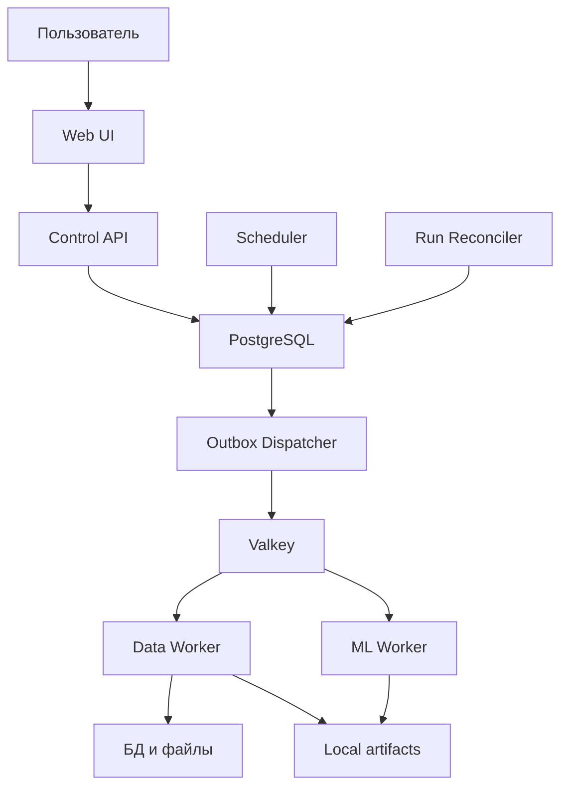

# Custometry — полный технический план платформы

> Это человекочитаемое смысловое зеркало спецификации `0.8.2-draft`. Нормативным источником истины является [машиночитаемый blueprint](./custometry-technical-blueprint-ru.md). Обе версии относятся к семейству `CUSTOMETRY-TECH-BLUEPRINT`, имеют одинаковый `spec_version` и одинаковый набор нормативных requirement ID. При любом расхождении действует machine-версия.

## 0. Как читать этот документ

Документ описывает открытый self-hosted продукт Custometry целиком: пользовательские пути, модель данных, аналитику и прогнозирование, выполнение процессов, безопасность, эксплуатацию, интерфейс, этапы выпуска и критерии готовности. Он рассчитан на разработчиков, аналитиков, ML- и data-инженеров, тестировщиков, DevOps-инженеров, владельцев продукта и будущих контрибьюторов.

Machine-версия использует нормативные слова `MUST`, `SHOULD` и `MAY`. Здесь они передаются обычным языком, но стабильные ID сохранены без изменений.

| ID | Как понимать правило |
|---|---|
| DOC-RULE-001 | `MUST` означает обязательное требование |
| DOC-RULE-002 | `SHOULD` означает рекомендуемый подход; отклонение оформляется ADR |
| DOC-RULE-003 | `MAY` означает необязательную возможность |
| DOC-RULE-004 | Источником истины о run state является PostgreSQL, а не очередь |
| DOC-RULE-005 | Источником истины опубликованной логики является её неизменяемая версия |
| DOC-RULE-006 | Результат воспроизводится по версиям входов, конфигурации и кода |
| DOC-RULE-007 | Machine-документ нормативен, human-документ объясняет тот же набор требований |
| DOC-RULE-008 | CI проверяет версию, взаимные ссылки и совпадение requirement ID |
| DOC-RULE-009 | Одна инсталляция изолированно обслуживает несколько workspaces |
| DOC-RULE-010 | Новое обязательство сначала появляется в machine-версии; human-версия не вводит собственных требований |

## 1. Что представляет собой Custometry

Custometry — open-source self-hosted low-code платформа клиентской аналитики и прогнозирования. Она подключается к транзакционным и клиентским данным, описывает их через предметную семантическую модель, проверяет качество, создаёт воспроизводимые витрины, выполняет исследования и строит прогнозы.

Главная ценность — не canvas сам по себе, а общее понимание клиента, идентификаторов, чека, позиции, товара, магазина, канала, календаря, продаж, возвратов, скидок, себестоимости, активности, когорт, сегментов и прогнозируемых метрик.

### 1.1. Цели проекта

| ID | Цель |
|---|---|
| GOAL-001 | Подключать существующие данные без переноса всей инфраструктуры компании внутрь платформы |
| GOAL-002 | Работать с неполными данными и явно объяснять доступные, ограниченные и недоступные функции |
| GOAL-003 | Давать типовую аналитику без написания Python |
| GOAL-004 | Расширяться через Python SDK и доверенные плагины |
| GOAL-005 | Версионировать и воспроизводить расчёты |
| GOAL-006 | Проверять прогнозы временным backtesting и baseline-моделями |
| GOAL-007 | Работать на одном self-hosted сервере и масштабироваться воркерами в пределах поддерживаемой topology |
| GOAL-008 | Не связывать бизнес-логику с одной СУБД или ML-библиотекой |
| GOAL-009 | Изолированно обслуживать несколько workspaces в одной инсталляции |
| GOAL-010 | Иметь полный английский и русский интерфейс и добавлять языки каталогами, не меняя доменный код |

### 1.2. Границы продукта

Текущий scope сознательно исключает персонализированные маркетинговые механики (`NON-GOAL-001`), массовые email/SMS/push-рассылки (`NON-GOAL-002`), промокоды и бонусные начисления (`NON-GOAL-003`), TDA и persistent homology (`NON-GOAL-004`), полноценную real-time CDP (`NON-GOAL-005`), замену DWH (`NON-GOAL-006`), полный аналог Airflow, dbt, JupyterLab или BI (`NON-GOAL-007`), произвольный недоверенный Python из браузера (`NON-GOAL-008`) и автоматическое доказательство причинности (`NON-GOAL-009`). Также до и включая v1 исключены Dash как production UI/runtime (`NON-GOAL-010`), Plotly как core chart dependency (`NON-GOAL-011`) и ECharts-GL/WebGL/GPU analytical compute (`NON-GOAL-012`). Post-v1 Plotly возможен только как trusted renderer plugin. Операционные уведомления и ручная персональная отправка одного воспроизводимого отчёта не являются массовой marketing-рассылкой. Promotion Journal регистрирует внешние акции, но не запускает механику, не выбирает аудиторию и не начисляет бонусы.

## 2. Пользователи и сценарии

### 2.1. Роли

| Роль | Ответственность | Граница |
|---|---|---|
| Installation Administrator | Bootstrap, глобальные политики, плагины, health и backup | Не читает workspace-данные без membership и audit |
| Workspace Administrator | Участники, роли, подключения, секреты и политики своего workspace | Не управляет другими workspaces |
| Data Steward | Mapping, сущности, метрики и качество | Не обязан заниматься ML |
| Analyst | Аналитика, сегменты, dashboards и экспорт | Не управляет глобальными секретами |
| ML Analyst | Backtesting, модели и прогнозы | Не управляет пользователями |
| Operator | Runs, расписания, очереди и восстановление | Не редактирует опубликованные версии |
| Viewer | Просмотр разрешённых результатов | Не запускает и не меняет процессы |

### 2.2. Основные сценарии

| ID | Сценарий и результат |
|---|---|
| UC-001 | Workspace Administrator создаёт read-only connection или загружает файл и получает проверенный каталог объектов |
| UC-002 | Data Steward публикует semantic dataset и capability matrix |
| UC-003 | Data Steward получает QualityReport и решение gate |
| UC-004 | Analyst запускает клиентскую аналитику и получает таблицы, метрики, сегменты и графики |
| UC-005 | ML Analyst сравнивает модели и публикует прогноз с интервалами |
| UC-006 | Analyst публикует повторяемый DAG и расписание |
| UC-007 | Разрешённый артефакт выгружается в CSV/Parquet или читается через внутренний authenticated result API |
| UC-008 | Installation Administrator по одноразовому bootstrap token создаёт первого администратора, workspace, locale/timezone и onboarding checklist |
| UC-009 | Data Steward исправляет failed QualityReport, повторяет проверку либо оформляет временный auditable waiver |
| UC-010 | Operator диагностирует run и выполняет retry, cancel, rerun либо фиксирует восстановление |
| UC-011 | Analyst делится versioned dashboard/result внутри workspace; immutable reference и audit сохраняются |
| UC-012 | Analyst сравнивает reportable результат с явно выровненным аналогичным периодом прошлого года и получает delta/coverage diagnostics |
| UC-013 | Analyst ведёт versioned Promotion Journal с окнами, каналами и immutable audience binding и видит timeline overlay |
| UC-014 | Analyst вручную отправляет immutable report snapshot от verified user email получателям разрешённых доменов |
| UC-015 | Analyst экспортирует любой reportable snapshot в единый XLSX с данными, графиками, metadata и Data Guide |
| UC-016 | Workspace Administrator публикует versioned Markdown Data Guide по утверждённому шаблону |
| UC-017 | Analyst получает Web ECharts chart, email PNG или native/raster XLSX chart из одного immutable ChartSpec и chart-data artifact |
| UC-018 | Analyst раскрывает разрешённый chart, table или range timeline в Focus / Explore mode, исследует его локальными filters и controls, экспортирует и возвращается в исходный контекст |

### 2.3. Сквозные пользовательские пути

| ID | Путь | Когда он завершён |
|---|---|---|
| JOURNEY-001 | Первый bootstrap: одноразовый token, первый admin, язык, format locale, timezone, первый workspace и optional demo dataset | Пользователь видит Overview и следующее действие; checklist можно продолжить позже |
| JOURNEY-002 | Dataset onboarding: connection, catalog/profile, mapping, keys/namespaces, relationships, metrics, returns/currency/identity, sample validation, publication и full quality gate | Dataset получает `trusted`, `degraded` или `blocked` и evidence capabilities |
| JOURNEY-003 | Quality remediation: нарушение, redacted sample, переход к mapping/rule, owner/comment, fix или time-bounded waiver, повтор и сравнение | Gate разрешил run, разрешил degraded mode либо оставил объяснимую блокировку |
| JOURNEY-004 | Guided analysis: template, dataset, preflight, parameters/estimate, общий execution engine, Result Trust, сохранение/share/schedule/export | Сохранены AnalysisVersion и immutable manifest |
| JOURNEY-005 | Forecast lifecycle: series preview, candidates/backtest, baseline comparison, champion approval, monitoring, retrain/promote/rollback | Champion, причины выбора, ограничения и policy доступны для аудита |
| JOURNEY-006 | Operator recovery: queues/schedules/attempts/workers, cancel/retry/rerun, cleanup и acknowledgement | Run терминален, действие и причина находятся в audit |

Для всех путей действуют общие UX-требования:

- `UX-JOURNEY-001`: wizard сохраняет draft после завершённого шага и позволяет продолжить позже;
- `UX-JOURNEY-002`: empty, loading, degraded, forbidden и failed state объясняют причину и следующее действие;
- `UX-JOURNEY-003`: guided forms создают те же versioned node/pipeline specifications и используют тот же engine, что canvas;
- `UX-JOURNEY-004`: до тяжёлого запуска видны capability preflight, оценка объёма и resource limits;
- `UX-JOURNEY-005`: Result Trust Panel показывает дату результата, freshness, quality, ограничения, версии, grain, filters, timezone, currency и lineage;
- `UX-JOURNEY-006`: из контекста доступны ответы «Почему функция недоступна?», «Почему это число?» и «На что повлияет публикация?».

### 2.4. Жизненный цикл объектов и readiness

Версионируемые определения проходят `draft → validating → published → deprecated → archived`. Published-версия неизменяема; clone создаёт новый draft; update draft защищён revision/ETag; publish формирует diff и impact report; pinned зависимости сами не переключаются на `latest`.

Readiness данных — отдельное измерение: `sample_validated`, `materializing`, `trusted`, `degraded`, `blocked`, `stale`. `draft` и `published` относятся к lifecycle конфигурации, а не к readiness; публикация конфигурации ещё не означает доверенные данные.

| ID | Обязательное поведение |
|---|---|
| OBJ-STATE-001 | API отклоняет невозможный переход stable code и возвращает допустимые действия пользователя |
| OBJ-STATE-002 | Публикация создаёт diff, dependency impact report и audit event |
| OBJ-STATE-003 | Definition с зависимостями не удаляется; применяется deprecation и управляемая миграция |
| OBJ-STATE-004 | UI не смешивает lifecycle definition, readiness данных и execution state в один `status` |
| OBJ-STATE-005 | Concurrent draft edits защищены optimistic locking через revision или ETag |

Connection отдельно имеет configuration states `draft/active/disabled/archived` и operational states `untested/testing/ready/degraded/unreachable`. Schedule имеет lifecycle и health, export — свой immutable request и execution state, model version — lifecycle и monitoring status, notification — delivery/read/acknowledgement state.

## 3. Базовые архитектурные принципы

| ID | Принцип простыми словами |
|---|---|
| ARCH-PRINCIPLE-001 | Сначала модульный монолит с контрактами между доменами |
| ARCH-PRINCIPLE-002 | Control plane отделён от тяжёлых worker-вычислений |
| ARCH-PRINCIPLE-003 | Метаданные живут в PostgreSQL, крупные данные — в Parquet |
| ARCH-PRINCIPLE-004 | Published definitions неизменяемы |
| ARCH-PRINCIPLE-005 | Каждый результат воспроизводим по manifest |
| ARCH-PRINCIPLE-006 | Фильтры, projection и безопасная агрегация по возможности выполняются в источнике |
| ARCH-PRINCIPLE-007 | У каждого набора объявлены grain и key |
| ARCH-PRINCIPLE-008 | Валюта, timezone, returns, activity и metric semantics задаются явно |
| ARCH-PRINCIPLE-009 | Plugin — доверенный server-side код |
| ARCH-PRINCIPLE-010 | Side effects идемпотентны |
| ARCH-PRINCIPLE-011 | Каждый workspace-scoped объект, request, task и artifact несёт `workspace_id`; cross-workspace access закрыт |
| ARCH-PRINCIPLE-012 | Guided UI и canvas используют один execution engine |
| ARCH-PRINCIPLE-013 | IDs, enum, manifests, cache keys и вычисления не зависят от языка UI |
| ARCH-PRINCIPLE-014 | Намерение dispatch задачи записывается в PostgreSQL в одной транзакции с control-plane state |



## 4. Как данные проходят через платформу

| Слой | Что хранит | Поведение |
|---|---|---|
| Source | SQL tables, CSV, Parquet, XLSX | Изменяется внешней системой |
| Landing | Извлечённые partitioned Parquet | Append/replace по manifest |
| Semantic | Mapping, relationships, metrics и business rules | Версионируется в metadata/JSON |
| Mart | Предметные витрины | Immutable per run |
| Result | Метрики, сегменты, forecasts и models | Immutable per run |
| Presentation | Chart/dashboard specs и exports | Версионируется |

### 4.1. Паспорт артефакта

Manifest фиксирует широкую категорию (`landing`, `mart`, `analysis`, `segment`, `quality`, `forecast`, `model`, `presentation`, `export`) отдельно от точного `artifact_schema_id` и его semver. Он также содержит `workspace_id`, run/node/attempt, UTC-время, только локальный относительный URI, формат, размеры, partitions, grain/key, event range, `content_hash`, `schema_fingerprint`, input artifact IDs, nullable `semantic_dataset_version_id`, pipeline/code/lockfile/parameters versions, PII class и retention.

Для partitioned artifact отдельный partition manifest содержит собственный `workspace_id` и перечисляет ожидаемые ключи, URI, row/byte counts, hashes и временные границы каждой части, а также общий hash и время commit.

| ID | Инвариант публикации |
|---|---|
| ARTIFACT-001 | Artifact и partition manifest становятся видимыми одним atomic metadata commit после проверки всех partitions |
| ARTIFACT-002 | Missing, extra или hash-mismatched partition блокирует весь commit |
| ARTIFACT-003 | Committed path нельзя перезаписать; idempotent retry возвращает старый artifact только при совпадении content/parameters hashes |
| ARTIFACT-004 | Каждый tabular artifact объявляет grain, ожидание primary key и schema fingerprint |

## 5. Каноническая модель данных

### 5.1. Общие правила

Перед аналитикой данные разных компаний приводятся к общей логической модели.

| ID | Правило |
|---|---|
| DATA-RULE-001 | Идентификаторы становятся строковым логическим типом без потери исходного значения |
| DATA-RULE-002 | Все timestamps имеют timezone, внутри платформы используется UTC |
| DATA-RULE-003 | Деньги имеют валюту строки либо объявленную валюту dataset |
| DATA-RULE-004 | Returns/cancellations представлены status или signed measure по явной политике |
| DATA-RULE-005 | У сущности объявлены grain, primary key и ожидание uniqueness |
| DATA-RULE-006 | Произвольные attributes допустимы, но часто используемые поля получают semantic role |
| DATA-RULE-007 | Unknown не превращается автоматически в `0` или `false` |
| DATA-RULE-008 | Внешний ID квалифицируется стабильным `source_system_id`; display name подключения не является namespace |
| DATA-RULE-009 | SCD-строка имеет version key либо составной ключ с `valid_from`; business ID не является PK версии |
| DATA-RULE-010 | Temporal join выбирает ровно одну версию dimension на event time и блокирует пересечение validity intervals |
| DATA-RULE-011 | FK к source entity включает `source_system_id`, если нет опубликованного crosswalk в canonical ID |

### 5.2. Клиент — ENTITY-CUSTOMER

Одна строка соответствует одной версии клиента. Primary key — `customer_version_id`; natural key — `[source_system_id, customer_id]`; уникальность версии — `[source_system_id, customer_id, valid_from]`. Обязательны `customer_version_id`, `source_system_id`, `customer_id`, `valid_from`. Дополнительно поддерживаются даты создания и действия, birth date, gender, region/city, registration channel, loyalty level, status и attributes. Email, phone и внешний person ID являются прямыми PII, birth date и city — квази-идентификаторами.

Customer может быть SCD или current snapshot. Для snapshot без source validity платформа создаёт synthetic interval от extraction batch boundary до `null` и фиксирует это ограничение в lineage.

### 5.3. Идентификация клиентов — ENTITY-CUSTOMER-IDENTITY

Identity mapping связывает source identity с canonical customer. Ключ строки включает `identity_mapping_version_id`, `source_system_id`, `source_customer_id` и `valid_from`; обязательны также `canonical_customer_id`. Public MVP поддерживает детерминированный mapping, вероятностное разрешение личности не входит в v1 target.

Версия mapping имеет отдельные `identity_mapping_version_id` и stable `identity_mapping_id`, `workspace_id`, монотонную version, lifecycle `draft/published/deprecated/archived`, effective time, source namespaces, conflict policy, merge/split events и lineage.

| ID | Инвариант identity mapping |
|---|---|
| IDENTITY-001 | Published mapping immutable и записывается во входной manifest каждой клиентской витрины |
| IDENTITY-002 | Merge/split создаёт новую mapping version и impact report, не переписывая историю |
| IDENTITY-003 | Один source identity нельзя одновременно связать с несколькими canonical IDs в одном effective interval |
| IDENTITY-004 | До публикации UI показывает unmatched, conflicted и remapped counts |
| IDENTITY-005 | В одной mapping version интервалы одного source identity не пересекаются и дают не более одного effective canonical customer в момент времени |

### 5.4. Чек — ENTITY-RECEIPT

Одна строка — один чек; ключ `[source_system_id, receipt_id]`. Обязательны source namespace, ID и `occurred_at`. Опциональны customer/store/channel, gross/discount/net/tax/cost, quantity, currency, status и `source_updated_at`. Ключ уникален в dataset version, будущая дата ограничена tolerance, а reconciliation net revenue задаётся пользователем.

### 5.5. Позиция — ENTITY-RECEIPT-ITEM

Одна строка — позиция чека; ключ `[source_system_id, receipt_id, line_id]`. Product обязателен для product/basket analytics. Если line ID отсутствует, wizard предлагает стабильный составной ключ; номер строки нельзя использовать при нестабильном порядке incremental source.

### 5.6. Товар — ENTITY-PRODUCT

Product — версионируемая сущность с `product_version_id`, natural key `[source_system_id, product_id]` и version key `[source_system_id, product_id, valid_from]`. Дополнительно хранятся name, category/subcategory, brand, manufacturer, unit, validity и attributes.

### 5.7. Магазин — ENTITY-STORE

Store строится аналогично: `store_version_id`, `[source_system_id, store_id]`, `valid_from`, optional name/type/format/region/city/opened/closed/timezone/validity/attributes. Для current Product и Store применяется synthetic validity; intervals одной natural key не пересекаются.

### 5.8. Канал — ENTITY-CHANNEL

Channel имеет ключ `[source_system_id, channel_id]`, optional name, attributes и нормализованную группу `online`, `offline`, `marketplace` или `other`. Он может быть справочником либо полем Receipt, но значения нормализуются стабильно.

### 5.9. Календарь — ENTITY-CALENDAR

Calendar генерируется платформой с grain `one_row_per_date`. В нём есть year, quarter, month, ISO week, weekday, days in period, weekend/holiday flags, holiday name и optional fiscal period.

### 5.10. Дополнительные измерения

| Сущность | Назначение | V1 target |
|---|---|---|
| CurrencyRate | Версионированное FX-приведение по effective date | Обязательно только при cross-currency aggregation |
| Promotion | Аналитика скидок и промопериодов | Опционально |
| Region | Географическая иерархия | Опционально |
| CustomerSegmentSnapshot | Историческое membership | Обязательно |
| ExternalRegressor | Погода, промодни, магазины, цены | Желательно для forecast |

Promotion Journal хранит stable `promotion_id`, immutable versions, external campaign ID, title/type/objective, planned и actual windows в IANA timezone, несколько channels, optional store/product/region scope, budget/tags/source и аудиторию `all_customers|segment_snapshot|customer_list_artifact`. Клиент всегда означает `canonical_customer_id`; исторические segment/list audiences не пересчитываются задним числом.

| ID | Инвариант Promotion Journal |
|---|---|
| PROMO-001 | Published version immutable; period/channel/audience/mechanic change создаёт новую version с diff/audit |
| PROMO-002 | Несколько planned/actual windows валидируют timezone и start/end |
| PROMO-003 | Одна акция может иметь несколько locale-neutral Channel bindings |
| PROMO-004 | Audience — all customers либо immutable segment/customer-list snapshot на canonical customer |
| PROMO-005 | Timeline фильтруется по period/status/channel/promotion/segment/customer без утечки PII/закрытых rows |
| PROMO-006 | Overlap сохраняется и диагностируется, но не разрешается скрытым приоритетом |
| PROMO-007 | Promo можно показывать overlay/regressor, но нельзя объявлять causal effect |
| PROMO-008 | Import идемпотентен и публикует rejected-row report |
| PROMO-009 | Journal имеет owner/permissions/audit/retention; published history архивируется, не hard-delete |

### 5.11. Reconciliation

Платформа сравнивает net revenue и quantity шапки с суммой позиций, проверяет orphan items и неизвестные товары. Для денег задаётся absolute/relative tolerance, а unknown products могут быть warning либо error.

## 6. Семантический набор данных

### 6.1. Версия semantic dataset

`SemanticDatasetVersion` имеет явные `semantic_dataset_version_id`, stable `dataset_id`, `workspace_id`, version и author/time. Он неизменяемо описывает source bindings, entities, joins, field mappings, filters, metrics, business rules, timezone, default currency, return и anonymous-customer policies и schema fingerprint. Lifecycle: `draft`, `validating`, `published`, `deprecated`, `archived`; concurrent edits защищены `revision`.

### 6.2. Relationships и cardinality

Каждая связь объявляет стороны, join fields, `1:1`/`1:N`/`N:1`, поведение missing key, допустимый unmatched ratio и temporal policy. Sample проверяется до публикации, full cardinality — при первой materialization; duplicate amplification измеряется явно.

### 6.3. Единый Metric Registry

Метрика хранит отдельные `metric_version_id` и stable `metric_id`, `workspace_id`, version, lifecycle `draft/validating/published/deprecated/archived`, `revision`, author/time, английский и русский labels, вид метрики, исходную сущность и grain, expression, допустимые aggregations, time aggregation, filters, dimensions, unit, currency и null policies.

Системная `net_revenue` на grain одного чека допускает slicing по date/store/channel, но запрещает product/category/brand. Товарная выручка регистрируется отдельной `item_net_revenue` на `ReceiptItem` с grain одной строки чека и сверяется с header-level total; planner не вправе молча подменять одну метрику другой.

| Вид | Пример | Как агрегируется |
|---|---|---|
| `additive_measure` | revenue, units | Сумма только по разрешённым dimensions/time |
| `semi_additive_measure` | balance, active-base snapshot | Не суммируется по времени без явной last/first/average policy |
| `event_count` | receipt count | Считает строки на заявленном уникальном grain |
| `distinct_count` | customer count | Пересчитывается на целевом grain, готовые counts не суммируются |
| `derived_ratio` | average receipt, margin rate | Пересчитывается из numerator/denominator |

| ID | Правило метрики |
|---|---|
| METRIC-001 | Объявляются kind, source grain, aggregations, time policy, unit и dimensions |
| METRIC-002 | Ratio ссылается на versioned numerator/denominator и пересчитывается на target grain |
| METRIC-003 | Недопустимая сумма distinct/semi-additive metric блокируется с объяснением |
| METRIC-004 | Изменение expression, filters, returns, unit или aggregation создаёт новую immutable version |
| METRIC-005 | Multi-currency money не агрегируется без group-by-currency или versioned FX policy |
| METRIC-006 | FX lineage содержит rate source/version, effective-date join, target currency и missing-rate policy |
| METRIC-007 | System metric имеет English и Russian labels; IDs и expressions не переводятся |
| METRIC-008 | Receipt-grain metric запрещает product/category/brand dimensions; item slicing использует отдельную ReceiptItem-grain metric с reconciliation к header total |

Базовый registry содержит gross/net revenue, receipt/customer/active-customer counts, units, average receipt, revenue per customer, margin, discount и repeat-customer rate.

### 6.4. Capability Engine

Capability возвращает `available`, `degraded` или `unavailable` не только по наличию полей, но и по evidence текущей materialization. Evaluation фиксирует `workspace_id`, `principal_id`, `effective_policy_version`, semantic dataset/run, time, schema, mapping, quality, freshness, permissions, history coverage, currency, volume и resource-policy evidence, blocker/limitation codes и suggested actions.

| ID | Требование capability |
|---|---|
| CAPABILITY-001 | Решение учитывает schema, mapping, quality, freshness, текущие permissions зафиксированных `principal_id` и `effective_policy_version`, history, currency, volume и workspace limits |
| CAPABILITY-002 | Причина имеет stable code, evidence, threshold и suggested action |
| CAPABILITY-003 | Evaluation обновляется после mapping, materialization, QualityReport, permission или policy change |
| CAPABILITY-004 | Preflight фиксируется во входном manifest запуска |

Продажи доступны по дате и денежной метрике даже без клиента; RFM требует Customer/Receipt и monetary measure; basket — receipt items и product; store/channel analytics требуют соответствующие keys; revenue forecast может деградировать до univariate baseline; customer forecast блокируется при плохой идентификации.

### 6.5. Поисковый реестр фильтров

Любой reportable result использует единый `FilterFieldRegistry`. В нём поле связано с published semantic dataset/entity, имеет stable/versioned ID, type, allowed operators, versioned null policy, hierarchy binding, relative-date policy с anchor/timezone/calendar, labels/description, cardinality, PII class, facet policy, pushdown capability и список применимых анализов. Выражения поддерживают `AND/OR/NOT`, typed hierarchy operators и relative-date windows. «Любое поле» означает любое опубликованное `filterable` поле, доступное effective policy пользователя, а не произвольную source column.

| ID | Инвариант фильтрации |
|---|---|
| FILTER-001 | Filters передаются versioned typed expression tree; arbitrary SQL/string из basic UI запрещён |
| FILTER-002 | Search находит только разрешённые fields по ID/entity/label/description/type |
| FILTER-003 | Backend проверяет operator/value по type, versioned null policy, hierarchy binding и relative-date policy независимо от UI |
| FILTER-004 | Expression, registry/hierarchy/calendar versions, relative-date anchor и timezone входят в analysis/report spec, manifest, request hash и cache key |
| FILTER-005 | Facets/counts/search применяют authorization до aggregation/pagination |
| FILTER-006 | Planner делает safe pushdown либо typed Polars/DuckDB execution с volume preflight |
| FILTER-007 | High-cardinality fields используют search-only/bounded lookup, не полный browser distinct list |
| FILTER-008 | UI показывает applied/default/locked filters, resulting grain и estimated rows; hidden business rule только versioned metric rule |
| FILTER-009 | Focus / Explore позволяет draft local filters без изменения parent report до Apply to report; Reset возвращает inherited state, Undo отменяет последнее draft-действие |
| FILTER-010 | Apply to report повторно валидирует filters и authorization на backend и обновляет normalized spec/request identity; system/locked filters видимы и не могут быть удалены либо ослаблены |

## 7. Подключение и загрузка данных

### 7.1. Источники v1 target

Обязательны PostgreSQL, Microsoft SQL Server, CSV и Parquet. MySQL/MariaDB желателен; небольшие XLSX опциональны. ClickHouse, Snowflake, BigQuery, Oracle и CDC относятся к будущему. S3 не входит в текущий artifact/source contract.

### 7.2. Connector contract

```python
class SourceConnector(Protocol):
    def capabilities(self) -> ConnectorCapabilities: ...
    def test(self, request: ConnectionTest) -> ConnectionTestResult: ...
    def discover(self, request: DiscoveryRequest) -> CatalogSnapshot: ...
    def preview(self, request: PreviewRequest) -> DataBatch: ...
    def estimate(self, request: ExtractRequest) -> ExtractEstimate: ...
    def begin_extraction_session(self, request: ExtractionSessionRequest) -> ExtractionSession: ...
    def extract(self, request: ExtractRequest, session: ExtractionSession) -> Iterator[ArrowBatch]: ...
    def close_extraction_session(self, session: ExtractionSession, outcome: ExtractionOutcome) -> None: ...
```

Constructor только принимает зависимости и проверяет инварианты. Multi-table чтение выполняется через одну явно открытую `ExtractionSession`: она хранит `session_id`, `workspace_id`, immutable `source_system_id`, consistency mode, непрозрачный secret snapshot token, состояния `created/active/committed/aborted/expired` и временные границы. Connector завершает её commit либо abort; expired session не публикует artifact или watermark, а token не попадает в artifacts, logs или UI. Connection/import binding получает immutable `source_system_id`; rename не меняет namespace, а повторная загрузка файла явно переиспользует binding либо создаёт новый.

### 7.3. Режимы загрузки

Поддерживаются full snapshot, append, incremental watermark с lookback, partition refresh и upsert. CDC до v1 target не входит. Incremental policy хранит field, successful watermark, lookback, dedup key с source namespace, latest-version rule, delete policy и UTC.

### 7.4. Консистентный extraction batch

Batch фиксирует `workspace_id`, connection/source namespace, consistency mode, opaque snapshot token, start time, objects, lower и candidate upper watermarks, landing artifacts, validation report и state от `created` до `committed/failed/cancelled`.

| ID | Инвариант ingestion |
|---|---|
| INGEST-001 | Связанные таблицы желательно читать из одного DB snapshot/checkpoint; mode записывается в manifest |
| INGEST-002 | Без общего snapshot используется `best_effort_validated` с временными границами и reconciliation до публикации |
| INGEST-003 | Candidate watermark продвигается одной PostgreSQL transaction после commit всех partitions и обязательных validations |
| INGEST-004 | Failed/partial/cancelled batch не двигает successful watermark, temp files очищаются retention |
| INGEST-005 | Retry использует прежние bounds либо новый batch; смешивание границ запрещено |
| INGEST-006 | Snapshot token и secrets не попадают в UI, logs и artifacts |
| INGEST-007 | Multi-table extraction использует одну `ExtractionSession` и завершает её commit/abort; expired session не публикует artifact или watermark |

### 7.5. Schema drift и extraction security

Новое неиспользуемое поле даёт warning; удалённое mapped field, несовместимый тип или изменённый PK блокируют; compatible widening предупреждает. Source account read-only; preview ограничен по rows/time/bytes; custom SQL — один read-only statement и по возможности AST validation; DB permissions остаются последней защитой; DSN/password шифруются; PII preview маскируется по роли.

## 8. Хранение и артефакты

PostgreSQL хранит users, RBAC, metadata, versions, run states, schedules, manifests и audit. Local Parquet storage хранит landing, marts, segments, forecasts и exports. Valkey служит broker/cache/locks, но не источником истины. Source DB остаётся внешним источником.

### 8.1. Только локальный Artifact Store до v1 target

```python
class LocalArtifactStore(Protocol):
    def begin(self, request: ArtifactWriteRequest) -> ArtifactWriter: ...
    def commit(self, writer: ArtifactWriter) -> ArtifactManifest: ...
    def abort(self, writer: ArtifactWriter) -> None: ...
    def open(self, artifact_id: UUID) -> ArtifactReader: ...
    def delete_expired(self, policy: RetentionPolicy) -> DeletionReport: ...
```

Запись идёт во временный path и публикуется атомарно. Для vertical alpha, public MVP и v1 target поддерживается только local filesystem на одном сервере с shared persistent volume, deployment-configured root и platform-generated relative paths без user fragments.

Текущая спецификация не обещает remote/object storage adapter. S3-compatible storage может появиться только по отдельному будущему ADR, который определит atomicity, consistency, credentials, migration и distributed topology.

Retention различает published outputs, temporary node data, preview, exports, models и audit. Нельзя удалить единственный вход опубликованного результата до окончания воспроизводимого срока.

## 9. Low-code pipeline engine

Pipeline — DAG из типизированных узлов. Поддерживаются source, semantic, transform, quality, mart, customer/sales analytics, segmentation, forecasting, visualization и output nodes. У node есть stable type/version, English/Russian label, category, JSON Schema конфигурации, typed ports, queue/resource profile, determinism/cache/cancel flags и PII access. Backend повторяет всю validation, даже если форму сгенерировал frontend.

### 9.1. Базовые transformations и engines

Select, filter, derive, join, aggregate, deduplicate, date spine, window, pivot и union проверяют schema, keys, null policy, cardinality, amplification, resulting grain, leakage cutoff и size limits. Source DB используется для pushdown, DuckDB — для SQL по Parquet и больших joins/group by, Polars — для lazy domain transforms. Каждый node публикует выбранный backend и explain summary.

```python
class PipelineNode(Protocol):
    def specification(self) -> NodeSpecification: ...
    def validate(self, request: NodeValidationRequest) -> ValidationReport: ...
    def execute(self, context: NodeExecutionContext, inputs: NodeInputs) -> NodeResult: ...
```

PipelineVersion имеет явные `pipeline_version_id`, stable `pipeline_id`, `workspace_id`, version, общий lifecycle/revision и pinned `semantic_dataset_version_id`, а также nodes/edges, parameter schema, validation report и author/time. Publish проверяет acyclic graph, обязательные ports, типы artifacts, capabilities, наличие secrets без их значений, resource policy, output conflicts и установленные node versions.

### 9.2. Execution states и надёжная доставка

Run проходит `CREATED`, `VALIDATING`, `QUEUED`, `RUNNING`, при отмене `CANCELLING`, затем `SUCCEEDED`, `FAILED`, `CANCELLED` или `PARTIAL`. Node дополнительно использует `PENDING`, `READY`, `RETRY_WAIT`, `SKIPPED` и `CACHED`.

| ID | Инвариант execution state |
|---|---|
| EXEC-STATE-001 | Run/node transition выполняется compare-and-set по state/revision; недопустимый переход возвращает stable error code |
| EXEC-STATE-002 | Terminal state неизменяем: automatic retry до terminal создаёт новый `attempt_id` через `RETRY_WAIT→READY`, а manual retry завершённого run/node создаёт новую execution record с новым run/node ID, initial state и `retry_of_id` |
| EXEC-STATE-003 | Aggregate state run вычисляется по зафиксированным node states и declared partial policy одной PostgreSQL transaction |
| EXEC-STATE-004 | `PARTIAL` требует успешную publishable branch и явную policy; failure обязательной branch не маскируется как `SUCCEEDED` |
| EXEC-STATE-005 | `CACHED` разрешён после проверки workspace/policy-scoped key, manifest, content hash и authorization |
| EXEC-STATE-006 | `CANCELLING` сохраняется до остановки либо fencing active attempts; `CANCELLED` не сообщается раньше cleanup policy |
| EXEC-STATE-007 | Каждый transition пишет time, actor/service, reason, request ID и previous/new state в audit/state history |

API создаёт run в PostgreSQL. Orchestrator валидирует preflight и одной transaction создаёт ready node и `task_outbox`. Dispatcher доставляет at-least-once команду в Valkey/Celery. Worker берёт lease с монотонным fencing token, выполняет изолированный attempt и может публиковать только с актуальным token. Orchestrator одной transaction открывает следующие nodes. Reconciler восстанавливает потерянную delivery, expired lease, incomplete commit и незавершённый aggregate state.

| ID | Инвариант dispatch |
|---|---|
| EXEC-DISPATCH-001 | State transition и outbox record фиксируются одной PostgreSQL transaction |
| EXEC-DISPATCH-002 | Worker ожидает duplicate delivery и дедуплицирует по node run, attempt и fencing token |
| EXEC-DISPATCH-003 | Fencing token монотонен; stale worker не публикует artifact/state |
| EXEC-DISPATCH-004 | Reconciler находит pending outbox, queued без delivery, expired running lease, terminal node без commit и incomplete run |
| EXEC-DISPATCH-005 | Reconciliation идемпотентен, bounded и отражён в audit/metrics |

Cache key состоит из `workspace_id`, `effective_policy_version`, node type/version, normalized config, ordered input hashes, semantic version и code version. Cache запрещён для non-deterministic node без seed, preview, source без snapshot guarantee и mutable side effect без idempotency policy. Network/timeout/worker-lost errors могут повторяться с bounded backoff; validation и OOM автоматически не повторяются.

Schedule хранит `workspace_id`, pinned pipeline version, `revision`, cron, IANA timezone, parameters, lifecycle `draft/enabled/paused/disabled/archived`, отдельный derived health `healthy/misfired/failing/blocked`, misfire/concurrency policies, nullable `next_run_at` и `last_evaluated_at` в PostgreSQL.

| ID | Инвариант schedule |
|---|---|
| SCHEDULE-001 | Lifecycle и derived health хранятся и показываются отдельно; boolean enabled не является persistent source of truth |
| SCHEDULE-002 | Только enabled schedule создаёт новые runs; уже созданные runs у paused/disabled/archived следуют своей cancellation policy |
| SCHEDULE-003 | Claim due schedule, следующий occurrence, run и `task_outbox` создаются атомарно с защитой от duplicate claim |
| SCHEDULE-004 | Cron, timezone, parameters и policies меняются через revision/ETag и audit event |
| SCHEDULE-005 | Health выводится из claim/run evidence и thresholds, а не выставляется пользователем |

Scheduled run и outbox создаются одной transaction; scheduler не пишет напрямую в queue. DST поведение тестируется.

### 9.3. Plugins

Plugin может добавить connector, node, metric pack, forecast model, export adapter и UI metadata. Он обнаруживается Python entry point, объявляет compatible `core_api_version`, а до v1 target требует restart. Английский catalog обязателен; bundled/official plugin также обязан иметь полный русский. Сторонний plugin без русского использует English fallback с предупреждением; namespace имеет вид `plugin.<plugin_id>`.

### 9.4. Cancellation и resource isolation

Cooperative cancellation проверяется до source query, между batches, перед partition commit и между model folds. После grace period выполняется hard stop child process, попытка driver-level DB cancel, abort writer и cleanup temp/lease. Terminal state может быть `CANCELLED`, `FAILED` либо `PARTIAL`; `PARTIAL` допустим только при declared partial policy и уже committed publishable branch.

| ID | Требование cancellation |
|---|---|
| EXEC-CANCEL-001 | Тяжёлый node работает в child process или эквивалентной изоляции |
| EXEC-CANCEL-002 | Runtime применяет timeout, memory, temp disk, output size и source-query limits |
| EXEC-CANCEL-003 | Активный DB statement отменяется штатно, затем process завершается после grace period |
| EXEC-CANCEL-004 | Cancelled attempt не публикует manifests; committed outputs становятся orphan candidates по retention |
| EXEC-CANCEL-005 | Cancel API идемпотентен; terminal run не возвращается в `CANCELLING` |
| EXEC-CANCEL-006 | Resource breach возвращает stable code, observed/configured limits и safe remediation |

## 10. Контроль качества данных

Data Quality — gate между источником и доверенной аналитикой. Проверяются schema, keys, references, domains, numeric ranges, time coverage, header/line reconciliation, freshness и drift.

Rule имеет отдельные `rule_version_id` и stable `rule_id`, `workspace_id`, version, lifecycle `draft/validating/published/deprecated/archived`, `revision`, author/time, entity, full/sample/partition scope, safe expression, severity, threshold, action `record/block_publish/block_run`, null policy и owner. QualityReport сохраняет `workspace_id`, канонический `semantic_dataset_version_id`, run, passed/warning/failed, gate decision `allow/allow_degraded/block`, rows, results каждого rule, redacted sample artifact и profile. Пользовательские rules компилируются из безопасного expression tree в source SQL, Polars или DuckDB; SQL-конкатенация запрещена.

### 10.1. Remediation и временные waivers

Quality issue хранит `workspace_id`, report/rule, status, owner, link к mapping/rule, audit-referenced comments и first/last seen. Waiver использует канонический `semantic_dataset_version_id` и ограничен workspace, rule version, optional partition scope, reason/ticket, requester, expiry и optional maximum failed ratio. Для `pending` approval/rejection fields равны `null`; `active` требует `approved_by` и `approved_at`; `rejected` — `rejected_by`, `rejected_at` и `rejection_reason`. Решение immutable и auditable; статусы waiver: `pending`, `active`, `rejected`, `expired`, `revoked`.

| ID | Требование remediation |
|---|---|
| DQ-REMEDIATE-001 | Failed rule связан с mapping/rule и показывает redacted sample, history, owner и affected capabilities |
| DQ-REMEDIATE-002 | Разрешён rerun отдельного rule/gate через тот же execution engine |
| DQ-REMEDIATE-003 | Waiver ограничен rule/dataset/scope/threshold/expiry и требует отдельного permission |
| DQ-REMEDIATE-004 | Expired/revoked waiver не влияет на новые gates, но остаётся в audit |
| DQ-REMEDIATE-005 | Workspace isolation, missing PK, bad artifact hash и executable security policy нельзя waived |
| DQ-REMEDIATE-006 | Gate перечисляет waiver IDs и оставшиеся limitations; скрыто подавлять ошибку нельзя |
| DQ-REMEDIATE-007 | Failure samples маскируют PII и требуют отдельного permission |
| DQ-REMEDIATE-008 | Pending имеет null approval/rejection; active требует approval, rejected — reject actor/time/reason; решения immutable и auditable |

Degraded gate status передаётся downstream и остаётся видимым в результате и Result Trust Panel.

## 11. Аналитические витрины

Каждая mart объявляет stable type/version, grain, key, period, metric versions, lineage, null/return policies, timezone, currency и quality.

### 11.1. Канонические facts

`receipt_header_fact` имеет grain одного source receipt и владеет header measures. `receipt_item_fact` имеет grain source receipt line и владеет line measures. `customer_receipt_fact` объединяет canonical customer, source receipt и конкретную identity mapping version.

| ID | Защита от double counting |
|---|---|
| MART-GRAIN-001 | Receipt-level measures агрегируются из header fact и не повторяются на lines |
| MART-GRAIN-002 | Item analytics использует item fact; header measures доступны после receipt aggregation или checked allocation |
| MART-GRAIN-003 | Header-to-items join объявляет `1:N` и amplification report |
| MART-GRAIN-004 | Customers считаются по canonical ID, receipts — по source system плюс receipt ID |
| MART-GRAIN-005 | Planner выбирает fact по source grain metric и блокирует ambiguous mixed-grain query |
| MART-GRAIN-006 | Customer-level marts и segment snapshots после identity resolution используют `canonical_customer_id` в grain, primary key и outputs; неоднозначный `customer_id` запрещён |
| MART-GRAIN-007 | Period mart объявляет period, `fact_scope` и полный ordered tuple materialized dimension keys как primary key и отклоняет collision |

### 11.2. Стандартные marts

| ID | Grain, назначение и ключевые поля |
|---|---|
| MART-CUSTOMER-TRANSACTION | Одна строка на canonical customer и source receipt; customer/source/receipt, UTC/local date, store/channel, amounts, quantity, eligibility; зависит от semantic/identity/return versions |
| MART-CUSTOMER-PERIOD-ACTIVITY | Customer × day/week/month; receipt/purchase-day counts, revenue, units, margin, active/first flags и last purchase as of period |
| MART-CUSTOMER-FEATURES | Customer × as-of date; окна 30/90/180/365 дней, RFM-like features, tenure, interpurchase, channel shares и preferences; только события до cutoff |
| MART-RECEIPT-FEATURES | Один source receipt; counts товаров/категорий, units, net revenue, discount share и margin из header/item facts и Product |
| MART-SALES-PERIOD | Period × dimensions с явным `receipt_header` или `receipt_item` fact scope; mixed header/item metrics строятся без размножения |
| MART-SEGMENT-MEMBERSHIP | Segment version × snapshot date × customer с score и assignment reason |

Canonical primary keys: customer transaction — `[canonical_customer_id, source_system_id, receipt_id]`; customer-period — `[canonical_customer_id, period_start, frequency]`; customer features — `[canonical_customer_id, as_of_date]`; receipt features — `[source_system_id, receipt_id]`; segment snapshot — `[segment_version_id, snapshot_date, canonical_customer_id]`. Sales-period mart использует `[period_start, fact_scope, materialized_dimension_key_tuple]`, где tuple содержит все реально materialized dimension keys в объявленном порядке. Одна materialization имеет один `fact_scope`; product/category требуют item fact, а header metrics сначала агрегируются на receipt grain.

`first_purchase_flag` и новые клиенты помечают left censoring при недостаточной предыстории. Historical dimensions и segment membership выбираются на дату события, а не по сегодняшнему значению.

## 12. Аналитические модули

Каждый анализ получает typed artifacts, immutable specification и Metric Registry version; публикует result table, metric set, chart specs, diagnostics и manifest. Он детерминирован при seed, не имеет hidden filters и всегда фиксирует as-of/comparison periods.

Любой reportable analytics/forecast/dashboard/QualityReport принимает `TimeComparisonSpec` либо explicit `none`. Поддерживаются same dates, calendar-aligned, ISO-week-aligned, fiscal-period и comparable-elapsed-days сравнения с прошлым годом. Результат материализуется как immutable `ComparisonArtifact`: он хранит normalized/resolved spec, фактические границы обоих периодов, timezone, calendar/policy hash, metric/activity/segment/dataset/filter versions, coverage и limitation codes. Именно его ID pin-ится в `ReportSnapshot`. Operator/Admin telemetry не входит в reportable scope.

| ID | Инвариант сравнения периодов |
|---|---|
| COMPARE-001 | Каждый reportable result принимает versioned spec либо explicit none; hidden shift запрещён |
| COMPARE-002 | Calendar mapping явно обрабатывает leap day, ISO week 53, fiscal periods, timezone и calendar version |
| COMPARE-003 | Неполный текущий период сравнивается только по explicit policy |
| COMPARE-004 | Output содержит current/comparison, absolute/percent delta, coverage и comparability; missing не равен zero без domain rule |
| COMPARE-005 | Immutable artifact фиксирует resolved spec/periods, timezone, calendar/policy hash и metric/activity/segment/dataset/filter versions; несовместимость блокируется либо требует auditable rebase |
| COMPARE-006 | Capability отдельно проверяет history, quality, permissions и definition compatibility обоих периодов |
| COMPARE-007 | UI/email/XLSX показывают одинаковые mode/limitations из одного comparison artifact |

| ID | Назначение, вход и ключевой результат |
|---|---|
| ANALYTICS-SALES-OVERVIEW | MART-SALES-PERIOD → KPI, trend, contribution и comparison; revenue раскладывается как customers × receipts per customer × average receipt |
| ANALYTICS-CUSTOMER-BASE | MART-CUSTOMER-PERIOD-ACTIVITY → active/new/retained/reactivated/at-risk/churned, value, frequency и tenure по versioned activity definition |
| ANALYTICS-RFM | MART-CUSTOMER-TRANSACTION → R/F/M scores и snapshots; explicit as-of, deterministic ties, fixed thresholds для сравнения |
| ANALYTICS-COHORT | Customer transactions → cohort matrix, sizes, cumulative value и retention с различением logo/revenue/repeat и right censoring |
| ANALYTICS-LIFECYCLE | Customer period activity → customer state, transitions, counts/revenue и flows; state machine валидирует priorities и impossible transitions |
| ANALYTICS-BASKET | ReceiptItem + optional Receipt/Product/segments → basket KPIs, pairs, optional rules и affinity; сначала sparse pair aggregation |
| ANALYTICS-STORE-CHANNEL | Sales mart → scorecards, channel membership/migration и optional same-store growth с единым canonical customer и workday normalization |
| ANALYTICS-SEGMENT-RULES | Customer feature snapshot → membership/profile/overlap; serializable Polars expression tree и explicit overlap policy |
| ANALYTICS-SEGMENT-CLUSTER | Post-v1 KMeans/HDBSCAN с preprocessing, stability, outliers, cluster sizes и diagnostics; cluster ещё не бизнес-сегмент |
| ANALYTICS-ABC-XYZ | Post-v1 классификация customer/product/store по value/variability с concentration/Pareto outputs |
| ANALYTICS-MARGIN-DISCOUNT | Post-v1 описательная discount/margin analytics; correlation не объявляется causal effect |
| ANALYTICS-SEGMENT-MIGRATION | Stored snapshots → transitions, inflow/outflow и stability без пересчёта истории новыми правилами |
| ANALYTICS-CUSTOM-BUILDER | Typed mart + allowed filters/dimensions/metrics/date/comparison/top/sort → reproducible ad hoc table, metrics и chart |

Custom Builder разрешает только MetricRegistry/draft-validated metrics и published semantic joins, блокирует non-additive aggregation и показывает resulting grain/estimated rows до запуска.

## 13. Прогнозирование

Forecasting строит series из зарегистрированной метрики, заполняет календарь, создаёт time-safe features, делает rolling backtest, сравнивает baselines и CatBoost, рассчитывает intervals, ведёт registry, batch prediction и monitoring. Он не является business planning или causal engine.

### 13.1. Forecast specification и series

Specification имеет отдельные `forecast_spec_version_id` и stable `forecast_id`, `workspace_id`, version, lifecycle `draft/validating/published/deprecated/archived`, `revision`, pinned `semantic_dataset_version_id` и author/time. Она фиксирует target, frequency/horizon/history, complete-period policy, dimensions/hierarchy, known-future и observed regressors, missing-period policy, candidates, rolling windows/step/horizon, selection metric/bias constraints, interval levels и seed.

Можно прогнозировать net revenue, receipts, average receipt как ratio, active/new/reactivated/churned customers, units и hierarchical store/category sales. TimeSeriesBuilder выдаёт одну строку на series/period с target, regressors и completeness. Missing period не означает zero без domain rule; current incomplete period не входит автоматически; first-purchase series отмечает left censoring.

FeatureBuilder создаёт lags 1/2/3/6/12, rolling means/std, calendar/trend и configured regressors. У любого feature есть `availability_time`; будущее относительно forecast origin запрещено.

```python
class ForecastModel(Protocol):
    def identity(self) -> ForecastModelIdentity: ...
    def fit(self, request: ForecastFitRequest) -> FittedForecastModel: ...
    def predict(self, model: FittedForecastModel, request: ForecastPredictRequest) -> ForecastFrame: ...
    def diagnostics(self, model: FittedForecastModel) -> ModelDiagnostics: ...
```

V1 target включает Naive, Seasonal Naive, moving average, ETS/AutoETS, AutoARIMA и CatBoostRegressor; optional Theta, Croston, seasonal-window average и linear trend.

CatBoost использует time sorting, fixed seed, time split вместо random K-fold, train-only preprocessing, later validation for early stopping и сохранённый feature order/model binary. Feature importance — diagnostic, не causal explanation.

### 13.2. Backtest, intervals и registry

Backtest result принадлежит `workspace_id` и ссылается на существующий immutable `forecast_spec_version_id` того же workspace; каждый fold хранит train/forecast boundaries и metrics by horizon. Считаются MAE, RMSE, WAPE, sMAPE и bias overall, по fold/horizon/series group. Если CatBoost не даёт минимального улучшения либо нарушает constraints, выбирается простой baseline.

Statistical intervals используют model method; CatBoost до v1 может использовать empirical residual quantiles. Coverage проверяется, interval не показывается как гарантия.

Model Registry хранит `model_version_id`, `workspace_id`, FK на тот же immutable `forecast_spec_version_id`, algorithm/library, training run/data/model artifacts, feature schema, hyperparameters, backtest metrics, status и creation time в PostgreSQL. Cross-workspace либо dangling forecast-spec FK запрещён. MLflow возможен только позднее.

Monitoring считает actual-vs-forecast, coverage, WAPE/bias, residual trend, missing regressors, model age и feature drift. Retraining manual/scheduled/quality-triggered; previous champion сохраняется, auto-promotion до v1 выключено и требует comparison/audit.

Post-v1: декомпозиция `active = retained + new + reactivated`, hierarchical reconciliation bottom-up/top-down/MinT и отдельные what-if scenarios. В v1 независимые hierarchy forecasts допустимы только с предупреждением.

## 14. Визуализация, dashboards и экспорт

### 14.1. Chart specification

Канонический visual contract — собственный versioned, renderer-neutral и theme-neutral `ChartSpec`, а не ECharts `option` и не изображение. Он фиксирует source/data artifacts, schema/grain/size, dimensions/measures, axes/series/annotations, comparison, interaction, semantic styles, accessibility и export policy. ECharts option, SVG, PNG и native Excel chart являются только derived render artifacts с compiler/renderer/theme/locale/timezone/render-profile versions и content hash.

Семь подтверждённых границ:

1. Apache ECharts — единственный v1 Web chart engine.
2. Dash отсутствует в production dependencies/runtime и application lifecycle.
3. Plotly возможен только после v1 как trusted renderer plugin, не core dependency.
4. Product-owned `ChartSpec` компилируется в ECharts; raw library option не является source of truth.
5. Promotion Journal использует отдельный `range_timeline` chart type.
6. Web рендерит SVG/Canvas, email получает PNG из deterministic SSR SVG, XLSX — lossless native chart либо PNG из того же static pipeline.
7. ECharts-GL/WebGL и GPU analytics не используются; aggregation/sampling/level-of-detail выполняются на backend CPU.

`range_timeline` хранит lane field, promotion version, start/end, planned/actual, status, immutable audience reference, overlap policy, visible-window state и detail action. Multi-channel promotions занимают соответствующие lanes; overlap отображается stack/swimlane/density summary. Overlay акции на аналитическом chart остаётся descriptive и не получает causal label. Это не ECharts `timeline` component для frame switching: Web adapter использует заранее зарегистрированный trusted range-series renderer.

Renderer boundaries:

- presentation domain владеет одним versioned TypeScript workspace package `packages/chart_compiler_ts`; его один immutable build импортируют и `SVC-WEB`, и embedded Node consumer report worker, независимые Web/SSR compiler implementations запрещены;
- `SVC-WEB` компилирует validated ChartSpec этим shared package только в allowlisted ECharts SVG/Canvas option;
- `SVC-REPORT-WORKER` содержит bounded Node ECharts SSR adapter, а не отдельный network service;
- static path: ChartSpec + immutable data + render profile → SSR SVG → PNG;
- email использует PNG, direct SVG embed запрещён;
- XLSX mapper создаёт native chart только при lossless mapping, иначе переиспользует тот же PNG pipeline и всегда сохраняет underlying typed sheet;
- identical ChartSpec/data, compiler build, renderer build и render profile, включая bundled-font hash, переиспользует content-addressed render artifact; изменение любого из этих значений создаёт новую render identity.

Render manifest фиксирует `compiler_contract_version`, `compiler_implementation_id`, `compiler_build_digest`, `renderer_id`, `renderer_version`, `renderer_build_digest`, theme, locale, timezone, size/scale и `font_bundle_id`/`font_bundle_hash`. Renderer использует только поставляемые versioned en/ru fonts, а не системные или remote fonts.

```python
class ChartCompilerPort(Protocol): ...
class ChartStaticRendererPort(Protocol): ...
class WorkbookChartRendererPort(Protocol): ...
```

ChartSpec не принимает JavaScript functions, `renderItem`, raw ECharts/Plotly option, HTML/CSS formatter, arbitrary URL/assets, executable expression или unbounded regex. Большие данные сначала детерминированно агрегируются, sampled либо materialized как level-of-detail artifact на backend CPU; browser получает bounded display data и повторно авторизованный visible-window fetch.

| ID | Chart invariant |
|---|---|
| CHART-001 | Product-owned versioned ChartSpec — единственный canonical visual contract; library options/images/workbook charts только derived |
| CHART-002 | Published spec/data immutable и content-addressed; schema/data, compiler implementation/build, renderer build, bundled fonts, theme/locale/timezone/profile входят в manifest/identity |
| CHART-003 | Spec фиксирует binding/schema/grain/size/dimensions/measures/units/reduction/comparison/access без hidden client metric logic |
| CHART-004 | Apache ECharts — единственный Web chart engine до и включая v1 |
| CHART-005 | Dash исключён из production dependencies/runtime/routing/state/callback architecture |
| CHART-006 | Plotly не core dependency; post-v1 только trusted renderer plugin через общий contract |
| CHART-007 | `range_timeline` — отдельный versioned type, не ECharts timeline-frame component |
| CHART-008 | Promotion timeline поддерживает planned/actual, channels, pinned audiences, overlap, visible window, details и descriptive overlay |
| CHART-009 | Один presentation-owned TypeScript compiler package используется Web и embedded Node; независимые implementations запрещены, identical input/build даёт identical option hash |
| CHART-010 | Raw options/functions/HTML/CSS/URLs/assets/regex запрещены; special charts только registered trusted renderer IDs |
| CHART-011 | Web использует SVG/Canvas по versioned measured policy без изменения data/hash semantics |
| CHART-012 | Static ECharts SSR bounded и встроен в report worker без отдельного network service/Chrome по умолчанию |
| CHART-013 | Email получает PNG из SSR SVG; XLSX — lossless native chart либо same-pipeline PNG с underlying data |
| CHART-014 | ChartSpec использует semantic color/style roles; theme разрешается только renderer-ом и pin-ится в manifest |
| CHART-015 | Каждый chart имеет localized summary, units/limitations и accessible table; hover/color не единственный смысл |
| CHART-016 | Browser получает bounded data; aggregation/sample/LOD выполняются backend CPU, visible-window fetch повторно авторизуется |
| CHART-017 | ECharts-GL/WebGL/GPU analytics выключены до v1; browser SVG/Canvas не выполняет analytical reduction |
| CHART-018 | Static adapter без network, с batch/dimension/output/temp/memory/CPU/time limits, cancellation и cleanup partial artifacts |
| CHART-019 | Release gate проверяет schema/security, shared-compiler option hash Web/SSR, SVG/Canvas semantics, SSR→PNG, font/render-build cache invalidation, range timeline, native/raster XLSX, themes/a11y и golden parity |

#### 14.1.1. Полноэкранный Focus / Explore mode

Любой разрешённый reportable chart, table и `range_timeline` можно раскрыть на весь viewport приложения. Это не browser F11, не отдельный результат и не повод для автоматического пересчёта: режим продолжает показывать тот же source binding, comparison, permissions, filters и Result Trust, а при закрытии возвращает пользователя к исходному блоку.

В header всегда находятся title, current period, компактный `vs LY`, все applied/system/locked filters, Result Trust, export и close. Поиск фильтра использует единый FilterFieldRegistry и видит любое разрешённое effective policy поле, но не раскрывает forbidden fields или их facets. Локальные filters сначала живут как draft: `Apply to report` применяет их к отчёту через backend validation, `Reset` возвращает inherited state, `Undo` отменяет последнее draft-действие.

Для charts доступны разрешённые `ChartSpec` управление legend, zoom, pan, brush и drill-down; для tables — columns, sorting, density, pinning и pagination. Пользователь может переключаться `Chart ↔ Data table`, не меняя source binding, filters, comparison, grain, units, freshness, permissions и Result Trust.

Состояние, меняющее сам результат, входит в normalized spec, manifest, request hash и cache key. Масштаб, выбранные series, brush, представление, columns, density, pinning и pagination остаются временным presentation state и сохраняются только через versioned Saved View. Entering focus mode не переносит business metrics/aggregation/sample/LOD в browser и не даёт новых data permissions.

| ID | Focus / Explore invariant |
|---|---|
| FOCUS-001 | Каждый разрешённый reportable chart/table/range timeline имеет Focus / Explore во всём application viewport с исходными binding/comparison/permissions/context |
| FOCUS-002 | Header показывает title, period, `vs LY`, applied/system/locked filters, Result Trust, export и close |
| FOCUS-003 | Filter search находит любое разрешённое поле registry без раскрытия forbidden fields/facets/counts |
| FOCUS-004 | Draft local filters имеют Apply to report, Reset и Undo; до Apply parent report/persisted state не меняется |
| FOCUS-005 | Apply повторяет backend validation/authorization, обновляет normalized request identity, а нужный compute выполняется backend CPU с ProgressEvent/ETA |
| FOCUS-006 | Chart controls legend/zoom/pan/brush/drill-down следуют allowlisted ChartSpec capabilities; reset возвращает declared initial view, browser analytics запрещена |
| FOCUS-007 | Table controls включают columns/sort/density/pinning/pagination с server-side authorization, bounded query и PII policy |
| FOCUS-008 | Chart ↔ Data table сохраняет source/filter/comparison/grain/units/permissions/freshness/Result Trust и явно раскрывает любое неизбежное различие |
| FOCUS-009 | Close/Escape/Back возвращают route, block, scroll и keyboard focus; выход с draft filters следует явному confirm/discard policy |
| FOCUS-010 | Все controls keyboard-operable, имеют visible focus/names, non-hover values, textual summary/table alternative и работают при 200% zoom |
| FOCUS-011 | Режим имеет loading/empty/filtered-empty/warning/degraded/blocked/failed/forbidden/stale/partial states без overlap |
| FOCUS-012 | Presentation state ephemeral и не входит в request/cache identity; persist только через versioned Saved View, result filters следуют FILTER-004/010 |

Не входят в этот scope: raw SQL, расширение прав, скрытие system/locked filters, client-side authoritative analytics, второй chart engine, browser/OS fullscreen ownership и неявная запись exploration state в published report.

Замена прежнего `chart_artifact.option` на canonical `ChartSpec` — `breaking-change` artifact/port contract. Runtime migration отсутствует, потому что репозиторий остаётся Foundation scaffold. Старый shape не реализуется и dual-write запрещён. Если внешний prototype consumer уже существует, он должен регенерировать visual из source binding либо пройти явный one-time adapter. Rollback после первого production ChartSpec требует отдельной обратной миграции persisted references.

### 14.2. Dashboard как versioned product object

Public MVP имеет templates для Overview, Sales, Customer Base, RFM, Cohorts, Lifecycle, Basket, Stores/Channels и Forecast. Свободный BI drag-and-drop не обязателен до v1.

DashboardVersion хранит отдельные `dashboard_version_id` и stable `dashboard_id`, version, lifecycle/revision, `workspace_id`, localized title/description, layout schema/layout, global filter schema, widgets, access/freshness policies и author/time. Widget имеет type, pinned либо latest-successful source binding, projection, local filters и visualization.

| ID | Dashboard invariant |
|---|---|
| DASHBOARD-001 | Published dashboard immutable, layout/widget change создаёт version |
| DASHBOARD-002 | Widget объявляет pinned result либо latest successful by spec и показывает resolved artifact |
| DASHBOARD-003 | Filters валидируются по schema и сохраняются воспроизводимо |
| DASHBOARD-004 | Dashboard не расширяет доступ к underlying artifact/PII; действует пересечение policies |
| DASHBOARD-005 | Stale/degraded/failed refresh/missing artifact явно виден без подмены данных |
| DASHBOARD-006 | Любой drag-and-drop имеет keyboard-accessible альтернативу |

### 14.3. Export

CSV использует `UTF-8` и UI row limit, Parquet — основной large-data format, JSON — только для небольших внутренних authenticated results. Public MVP и v1 не записывают в внешнюю DB. Database destination export и публичный read-only result API относятся к post-v1 и требуют отдельных security/transactionality ADR.

### 14.4. Universal Report Composition

Web, email и XLSX не собирают отчёт независимо. `ReportDefinitionVersion` описывает versioned blocks `heading|text|metric|table|chart|quality|forecast_status|metadata|data_guide`, а каждый binding pin-ит artifact, projection, filters, comparison, metrics, schema/grain, unit/format и lineage policies и PII class. До render создаётся immutable `ReportSnapshot`; его `resolved_blocks[]` однозначно связывает каждый `block_id` с source artifact/projection/filter/comparison, canonical ChartSpec ID/hash, schema/grain, row/column counts, units/formats, lineage и PII class. Snapshot также фиксирует Data Guide, theme, locale/timezone/currency и renderer contract. UI редактирует эту specification; DOM scraping и raw library options запрещены.

```python
class ReportRendererPort(Protocol):
    def preflight(self, request: ReportRenderRequest) -> ReportRenderPreflight: ...
    def render(self, request: ReportRenderRequest) -> RenderedReportArtifact: ...

class ReportDeliveryPort(Protocol):
    def submit(self, request: ReportDeliverySubmitRequest) -> ReportDeliverySubmission: ...
    def reconcile(self, request: ReportDeliveryReconcileRequest) -> ReportDeliveryReconciliation: ...
```

| ID | Report invariant |
|---|---|
| REPORT-001 | Published definition immutable; block/binding/layout/default-theme change создаёт version |
| REPORT-002 | Snapshot разрешает каждый block с artifacts/filters/metrics/comparison/ChartSpec/schema/size/units/lineage/PII и фиксирует locale/timezone/currency/theme/renderer |
| REPORT-003 | Web/email/XLSX используют один snapshot, ChartSpec и chart-data artifacts; DOM scraping/raw options/channel-specific metric logic запрещены |
| REPORT-004 | Data block объявляет schema, grain, size, units/formats, lineage и PII class |
| REPORT-005 | Permission — пересечение report/source/row/object/PII/export policies и проверяется перед render/download/send |
| REPORT-006 | Rendered artifact имеет manifest/hash/renderer/size/retention/snapshot reference |
| REPORT-007 | Reportable scope: analytics, forecasts, dashboards, QualityReport; не Operator/Admin telemetry |
| REPORT-008 | Result Trust показывает as-of/freshness/quality/filters/comparison/limitations/lineage |
| REPORT-009 | Render asynchronous с preflight/cancel/progress/resource/idempotency/stable errors |
| REPORT-010 | Retention чистит rendered artifacts, но не definition/snapshot metadata/redacted audit |

### 14.5. Пользовательский email-отчёт

Это user-initiated workflow, а не operational notification и не marketing campaign. Installation Administrator публикует global maximum recipient-domain allowlist, Workspace Administrator может только сузить его, отсутствие policy означает deny. Sender identity связана с user/workspace, verified и отдельно transport-authorized. `From` равен адресу пользователя; silent system fallback и замена требования одним `Reply-To` запрещены.

Delivery pin-ит ReportSnapshot, actor/sender, redacted recipient/domain hashes, policy versions, HTML/text/attachments, payload/idempotency hashes, state и safe provider metadata. Нормализованный список `To` хранится отдельно как durable encrypted short-retention snapshot с key version и доступен только scoped report-delivery worker; это позволяет пережить restart до submit. До submit adapter сохраняет encrypted idempotency handle, а для unknown-state reconciliation — encrypted provider locator. После retention expiry они удаляются с audit удаления, и остаются только redacted hashes/outcome. Transport без доказуемого idempotency/reconciliation contract для пользовательского email не допускается.

| ID | Report email invariant |
|---|---|
| REPORT-MAIL-001 | Только явное authenticated-user действие; bulk/scheduled marketing и audience expansion запрещены |
| REPORT-MAIL-002 | From — verified transport-authorized user email; system-sender fallback запрещён |
| REPORT-MAIL-003 | Installation allowlist — global ceiling, workspace только сужает; no policy = deny |
| REPORT-MAIL-004 | Domain нормализуется case-insensitive/IDNA с explicit subdomain и confusable validation |
| REPORT-MAIL-005 | Перед render/submit повторно проверяются send/source/domain/PII/DLP/sender/transport policies |
| REPORT-MAIL-006 | Accessible HTML/plain text и inline PNG из deterministic ECharts SSR SVG; direct SVG/remote executable content запрещены |
| REPORT-MAIL-007 | Delivery имеет persisted encrypted adapter idempotency handle; retry только bounded known-retryable failure |
| REPORT-MAIL-008 | Unknown result reconciles по persisted encrypted locator/handle и не повторяется вслепую до explicit duplicate-warning action |
| REPORT-MAIL-009 | Recipient snapshot/handles encrypted, versioned, scoped и short-retention; обычный audit хранит только redacted hashes/outcome без full address/body/PII rows |
| REPORT-MAIL-010 | Secrets, SMTP credentials, full provider response и recipient list не попадают в telemetry/diagnostics |
| REPORT-MAIL-011 | Queue/duration/outcome/policy metrics имеют alerts и versioned runbook |

### 14.6. Универсальный XLSX

XLSX реализуется последней функциональной частью v1 target поверх уже стабильного ReportSnapshot. Один `XlsxRendererPort` строит workbook `README`, `Contents`, `Summary`, typed block sheets, charts и `Metadata/Lineage`. Native chart используется только при lossless mapping canonical `ChartSpec`; иначе применяется PNG из того же bounded static renderer pipeline с сохранённым typed data sheet.

| ID | XLSX invariant |
|---|---|
| XLSX-001 | Один render path для всех reportable snapshots; module-specific generators запрещены |
| XLSX-002 | Обязательны README/Data Guide, Contents, Summary, data blocks, charts, Metadata/Lineage |
| XLSX-003 | Data sheet имеет canonical typed columns, stable table name, grain, formats и source binding |
| XLSX-004 | Native chart только lossless; иначе same-static-renderer PNG и underlying typed data |
| XLSX-005 | Overflow split на deterministic sheets, silent truncation запрещён |
| XLSX-006 | Preflight оценивает rows/columns/sheets/charts/memory/temp/final size и блокирует unsafe render |
| XLSX-007 | Formula injection нейтрализуется; business metrics — materialized values, formulas только controlled technical ranges |
| XLSX-008 | Sheet/table names safe/unique/deterministic, mapping сокращений находится в Contents |
| XLSX-009 | Release gate проверяет OOXML/openability/tables/charts/formulas и golden parity Web/email/XLSX |

## 15. Web-интерфейс

Guided mode ведёт аналитика через connections, semantic model, quality, sales/customer/RFM/cohort/segment/forecast flows. Pipeline mode предназначен для повторяемых DAG, но не заменяет предметные мастера.

Разделы продукта: Overview, Connections, Data Catalog, Data Model, Metrics, Data Quality, Analytics, Promotion Journal, Segments, Forecasts, Reports, Pipelines, Runs/Operator Center, Notifications, Data Guide, Admin и Profile. В Profile независимо настраиваются language, format locale, timezone, theme, sessions и API tokens.

Любой result view показывает as-of date, freshness, quality, draft/published version, filters, metric version, degraded limitations, fact против forecast, interval отдельно от point prediction, PII только по permission, понятную ошибку и trace ID. Object lifecycle, dataset readiness и run state не смешиваются. Progress public MVP передаётся SSE через `GET /api/v1/runs/{run_id}/events`, fallback — polling.

### Application shell и плотность отчётности

| ID | Инвариант |
|---|---|
| UI-SHELL-001 | Expanded sidebar показывает стабильную outline icon и полное локализованное название; collapsed использует те же icons без текста, а буквенные сокращения и инициалы вместо navigation icons запрещены |
| UI-SHELL-002 | Icon-only navigation имеет локализованные accessible name и tooltip по hover/focus, visible focus, `aria-current` и hit area не менее 40×40 CSS px; collapse не меняет порядок, route, authorization или focus semantics |
| UI-SHELL-003 | Core Web navigation использует одну pinned OSS/web-distributable family и versioned semantic mapping; для v1 это Lucide через `lucide-react`, без смешивания families, emoji и platform-proprietary assets без license/accessibility review |
| UI-DENSITY-001 | Reportable result и каждый `UI-AN` route используют compact page-header/context и KPI, когда применимо, чтобы primary visualization, table или editor начинались в первом desktop viewport; декоративный пустой space не вытесняет рабочие данные |
| UI-DENSITY-002 | Четыре primary KPI по умолчанию находятся в одном Compact KPI Strip с общей baseline, согласованными column boundaries/dividers и коротким `vs LY`; четыре высокие самостоятельные cards не используются как default report header |
| UI-DENSITY-003 | Report surfaces используют общие versioned geometry/spacing tokens; context/KPI separators и baselines совпадают, per-page ad hoc spacing запрещён; правило обязательно для `UI-DQ-001` и `UI-AN-001…012`, включая compact header/context на screens без KPI |

### Data Guide

`DataGuideVersion` имеет workspace либо semantic-dataset scope, template schema, default locale, Markdown/HTML artifacts, optional pinned dataset version и validation report. Template требует purpose, owner/contacts, sources, freshness/SLA, timezone/calendar/currency, entities/grain/keys, metrics, returns/cancellations, DQ limitations, PII/access, known limitations и change history.

| ID | Data Guide invariant |
|---|---|
| DATA-GUIDE-001 | Только bounded UTF-8 Markdown с обязательными template sections |
| DATA-GUIDE-002 | Raw HTML/scripts/iframes/executable content/arbitrary remote assets запрещены; renderer sanitizes allowlist subset |
| DATA-GUIDE-003 | Published guide immutable; upload/binding change создаёт version с diff/audit |
| DATA-GUIDE-004 | Scope workspace/dataset; links только на разрешённые versioned entities/metrics без secrets/PII samples |
| DATA-GUIDE-005 | Dataset version change показывает stale/review-required до compatible guide publication |
| DATA-GUIDE-006 | Guide виден в Data Catalog/Result Trust и входит ссылкой/выдержкой в email/XLSX README |
| DATA-GUIDE-007 | User-authored default locale explicit; automatic translation отсутствует |
| DATA-GUIDE-008 | Publish требует отдельного permission, PII/secret scan и audit template/version/content hash |

### Progress и ETA

Compute UX действует для всех пользовательски наблюдаемых вычислений. Любая asynchronous compute operation публикует `ProgressEvent` с run/node/stage, monotonic sequence, completed/total units, stage/overall percent, throughput, ETA/confidence, locale-neutral message и terminal state. Быстрая synchronous compute operation показывает accessible busy/loading state; percent/ETA могут отсутствовать. Если оценка ненадёжна, UI показывает indeterminate state, а не выдуманные числа.

| ID | Progress invariant |
|---|---|
| PROGRESS-001 | Любая user-observable asynchronous compute operation публикует versioned events; synchronous compute имеет accessible loading state |
| PROGRESS-002 | Unknown total даёт null percent/ETA и indeterminate UI |
| PROGRESS-003 | ETA имеет confidence, основан на throughput/history и не является SLA |
| PROGRESS-004 | Overall percent monotonic; total revision объясняется event reason |
| PROGRESS-005 | SSE reconnect использует Last-Event-ID/cursor; polling читает PostgreSQL snapshot |
| PROGRESS-006 | UI показывает stage/elapsed/progress/ETA/cancel и не прекращает run при уходе со страницы |
| PROGRESS-007 | Animation respects reduced motion, live-region announcements throttled |
| PROGRESS-008 | Events bounded; их потеря не меняет authoritative run state |

### Цветовые профили

Custometry использует те же шесть палитр, что Roehub: `abyss`, `graphite`, `slate`, `frost`, `paper`, `sand`. Machine blueprint фиксирует исходные palette values. UI default — `graphite`, email/XLSX default — `paper`; user может выбрать любую тему. Компоненты используют semantic tokens, а `ChartSpec` остаётся theme-neutral.

| ID | Theme invariant |
|---|---|
| THEME-001 | Registry содержит ровно шесть profiles; graphite UI default, paper report default |
| THEME-002 | Компоненты используют semantic canvas/surface/text/border/accent/focus/status/chart tokens |
| THEME-003 | Themes имеют status/positive-negative/color-blind chart tokens и WCAG AA validation |
| THEME-004 | Authenticated preference хранится в profile; local browser value только до входа/fallback |
| THEME-005 | Theme switch без reload и без изменения analytics/run/artifact/cache identity |
| THEME-006 | ChartSpec theme-neutral; renderer pin-ит theme в report manifest |
| THEME-007 | Email/XLSX default paper можно заменить одной из шести themes; theme входит в snapshot/hash |
| THEME-008 | Switcher/focus/status/charts проходят en/ru, keyboard, reduced-motion, contrast и table-alternative gates |

### 15.1. Интернационализация и локализация

English — default и fallback; русский обязателен полностью. Внешние locale tags соответствуют `BCP-47`. Frontend использует `i18next` и `react-i18next`, backend-generated presentation — gettext/Babel. Domain core остаётся locale-neutral, автоматический перевод пользовательского контента выключен.

| Настройка | Пример | Что определяет |
|---|---|---|
| `language` | `en`, `ru` | Текст UI |
| `format_locale` | `en-US`, `en-GB`, `ru-RU` | Даты, числа, проценты, plural forms |
| `timezone` | `Europe/Tallinn` | Отображение времени и schedules |
| `currency` | `EUR`, `RUB` | Dataset/metric policy, не выводится из языка |

Язык выбирается так: user preference → workspace default → сохранённая anonymous preference до входа → `en`. `Accept-Language` может подсказать язык первого экрана, но не меняет fallback. User values приоритетнее workspace defaults; dataset timezone/currency/calendar остаются semantic settings.

Catalogs лежат по namespaces `common`, `connections`, `quality`, `analytics`, `forecasts`, `admin` внутри `packages/localization/locales/{locale}`. Ключи семантические, например `runs.status.failed`; строки с параметрами/plurals хранятся целиком, translated fragments не конкатенируются. Formatting выполняют `Intl.DateTimeFormat`, `Intl.NumberFormat`, `Intl.RelativeTimeFormat` и Babel.

System metrics/nodes/rules/templates/official plugins имеют English и Russian. User content имеет обязательный source `default_locale` и optional translations. API fields, IDs, enum, permission/error/event codes, Parquet columns, manifest fields, source names и cache keys не переводятся.

| ID | Требование i18n |
|---|---|
| I18N-001 | English — default/fallback, русский полностью покрывает shipped UI и backend-generated text |
| I18N-002 | Frontend использует i18next/react-i18next и JSON namespaces; locale-specific branches в product code запрещены |
| I18N-003 | Backend-generated email/HTML/PDF использует gettext catalogs и Babel formatting |
| I18N-004 | API/logs/audit/manifests/events хранят stable codes/params, перевод выполняется на presentation boundary |
| I18N-005 | Смена языка не требует relogin и не меняет analytics, business calendar, run/artifact hashes или cache key |
| I18N-006 | Language, format locale, timezone и currency хранятся независимо |
| I18N-007 | CSV по умолчанию имеет canonical headers, optional localized headers требуют явных locale/metadata; Parquet/JSON canonical |
| I18N-008 | Новый язык добавляется registry entry, namespaces/gettext/built-in translations и parity/pseudo/E2E checks без domain changes |
| I18N-009 | CI проверяет placeholders, plural branches и 100% en/ru coverage; missing release key — ошибка |
| I18N-010 | Layout использует CSS logical properties и direction из registry, заранее поддерживая RTL |
| I18N-011 | Plugin keys изолированы `plugin.<plugin_id>`; English обязателен всем, Russian — bundled/official plugins |

### 15.2. Accessibility

Web UI соответствует WCAG 2.2 Level AA, включая onboarding, forms, grids, charts, canvas, dialogs и Operator Center.

| ID | Требование WCAG |
|---|---|
| A11Y-001 | Все функции доступны keyboard с visible focus и logical order |
| A11Y-002 | Canvas/dashboard drag-and-drop имеет add/connect/move/reorder/delete команды без dragging |
| A11Y-003 | Цвет не единственный status signal; text/icon/pattern и AA contrast обязательны |
| A11Y-004 | Forms имеют связанные labels/instructions/errors; после submit focus переходит к error summary |
| A11Y-005 | Async progress/completion/notifications объявляются уместным live region без шума |
| A11Y-006 | Chart имеет localized summary, units/limitations и accessible table; hover/tooltip/color не единственный смысл |
| A11Y-007 | Grid поддерживает header associations, keyboard navigation, sort/filter announcements и virtualization accessibility |
| A11Y-008 | UI работает при 200% zoom/reflow и учитывает reduced motion |
| A11Y-009 | Localized aria labels/names проходят en/ru parity |
| A11Y-010 | CI запускает automated checks, release journey — ручной keyboard/screen-reader smoke |

### 15.3. Операционные уведомления

Они информируют об эксплуатации платформы и не являются массовой рассылкой из `NON-GOAL-002`. Event хранит nullable workspace для installation-scoped события, stable event code/severity, resource, actor, time, dedup key, locale-neutral params и trace.

Delivery хранит nullable `workspace_id`, target `user|workspace`, nullable recipient, канал `in_app|email|webhook`, pinned endpoint version и redacted snapshot hash, payload schema/hash, states `pending/delivering/delivered/failed/read/acknowledged/dismissed`, attempt count, next retry, stable error code и delivery/read/acknowledgement times. Public MVP активирует только `in_app`; `v1_target` активирует `in_app`, `email` и `webhook`.

Email/webhook endpoint — immutable version с workspace/owner scope, encrypted destination, status `active/disabled/revoked` и optional signing-secret reference. Каждая delivery attempt фиксирует endpoint version/snapshot, attempt number, `started/succeeded/retryable_failure/permanent_failure`, times, safe response class/provider hash, error code и retryability. In-app endpoint не нужен; email рендерится Babel/gettext в языке получателя, webhook получает versioned locale-neutral envelope с event ID, timestamp и signature. Secret, полный destination и response body не попадают в delivery/audit logs.

| ID | Notification behavior |
|---|---|
| NOTIFY-001 | Public MVP включает inbox, unread count, deep links, read/dismiss/acknowledge и preferences |
| NOTIFY-002 | Events покрывают failed/stuck runs, DQ gate, stale data, forecast degradation, disabled schedule, worker/storage health и sensitive admin actions |
| NOTIFY-003 | Delivery дедуплицируется и группируется; retry не создаёт бесконечные копии |
| NOTIFY-004 | Recipient определяется membership/role/ownership/preferences; notification не раскрывает закрытый resource/PII |
| NOTIFY-005 | Event хранит codes/params, UI переводит текст на текущий язык |
| NOTIFY-006 | Email и webhook входят в `v1_target`, следующую версию после public MVP; до неё обязательного delivery runtime нет |
| NOTIFY-007 | Critical acknowledgement и admin dismissal попадают в audit |
| NOTIFY-008 | Public MVP активирует только in-app; email/webhook adapters, endpoint management и retries обязательны в `v1_target` |
| NOTIFY-009 | Email/webhook фиксируют immutable endpoint version/hash, bounded attempts, exponential backoff, stable error и terminal failure без secret/response body |
| NOTIFY-010 | Webhook использует HTTPS, timestamped signature, event ID как idempotency key, rotation-ready secret и SSRF/redirect controls из `SEC-006` |
| NOTIFY-011 | Operational email идёт только на verified destination, использует язык получателя с English fallback, authenticated deep link и не служит marketing campaign |
| NOTIFY-012 | Change/revocation endpoint создаёт новую immutable version только для новых delivery; history хранит redacted snapshot hash |
| NOTIFY-013 | In-app требует recipient и null endpoint; email — verified recipient и endpoint version; webhook — workspace target и endpoint version, recipient optional |
| NOTIFY-014 | Управление workspace-каналами показывает availability, immutable endpoint versions, verification/health, категории, последний bounded test и revoke/rotate без раскрытия destination/secret |
| NOTIFY-015 | Test delivery, rotation, disable и revoke permission-checked/audited; test использует отдельный event code, bounded attempts и тот же SSRF/signature/redaction contract без изменения production history |

### 15.4. Admin и Operator Center

Installation admin видит bootstrap/security, release/schema versions, service/worker/queue/outbox/reconciler health, local storage, migrations/upgrades/licenses, backup drills, plugins, localization, detected CPU/global cap и global report-recipient domains. Workspace admin управляет members/roles/invites/tokens, connections/secrets/policies, resource/retention, schedules/notifications/audit, narrowed recipient domains, sender identities, report quotas, Promotion Journal и Data Guide. Operator работает с runs, attempts, workers, retry/cancel/rerun и redacted logs/traces.

| ID | Admin invariant |
|---|---|
| ADMIN-001 | Health view показывает versions, dependency readiness, queue age, outbox lag, reconciliation, heartbeat, disk и backup age |
| ADMIN-002 | Diagnostics download redacted, time-limited и audited, без secrets/raw PII/source values |
| ADMIN-003 | Retry/cancel/schedule disable/session-token revoke/plugin change/waiver/restore требуют permission и audit reason |
| ADMIN-004 | Destructive action показывает dependency impact и confirmation; bulk возвращает результат каждого ресурса |
| ADMIN-005 | Operator сравнивает attempts и выбирает retry failed node либо full rerun |
| ADMIN-006 | UI показывает orphan temp files, но разрешает только policy cleanup, не произвольный path deletion |
| ADMIN-007 | Restore выполняется в maintenance mode либо test environment и заканчивается integrity verification |
| ADMIN-008 | Installation admin видит CPU evidence и может только уменьшить cap; workspace не расширяет его |
| ADMIN-009 | Global report-domain allowlist versioned/default-deny/audited; workspace только сужает |
| ADMIN-010 | System lifecycle показывает release/schema versions, migrations, compatibility/readiness, upgrade requirement, licenses/SBOM/provenance и versioned runbooks; blind upgrade без preflight/backup/rollback запрещён |
| ADMIN-011 | Maintenance/upgrade имеют owner/reason/timestamps/affected scope/read-only policy/status; enter/exit/migrate/rollback требуют permission, confirmation и audit reason |

### 15.5. URL, workspace routing и browser history

Маршруты делятся на четыре семейства. Auth/bootstrap/invites являются public/auth; profile, global notifications и Help — global-user; `/admin/*` и `/audit` — installation; все ресурсы workspace имеют префикс `/w/:workspaceKey/*`. `workspaceKey` — неизменяемый публичный opaque identifier, но не доказательство доступа: authorization всегда повторно проверяется по membership, effective permissions и resource.

| ID | Route/history invariant |
|---|---|
| ROUTE-001 | Registry разделяет public/auth, global-user, installation и workspace; workspace resources используют `/w/:workspaceKey/*` |
| ROUTE-002 | `workspaceKey` immutable/opaque, но не authorization proof; guards разрешают resolved workspace/resource |
| ROUTE-003 | Protected guard выполняется до data fetch/render и не раскрывает существование, title, count, facet или cached denied content |
| ROUTE-004 | Resource/tab/Focus deep links создают history entry; presentation replace, transient menu/popover и refresh history не засоряют |
| ROUTE-005 | URL содержит только allowlisted stable state; raw PII/secrets/source values/filter values запрещены, complex filters идут через Saved View либо opaque short-lived reference |
| ROUTE-006 | Focus / Explore — route-backed full-viewport surface, не nested modal; Close/Escape/Back восстанавливают origin route/block/scroll/focus и direct-link fallback |
| ROUTE-007 | Drawer получает route/query только для deep-linkable resource/recoverable workflow; transient surfaces canonical URL не меняют |
| ROUTE-008 | Dirty draft защищён при route/workspace/Back/reload/close и предлагает Stay, Discard или Save draft |
| ROUTE-009 | Navigation обновляет title/breadcrumb/current location, восстанавливает focus/scroll либо page heading; shell/sidebar/topbar не remount-ятся |
| ROUTE-010 | Workspace switch сохраняет route suffix только при разрешённом target resource/capability, иначе ведёт на Overview с безопасным объяснением |
| ROUTE-011 | `returnTo` same-origin/allowlisted; session-expired хранит safe opaque reference и повторно проверяет authorization после login |
| ROUTE-012 | Route schema versioned; rename имеет redirects/deprecation, а после stable bookmarks требует migration/telemetry/rollback |

### 15.6. Motion, refresh и reduced motion

Production motion использует пять tokens: `none=0`, `fast=120`, `route=160`, `panel=220`, `slow=240` ms. Стандартный easing — `cubic-bezier(0.2, 0, 0, 1)`, exit — `cubic-bezier(0.4, 0, 1, 1)`. Motion является feedback, но не заменяет текст, status, focus или данные.

| ID | Motion invariant |
|---|---|
| MOTION-001 | Только versioned semantic tokens/easing; motion не несёт уникальный status/hierarchy/completion |
| MOTION-002 | Route сохраняет shell/sidebar/topbar; main content получает fade 120–160 ms, без full-screen slide |
| MOTION-003 | Sidebar expand/collapse 180–220 ms, без bounce/overshoot/blur; hidden state имеет restore control |
| MOTION-004 | Tabs indicator 120–160 ms, previous data остаются до готовности нового content и маркируются stale |
| MOTION-005 | Drawer 200–240 ms; modal fade + минимальный scale 160–200 ms; popover/menu 100–140 ms; focus semantics немедленные |
| MOTION-006 | Focus открывается как route surface без nested-modal/full-screen slide; Back/Escape следуют ROUTE-006 |
| MOTION-007 | Chart безопасно анимируется 160–240 ms только при стабильном domain/axis и малой density; dense/live/domain/policy changes без misleading interpolation |
| MOTION-008 | Табличные строки не «летают»; refresh использует краткую non-color-only highlight и текстовый status/timestamp |
| MOTION-009 | Refresh сохраняет previous authorized data, показывает local loading/freshness/status и блокирует недействительные stale controls |
| MOTION-010 | Skeleton преимущественно first load; refresh использует reserved layout и stale-while-revalidate, без reduced-motion shimmer |
| MOTION-011 | Reduced motion убирает translate/scale/bounce/shimmer/continuous charts; остаётся fade/status до 80 ms либо instant |
| MOTION-012 | Motion bounded/cancellable и тестируется keyboard/zoom/en/ru/reduced; live region не ждёт окончания animation |

### 15.7. System surfaces, Help и shortcuts

System surfaces не выглядят как пустая обычная страница: они объясняют scope воздействия, дают безопасную следующую action и stable support code, не раскрывая stack trace, внутренние paths, resource existence или migration secrets.

| ID | System surface |
|---|---|
| SYS-UI-001 | 403 остаётся на requested URL, не подтверждает resource и предлагает Back/разрешённый Overview/request-access guidance |
| SYS-UI-002 | 404 безопасно различает invalid route/client incompatibility; suggestions берутся только из разрешённой local history |
| SYS-UI-003 | Session expired очищает protected cache, хранит safe opaque return reference и после login повторяет permissions/draft recovery |
| SYS-UI-004 | Maintenance показывает safe owner message, scope, timestamps, read-only/status actions и bounded refresh с reduced motion |
| SYS-UI-005 | Upgrade required блокирует incompatible mutations, показывает current/required compatibility и admin runbook без sensitive migration details |

| ID | Help invariant |
|---|---|
| HELP-001 | `/help` ищет по shipped versioned docs, contextual help, разрешённым Data Guide и stable codes без внешней сети по умолчанию |
| HELP-002 | Shortcuts discoverable, searchable, platform-aware; ни один core action не требует помнить shortcut |
| HELP-003 | Help соответствует active release/locale/permissions и не индексирует denied features, secrets, source values или PII |
| HELP-004 | Contextual Help/shortcuts/support info доступны keyboard/screen reader, copy/print-safe и имеют deterministic deep links без поломки Back history |

## 16. API

Все endpoints начинаются с `/api/v1`. Это internal authenticated API для Web UI и доверенной automation, не публичный read-only result API.

| Resource | Основные операции |
|---|---|
| `/auth`, `/auth/sessions`, `/auth/api-tokens` | Bootstrap, login/refresh/logout/reset/profile, sessions, scoped tokens |
| `/workspaces`, `/workspaces/{id}/invites` | Workspaces, members, policies, invites |
| `/connections`, `/catalogs` | Metadata, test, discover, snapshots, preview |
| `/datasets`, `/metrics`, `/filter-fields` | Draft/validate/publish/capabilities, metric versions и searchable typed filters |
| `/quality-rules`, `/quality-reports` | Rules, execution, reports и samples |
| `/pipelines`, `/runs`, `/artifacts` | Definitions, run/cancel/retry/events, metadata/preview/download |
| `/analyses`, `/chart-specs`, `/promotions`, `/segments`, `/forecasts`, `/models` | Analyses, validated ChartSpec/bounded chart data/capabilities, Promotion timeline, segments и forecasting/model registry |
| `/reports`, `/report-deliveries`, `/exports`, `/dashboards` | Report definitions/snapshots/email, CSV/Parquet/JSON/XLSX jobs и dashboards |
| `/data-guides` | Template, upload, validate, publish, versions и rendered view |
| `/notifications` | Inbox, unread, preferences, read/acknowledge/dismiss |
| `/admin/plugins`, `/admin/operations`, `/audit` | Plugins, health/workers/outbox/reconciler/storage/backups и audit |

Response содержит `data` и `meta.request_id/api_version`. Error содержит stable `code`, safe English fallback `message`, locale-neutral `params`, optional `details`, `retryable` и request ID. Frontend переводит code+params; stack trace не возвращается.

Workspace scope берётся из authenticated membership/path/resource, а не из body. Collections используют opaque cursor, bounded page size, deterministic order, allowlisted typed sort/filter. Draft mutations требуют ETag/If-Match. Long commands отвечают `202` и status URL. Run/retry/report-render/report-email/export create используют scoped `Idempotency-Key`. Upload/download streamed и bounded.

| ID | API contract |
|---|---|
| API-001 | Collection имеет bounded pagination и deterministic order |
| API-002 | Filter/sort allowlisted и typed, SQL fragments запрещены |
| API-003 | Repeatable side effect поддерживает Idempotency-Key с actor/workspace/route/payload hash scope |
| API-004 | Long command отвечает 202/status URL, HTTP не ждёт compute result |
| API-005 | Draft mutation требует ETag/If-Match и сообщает current revision при conflict |
| API-006 | Download заново проверяет artifact/PII permission и безопасный filename |
| API-007 | Body/query/upload/response limits документированы и имеют stable errors |
| API-008 | Rate limits разделены для auth/reset, preview, run, report render/email, export и diagnostics |
| API-009 | OpenAPI описывает errors, scopes, pagination, idempotency и async responses |
| API-010 | Internal JSON result bounded по rows/bytes и не заменяет CSV/Parquet |

## 17. Сервисы и ответственность

| ID | Процесс и роль |
|---|---|
| SVC-WEB | React SPA: forms, canvas, tables и единственный v1 Web chart adapter ECharts SVG/Canvas через shared `packages/chart_compiler_ts` |
| SVC-API | FastAPI: auth, metadata, validation, commands, JSON/SSE |
| SVC-SCHEDULER | Claims due schedules и создаёт run/outbox records в PostgreSQL |
| SVC-ORCHESTRATOR | Отдельный process для DAG readiness и state transitions |
| SVC-OUTBOX | Доставляет PostgreSQL outbox в Valkey |
| SVC-RECONCILER | Идемпотентно чинит delivery, leases и aggregate states |
| SVC-DATA-WORKER | Extraction, transforms, DQ, marts и analytics |
| SVC-ML-WORKER | Clustering, backtests, fit/predict |
| SVC-REPORT-WORKER | Report composition, shared compiler в bounded embedded Node ECharts SSR, bundled fonts, SVG→PNG, XLSX native/raster, email и reconciliation |
| SVC-POSTGRES | Durable control-plane state |
| SVC-VALKEY | Broker, cache и ephemeral locks |
| SVC-ARTIFACTS | Только local immutable bulk objects на persistent volume |
| SVC-PROXY | Secretless/state-free инфраструктурный Edge-адаптер входа: TLS, routing и limits только к фиксированному Web upstream; это не bounded context и не новый продуктовый микросервис |
| SVC-OTEL | Optional telemetry collector |

Backend разбит на domains: identity/access; connections/catalog; semantic model с filter registry; ingestion; execution с outbox/leases/reconciliation; artifacts; DQ; analytics; Promotion Journal; forecasting; presentation, владеющий canonical ChartSpec/compiler ports, единственным shared TypeScript compiler package, render metadata и report composition; report delivery; data documentation; notifications; audit. Один domain не читает private tables другого напрямую — только contract/repository.

PostgreSQL содержит users/roles/workspaces/members/invites/sessions/reset tokens/API tokens; connections/secrets/catalogs; semantic/identity/metric/filter/capability versions и diffs/impacts; extraction batches/watermarks; quality rules/reports/issues/waivers; pipelines/schedules/runs/nodes/outbox/leases/reconciliation/idempotency; artifact manifests/dependencies; analyses/segments/promotions/windows/audience bindings; forecasts/backtests/models/monitoring; ChartSpec/render-artifact metadata; report definitions/snapshots/rendered artifacts/email policies/senders/deliveries; exports/dashboards/Data Guides; notifications; plugins и audit.

## 18. Технические зависимости

### 18.1. Backend и data engine

Python 3.12, FastAPI/Uvicorn, Pydantic/settings, SQLAlchemy Core без ORM/ActiveRecord, Alembic, psycopg, pyodbc, optional MySQL driver, Celery, redis-py, croniter и httpx образуют runtime. Polars — основной dataframe engine, PyArrow — Arrow/Parquet interchange, DuckDB — local OLAP, optional ConnectorX/ADBC — ускорение extraction, sqlglot — SQL AST, openpyxl — bounded XLSX. Pandas допустим только на compatibility boundary.

### 18.2. Analytics, security и observability

NumPy/SciPy обязательны, statsmodels желателен, scikit-learn/CatBoost/StatsForecast обязательны, holidays желателен, mlxtend optional, Optuna и MLflow — post-v1. Password hashing использует Argon2; PyJWT подписывает и проверяет только short-lived local access JWT, тогда как opaque refresh tokens сверяются с hash/session records без JWT decoding. Future OIDC использует Authlib только после v1 и approved provider contract; secrets — `cryptography` с `AES-GCM`, uploads — python-multipart. Structured telemetry строится на structlog, prometheus-client и OpenTelemetry FastAPI/Celery instrumentation.

### 18.3. Frontend и localization

Node.js active LTS, React, TypeScript, Vite, i18next/react-i18next, React Flow, TanStack Query, `lucide-react`, Apache ECharts core и Playwright обязательны. Lucide является единственной core outline icon family с versioned semantic mapping для navigation/actions. Node используется для frontend build и bounded ECharts SSR внутри report-worker image. Presentation-owned `@custometry/chart-compiler` из `packages/chart_compiler_ts` является единственной ChartSpec→ECharts implementation для обоих consumers; versioned bundled en/ru font pack обеспечивает одинаковую typographic layout. TanStack Table, Zod и React Hook Form желательны; Zustand optional. Dash, Plotly core, ECharts-GL и WebGL chart runtime отсутствуют в v1 lockfile. Конкретный network-disabled SVG→PNG rasterizer выбирается fidelity/performance/security spike без изменения ChartSpec. Accessibility regression использует axe-core/`@axe-core/playwright`. Backend-generated text при его появлении использует Python gettext catalogs и Babel; domain/API errors и events остаются locale-neutral.

### 18.4. Toolchain и лицензии

Python packages/lock — `uv`/`uv.lock`; frontend — `pnpm`/`pnpm-lock.yaml`; Ruff, mypy/Pyright, pytest, Hypothesis, Testcontainers, Playwright, OpenAPI, Docker и Docker Compose. Lockfiles pinned; automated dependency updates для data/ML проходят regression benchmarks.

Проект лицензируется Apache 2.0. По умолчанию допустимы Apache-2.0, ISC, MIT, `BSD-2-Clause`, `BSD-3-Clause` и PostgreSQL License. `MPL-2.0` и LGPL требуют review. AGPL, SSPL и source-available non-OSS запрещены без architecture/legal decision. CI формирует SBOM и license report. Для Lucide сохраняются upstream ISC и унаследованные Feather MIT notices в `THIRD_PARTY_NOTICES`; SF Symbols не включаются в Web assets/dependencies из-за Apple-platform distribution boundary.

## 19. Почему выбран этот стек

| ID | Решение | Смысл |
|---|---|---|
| ADR-001 | Modular monolith | Реалистичен для небольшой команды; services выделяются по доказанной необходимости |
| ADR-002 | PostgreSQL control plane | Транзакции, migrations и будущий RLS; SQLite только tests |
| ADR-003 | Parquet artifacts | Открытый columnar format; массовые данные не складываются в PostgreSQL |
| ADR-004 | Polars + DuckDB | Lazy Python transforms и local OLAP; Pandas не core engine |
| ADR-005 | Celery + Valkey | Понятный task stack; authoritative state остаётся в PostgreSQL |
| ADR-006 | React Flow | Готовый MIT canvas вместо дорогой собственной реализации |
| ADR-007 | Собственное semantic/metric core | Главная ценность Custometry, не обязательная dbt-зависимость |
| ADR-008 | Lightweight model registry | Меньше обязательных services; MLflow позже |
| ADR-009 | Guided before canvas | Сначала аналитические journeys, а не generic ETL clone |
| ADR-010 | Multi-workspace installation | Несколько изолированных команд в одной self-hosted инсталляции |
| ADR-011 | Local filesystem through v1 | Сначала доказать atomicity, recovery и backup одного сервера; remote storage — будущий ADR |
| ADR-012 | English default, Russian required | Международная база и обязательное русское покрытие; single-language продукт запрещён |
| ADR-013 | Product-owned ChartSpec + ECharts adapters | Один смысловой контракт для Web/email/XLSX; raw ECharts option больше не source of truth |

До v1 не используются Airflow runtime, FastAPI background tasks для тяжёлых jobs, DuckDB как control DB, Valkey как final run state, remote/object artifact storage, multi-host workers, arbitrary notebooks и пользовательский код. Dash не используется как второй application framework; Plotly возможен только post-v1 plugin; ECharts-GL/WebGL/GPU analytics запрещены.

## 20. Безопасность и приватность

Threat model включает утечку secrets, SQL injection, IDOR/workspace bypass, session/token theft и refresh replay, CSRF, brute force, excessive preview, cross-workspace/PII leaks, report email на запрещённый/confusable domain, spoofed sender, duplicate after unknown submit, executable/raw chart options, chart callbacks/URLs/regex, SSR/raster resource exhaustion или remote fetch, trusted plugin risk, path traversal, CSV/XLSX formula injection, unsafe Markdown/email HTML, unsafe model deserialization и SSRF.

### 20.1. RBAC и multi-workspace isolation

Permissions разделяют installation/workspace management, members/roles, connections/secrets, dataset/quality/waiver, analytics/promotions/segments/forecasts/pipelines/runs, PII, artifacts, report read/manage/send/XLSX/email-policy, Data Guide read/publish, exports/dashboards/notifications, tokens/plugins/audit. Installation Administrator не получает автоматический доступ к workspace data. Effective permission объединяет role grants, но не обходит object/data restrictions.

| ID | RBAC invariant |
|---|---|
| RBAC-001 | Workspace-scoped metadata, artifacts, tasks, cache, notifications и audit несут workspace ID |
| RBAC-002 | Central policy service проверяет list/detail/action; worker повторяет check перед sensitive access |
| RBAC-003 | Installation role не означает membership; support grant time-bounded и audited |
| RBAC-004 | Actor не выдаёт permission выше собственных в scope, кроме bootstrap policy |
| RBAC-005 | PII preview/download, segment export, report send/XLSX, Data Guide publish, email policy, waiver, tokens и diagnostics — отдельные permissions |
| RBAC-006 | List/count/search фильтруют rows до pagination/aggregation, не раскрывая существование objects |
| RBAC-007 | RLS желательно как defense-in-depth после transaction-local workspace context; app auth остаётся |
| RBAC-008 | Cache/idempotency scope включает workspace ID и effective policy version |

### 20.2. Local auth и будущий OIDC boundary

Local auth входит в public MVP. Общий `IdentityProvider` normalizes platform principal, но OIDC/Keycloak/Authlib runtime относится к post-v1 и отдельному security ADR.

Bootstrap работает только при zero users и защищён одноразовым deployment token. Invite хранится hash-only, workspace/identity/grants/expiry и single-use. Password использует Argon2id. Access short-lived, refresh opaque rotating hash-only с session/device/absolute expiry/revocation. API token показывается один раз, hash-only, workspace/scopes/expiry/last use/revocation.

| ID | Auth lifecycle |
|---|---|
| AUTH-001 | Bootstrap необратимо отключается после первого admin; recovery только host-level documented procedure |
| AUTH-002 | Invite single-use/expiring/revocable, не выше grants inviter, acceptance audited |
| AUTH-003 | Public MVP имеет password change и admin/host one-time reset; self-service email ждёт email channel |
| AUTH-004 | Password/reset/privilege increase/refresh replay отзывает применимые sessions/token family |
| AUTH-005 | Refresh rotation обнаруживает reuse; user/admin могут list/revoke sessions по permission |
| AUTH-006 | Browser auth использует Secure HttpOnly SameSite cookies, CSRF token и Origin validation |
| AUTH-007 | API token workspace-scoped, expiring, least-privilege, shown once, hash-only и revocable |
| AUTH-008 | Login/reset/invite/token endpoints rate-limited, с generic failure и безопасными security metrics |
| AUTH-009 | Logout отзывает текущую refresh session; доступны logout-all и admin revoke |
| AUTH-010 | CORS allowlist deployment-configured; wildcard origin с credentials запрещён |
| AUTH-011 | OIDC post-v1, но provider contract и normalized-principal tests существуют заранее |

### 20.3. Secrets, PII, files, plugins и audit

Encrypted secret payload/reference хранится в PostgreSQL, master key — только environment/file secret. Envelope использует authenticated encryption, key version и rotation; plaintext не возвращается и редактируется из logs/traces. Vault/KMS — post-v1.

PII classes: `none`, `internal`, `personal`, `sensitive`; artifact наследует максимальный класс, если node доказуемо не anonymizes/aggregates. Upload проверяется streaming size/hash/content, XLSX bounded, archives до v1 запрещены, user name не становится path. Plugin — trusted process code; настоящий sandbox не входит в v1.

Audit event хранит event/time, `scope_type` installation/workspace, nullable workspace только для installation scope, actor/action/resource/request, before/after hashes, success/failure и redacted metadata. Cross-workspace support создаёт отдельный workspace audit.

| ID | Дополнительный security control |
|---|---|
| SEC-001 | Proxy завершает TLS и ставит HSTS/CSP/frame/nosniff/referrer policies |
| SEC-002 | Artifact UUID-path нормализуется под root и защищён от traversal/symlink escape |
| SEC-003 | Upload проходит quarantine streaming size/hash/type checks до manifest |
| SEC-004 | CSV neutralizes formula prefixes reversible escaping |
| SEC-005 | Недоверенный pickle/joblib запрещён, model formats/versions allowlisted |
| SEC-006 | Outbound HTTP применяет scheme/host/DNS/IP/redirect controls и egress policy |
| SEC-007 | Secret plaintext минимально живёт только в разрешённом process и редактируется в telemetry |
| SEC-008 | Encryption envelope хранит key version и меняет key без смены logical secret ID |
| SEC-009 | Official release публикует SBOM, vulnerability report и signed provenance; critical finding блокирует |
| SEC-010 | Audit append-only на application level, с retention и gap/tamper detection |
| SEC-011 | Sensitive export имеет limits, purpose/reason, audit, short retention и re-authorization |
| SEC-012 | User errors/traces не раскрывают paths, DSN, SQL params, secrets и raw PII |
| SEC-013 | Installation audit имеет `scope_type=installation` и null `workspace_id`; любое действие с workspace data создаёт workspace-scoped event с ненулевым workspace ID |
| SEC-014 | ChartSpec/API отклоняют raw options/functions/renderItem/HTML/CSS/URLs/assets/expressions/regex; adapters принимают только validated allowlist |
| SEC-015 | Static chart renderer без network, с read-only runtime, resource/time/path/workspace limits и cleanup partial SVG/PNG |
| SEC-016 | Edge/proxy остаётся secretless/state-free инфраструктурным ingress-адаптером без бизнес-логики и пользовательского upstream, а не отдельным bounded context или продуктовым микросервисом |
| SEC-017 | Путь разделён на разные internal networks `edge_to_web` и `web_to_api`; Edge не имеет общей сети с API, control-plane, PostgreSQL, Valkey или workers |
| SEC-018 | Compose не считается portable ingress-only или Edge egress-denial механизмом; production требует target-specific firewall/CNI-equivalent policy и positive/negative runtime evidence |

## 21. Наблюдаемость и эксплуатация

Structured log содержит timestamp, level, service/environment, request/trace/workspace/run/node IDs, event code, safe message и duration. PII/secrets запрещены.

Metrics покрывают API latency/errors/pools/auth/export; queue age/tasks/retries/heartbeats/cancel/outbox/leases/reconciler; extraction/artifacts/cache/DQ/freshness/partitions/local bytes-inodes/orphans; forecast training/model/WAPE/bias/coverage/age; notifications/auth replay/rate limits. Для visual/report surface отдельно измеряются ChartSpec validation/compile failures, SVG/Canvas selection/bounded-data rejects, SSR SVG→PNG queue/duration/timeout/cancel/failure/RSS/temp/cache, XLSX native-vs-raster/parity failures, report bytes/retention, email outcomes/policies, CPU allocation и progress/ETA quality.

Health endpoints: `/health/live`, `/health/ready`, `/health/dependencies`. Liveness не проверяет externals; readiness отвечает за безопасный приём requests; details доступны admin.

Backup включает PostgreSQL, local artifacts, master key/KMS config, deployment config и plugin list. Backup без регулярного restore drill не считается проверенным.

| ID | Operations requirement |
|---|---|
| OPS-001 | Versioned runbooks покрывают DB/queue/outbox/worker/disk/hash/migration/restore incidents |
| OPS-002 | Readiness false при unsafe mutations, но documented read-only metadata может остаться |
| OPS-003 | Disk low/high watermarks заранее блокируют heavy runs и создают critical notification |
| OPS-004 | Backup manifest связывает DB/artifact snapshots, key/release/schema versions и verification |
| OPS-005 | Recovery test проверяет manifests, isolation, secret decrypt, published definitions и sample result |
| OPS-006 | SLO thresholds ставятся после baseline, но metric names и owners существуют в public MVP |
| OPS-007 | V1 runbooks покрывают report backlog, XLSX limit, mail unavailable, sender authorization и unknown delivery |
| OPS-008 | V1 runbook покрывает invalid/unsupported ChartSpec, renderer backlog, SSR/raster timeout/crash, bounded-data reject, parity failure и safe cleanup/retry |

## 22. Тестирование

Test pyramid включает pytest unit/property/contract/API, Testcontainers integrations, golden Parquet, forecast regression, Vitest components, Playwright E2E, i18next/gettext localization, axe/manual accessibility, security scans, Compose recovery fault injection и dedicated performance benchmarks. Отдельные chart gates проверяют valid/invalid ChartSpec, executable/network-field rejection, bounded data, identical compiled-option hash одного shared compiler build в Web/SSR, Web SVG/Canvas semantics, range timeline, SSR SVG→PNG, bundled-font/compiler/renderer-build identity invalidation, XLSX native/raster mapping и six-theme accessibility. Report gates проверяют golden parity Web/email/XLSX, OOXML/openability/charts/split/formula-injection и email transport на test adapter плюс approved real-boundary canary. Реальная MSSQL release matrix на Linux ODBC и Windows Server обязательна; mocks её не заменяют.

### 22.1. Обязательные инварианты

| ID | Что должно всегда оставаться истинным |
|---|---|
| TEST-INV-001 | Join с lines не увеличивает receipt count |
| TEST-INV-002 | Segment members соответствуют overlap policy |
| TEST-INV-003 | RFM не видит события после as-of |
| TEST-INV-004 | Forecast features не видят будущее origin |
| TEST-INV-005 | Retry node не создаёт два successful manifests |
| TEST-INV-006 | Failed write не публикуется |
| TEST-INV-007 | Workspace A не читает metadata B |
| TEST-INV-008 | Overview revenue согласован с source mart в tolerance |
| TEST-INV-009 | Incomplete current period не входит в training без policy |
| TEST-INV-010 | Одинаковые source-local IDs разных namespaces не объединяются без identity mapping |
| TEST-INV-011 | Temporal join выбирает одну SCD version и отклоняет overlap |
| TEST-INV-012 | Distinct/semi-additive не суммируются, ratio пересчитывается |
| TEST-INV-013 | Cross-currency total blocked без group/FX policy |
| TEST-INV-014 | Crash между DB commit и queue publish восстанавливает outbox без потери run |
| TEST-INV-015 | Stale fencing worker не публикует manifest/state |
| TEST-INV-016 | Failed multi-table extraction не двигает watermark и не публикует partial partitions |
| TEST-INV-017 | Expired/revoked waiver не разрешает gate, non-waivable остаётся blocked |
| TEST-INV-018 | Isolation действует на list/count/search, artifacts, cache, idempotency, tasks, notifications, exports |
| TEST-INV-019 | Refresh reuse revokes family, no-CSRF mutation и revoked API token rejected |
| TEST-INV-020 | Hard-cancel child не оставляет committed output и не убивает long-lived worker |
| TEST-INV-021 | Dashboard не расширяет artifact permission и различает pinned/latest |
| TEST-INV-022 | en/ru keys/placeholders/plurals равны и journeys проходят в обоих языках |
| TEST-INV-023 | Language/format locale не меняют run/result/artifact/cache hashes |
| TEST-INV-024 | Guided и equivalent pipeline дают одинаковый normalized spec/result |
| TEST-INV-025 | Clean Compose install/migration/backup/restore проходят на release candidate |
| TEST-INV-026 | Receipt-grain revenue с product/category/brand отклоняется; отдельная item-grain revenue metric сходится с header total в policy tolerance |
| TEST-INV-027 | Invalid run/node/schedule transition отклоняется; terminal attempt не переписывается; schedule lifecycle и health независимы |
| TEST-INV-028 | Expired/aborted ExtractionSession не публикует artifact/watermark; committed multi-table batch доказывает общий session либо documented best-effort mode |
| TEST-INV-029 | Public MVP не активирует email/webhook; v1 delivery pins endpoint version, дедуплицируется, bounded-retry и проверяет webhook signature/SSRF |
| TEST-INV-030 | Каждый backtest/model ссылается на существующий immutable `forecast_spec_version_id` того же workspace |
| TEST-INV-031 | Customer marts/segments используют canonical customer и collision-free PK; sales-period key включает period, fact scope и все dimensions |
| TEST-INV-032 | Web/email/XLSX одного snapshot используют одни resolved blocks/artifacts/filters/metrics/comparison/schema/units/lineage и totals |
| TEST-INV-033 | Immutable comparison artifact pin-ит periods/timezone/calendar/policies/versions; YoY корректен для leap day/week53/fiscal/incomplete |
| TEST-INV-034 | Filter search/facets/hierarchy/relative-date/null policy не раскрывают запрещённое; versioned expression/anchor/timezone входят в identity/lineage |
| TEST-INV-035 | Promotion audience pinned, overlaps не теряются, overlay не получает causal label |
| TEST-INV-036 | Email rejected для unverified sender, forbidden domain или недостаточных PII/report rights |
| TEST-INV-037 | Crash ready/submit восстанавливает encrypted recipients; unknown submit reconciles по persisted adapter handle и не blind-retry |
| TEST-INV-038 | XLSX split не теряет/дублирует rows, formula text safe, workbook/chart data valid |
| TEST-INV-039 | Data Guide sanitizes active content и становится review-required при dataset drift |
| TEST-INV-040 | CPU detector/cap учитывает affinity/cgroup, pools соблюдают allocation, invalid cap rejected |
| TEST-INV-041 | Progress monotonic/reconnectable; unknown total даёт null percent/ETA; run state независим |
| TEST-INV-042 | Six themes проходят contrast/keyboard/chart-table checks; switch не меняет result/cache identity |
| TEST-INV-043 | Canonical ChartSpec не содержит raw options/functions/renderItem/HTML/CSS/URLs/assets/regex; invalid spec rejected до render |
| TEST-INV-044 | Один ChartSpec/data и immutable shared compiler build дают одинаковый option hash, values/styles в Web SVG/Canvas, SSR SVG, email PNG и XLSX native/raster |
| TEST-INV-045 | range_timeline совпадает с accessible table по planned/actual/channels/audiences/overlaps/visible window |
| TEST-INV-046 | SVG/Canvas policy не меняет semantics; Dash/Plotly core/ECharts-GL/WebGL отсутствуют, browser не считает business metrics |
| TEST-INV-047 | Email PNG идёт из SSR SVG; XLSX native lossless либо same-pipeline PNG с typed data без изменения totals |
| TEST-INV-048 | Static renderer без network/remote/system fonts, соблюдает limits/cancel и не публикует partial SVG/PNG; compiler/renderer/font hash rotation инвалидирует cache identity |
| TEST-INV-049 | Focus / Explore сохраняет source/comparison/permissions/trust при Chart↔Table, защищает system/locked filters, разделяет result/presentation identity и возвращает route/block/scroll/focus |
| TEST-INV-050 | Canonical routes, workspace switch, guards, deep links, Back/Forward, safe returnTo, dirty guard и Focus восстанавливают только разрешённый resource без metadata/query leaks |
| TEST-INV-051 | Motion/reduced-motion соблюдают tokens; shell сохраняется, refresh держит previous data/status, dense/live/domain charts не интерполируются, table rows не летают |
| TEST-INV-052 | System surfaces, Help/shortcuts, notification channels и admin lifecycle дают безопасные actions/codes, permissions/redaction и не раскрывают secrets/denied/migration internals |

Golden datasets включают ideal, anonymous, returns, multi-currency, late corrections, duplicates, missing products, SCD, irregular/intermittent series, new store, incomplete month, duplicate source IDs, overlapping/gapped validity, разные metric kinds, YoY leap/week53/fiscal cases, overlapping promotions, low/high-cardinality sensitive filters, safe/unsafe Markdown, multi-block reports, XLSX limits/injection/names, six themes, полный ChartSpec allowlist, invalid executable/network specs, range timeline, dense aggregate/sample/LOD, identical shared-compiler Web/SSR option hashes и Web/SSR/email/XLSX semantic outputs, а также bundled-font/compiler/renderer build rotation fixtures.

## 23. Производительность и масштабирование

Стратегия: pushdown, Arrow batches, partitioned Parquet, Polars lazy plans, DuckDB pruning, incremental partition rebuild, typed queues и workspace/run resource policies. Очереди разделены на metadata, data I/O, data compute, ML, export и reports с соответствующей concurrency. Backend следует `vectorized/native-engine first`: pushdown → Arrow → Polars/DuckDB для tabular → NumPy/SciPy для dense numerical kernels → measured Numba/JIT; production-size Python row loops требуют benchmark-обоснования.

Начальные profiles: small 1–2 GB/10 min/1 core, medium 2–8 GB/60 min/2–4 cores, large 8–32 GB/240 min/all available within policy с admin approval. Это policies, не гарантии.

До отдельного будущего decision compute работает только на CPU. Detector учитывает host logical cores, process affinity, cpuset и cgroup quota; default cap равен всем container-visible cores, а Installation Administrator может только уменьшить его. Scheduler выдаёт allocation с учётом memory/workspace/concurrent runs и синхронно ограничивает Polars, DuckDB, CatBoost, BLAS/OpenMP, joblib и child processes.

| ID | CPU/compute invariant |
|---|---|
| COMPUTE-001 | Alpha/MVP/v1 compute CPU-only; GPU/CUDA требует будущего blueprint/ADR |
| COMPUTE-002 | Detector учитывает host/affinity/cpuset/cgroup и возвращает минимум один safe core |
| COMPUTE-003 | No admin cap = all container-visible cores; cap только уменьшает detected capacity |
| COMPUTE-004 | Scheduler учитывает memory/quotas/active allocations и не oversubscribe молча |
| COMPUTE-005 | Один allocation ограничивает Polars/DuckDB/CatBoost/BLAS/OpenMP/joblib pools |
| COMPUTE-006 | Manifest хранит detected/effective/allocated cores, policy/backend/library/thread evidence |
| COMPUTE-007 | Tabular: pushdown/Arrow/Polars/DuckDB; dense kernels: NumPy/SciPy; row loops measured |
| COMPUTE-008 | Numba/JIT/SIMD/fastmath только после baseline/profile с correctness/tolerance/fallback |
| COMPUTE-009 | Admin UI показывает evidence/cap/allocations/saturation и отклоняет invalid cap |
| COMPUTE-010 | CPU policy versioned; thread-sensitive reductions входят в identity либо tolerance policy |

Benchmark до stable release использует минимум 500k customers, 10m receipts, 50m items, 100k products, 1k stores и 36 months. Измеряются extraction, incremental day, feature mart, RFM, cohorts, basket pairs, forecast backtest, ChartSpec validation/compile, bounded chart data, SSR SVG batch, SVG→PNG, range timeline, dense SVG/Canvas smoke, peak RSS/temp/output и artifact size. SLO ставятся после реального baseline.

До v1 поддерживается один server: web/API, PostgreSQL, Valkey, local artifact volume, scheduler/orchestrator/outbox/reconciler, несколько local data worker processes, low-concurrency ML worker и bounded report worker. Multi-host/Kubernetes ждут отдельный distributed storage/execution ADR.

| ID | Scaling invariant |
|---|---|
| SCALE-001 | Concurrency ограничивается expected memory и quotas, не только CPU |
| SCALE-002 | Source connection имеет per-connection limit/backpressure |
| SCALE-003 | Local workers используют один canonical artifact root и supported atomic filesystem semantics |
| SCALE-004 | Deployment отклоняет remote worker до future distributed ADR |

## 24. Развёртывание

Production Docker Compose включает web, API, scheduler, orchestrator, outbox dispatcher, reconciler, data/ML/report workers, migration job, PostgreSQL, Valkey и infrastructure Edge/proxy. API/reconciler/workers используют общий artifact volume; master key и mail credentials поступают как file secret; наружу публикуется только Edge, PostgreSQL/Valkey остаются internal, а report worker имеет bounded outbound mail egress.

Edge — минимальный инфраструктурный адаптер входа, а не новый микросервис продукта. Он не получает secrets, состояние или бизнес-логику, работает с read-only runtime и проксирует только на зафиксированный Web upstream. Путь разделён на две сети: `edge_to_web` соединяет только Edge и Web, `web_to_api` — только Web и API. Поэтому Edge не может обратиться к API напрямую на уровне container network; Web остаётся единственным мостом.

При этом Docker Compose не умеет портативно выразить сеть «host может войти, но публикующий контейнер совсем не может выйти» для всех engines, включая Docker Desktop. Невнутренняя transport network Edge может дать ему ambient outbound route. Fixed upstream ограничивает поведение proxy, но не заменяет firewall. Поэтому Foundation честно доказывает сегментацию и отсутствие произвольного outbound у Web/API, но не называет Edge полностью лишённым egress.

Строгая production-граница создаётся отдельным hardening этапом: host firewall, CNI или эквивалентная policy разрешает Edge только нужный host ingress и соединение с Web, запрещает прямой доступ к API/control/data/Internet/private/link-local/metadata и подтверждается положительными и отрицательными runtime probes. До такого evidence production readiness по этой границе не заявляется.

Release Compose задаёт healthchecks, restart policies, non-root users, read-only root FS где возможно, bounded tmpfs/temp, log rotation, CPU/memory limits, volumes, dependency readiness и documented migration command.

Configuration разделяется на non-secret env, secret files/env, workspace runtime policies и versioned semantic/business configuration. ECharts/Node/shared compiler/rasterizer pin-ятся lockfile/image/build digest, разрешённые en/ru fonts поставляются versioned bundle; его hash вместе с compiler/renderer build digests входит в render identity, системные/remote fonts запрещены. Migration выполняется отдельным job, имеет compatibility window либо downtime; artifact schema version независима от PostgreSQL schema.

## 25. Структура репозитория и код

Monorepo содержит apps для API, scheduler, orchestrator, outbox dispatcher, reconciler, workers и web; packages для contracts, domains, execution/artifacts/DQ/analytics/forecast/presentation, единственного `chart_compiler_ts`, notifications/localization/plugin SDK; official plugins, migrations, Compose deploy, architecture/ADR/contracts/user docs и unit/contract/integration/golden/E2E/performance tests.

Public backend methods объявляются через Protocol/ABC; constructors только принимают dependencies и проверяют invariants; composition вместо implementation inheritance; persistence через SQLAlchemy Core repositories; domain не импортирует FastAPI/Celery/drivers; data transforms остаются functions с явными I/O; nondeterminism всегда имеет seed.

## 26. Roadmap: vertical alpha, public MVP и v1 target

Прежний широкий «MVP» теперь называется `v1_target`. До него есть два самостоятельных acceptance stage.

### 26.1. Vertical alpha

Проверяет production-shaped vertical slice на CSV/Parquet: workspace-scoped contracts и first bootstrap, basic local auth/session revoke, Customer/Receipt/Calendar, full snapshot, базовые schema/key/date/reference checks, Sales Overview/active base/RFM, monthly revenue Seasonal Naive против CatBoost rolling backtest, единый guided/pipeline engine, local manifests, outbox/reconciler, bounded internal JSON/Parquet/minimal UI, locale-neutral contracts и структура en/ru catalogs в development Compose.

### 26.2. Public MVP

Добавляет несколько изолированных workspaces; полный local auth с invites/reset/sessions/scoped tokens и OIDC boundary без runtime; PostgreSQL/MSSQL/CSV/Parquet; CustomerIdentity и item/product entities; full/incremental/partition refresh; полный основной DQ gate с remediation/waiver; sales/customer/RFM/cohorts/lifecycle/rule segments; основные forecasts с baselines/CatBoost, intervals, registry и monitoring; saved onboarding, guided analysis, Result Trust, template dashboards, schedules, Operator Center и in-app notifications; canonical workspace routing/history, system surfaces и unsaved-change guards; полный en/ru, WCAG 2.2 AA; web/CSV/Parquet/bounded internal JSON; production one-server Compose/local filesystem.

### 26.3. V1 target

Добавляет MySQL should и bounded XLSX source optional, Store/Channel/Promotion, append/upsert, drift history/issue workflow, store/channel, basic basket, historical migration и Custom Builder, universal previous-year comparison и searchable filters, полный forecast set, Promotion Journal, Data Guide, CPU-only capacity/admin cap, progress/ETA, шесть Roehub themes, canonical ChartSpec, ECharts-only Web SVG/Canvas, range timeline, bounded SSR SVG→PNG, Report Composition, verified-sender/domain-allowlisted user email, production motion/reduced-motion, Help/shortcuts, admin system lifecycle, operational channel management, mature guided/canvas/templates, plugin SDK, full admin, benchmarks/restore/security/license gates, dashboards и notifications. Dash/Plotly core/ECharts-GL/WebGL отсутствуют. Универсальный XLSX report renderer является последней функциональной частью v1.

### 26.4. Реализационные phases

1. Foundation: monorepo/contracts/locale-neutral core, workspace DB/auth/RBAC, local artifacts/partition commit, run/outbox/fencing/reconciler, CPU/progress/theme и canonical ChartSpec/compiler-port foundations, minimal guided shell, observability и Compose.
2. Vertical alpha: file discovery/mapping, full extraction/DQ/preflight, marts/analytics/RFM, forecast backtest, первый ChartSpec set и ECharts SVG/Canvas adapter, Result Trust и en/ru catalog structure.
3. Data onboarding/security public MVP: SQL connectors с integration CI, multi-workspace/local auth, identity/items/products, Filter Registry, Data Guide foundation, lifecycle/impact, incremental/drift/remediation, canonical routes/history/system surfaces/dirty guards, complete en/ru/WCAG/onboarding.
4. Product analytics public MVP: marts/cohorts/lifecycle/segments, universal YoY, Promotion Journal first-class range timeline/overlays, forecast monitoring, dashboards/schedules/Operator/in-app inbox, exports, backup/restore и production Compose.
5. Advanced low-code v1: accessible canvas, templates, Custom Builder, basket/store/channel, operational email/webhook и channel management, Report Composition, bounded embedded ECharts SSR→PNG, HTML/user report email, production motion, Help/shortcuts, admin lifecycle, plugin SDK и admin/diff UX.
6. Pre-XLSX hardening: analytics/chart/report/CPU/email benchmarks, invalid ChartSpec security, cross-render/six-theme parity, restore/upgrades, a11y/i18n, mail canary/runbooks, MSSQL matrix, SBOM/provenance и документация.
7. Universal XLSX: последняя feature — canonical ChartSpec→native chart либо same-pipeline PNG, typed data sheet, sheet split, injection/openability/golden parity.
8. Final v1 acceptance: только full acceptance/security/performance/recovery/rollback evidence, без новых features.

Post-v1 остаются DB destination export, OIDC/Keycloak implementation, clusters, расширенный ABC/XYZ, comparable stores, discount/margin, hierarchical/scenario/decomposed forecasting, Optuna/MLflow, Vault/KMS, новые connectors, remote storage/distributed workers по будущему ADR и public result API.

## 27. End-to-end сценарии

### 27.1. Первый запуск

One-time host token создаёт local installation admin и первый workspace. Пользователь выбирает language, format locale и timezone, при желании загружает demo dataset, а saved checklist приводит его в Overview с явным следующим шагом.

### 27.2. Основной demo flow

MS SQL/CSV → catalog → Customer/Receipt/ReceiptItem mapping → schema/cardinality validation → landing Parquet → quality gate → transaction/features marts → active base/RFM/cohorts/online-offline → previous-year comparison → Promotion range timeline/overlay → 12-month revenue/active-base forecast → canonical ChartSpec → ECharts Web SVG/Canvas → ReportSnapshot → SSR SVG→email PNG → dashboard, Parquet и native/raster universal XLSX.

### 27.3. Incremental refresh

Scheduler claims due row и одной transaction создаёт run/outbox. Extraction читает lookback, пересобирает affected partitions, выполняет quality, invalidates dependent cache, перестраивает marts/analyses, сверяет forecast с actual и публикует новый immutable result.

### 27.4. Degraded dataset

Receipt без customer ID допускается в mapping, но Capability Engine блокирует customer analytics и сохраняет доступность sales/store/basket с явным объяснением.

### 27.5. DQ remediation

Critical rule → redacted sample/affected capabilities → fix либо scoped expiring waiver → authorized approval/audit → rerun тем же engine → сравнение report и пересчёт readiness/capabilities.

### 27.6. Forecast и operator lifecycle

Forecast проходит history/preflight, series preview, rolling comparison, manual champion, scheduled prediction/monitoring, degradation notification, retrain/compare и explicit promote/rollback. При expired worker lease Reconciler invalidates stale token; Operator сравнивает attempts, делает node retry/full rerun, проверяет artifacts/cleanup и acknowledges notification с audit reason.

## 28. Критерии приёмки public MVP

| ID | Public MVP считается готовым, когда… |
|---|---|
| AC-001 | PostgreSQL и MSSQL read-only source подключаются из Web UI |
| AC-002 | Semantic dataset создаётся и публикуется без code changes |
| AC-003 | Capability Engine объясняет доступность функций |
| AC-004 | Full/incremental создают extraction batch/partition manifests, watermark двигается после atomic commit |
| AC-005 | Removed mapped field блокирует run stable error |
| AC-006 | Critical DQ блокирует trusted analytics |
| AC-007 | Sales/customer/RFM/cohort/lifecycle используют один MetricRegistry |
| AC-008 | Results содержат as-of, lineage и code version |
| AC-009 | CatBoost сравнивается минимум с Seasonal Naive и statistical baseline |
| AC-010 | Backtest не использует future features |
| AC-011 | Queued/running run отменяется |
| AC-012 | Retry не дублирует successful artifact |
| AC-013 | Roles ограничивают PII preview/export |
| AC-014 | Clean-server Compose install проверен |
| AC-015 | PostgreSQL/artifacts backup успешно restore в test env |
| AC-016 | Golden metrics стабильны после clean install |
| AC-017 | One-time bootstrap создаёт первого admin/workspace и отключается |
| AC-018 | Два workspaces изолированы во всех metadata/data/operational surfaces |
| AC-019 | Local auth имеет invites/change-reset/rotating sessions/revoke-all/scoped tokens/CSRF |
| AC-020 | OIDC boundary contract-tested без OIDC runtime dependency |
| AC-021 | Source IDs/SCD joins проходят collision/overlap tests |
| AC-022 | Distinct/semi-additive/ratio и multi-currency aggregation применяют registered rules |
| AC-023 | Outbox/reconciler восстанавливает state-delivery crash, stale fence не публикует |
| AC-024 | DQ issue ведёт к source fix/waiver и rerun тем же engine |
| AC-025 | Guided и equivalent pipeline используют один normalized spec/engine/result |
| AC-026 | Dashboard version хранит layout/widgets/filters/access/bindings и не расширяет permissions |
| AC-027 | Inbox доставляет, дедуплицирует, локализует и acknowledges operational events |
| AC-028 | English default/fallback, en/ru 100%, switch без relogin |
| AC-029 | Core en/ru journeys WCAG AA и keyboard-operable, включая drag alternative |
| AC-030 | Operator Center показывает attempts/workers/queues/outbox/reconciler и audited recovery |
| AC-031 | Collections bounded, drafts ETag, side effects idempotent, long commands 202 |
| AC-032 | Есть CSV/Parquet/bounded internal JSON, нет DB write/public result API |
| AC-033 | Активен только local filesystem, remote workers rejected |
| AC-034 | Release Compose содержит все control/worker/storage/infrastructure Edge/migration components, разделяет `Edge → Web` и `Web → API` без прямой Edge→API adjacency, а production promotion имеет отдельное firewall/CNI hardening evidence |
| AC-035 | Real MSSQL matrix — protected release check |
| AC-036 | Cancel завершает child/DB statement и не публикует partial artifact |
| AC-037 | Run/node/schedule APIs отклоняют invalid transitions, не переписывают terminal attempts и показывают schedule lifecycle отдельно от health |
| AC-038 | Forecast spec проходит общий version lifecycle; backtest/model FK указывает immutable spec version того же workspace |
| AC-039 | Customer marts/segments используют canonical customer и явные PK; product revenue использует item-grain metric без размножения header measures |
| AC-040 | Public MVP активирует только in-app delivery; email/webhook endpoints и adapters выключены до `v1_target` |

### 28.1. Критерии приёмки v1 target для отчётной платформы

| ID | V1 считается готовым, когда… |
|---|---|
| V1-AC-001 | Все reportable analytics/forecast/dashboard/DQ принимают explicit YoY spec либо объясняют blocker |
| V1-AC-002 | Filter search находит разрешённые fields, typed expressions и не раскрывает denied facets/counts |
| V1-AC-003 | Promotion Journal versioned, multi-window/channel, pinned audiences и timeline overlay без causal claim |
| V1-AC-004 | Markdown Data Guide безопасно versioned/rendered и review-required после dataset drift |
| V1-AC-005 | CPU detector/cap/allocation использует all container-visible default и предотвращает thread oversubscription |
| V1-AC-006 | Все user-observable compute показывают accessible loading; async дополнительно имеет progress/indeterminate/ETA/reconnect/cancel |
| V1-AC-007 | Six themes работают в core journeys; graphite UI/paper reports, WCAG/chart-table gates зелёные |
| V1-AC-008 | Web/email одного snapshot имеют одинаковые ChartSpec/chart-data/filters/comparison/metrics/lineage; email HTML+text+SSR-derived PNG accessible |
| V1-AC-009 | Email только verified transport-authorized user From и allowed domains с PII/audit checks |
| V1-AC-010 | Restart ready/submit восстанавливает encrypted recipients; unknown result reconciles по persisted adapter handle без blind retry |
| V1-AC-011 | XLSX содержит обязательные sheets и lossless native либо same-pipeline PNG charts с data; no truncation, safe split, openable |
| V1-AC-012 | Golden fixtures доказывают ChartSpec/totals/filter/comparison/lineage parity Web SVG/Canvas, email PNG и XLSX native/raster |
| V1-AC-013 | Dependency/runtime graph: только ECharts Web; нет Dash/Plotly core/ECharts-GL/WebGL/browser analytics |
| V1-AC-014 | ChartSpec проходит security validation; range timeline воспроизводит planned/actual/channels/audiences/overlap/window/table |
| V1-AC-015 | Bounded networkless SSR SVG→PNG соблюдает limits/cancel и не публикует partial artifacts после failure/crash |
| V1-AC-016 | Каждый reportable chart/table/range timeline имеет accessible Focus / Explore с title/period/vs LY, полным filter context, search, Apply/Reset/Undo, controls, trust/export и return-to-origin; identity boundaries проверены |
| V1-AC-017 | Canonical route registry, immutable workspaceKey, guards, safe query, deep links, Back/Forward, workspace switch, dirty guard и route-backed Focus проходят en/ru E2E без metadata leaks |
| V1-AC-018 | Motion matrix соблюдает durations/easing, сохраняет shell/previous data, не искажает charts/tables и имеет проверенный reduced-motion вариант |
| V1-AC-019 | 403/404/session/maintenance/upgrade, Help/shortcuts, admin lifecycle и operational channels имеют accessible permission-aware states, safe actions, redaction и audit evidence |

## 29. Закрытые пробелы исходного плана

| ID | Что было не определено | Чем закрыто |
|---|---|---|
| GAP-001 | Identity mapping | Versioned CustomerIdentity |
| GAP-002 | Grain | Grain/PK всех entities/marts |
| GAP-003 | Returns/cancellations | Semantic policies |
| GAP-004 | Currency/timezone | Canonical rules |
| GAP-005 | Late data/deletes | Lookback/delete policy |
| GAP-006 | Schema drift | Drift gate |
| GAP-007 | Единые метрики | MetricRegistry |
| GAP-008 | Immutable history | Manifests/snapshots |
| GAP-009 | DQ gate | Severity/threshold/action |
| GAP-010 | DAG state machine | Formal states |
| GAP-011 | Idempotency/cache | Content/policy-scoped keys |
| GAP-012 | PII/security | RBAC/classification/audit |
| GAP-013 | Forecast validation | Specification/rolling backtest |
| GAP-014 | Forecast monitoring | Actual-vs-forecast |
| GAP-015 | Incomplete period | Complete-period rule |
| GAP-016 | Hierarchy consistency | v1 warning, post-v1 reconciliation |
| GAP-017 | Backup/restore | Backup manifest/drill |
| GAP-018 | Licenses | SPDX/SBOM |
| GAP-019 | Performance limits | Reproducible benchmark |
| GAP-020 | Canvas-first risk | Guided-first |
| GAP-021 | User journeys/recovery | Saved onboarding, remediation, Operator Center |
| GAP-022 | Смешанные statuses | Separate lifecycle/readiness/execution |
| GAP-023 | Weak SCD/source keys | Version keys/namespaces |
| GAP-024 | Metric kinds | Aggregation constraints |
| GAP-025 | Silent multi-currency | FX/group blocker |
| GAP-026 | DB/queue race | Outbox/fencing/reconciler |
| GAP-027 | Multi-table snapshot boundary | Extraction session/batch и atomic watermark |
| GAP-028 | Artifact taxonomy/schema | Category/schema/version/partition manifest |
| GAP-029 | Header/item double count | Separate facts/planner |
| GAP-030 | DQ remediation | Issues/owner/rerun/waiver |
| GAP-031 | Dashboard reproducibility | DashboardVersion |
| GAP-032 | API consistency | Pagination/concurrency/idempotency contracts |
| GAP-033 | Auth lifecycle | Bootstrap/invites/reset/rotation/revoke/CSRF/tokens |
| GAP-034 | i18n | en/ru catalogs, locale-neutral core, Babel/gettext |
| GAP-035 | Accessibility | WCAG 2.2 AA |
| GAP-036 | Operational awareness | Notification event/delivery model |
| GAP-037 | Module-specific comparison | Universal TimeComparisonSpec/compatibility |
| GAP-038 | Promotion only optional dimension | Versioned journal/immutable audiences |
| GAP-039 | Нет searchable filter registry | Typed registry/expression tree |
| GAP-040 | Web/email/export могли расходиться | Report Composition/ReportSnapshot |
| GAP-041 | Нет user report-email contract | Verified sender/domain/DLP/unknown reconciliation |
| GAP-042 | Нет universal XLSX contract | Renderer/workbook/openability gates |
| GAP-043 | Нет управляемого Data Guide | Versioned sanitized template |
| GAP-044 | CPU/thread pools не координировались | Container detector/admin cap/allocation |
| GAP-045 | Progress без schema/ETA | Versioned event/confidence/reconnect |
| GAP-046 | Нет theme contract | Six semantic profiles/parity gates |
| GAP-047 | Raw ECharts option был canonical | Product-owned validated ChartSpec; library outputs derived only |
| GAP-048 | Web/static/XLSX renderer boundaries не разделены | ECharts Web, bounded SSR SVG→PNG и native-or-same-PNG XLSX ports |
| GAP-049 | Promotion timeline не имел chart type | First-class range_timeline и accessible table |

## 30. Риски и решения

| ID | Риск | Снижение риска |
|---|---|---|
| RISK-001 | Широкий v1 принимают за первый release | Alpha/public MVP/v1 gates |
| RISK-002 | Плохие source schemas/keys | Mapping/drift/DQ/degraded mode |
| RISK-003 | Не хватает RAM одного сервера | Pushdown/partitions/lazy/resource profiles |
| RISK-004 | Canvas съедает frontend effort | Guided-first/limited nodes |
| RISK-005 | CatBoost создаёт ложное качество | Baselines/rolling/bias constraints |
| RISK-006 | MSSQL ODBC сложно устанавливать | Connector extra и release matrix |
| RISK-007 | Plugins ломают core | Versioned contracts/compatibility |
| RISK-008 | PII в logs/exports | Classification/masking/audit/security tests |
| RISK-009 | Local volume переполняется | Quotas/watermarks/retention/orphan cleanup/preflight |
| RISK-010 | en/ru и accessibility расходятся | CI parity/pseudo/dual-locale E2E/WCAG gates |
| RISK-011 | Universal filters/reports создают дорогие scans | Registry/pushdown/preflight/quotas/limits |
| RISK-012 | Promotion overlap принимают за causality | Immutable history/diagnostics/descriptive-only |
| RISK-013 | Email раскрывает PII или spoofed sender | Verified sender/domain/DLP/audit |
| RISK-014 | Unknown provider state даёт duplicate | Idempotency/unknown/reconcile/confirmation |
| RISK-015 | XLSX слишком велик/повреждён | Preflight/split/no truncation/openability |
| RISK-016 | Библиотеки занимают все cores независимо | Central capacity/allocation/thread limits |
| RISK-017 | Web/email/XLSX показывают разные цифры | One snapshot/shared artifacts/golden parity |
| RISK-018 | Library option становится hidden logic/executable attack surface | Allowlisted ChartSpec, no raw options/functions/HTML/URLs/regex |
| RISK-019 | SSR/raster исчерпывает CPU/RAM/temp или зависает | Bounded spec/data, no network, limits/cancel/cleanup/runbook |
| RISK-020 | Большой chart блокирует browser или даёт разные reductions | Backend CPU aggregate/sample/LOD, visible window и measured SVG/Canvas policy |

### 30.1. Зафиксированные решения

| ID | Решение |
|---|---|
| RESOLVED-001 | Название — Custometry |
| RESOLVED-002 | Базовая tenancy — несколько изолированных workspaces в одной инсталляции |
| RESOLVED-003 | Local auth public MVP; provider boundary сразу; OIDC/Keycloak post-v1 |
| RESOLVED-004 | External DB export post-v1 после отдельного ADR |
| RESOLVED-005 | Только local filesystem до v1; remote contract — будущий ADR |
| RESOLVED-006 | English default/fallback, Russian required; i18next frontend, Babel/gettext generated backend text |
| RESOLVED-007 | In-app входит в public MVP; email/webhook входят в следующую версию `v1_target` |
| RESOLVED-008 | Accessibility baseline — WCAG 2.2 AA |
| RESOLVED-009 | PostgreSQL polling/claim scheduler создаёт run/outbox одной transaction |
| RESOLVED-010 | Canonical chart format — product-owned validated ChartSpec; ECharts option только derived output |
| RESOLVED-011 | Promotion clients — canonical customer через all/immutable segment/immutable customer-list, без corporate-organization entity |
| RESOLVED-012 | Report email From — verified transport-authorized user email; иначе block без system fallback |
| RESOLVED-013 | Installation domain allowlist — global ceiling; workspace только сужает; no policy = deny |
| RESOLVED-014 | Reportable scope — analytics, forecasts, dashboards, QualityReport; не Admin/Operator telemetry |
| RESOLVED-015 | XLSX overflow — deterministic sheet split, no silent truncation, hard limit blocks |
| RESOLVED-016 | Graphite — UI default; paper — email/XLSX default; user-selected theme pinned в snapshot/manifest |
| RESOLVED-017 | Apache ECharts — единственный Web chart engine до и включая v1 |
| RESOLVED-018 | Dash исключён из production dependencies/runtime/routing/state/callback architecture |
| RESOLVED-019 | Plotly не core dependency; post-v1 только trusted renderer plugin через ChartSpec contract |
| RESOLVED-020 | Promotion timeline — first-class `range_timeline`, не timeline-frame component |
| RESOLVED-021 | Web SVG/Canvas; email PNG из SSR SVG; XLSX native lossless либо same-pipeline PNG |
| RESOLVED-022 | Нет ECharts-GL/WebGL до v1; analytics/aggregation/sample/LOD — backend CPU |

Открыты только `OPEN-007` — customer ID completeness threshold как workspace degraded policy, и `OPEN-008` — minimum history для forecast target как capability rule по frequency/seasonality/horizon.

## 31. Первый implementation slice

Vertical alpha берёт CSV/Parquet, Customer/Receipt, guided JSON-backed semantic form, базовые key/date/reference quality rules, transaction mart, Sales Overview/active base/RFM, monthly revenue Seasonal Naive и CatBoost rolling backtest, bounded internal JSON/Parquet, первый canonical ChartSpec set и minimal Web UI через ECharts SVG/Canvas, общий guided/pipeline engine, outbox/fencing/reconciler и local artifacts. SQL connectors, incremental, cohorts/lifecycle и полный forecast set добавляются после доказанного slice.

## 32. Definition of Done нового модуля

Готовый модуль имеет versioned I/O contracts, owner, capability rule, lifecycle/actions/permissions; не использует hidden global state, фиксирует seed, structured errors, cancellation, workspace/idempotency, CPU/thread allocation и ProgressEvent/ETA для heavy work; объявляет grain/key/PII, manifest/lineage; имеет unit/contract/golden/negative/cross-workspace tests; logs/metrics/timeout/resource profile; guided/node UI, searchable typed filters, previous-year comparison и ReportSnapshot binding когда reportable, canonical ChartSpec/bounded chart data/ECharts renderer capability/textual summary/accessibility table когда visualized, en/ru keys, все шесть themes, keyboard/screen-reader path, все states и нужные notification events; документацию, examples и limitations.

## 33. Основные технологические стандарты

Нормативные ссылки machine-версии охватывают FastAPI, Pydantic, SQLAlchemy, Celery, Valkey, PostgreSQL RLS, Polars, DuckDB, React Flow, Apache ECharts core/Canvas/SVG/SSR/custom-series/security, i18next/react-i18next, Babel, BCP 47, ECMAScript Intl, WCAG 2.2, CatBoost, StatsForecast, Python entry points и OpenTelemetry instrumentation.

## 34. Итоговая формула продукта

```text
Source data
→ semantic mapping
→ quality gate
→ immutable analytical artifacts
→ reusable marts and metrics
→ customer/sales analytics
→ reproducible forecasting
→ canonical product-owned ChartSpec
→ ECharts Web SVG/Canvas and deterministic SSR-SVG-to-PNG
→ versioned report composition
→ verified-sender email
→ dashboards and native-or-raster universal XLSX/other exports
```

Custometry остаётся аналитической платформой, а не универсальным оркестратором. Её главные differentiators — semantic model, единые metric semantics, Result Trust, воспроизводимость и корректная временная validation прогнозов.
