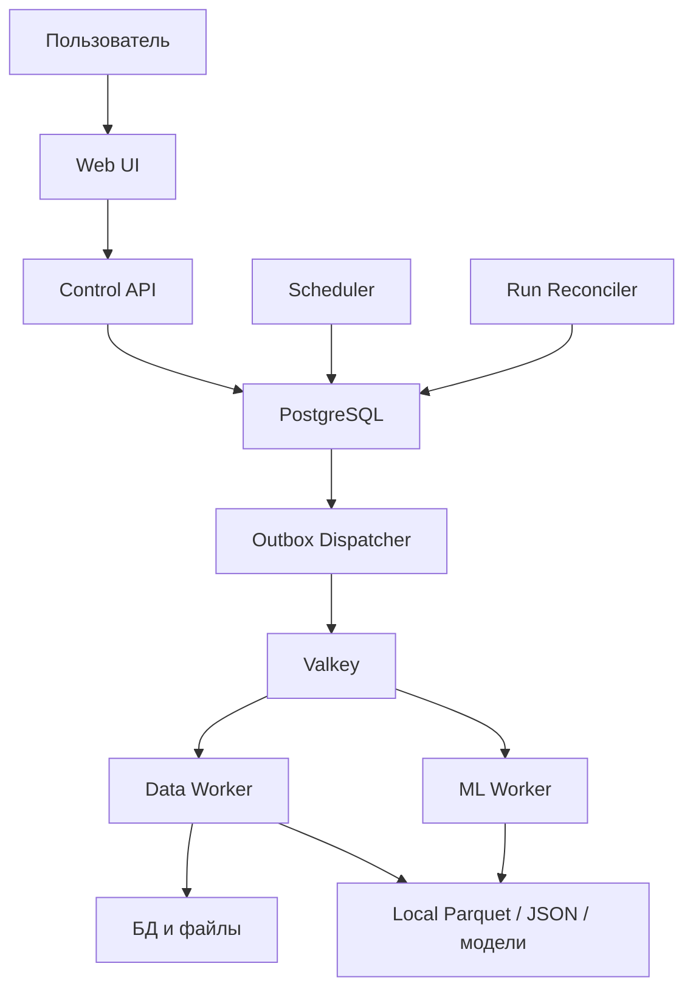

# 0. Назначение документа

Этот документ является единым техническим blueprint для создания открытой self-hosted платформы клиентской аналитики и прогнозирования под названием `Custometry`.

> Это нормативная машиночитаемая версия спецификации `0.9.4-draft`. Полное человекочитаемое смысловое зеркало: [custometry-technical-blueprint-human-ru.md](./custometry-technical-blueprint-human-ru.md). Обе версии MUST иметь одинаковый `document_family_id`, `spec_version` и набор нормативных requirement ID; при расхождении источником истины является этот документ.

Документ объединяет:

- продуктовые границы;
- каноническую и семантическую модели данных;
- функциональные модули;
- входы и выходы каждого модуля;
- архитектуру сервисов;
- контракты low-code pipeline;
- карту технических зависимостей;
- безопасность и работу с PII;
- наблюдаемость;
- тестирование;
- развёртывание;
- этапы vertical alpha, public MVP и v1 target;
- критерии готовности;
- известные риски и открытые решения.

Документ предназначен для людей, программных агентов и чат-ботов. Требования имеют стабильные идентификаторы. При реализации агент MUST ссылаться на идентификаторы требований и не должен молча менять архитектурные решения.

## 0.1. Правила интерпретации

```yaml
interpretation_rules:
  - id: DOC-RULE-001
    rule: MUST означает обязательное требование.
  - id: DOC-RULE-002
    rule: SHOULD означает рекомендуемое требование; отклонение фиксируется в ADR.
  - id: DOC-RULE-003
    rule: MAY означает опциональную возможность.
  - id: DOC-RULE-004
    rule: Источником истины для состояния запусков является PostgreSQL, а не очередь задач.
  - id: DOC-RULE-005
    rule: Источником истины для опубликованной аналитической логики является неизменяемая версия определения.
  - id: DOC-RULE-006
    rule: Опубликованные результаты MUST быть воспроизводимы по версии входов, конфигурации и кода.
  - id: DOC-RULE-007
    rule: Эта machine-версия является нормативной; human-версия является полным объясняющим представлением тех же требований.
  - id: DOC-RULE-008
    rule: CI MUST проверять совпадение spec_version, взаимных ссылок и нормативных requirement ID в двух представлениях.
  - id: DOC-RULE-009
    rule: Несколько изолированных workspaces внутри одной инсталляции являются базовой tenancy-моделью, а не открытым решением.
  - id: DOC-RULE-010
    rule: Новое нормативное требование MUST сначала появляться в machine-версии; human-версия не может вводить отдельные обязательства.
```

# 1. Резюме продукта

## 1.1. Определение

`Custometry` — открытая self-hosted low-code операционная система B2C retail-аналитики, которая превращает разрозненные клиентские и транзакционные данные, локальные методики и повторяющиеся ad hoc-запросы в управляемый цикл: бизнес-вопрос, утверждённая методика, воспроизводимое исследование, проверенный вывод, опубликованный аналитический продукт и доступный бизнесу результат.

Текущая доменная модель целенаправленно обслуживает B2C retail. Будущее расширение на B2B sales MUST быть additive и не должно заставлять текущие сущности `Customer`, `Receipt`, `ReceiptItem`, `Product`, `Store` или `Channel` притворяться `Account`, `Lead` либо `Opportunity`.

Ключевая ценность продукта — собственный семантический слой, который понимает предметные сущности и правила бизнеса:

- клиент;
- клиентский идентификатор;
- чек или заказ;
- позиция чека;
- товар;
- магазин;
- канал;
- календарь;
- продажа;
- возврат;
- выручка;
- скидка;
- себестоимость;
- активный клиент;
- когорта;
- сегмент;
- прогнозируемая метрика.

## 1.2. Основные цели

```yaml
product_goals:
  - id: GOAL-001
    goal: Подключать данные без переноса всей инфраструктуры компании в платформу.
  - id: GOAL-002
    goal: Поддерживать неполные наборы данных и явно определять доступные функции.
  - id: GOAL-003
    goal: Давать аналитику без необходимости писать Python для типовых сценариев.
  - id: GOAL-004
    goal: Сохранять возможность расширения через Python SDK и плагины.
  - id: GOAL-005
    goal: Делать расчёты воспроизводимыми, версионированными и проверяемыми.
  - id: GOAL-006
    goal: Строить прогнозы с временным backtesting и сравнением с baseline-моделями.
  - id: GOAL-007
    goal: Работать в self-hosted режиме на одном сервере и масштабироваться воркерами.
  - id: GOAL-008
    goal: Не привязывать бизнес-логику к конкретной СУБД или ML-библиотеке.
  - id: GOAL-009
    goal: Изолированно обслуживать несколько workspaces в одной инсталляции.
  - id: GOAL-010
    goal: Предоставлять полный английский и русский интерфейс с возможностью добавлять языки каталогами переводов без изменения доменного кода.
  - id: GOAL-011
    goal: Стандартизировать аналитическую работу через versioned Metric Registry, Methodology Registry, Analysis Case, evidence-linked findings и повторно используемые analytical products.
  - id: GOAL-012
    goal: Позволять кастомизировать инсталляцию под компанию через versioned BrandProfile и CompanyPack без fork кода или customer-specific image.
  - id: GOAL-013
    goal: Давать аналитикам единое research-пространство от общего к частному с таблицами, графиками, metric groups, выводами и воспроизводимой публикацией.
```

## 1.3. Не входит в текущий scope

```yaml
non_goals:
  - id: NON-GOAL-001
    item: Запуск персонализированных механик.
  - id: NON-GOAL-002
    item: Email, SMS, push и другие массовые рассылки.
  - id: NON-GOAL-003
    item: Промокоды и бонусные начисления.
  - id: NON-GOAL-004
    item: TDA и persistent homology.
  - id: NON-GOAL-005
    item: Полноценная real-time CDP.
  - id: NON-GOAL-006
    item: Замена корпоративного DWH.
  - id: NON-GOAL-007
    item: Полный аналог Airflow, dbt, JupyterLab или BI-платформы.
  - id: NON-GOAL-008
    item: Выполнение произвольного недоверенного Python-кода из браузера.
  - id: NON-GOAL-009
    item: Автоматическое доказательство причинно-следственного эффекта.
  - id: NON-GOAL-010
    item: Dash как production UI/runtime или второй application framework до и включая v1 target.
  - id: NON-GOAL-011
    item: Plotly как core chart dependency до и включая v1 target; будущий trusted plugin допускается только через утверждённый renderer contract.
  - id: NON-GOAL-012
    item: ECharts-GL, WebGL chart pipeline или GPU analytical compute до и включая v1 target.
  - id: NON-GOAL-013
    item: B2B sales ontology, включая Account, Contact, Lead, Opportunity, pipeline stages, quote и renewal, до отдельной будущей product specification.
  - id: NON-GOAL-014
    item: Публичный activation runtime, reverse ETL marketplace, campaign orchestration или destination connector implementation до отдельного private product decision после v1 target.
  - id: NON-GOAL-015
    item: Cloud/SaaS distribution, managed control plane, Kubernetes или multi-host production topology до отдельного будущего release decision; текущая distribution model — только self-host.
```

`NON-GOAL-001`, `NON-GOAL-002` и `NON-GOAL-003` не запрещают вести исторический журнал внешних промокампаний и не запрещают пользователю вручную отправить один воспроизводимый аналитический отчёт разрешённым получателям. Платформа не запускает маркетинговую механику, не выбирает аудиторию для воздействия, не выполняет массовую или scheduled marketing-рассылку и не начисляет бонусы. Три visualization non-goals не запрещают будущий Plotly renderer plugin после v1, но запрещают второй production UI framework, core Plotly dependency, WebGL/GPU chart path и перенос аналитических вычислений в browser. `NON-GOAL-014` не отменяет публичные контракты ручного email/XLSX/CSV/Parquet report delivery: он отделяет доставку аналитического результата от будущей активации аудитории во внешних marketing systems.

# 2. Пользователи и сценарии

## 2.1. Роли продукта

| Роль | Основные задачи | Ограничения |
|---|---|---|
| Installation Administrator | Bootstrap, lifecycle инсталляции, глобальные policy ceilings, trusted plugins, health и backup | Не получает workspace content или PII без отдельного time-bounded membership/grant |
| Workspace Administrator | Участники, роли, object-level доступ к отчётам, подключения, secrets и политики workspace | По умолчанию не создаёт аналитический content, metrics, segments или reports и не получает PII автоматически |
| Data Steward | Mapping, quality, canonical entities, semantic datasets, data contracts и Data Guides | Не управляет пользователями или подключениями без отдельной административной роли |
| Analyst | Анализы, research cases, методики, metrics, segments, dashboards, reports, comments, отправка и exports | Не создаёт, не изменяет и не удаляет connections/secrets и не назначает пользователям доступ |
| ML Analyst | Права Analyst плюс forecast projects, backtesting и model lifecycle | Не управляет пользователями или connections |
| Operator | Запуск опубликованных pipeline, диагностика и восстановление execution | Не редактирует опубликованные определения, access policies или аналитический content |
| Viewer | Просмотр явно разрешённых reports/dashboards и comments | Не запускает compute, не меняет definitions и никогда не получает raw personal/sensitive PII |

Роли являются versioned permission bundles. Пользователь MAY иметь несколько ролей, но административная роль не должна молча наследовать аналитические права. `Data Steward`, `ML Analyst` и `Operator` являются специализированными профилями; базовое бизнес-разделение остаётся `Workspace Administrator`, `Analyst`, `Viewer`.

Функциональная роль и положение в организационной структуре MUST быть независимыми измерениями. `Department Leader` — scoped leadership assignment для выбранного подразделения и, при явной политике, его поддерева, а не новая глобальная роль. Каждый активный workspace member MUST иметь ровно одно primary department assignment; дополнительные доступы к данным, отчётам или аналитическим объектам других подразделений выдаются отдельными bounded grants и никогда не расширяют базовый role/PII ceiling.

## 2.2. Ключевые сценарии

```yaml
use_cases:
  - id: UC-001
    name: Подключение источника
    actor: Workspace Administrator
    input: Параметры подключения или файл
    output: Проверенное read-only подключение и каталог доступных объектов
  - id: UC-002
    name: Создание semantic dataset
    actor: Data Steward
    input: Таблицы, поля, связи, правила предметной области
    output: Версионированная семантическая модель и capability matrix
  - id: UC-003
    name: Проверка качества
    actor: Data Steward
    input: Semantic dataset и правила качества
    output: Quality report, нарушения и решение quality gate
  - id: UC-004
    name: Клиентская аналитика
    actor: Analyst
    input: Валидный dataset и параметры анализа
    output: Таблицы, метрики, сегменты и графики
  - id: UC-005
    name: Прогнозирование
    actor: ML Analyst
    input: Временной ряд, горизонт, разрезы, регрессоры
    output: Backtest, выбранная модель, прогноз и интервалы
  - id: UC-006
    name: Повторяемый pipeline
    actor: Analyst
    input: DAG, параметры и расписание
    output: Версионированный run и набор артефактов
  - id: UC-007
    name: Экспорт результата
    actor: Analyst
    input: Разрешённый артефакт
    output: CSV, Parquet или ответ внутреннего authenticated result API
  - id: UC-008
    name: Первый запуск инсталляции
    actor: Installation Administrator
    input: Bootstrap token, локальная учётная запись и параметры инсталляции
    output: Первый администратор, первый workspace, locale/timezone и сохранённый onboarding checklist
  - id: UC-009
    name: Исправление качества
    actor: Data Steward
    input: Failed QualityReport и разрешённый sample нарушений
    output: Исправленная draft-версия, повторная проверка или временный auditable waiver
  - id: UC-010
    name: Эксплуатация запусков
    actor: Operator
    input: Очереди, schedules, runs, worker health и operational notifications
    output: Retry, cancel, rerun, назначение владельца инцидента или подтверждённое восстановление
  - id: UC-011
    name: Совместное использование результата
    actor: Analyst
    input: Версионированный dashboard или published report snapshot и access policy
    output: Доступ внутри workspace, immutable reference и audit event
  - id: UC-012
    name: Сравнение с прошлым годом
    actor: Analyst
    input: Аналитический результат, текущий период и явная calendar-alignment policy
    output: Текущие и сравнительные значения, абсолютное/процентное изменение и coverage diagnostics
  - id: UC-013
    name: Журнал промоакций
    actor: Analyst
    input: Версионированные периоды акции, каналы и immutable audience binding
    output: Auditable promotion timeline и аналитический overlay без causal claim
  - id: UC-014
    name: Пользовательская отправка отчёта
    actor: Analyst
    input: Immutable report snapshot, verified sender и получатели из разрешённых доменов
    output: Персональный HTML email, delivery status и redacted audit trail
  - id: UC-015
    name: Универсальный XLSX-отчёт
    actor: Analyst
    input: Report snapshot из поддерживаемого reportable result
    output: Единый workbook с данными, графиками, metadata, lineage и Data Guide
  - id: UC-016
    name: Публикация Data Guide
    actor: Workspace Administrator
    input: Markdown по утверждённому шаблону
    output: Безопасная immutable DataGuideVersion, связанная с workspace или semantic dataset
  - id: UC-017
    name: Воспроизводимая визуализация результата
    actor: Analyst
    input: Immutable result artifact, product-owned ChartSpec, theme и render target
    output: Интерактивный ECharts Web chart, email PNG либо native/raster XLSX chart из одной specification
  - id: UC-018
    name: Полноэкранное исследование блока
    actor: Analyst
    input: Разрешённый reportable chart, table или range_timeline, inherited filters и presentation state
    output: Focus / Explore mode с локальными фильтрами, chart/table controls, Result Trust, экспортом и возвратом в исходный контекст
  - id: UC-019
    name: Управление аналитической методикой
    actor: Analyst
    input: Бизнес-вопрос, required capabilities, metric versions, правила расчёта, допущения, quality checks и output template
    output: Reviewed immutable AnalysisMethodVersion со status, owner, reviewers и implementation bindings
  - id: UC-020
    name: Research от общего к частному
    actor: Analyst
    input: AnalysisCase, dataset, method, metrics, filters и reportable artifacts
    output: Versioned research document с sections, metric groups, charts, tables, findings, conclusions и reproducible bindings
  - id: UC-021
    name: Комментарий к аналитическому результату
    actor: Viewer
    input: Разрешённый report/dashboard snapshot или block и неперсональный текст комментария
    output: Auditable discussion thread без изменения immutable snapshot и без раскрытия PII
  - id: UC-022
    name: Управление доступом к отчёту
    actor: Workspace Administrator
    input: Published report/dashboard, пользователи или группы и object access policy
    output: Versioned grant/revoke policy, effective-access preview и audit event
  - id: UC-023
    name: Корпоративное брендирование
    actor: Installation Administrator
    input: Brand assets, semantic color tokens, typography, product identity и channel-specific presentation policy
    output: Validated immutable BrandProfileVersion и CompanyPack binding без fork кода
  - id: UC-024
    name: Шаблонный импорт файла
    actor: Workspace Administrator
    input: CSV/XLSX file и опубликованный FileImportTemplateVersion
    output: Validated typed extraction с mapping evidence, rejected-row diagnostics и source lineage
  - id: UC-025
    name: Управляемая обработка выбросов
    actor: Analyst
    input: Версионированная population, grain, metric/feature, observation window, peer scope, method, parameters и action
    output: Immutable PopulationTreatmentSpecVersion, воспроизводимые bounds, sensitivity diagnostics и разрешённый treated result без изменения canonical source/metric
  - id: UC-026
    name: Бакетная, стратифицированная и кластерная сегментация
    actor: Analyst
    input: Population, feature set, treatment version, segmentation method и требуемое количество конечных групп
    output: Versioned definition, diagnostics, profiles и immutable SegmentMembershipSnapshot либо DistributionArtifact
  - id: UC-027
    name: Компонентная аналитика скидок и price-volume-mix
    actor: Analyst
    input: ReceiptItem, базовая цена, component facts, DiscountPolicyVersion, период, comparison и разрешённые dimensions
    output: Reconciled component-discount metrics, stacking/cap diagnostics, PVM decomposition и Result Trust с disclosure качества атрибуции
  - id: UC-028
    name: Управление организационной структурой и доступом подразделений
    actor: Workspace Administrator
    input: Иерархия company/division/department/team, primary assignments, leadership scopes, department data policies и cross-department grants
    output: Версионированная OrganizationStructureVersion, effective-access preview, ownership bindings и auditable change events
  - id: UC-029
    name: Витрина People & Creators и активность сотрудников
    actor: Department Leader
    input: Разрешённый organizational scope, redacted domain events и опубликованные аналитические объекты
    output: Privacy-safe contributor cards/profile с activity summary, owned/created reports и dashboards без employee ranking или доступа к raw audit
```

## 2.3. Нормативные пользовательские пути

```yaml
user_journeys:
  - id: JOURNEY-001
    name: first_run_and_workspace_bootstrap
    requirements:
      - Bootstrap endpoint доступен только до создания первого installation administrator и защищён одноразовым bootstrap token.
      - Пользователь выбирает language, format locale и timezone независимо друг от друга.
      - Система создаёт первый workspace и предлагает опциональный демонстрационный dataset.
      - Checklist сохраняется и может быть продолжен после повторного входа.
    completion: Пользователь попадает в Overview с явным следующим действием.
  - id: JOURNEY-002
    name: dataset_onboarding
    steps:
      - add_or_upload_connection
      - discover_and_profile_catalog
      - map_entities_fields_keys_and_source_namespaces
      - configure_relationships_metrics_returns_currency_and_identity
      - validate_sample
      - publish_configuration
      - materialize_and_run_full_quality_gate
    completion: Dataset получает trusted, degraded или blocked readiness status и capability evidence.
  - id: JOURNEY-003
    name: quality_remediation
    steps:
      - inspect_failed_rule_and_redacted_sample
      - navigate_to_mapping_or_rule
      - assign_owner_and_comment
      - fix_and_rerun_rule_or_request_time_bounded_waiver
      - compare_with_previous_report
    completion: Gate разрешает запуск, разрешает degraded mode либо сохраняет блокировку с объяснением.
  - id: JOURNEY-004
    name: guided_analysis
    steps:
      - select_analysis_template
      - select_compatible_dataset
      - inspect_capability_preflight
      - configure_parameters_and_estimate
      - execute_through_pipeline_engine
      - inspect_result_trust_panel
      - save_dashboard_share_schedule_or_export
    completion: Сохранена воспроизводимая AnalysisVersion и immutable result manifest.
  - id: JOURNEY-005
    name: forecast_lifecycle
    steps:
      - validate_history_and_preview_series
      - configure_horizon_candidates_and_backtest
      - compare_candidates_with_baselines
      - approve_champion
      - publish_forecast_and_schedule_monitoring
      - retrain_compare_promote_or_rollback
    completion: Champion, причины выбора, ограничения и monitoring policy доступны для аудита.
  - id: JOURNEY-006
    name: operator_recovery
    steps:
      - inspect_queue_schedule_run_attempt_and_worker_health
      - identify_stuck_failed_or_partial_scope
      - cancel_retry_failed_node_or_start_full_rerun
      - compare_attempts_and_verify_cleanup
      - acknowledge_notification
    completion: Run находится в terminal state, а действие и причина зафиксированы в audit.
  - id: JOURNEY-007
    name: governed_research_to_analytical_product
    steps:
      - create_or_open_analysis_case
      - select_or_draft_analysis_method
      - verify_dataset_metric_identity_and_quality_capabilities
      - explore_from_summary_to_detail_in_research_workspace
      - bind_metric_groups_charts_tables_findings_and_limitations
      - review_and_publish_immutable_research_document
      - compose_dashboard_report_or_export_from_the_same_snapshot
      - collect_contextual_comments_without_mutating_the_snapshot
    completion: AnalysisCase связан с approved method, immutable evidence, published analytical product и auditable discussion.
```

```yaml
journey_requirements:
  - id: UX-JOURNEY-001
    requirement: Каждый многошаговый wizard MUST сохранять draft после завершённого шага и позволять безопасно продолжить позже.
  - id: UX-JOURNEY-002
    requirement: Каждый пустой, loading, degraded, forbidden и failed state MUST содержать причину и доступное следующее действие.
  - id: UX-JOURNEY-003
    requirement: Guided forms MUST компилироваться в те же versioned node и pipeline specifications и выполняться тем же execution engine, что и Pipeline mode; отдельный вычислительный путь запрещён.
  - id: UX-JOURNEY-004
    requirement: До тяжёлого запуска UI MUST показывать capability preflight, оценку объёма и применяемые resource limits.
  - id: UX-JOURNEY-005
    requirement: Result Trust Panel MUST показывать as_of_date, freshness, quality, limitations, версии dataset и metrics, grain, filters, timezone, currency и lineage.
  - id: UX-JOURNEY-006
    requirement: Действия «Почему функция недоступна?», «Почему это число?» и «На что повлияет публикация?» MUST быть доступны из соответствующего контекста.
  - id: UX-JOURNEY-007
    requirement: Research workspace MUST поддерживать движение от executive summary к детализации через stable outline/sections, linked filters и drill-down без потери исходного контекста.
  - id: UX-JOURNEY-008
    requirement: Аналитический вывод MUST быть отдельным versioned finding/conclusion block с author, evidence bindings, scope, limitations и review status; свободный comment не становится опубликованным выводом автоматически.
  - id: UX-JOURNEY-009
    requirement: Viewer с доступом к report/dashboard MUST уметь читать и создавать comments на разрешённом snapshot/block, но comment path MUST применять object access, PII/DLP validation, audit и notification policies.
  - id: UX-JOURNEY-010
    requirement: Workspace Administrator MUST управлять report/dashboard access grants отдельно от authoring; Analyst MAY запросить публикацию или изменение доступа, но не расширяет ACL самостоятельно без соответствующей административной роли.
```

## 2.4. Жизненный цикл объектов и readiness

Versioned definitions используют единый жизненный цикл:

```yaml
version_lifecycle:
  states: [draft, validating, published, deprecated, archived]
  actions:
    create: creates_draft
    clone: creates_new_draft_from_any_readable_version
    update: draft_only_with_optimistic_revision
    validate: draft_to_validating_to_draft_with_report
    publish: valid_draft_to_published_immutable_version
    deprecate: published_to_deprecated_with_replacement_optional
    archive: deprecated_to_archived_when_retention_and_dependencies_allow
  invariants:
    - published_version_is_immutable
    - stable_object_id_and_monotonic_version_number
    - update_requires_if_match_or_revision
    - publish_requires_diff_and_dependency_impact_report
    - dependent_pinned_versions_do_not_move_automatically
    - latest_binding_re_resolves_only_by_explicit_policy
```

Dataset configuration lifecycle отделён от результата materialization:

```yaml
dataset_readiness:
  states: [sample_validated, materializing, trusted, degraded, blocked, stale]
  terminal_for_attempt: [trusted, degraded, blocked]
  rules:
    - published configuration lifecycle не означает trusted data readiness
    - stale определяется freshness policy и последним успешным materialization
    - degraded содержит machine-readable limitations и affected capabilities
    - blocked не может использоваться для trusted analytics без действующего waiver
```

```yaml
object_state_requirements:
  - id: OBJ-STATE-001
    requirement: API MUST отклонять недопустимые переходы stable machine code и возвращать допустимые actions для текущего пользователя.
  - id: OBJ-STATE-002
    requirement: Любая публикация MUST создавать version diff, dependency impact report и audit event.
  - id: OBJ-STATE-003
    requirement: Удаление definition запрещено при зависимостях; используется deprecation и управляемая миграция ссылок.
  - id: OBJ-STATE-004
    requirement: UI MUST различать lifecycle definition, readiness данных и execution state и не объединять их в одно поле status.
  - id: OBJ-STATE-005
    requirement: Concurrent draft edits MUST защищаться optimistic locking через revision или ETag.
```

| Объект | Lifecycle/configuration state | Operational/readiness state |
|---|---|---|
| Connection | `draft`, `active`, `disabled`, `archived` | `untested`, `testing`, `ready`, `degraded`, `unreachable` |
| Semantic dataset | общий version lifecycle | `sample_validated`, `materializing`, `trusted`, `degraded`, `blocked`, `stale` |
| Metric/Pipeline/Analysis/Segment/Dashboard/Forecast spec | общий version lifecycle | Последний run/result показывается отдельно |
| Schedule | `draft`, `enabled`, `paused`, `disabled`, `archived` | `healthy`, `misfired`, `failing`, `blocked` |
| Run | immutable definition reference | состояния из раздела 9.5 |
| Export | immutable export request | `created`, `queued`, `running`, `succeeded`, `failed`, `cancelled`, `expired` |
| Model version | `candidate`, `champion`, `archived`, `invalid` | monitoring status `healthy`, `degraded`, `stale`, `insufficient_actuals` |
| Notification delivery | immutable event reference | `pending`, `delivered`, `read`, `acknowledged`, `dismissed` |

# 3. Архитектурные принципы

```yaml
architecture_principles:
  - id: ARCH-PRINCIPLE-001
    principle: Modular monolith first
    statement: Бизнес-модули размещаются в одном репозитории и одном backend release, но взаимодействуют через контракты.
  - id: ARCH-PRINCIPLE-002
    principle: Separate control plane and data plane
    statement: API и PostgreSQL управляют состоянием; воркеры выполняют тяжёлые задачи.
  - id: ARCH-PRINCIPLE-003
    principle: Metadata in PostgreSQL, analytical data in Parquet
    statement: Управляющие данные не смешиваются с крупными аналитическими наборами.
  - id: ARCH-PRINCIPLE-004
    principle: Immutable published versions
    statement: Опубликованные semantic models, pipelines, metrics и forecast specifications не редактируются на месте.
  - id: ARCH-PRINCIPLE-005
    principle: Reproducibility by manifest
    statement: Каждый результат содержит manifest входов, конфигурации, кода и зависимостей.
  - id: ARCH-PRINCIPLE-006
    principle: Pushdown before extraction
    statement: Фильтрация, выбор столбцов и безопасные агрегации выполняются в источнике, если это возможно.
  - id: ARCH-PRINCIPLE-007
    principle: Explicit data grain
    statement: Каждая таблица и каждый артефакт объявляют гранулярность и ключ.
  - id: ARCH-PRINCIPLE-008
    principle: No silent assumptions
    statement: Валюта, timezone, возвраты, активность и определения метрик задаются явно.
  - id: ARCH-PRINCIPLE-009
    principle: Trusted plugins only
    statement: Плагины устанавливаются администратором и выполняются как доверенный серверный код.
  - id: ARCH-PRINCIPLE-010
    principle: Idempotent side effects
    statement: Запись таблиц и публикация артефактов безопасны при повторном выполнении.
  - id: ARCH-PRINCIPLE-011
    principle: Multi-workspace isolation by default
    statement: Каждый workspace-scoped объект, запрос, task и artifact несёт workspace_id; доступ между workspaces запрещён по умолчанию.
  - id: ARCH-PRINCIPLE-012
    principle: One execution engine
    statement: Guided forms и Pipeline canvas создают одни и те же versioned specifications и выполняются общим orchestrator/worker engine.
  - id: ARCH-PRINCIPLE-013
    principle: Locale-neutral domain core
    statement: Идентификаторы, enum, manifests, cache keys и вычисления не зависят от языка UI.
  - id: ARCH-PRINCIPLE-014
    principle: Transactional task dispatch
    statement: Намерение поставить задачу в очередь фиксируется в PostgreSQL в одной транзакции с изменением control-plane state.
```

## 3.1. Контекст системы



# 4. Слои данных

| Слой | Назначение | Формат | Изменяемость |
|---|---|---|---|
| Source | Исходные БД и файлы | SQL tables, CSV, Parquet, XLSX | Внешняя |
| Landing | Снимок извлечённых данных | Partitioned Parquet | Append/replace по manifest |
| Semantic | Mapping ролей, связей и правил | PostgreSQL metadata + JSON | Версионируется |
| Mart | Предметные расчётные витрины | Partitioned Parquet | Immutable per run |
| Result | Метрики, сегменты, прогнозы | Parquet, JSON, model binary | Immutable per run |
| Presentation | Графики, dashboard specs, exports | JSON, CSV, Parquet | Версионируется |

## 4.1. Обязательный manifest артефакта

```yaml
artifact_manifest:
  artifact_id: uuid
  artifact_category: landing|mart|analysis|segment|quality|forecast|model|presentation|export
  artifact_schema_id: stable_machine_identifier
  artifact_schema_version: semver
  workspace_id: uuid
  run_id: uuid
  node_run_id: uuid|null
  attempt_id: uuid|null
  created_at: timestamp_utc
  storage_uri: local_relative_uri
  format: parquet|json|csv|cbm|html
  row_count: integer|null
  byte_size: integer
  partition_columns: []
  partition_manifest_id: uuid|null
  grain: string|null
  primary_key: []
  min_event_time: timestamp|null
  max_event_time: timestamp|null
  content_hash: sha256
  schema_fingerprint: sha256|null
  input_artifact_ids: []
  semantic_dataset_version_id: uuid|null
  pipeline_version_id: uuid|null
  code_version: git_sha_or_release
  dependency_lock_hash: sha256
  parameters_hash: sha256
  pii_classification: none|internal|personal|sensitive
  retention_policy: string
```

`artifact_category` задаёт широкую политику хранения и доступа, а `artifact_schema_id` — конкретный тип данных, совместимый с pipeline ports. `node_run_id` равен `null` для импортированного, системного или сформированного вне node результата. Обобщённое поле `artifact_type`, смешивающее эти два уровня, запрещено в persistent manifest.

```yaml
partition_manifest:
  partition_manifest_id: uuid
  workspace_id: uuid
  artifact_id: uuid
  expected_partition_keys: []
  partitions:
    - partition_key: object
      relative_uri: string
      row_count: integer
      byte_size: integer
      content_hash: sha256
      min_event_time: timestamp|null
      max_event_time: timestamp|null
  aggregate_content_hash: sha256
  committed_at: timestamp_utc
```

```yaml
artifact_requirements:
  - id: ARTIFACT-001
    requirement: Artifact и его partition manifest становятся видимыми только одним атомарным metadata commit после проверки всех ожидаемых partition.
  - id: ARTIFACT-002
    requirement: Отсутствующая, лишняя или имеющая неверный hash partition MUST блокировать commit всего artifact.
  - id: ARTIFACT-003
    requirement: Перезапись immutable committed path запрещена; idempotent повтор возвращает существующий artifact только при совпадении content и parameters hashes.
  - id: ARTIFACT-004
    requirement: Каждый tabular artifact MUST объявлять grain, primary key expectation и schema fingerprint.
```

# 5. Каноническая модель данных

## 5.1. Общие правила

```yaml
canonical_rules:
  - id: DATA-RULE-001
    rule: Все идентификаторы MUST преобразовываться в строковый логический тип без потери исходного значения.
  - id: DATA-RULE-002
    rule: Все timestamps MUST иметь определённую timezone; внутри платформы используется UTC.
  - id: DATA-RULE-003
    rule: Денежные значения MUST иметь currency или объявленную валюту dataset.
  - id: DATA-RULE-004
    rule: Возвраты и отмены MUST быть представлены status или signed measure, правило задаётся явно.
  - id: DATA-RULE-005
    rule: Каждая сущность MUST объявлять grain, primary key и uniqueness expectation.
  - id: DATA-RULE-006
    rule: Произвольные атрибуты MAY храниться как dimensions, но часто используемые поля SHOULD иметь явную семантическую роль.
  - id: DATA-RULE-007
    rule: Неизвестное значение не должно автоматически приравниваться к нулю или false.
  - id: DATA-RULE-008
    rule: Любой внешний идентификатор MUST быть квалифицирован стабильным source_system_id; отображаемое имя подключения не является namespace.
  - id: DATA-RULE-009
    rule: SCD-сущность MUST иметь отдельный version key либо составной ключ с valid_from; business ID без версии не может быть primary key строки истории.
  - id: DATA-RULE-010
    rule: Temporal joins MUST выбирать ровно одну допустимую версию dimension на event time и блокировать пересекающиеся интервалы validity.
  - id: DATA-RULE-011
    rule: Foreign key к source entity MUST включать source_system_id, если не опубликован отдельный versioned crosswalk в canonical ID.
```

## 5.2. Customer

```yaml
entity:
  id: ENTITY-CUSTOMER
  name: Customer
  grain: one_row_per_customer_version
  primary_key: [customer_version_id]
  natural_key: [source_system_id, customer_id]
  unique_version_key: [source_system_id, customer_id, valid_from]
  required_fields:
    customer_version_id: uuid
    source_system_id: uuid
    customer_id: string
    valid_from: timestamp
  optional_fields:
    created_at: timestamp
    birth_date: date
    gender: categorical
    region: categorical
    city: categorical
    registration_channel: categorical
    loyalty_level: categorical
    status: categorical
    valid_to: timestamp
    attributes: map
  pii_fields:
    direct_identifiers: [email, phone, external_person_id]
    quasi_identifiers: [birth_date, city]
  outputs_enabled:
    - customer_analytics
    - customer_segments
```

`Customer` MAY быть snapshot-таблицей или slowly changing dimension. Если исторические изменения атрибутов отсутствуют, аналитика использует текущие значения и MUST помечать это ограничение.
Для current snapshot без source validity платформа присваивает `valid_from` из extraction batch boundary и `valid_to = null`; такой synthetic interval MUST быть отмечен в lineage.

## 5.3. CustomerIdentity

Идентификация клиентов — обязательный отдельный слой. Один человек может иметь loyalty ID, website ID, CRM ID и несколько технических ID.

```yaml
entity:
  id: ENTITY-CUSTOMER-IDENTITY
  name: CustomerIdentity
  grain: one_row_per_source_identity_mapping_version_interval
  primary_key: [identity_mapping_version_id, source_system_id, source_customer_id, valid_from]
  interval_invariant: no_overlapping_validity_intervals_per_mapping_version_and_source_identity
  required_fields:
    identity_mapping_version_id: uuid
    source_system_id: uuid
    source_customer_id: string
    canonical_customer_id: string
    valid_from: timestamp
  optional_fields:
    identity_type: categorical
    confidence: float
    valid_to: timestamp
    resolution_rule: string
```

Public MVP MUST поддерживать deterministic mapping, загруженный пользователем. Вероятностный identity resolution не входит в v1 target.

```yaml
identity_mapping_lifecycle:
  identity_mapping_version_id: uuid
  identity_mapping_id: uuid
  workspace_id: uuid
  version: integer
  status: draft|published|deprecated|archived
  effective_from: timestamp
  source_namespaces: []
  conflict_policy: reject|explicit_priority
  merge_split_events: []
  lineage: object
```

```yaml
identity_requirements:
  - id: IDENTITY-001
    requirement: Published identity mapping version MUST быть immutable и фиксироваться во входном manifest каждой клиентской витрины.
  - id: IDENTITY-002
    requirement: Merge или split canonical customer MUST создавать новую mapping version и impact report, а не переписывать исторические результаты.
  - id: IDENTITY-003
    requirement: Одновременное сопоставление одного source identity нескольким canonical_customer_id в одном effective interval MUST блокироваться.
  - id: IDENTITY-004
    requirement: UI MUST показывать unmatched, conflicted и remapped identity counts до публикации.
  - id: IDENTITY-005
    requirement: В одной identity mapping version validity intervals для одного source_system_id и source_customer_id MUST не пересекаться и давать не более одного effective canonical_customer_id в момент времени.
```

## 5.4. Receipt

```yaml
entity:
  id: ENTITY-RECEIPT
  name: Receipt
  grain: one_row_per_receipt
  primary_key: [source_system_id, receipt_id]
  required_fields:
    source_system_id: uuid
    receipt_id: string
    occurred_at: timestamp
  optional_fields:
    customer_id: string
    store_id: string
    channel_id: string
    gross_revenue: decimal
    discount_amount: decimal
    net_revenue: decimal
    tax_amount: decimal
    cost_amount: decimal
    quantity: decimal
    currency: string
    status: categorical
    source_updated_at: timestamp
  invariants:
    - сочетание source_system_id и receipt_id глобально уникально в dataset version
    - occurred_at не должен быть позже допустимого future tolerance
    - net_revenue reconciliation задаётся пользователем
```

## 5.5. ReceiptItem

```yaml
entity:
  id: ENTITY-RECEIPT-ITEM
  name: ReceiptItem
  grain: one_row_per_receipt_line
  primary_key: [source_system_id, receipt_id, line_id]
  required_fields:
    source_system_id: uuid
    receipt_id: string
    line_id: string
  conditionally_required_fields:
    product_id: required_for_product_and_basket_analytics
  optional_fields:
    product_id: string
    quantity: decimal
    base_unit_price_amount: decimal
    base_price_amount: decimal
    gross_amount: decimal
    discount_amount: decimal
    promotion_discount_amount: decimal
    loyalty_discount_amount: decimal
    bonus_redemption_amount: decimal
    other_discount_amount: decimal
    net_amount: decimal
    tax_amount: decimal
    cost_amount: decimal
    promotion_flag: boolean
    external_promotion_id: string
    promotion_version_id: uuid
    status: categorical
    source_updated_at: timestamp
```

Если `line_id` отсутствует, mapping wizard MUST предложить стабильный составной ключ. Генерация ключа по номеру строки запрещена для инкрементальных данных, если порядок строк нестабилен.

### 5.5.1. ReceiptItemDiscountComponent

Исходная wide-схема `ReceiptItem` удобна для прямого mapping, но аналитический
контракт нормализует каждую известную составляющую скидки в отдельный fact. Это
позволяет добавлять company-specific компоненты без новых колонок и не смешивать
экономическую скидку, оплату бонусами и бонусное начисление.

```yaml
entity:
  id: ENTITY-RECEIPT-ITEM-DISCOUNT-COMPONENT
  name: ReceiptItemDiscountComponent
  grain: one_row_per_receipt_line_discount_component
  primary_key: [source_system_id, receipt_id, line_id, discount_component_id]
  required_fields:
    source_system_id: uuid
    receipt_id: string
    line_id: string
    discount_component_id: string
    component_type: promotion|loyalty|bonus_redemption|other
    component_amount: decimal
    attribution_mode: direct|rule_derived|residual_proxy|total_only|unavailable
  optional_fields:
    source_field_ref: string
    source_rule_ref: string
    promotion_version_id: uuid
    discount_policy_version_id: uuid
    attribution_evidence_ref: object
    quality_code: string
```

`bonus_redemption` означает списание/использование бонусов покупателем. Бонусное
начисление является отдельным событием loyalty accounting и MUST не попадать в
discount component fact. `base_price_amount` — стоимость строки по опубликованной
базовой цене до скидок с учётом количества и return policy; unit и line amount
не взаимозаменяются молча.

## 5.6. Product

```yaml
entity:
  id: ENTITY-PRODUCT
  name: Product
  grain: one_row_per_product_version
  primary_key: [product_version_id]
  natural_key: [source_system_id, product_id]
  unique_version_key: [source_system_id, product_id, valid_from]
  required_fields:
    product_version_id: uuid
    source_system_id: uuid
    product_id: string
    valid_from: timestamp
  optional_fields:
    product_name: string
    category: categorical
    subcategory: categorical
    brand: categorical
    manufacturer: categorical
    unit_of_measure: categorical
    valid_to: timestamp
    attributes: map
```

## 5.7. Store

```yaml
entity:
  id: ENTITY-STORE
  name: Store
  grain: one_row_per_store_version
  primary_key: [store_version_id]
  natural_key: [source_system_id, store_id]
  unique_version_key: [source_system_id, store_id, valid_from]
  required_fields:
    store_version_id: uuid
    source_system_id: uuid
    store_id: string
    valid_from: timestamp
  optional_fields:
    store_name: string
    store_type: categorical
    format: categorical
    region: categorical
    city: categorical
    opened_at: date
    closed_at: date
    timezone: string
    valid_to: timestamp
    attributes: map
```

Правило synthetic validity для current snapshot применяется также к Product и Store; пересекающиеся intervals одной natural key запрещены.

## 5.8. Channel

```yaml
entity:
  id: ENTITY-CHANNEL
  name: Channel
  grain: one_row_per_channel
  primary_key: [source_system_id, channel_id]
  required_fields:
    source_system_id: uuid
    channel_id: string
  optional_fields:
    channel_name: string
    channel_group: online|offline|marketplace|other
    attributes: map
```

Channel MAY быть отдельной сущностью или нормализованным полем `Receipt`. Семантическая модель MUST привести исходные значения к стабильному справочнику.

## 5.9. Calendar

```yaml
entity:
  id: ENTITY-CALENDAR
  name: Calendar
  grain: one_row_per_date
  primary_key: [date]
  generated_by_platform: true
  fields:
    date: date
    year: integer
    quarter: integer
    month: integer
    iso_week: integer
    day_of_week: integer
    days_in_period: integer
    is_weekend: boolean
    is_holiday: boolean
    holiday_name: string|null
    fiscal_period: string|null
```

## 5.10. Optional analytical dimensions

| Сущность | Назначение | V1 target |
|---|---|---|
| CurrencyRate | Версионированное приведение нескольких валют по effective date | Required only when cross-currency aggregation is enabled |
| Promotion | Аналитика скидок и промопериодов без запуска механик | Optional |
| Region | Единая географическая иерархия | Optional |
| CustomerSegmentSnapshot | Историческое членство в сегменте | MUST |
| ExternalRegressor | Погода, промодни, количество магазинов, цены | SHOULD для forecast |

### 5.10.1. Promotion Journal

`Promotion` является версионированной аналитической сущностью для регистрации уже запланированных или фактически проведённых вне платформы промокампаний. Journal не исполняет маркетинговые механики и не создаёт causal attribution.

```yaml
promotion_version:
  promotion_version_id: uuid
  promotion_id: uuid
  workspace_id: uuid
  version: integer
  status: draft|validating|published|deprecated|archived
  availability_class: native_v1|template_v1|future_extension|unsupported
  method_family: descriptive|diagnostic|segmentation|forecasting|experimental|causal|decision
  revision: integer
  external_campaign_id: string|null
  title: localized_text
  description: localized_text|null
  promotion_type: string
  objective: string|null
  planned_status: scheduled|cancelled|null
  actual_status: active|completed|cancelled|null
  timezone: IANA_timezone
  windows:
    - window_id: uuid
      kind: planned|actual
      starts_at: timestamp
      ends_at: timestamp
  channel_ids: []
  store_scope: object|null
  product_scope: object|null
  region_scope: object|null
  audience_binding:
    mode: all_customers|segment_snapshot|customer_list_artifact
    segment_version_id: uuid|null
    segment_snapshot_artifact_id: uuid|null
    customer_list_artifact_id: uuid|null
  budget_amount: decimal|null
  budget_currency: ISO_4217|null
  tags: []
  source: manual|imported
  created_by: uuid
  created_at: timestamp_utc
```

```yaml
promotion_requirements:
  - id: PROMO-001
    requirement: Published PromotionVersion MUST быть immutable; изменение периода, каналов, аудитории или механики создаёт новую version с diff и audit.
  - id: PROMO-002
    requirement: Promotion MUST поддерживать несколько planned/actual windows в IANA timezone и валидировать starts_at < ends_at.
  - id: PROMO-003
    requirement: Promotion MAY относиться к нескольким Channel и MUST сохранять channel scope независимо от пользовательского языка.
  - id: PROMO-004
    requirement: Customer audience MUST задаваться только как all_customers, immutable SegmentSnapshot либо immutable customer-list artifact на canonical_customer_id; динамический пересчёт исторической аудитории запрещён.
  - id: PROMO-005
    requirement: Timeline search/filter MUST поддерживать period, status, channel, promotion, segment и разрешённый canonical customer без раскрытия недоступных customer rows или PII.
  - id: PROMO-006
    requirement: Пересекающиеся акции MUST сохраняться независимо и сопровождаться overlap diagnostics; overlap не считается ошибкой и не разрешается скрытым приоритетом.
  - id: PROMO-007
    requirement: Promotion period MAY отображаться как chart overlay и использоваться как versioned observed/known-future regressor, но correlation с метрикой не может объявляться causal effect.
  - id: PROMO-008
    requirement: Импорт Promotion MUST быть идемпотентен по workspace/source/external_campaign_id/source_version либо явному import key и публиковать rejected-row report.
  - id: PROMO-009
    requirement: Promotion Journal MUST иметь owner, permissions, audit и retention policy; удаление published history заменяется archive/deprecation, а не hard delete.
```

## 5.11. Reconciliation

Платформа MUST проверять согласованность чека и его позиций.

```yaml
reconciliation_rules:
  receipt_net_revenue:
    expected_expression: sum(receipt_item.net_amount)
    tolerance_type: absolute_or_relative
    tolerance_value: configurable
  receipt_quantity:
    expected_expression: sum(receipt_item.quantity)
  orphan_items:
    expected: 0
  unknown_products:
    severity: warning_or_error
```

# 6. Semantic Dataset

## 6.1. Определение

`SemanticDatasetVersion` — неизменяемое описание того, как физические источники преобразуются в канонические сущности и бизнес-метрики.

```yaml
semantic_dataset_version:
  semantic_dataset_version_id: uuid
  workspace_id: uuid
  dataset_id: uuid
  version: integer
  status: draft|validating|published|deprecated|archived
  revision: integer
  source_bindings: []
  entities: []
  joins: []
  field_mappings: []
  filters: []
  metric_definitions: []
  business_rules: []
  timezone: IANA_timezone
  default_currency: ISO_4217|null
  return_policy: object
  anonymous_customer_policy: object
  schema_fingerprint: sha256
  created_by: uuid
  created_at: timestamp
```

## 6.2. Связи и cardinality

Каждая связь MUST объявлять:

- левую и правую сущность;
- поля join;
- ожидаемую cardinality: `1:1`, `1:N`, `N:1`;
- поведение при отсутствующем ключе;
- допустимый процент unmatched;
- temporal join policy для версионированных dimensions.

Платформа MUST выполнять sample-based проверку до публикации и full check при первом materialization.

## 6.3. Реестр метрик

Метрики нельзя определять отдельно в каждом dashboard. Нужен единый `MetricRegistry`.

```yaml
metric_definition:
  metric_version_id: uuid
  metric_id: net_revenue
  workspace_id: uuid
  version: 1
  status: draft|validating|published|deprecated|archived
  certification_status: candidate|verified|canonical|deprecated
  revision: integer
  label_key: metrics.net_revenue.label
  description_key: metrics.net_revenue.description
  localized_labels:
    en: Net revenue
    ru: Чистая выручка
  metric_kind: additive_measure
  source_entity: Receipt
  source_grain: one_row_per_receipt
  expression: net_revenue
  default_aggregation: sum
  allowed_aggregations: [sum]
  time_aggregation: sum
  filters:
    - sale_eligibility == true
  additive_dimensions: [date, store, channel]
  forbidden_dimensions: [product, category, brand]
  unit: currency
  currency_policy: single_currency_or_explicit_conversion
  null_policy: reject
  created_by: uuid
  created_at: timestamp_utc
```

`status` управляет lifecycle конкретной immutable definition version, а
`certification_status` — степенью организационного доверия к metric family.
Публикация candidate-метрики не делает её verified или canonical. Сертификация
ссылается на owner/reviewer, reference datasets, reconciliation, sensitivity и
compatibility evidence; изменение evidence создаёт новую certification record,
но не переписывает исторический metric result.

`net_revenue` выше привязан к grain чека и поэтому не допускает product/category/brand slicing. Выручка по товару MUST регистрироваться отдельной метрикой на `ReceiptItem`, например `item_net_revenue` с `source_grain: one_row_per_receipt_line`, и проходить reconciliation с header-level `net_revenue`; planner не подменяет один binding другим молча.

Поддерживаемые виды метрик:

| `metric_kind` | Пример | Правило агрегации |
|---|---|---|
| `additive_measure` | net revenue, units | Суммируется только по разрешённым dimensions/time |
| `semi_additive_measure` | balance, active base snapshot | Не суммируется по времени; используется last/first/average по явной политике |
| `event_count` | receipt count | Считает строки только на заявленном уникальном grain |
| `distinct_count` | customer count | Пересчитывается на целевом grain; предварительно посчитанные значения не суммируются |
| `derived_ratio` | average receipt, margin rate | Агрегируется через повторный расчёт numerator/denominator, а не среднее готовых ratios |

```yaml
metric_requirements:
  - id: METRIC-001
    requirement: Metric definition MUST объявлять metric_kind, source_grain, allowed aggregations, time aggregation, unit и допустимые dimensions.
  - id: METRIC-002
    requirement: Derived ratio MUST ссылаться на versioned numerator и denominator metrics и пересчитываться на целевом grain.
  - id: METRIC-003
    requirement: Distinct count и semi-additive metric MUST блокировать недопустимую сумму с объяснением.
  - id: METRIC-004
    requirement: Изменение expression, filters, return policy, unit или aggregation semantics MUST создавать новую immutable metric version.
  - id: METRIC-005
    requirement: При нескольких currency агрегация денежных метрик MUST быть заблокирована, пока пользователь не выбрал group_by_currency либо versioned FX conversion policy.
  - id: METRIC-006
    requirement: FX conversion MUST фиксировать rate source, rate version, effective-date join, target currency и missing-rate policy в lineage.
  - id: METRIC-007
    requirement: Системная metric MUST иметь английский и русский labels; identifiers и expressions не локализуются.
  - id: METRIC-008
    requirement: Receipt-grain metric MUST запрещать product/category/brand dimensions; item-level slicing использует отдельную ReceiptItem-grain metric с reconciliation к header total.
```

Минимальные системные метрики:

- `net_revenue`;
- `gross_revenue`;
- `receipt_count`;
- `customer_count`;
- `active_customer_count`;
- `units_sold`;
- `average_receipt`;
- `revenue_per_customer`;
- `margin_amount`;
- `discount_amount`;
- `base_price_gmv`;
- `commercial_discount_amount`;
- `customer_benefit_amount`;
- `promotion_discount_amount`;
- `loyalty_discount_amount`;
- `bonus_redemption_amount`;
- `repeat_customer_rate`.

### 6.3.1. Display formats и стабильная группировка метрик

Raw numeric value, business unit и presentation format являются разными частями контракта. Платформа не сохраняет форматированную строку как числовую истину и не сортирует по ней. Один versioned `NumberFormatSpec` MUST одинаково разрешаться в Web, email, XLSX summary/table, PNG labels и доступном text alternative.

```yaml
number_format_spec:
  format_spec_id: uuid
  value_kind: integer|decimal|currency|percent|ratio|duration|count
  unit: string|null
  currency: ISO_4217|null
  notation: standard|compact|scientific
  compact_thresholds:
    thousand: 1000
    million: 1000000
    billion: 1000000000
  precision_policy: fixed|adaptive_significant
  significant_digits: 3
  min_fraction_digits: integer
  max_fraction_digits: integer
  non_zero_floor: decimal|null
  negative_zero_policy: normalize_to_zero
  null_policy: explicit_missing
  locale: BCP_47
```

Default adaptive percent policy:

| Абсолютное отображаемое значение | Default precision | Пример |
|---:|---:|---|
| `>= 10%` | 0 знаков | `75.44% → 75%` |
| `>= 1%` и `< 10%` | 1 знак | `3.44% → 3.4%` |
| `>= 0.1%` и `< 1%` | 2 знака | `0.234% → 0.23%` |
| `> 0` и ниже минимально отображаемого порога | значащие цифры либо `< threshold` | `0.004%`, но никогда ложный `0%` |

Для compact notation используются locale-aware suffixes (`K/M/B` для английского, `тыс./млн/млрд` для русского). Summary/KPI MAY применять compact notation; typed detail table и XLSX data sheet сохраняют полное numeric value и native unit/currency metadata. Tooltip, Focus/Data table либо accessible detail MUST раскрывать полное значение, если видимое значение округлено.

```yaml
metric_group_version:
  metric_group_version_id: uuid
  metric_group_id: finance
  version: integer
  status: draft|validating|published|deprecated|archived
  localized_label: {en: Finance, ru: Финансы}
  group_order: 10
  members:
    - metric_version_id: uuid
      metric_order: 10
      default_visible: true
  created_by: uuid
  created_at: timestamp_utc
```

Пример default-групп: `finance` содержит margin/revenue/discount metrics в утверждённом порядке; `client` содержит active customer/customer count/average receipt/retention metrics. Группы являются semantic presentation metadata, не меняют формулы и не создают новую metric truth.

```yaml
metric_presentation_requirements:
  - id: METRIC-009
    requirement: Каждая reportable numeric metric MUST ссылаться на versioned NumberFormatSpec либо на versioned system default по value_kind; форматирование внутри dashboard/component запрещено.
  - id: METRIC-010
    requirement: Web, email, XLSX и chart labels MUST разрешать одинаковые locale, unit, currency, sign, compact-notation и precision semantics из одного format contract.
  - id: METRIC-011
    requirement: Adaptive percent formatting MUST не превращать ненулевое значение в видимый 0%; значение ниже display threshold показывается с дополнительными significant digits либо как явное less-than значение.
  - id: METRIC-012
    requirement: Sorting, filtering, aggregation, comparison и export fidelity MUST использовать raw typed value; formatted label не является входом вычисления.
  - id: METRIC-013
    requirement: Rounded или compact visible value MUST иметь доступный путь к полному значению; missing, suppressed, not-applicable и zero MUST оставаться различимыми.
  - id: METRIC-014
    requirement: MetricGroupVersion MUST задавать stable localized group label, group_order и metric_order; default presentation сохраняет непрерывность групп и одинаковый порядок Web/email/XLSX.
  - id: METRIC-015
    requirement: Analyst MAY переопределить visibility и порядок только в versioned presentation/report specification; переопределение не меняет MetricGroupVersion и MUST сохранять явные group boundaries и accessible headers.
  - id: METRIC-016
    requirement: XLSX summary/report sheets MUST хранить numeric cells как числа с native number formats; преобразование business number в текст ради визуального сокращения запрещено.
  - id: METRIC-017
    requirement: Metric lifecycle status и certification_status MUST быть независимы; published candidate не может отображаться как verified/canonical без отдельного review и evidence.
  - id: METRIC-018
    requirement: Переход candidate→verified→canonical и deprecation MUST фиксировать owner, reviewers, reference datasets, reconciliation/robustness evidence, replacement и downstream impact без изменения исторических metric versions.
  - id: METRIC-019
    requirement: Metric и result MUST объявлять value_origin direct|policy_derived|residual_proxy и quality/coverage; proxy не может иметь тот же trust label, что прямой source component.
  - id: METRIC-020
    requirement: Residual/proxy metric MUST раскрывать derivation, excluded components, coverage, reconciliation residual, sensitivity и запрет на использование вне заявленной применимости.
```

### 6.3.2. DiscountPolicyVersion и компонентная семантика скидок

Состав скидки определяется не hardcoded customer branch, а immutable
`DiscountPolicyVersion`, выбранной semantic dataset или CompanyPack binding на
effective interval. Политика отличает коммерческое снижение цены от оплаты
бонусами и от бонусного начисления, задаёт совместимость, приоритет, потолок и
accounting treatment.

```yaml
discount_policy_version:
  discount_policy_version_id: uuid
  discount_policy_id: string
  workspace_id: uuid
  version: integer
  status: draft|validating|published|deprecated|archived
  effective_from: timestamp
  effective_to: timestamp|null
  base_price_field_role: string
  currency_policy_version_id: uuid
  component_catalog:
    - component_type: promotion|loyalty|bonus_redemption|other
      source_binding: direct_field|source_rule|residual|unavailable
      precedence: integer
      affects_recognized_net_revenue: boolean
  stacking_matrix: object
  maximum_effective_discount_rate: decimal|null
  cap_basis: base_price_amount
  cap_component_types: []
  cap_tolerance: decimal
  rounding_policy: object
  return_and_cancellation_policy: object
  historical_breach_action: flag|degrade|block_trusted_analysis
  simulated_breach_action: block_publication
  residual_attribution_policy: disabled|explicit_proxy
  created_by: uuid
  created_at: timestamp_utc
```

Канонические derived amounts имеют недвусмысленные имена:

```yaml
discount_derived_measures:
  commercial_discount_amount: promotion_discount_amount + loyalty_discount_amount + other_discount_amount
  customer_benefit_amount: commercial_discount_amount + bonus_redemption_amount
  commercial_net_price_amount: base_price_amount - commercial_discount_amount
  recognized_net_revenue: source_or_policy_governed_financial_measure
  commercial_discount_rate: safe_divide(commercial_discount_amount, base_price_amount)
  customer_benefit_rate: safe_divide(customer_benefit_amount, base_price_amount)
```

Понятие `total discount` в UI/API/export запрещено без явной ссылки на
`commercial_discount_amount` либо `customer_benefit_amount`. Для первого
клиентского внедрения installation-local CompanyPack MAY зафиксировать
`promotion+loyalty=false`, `promotion+bonus=true`, `loyalty+bonus=true`,
`bonus_only=true`, precedence `promotion → loyalty`, cap `50%` от
`base_price_amount` и inclusion promotion/loyalty/bonus in cap. Это
конфигурационный пример, а не встроенный default или customer-specific fork.

```yaml
discount_requirements:
  - id: DISCOUNT-001
    requirement: Component analytics MUST использовать ReceiptItem grain и объявленный base_price_amount; header total не распределяется по строкам без versioned allocation policy.
  - id: DISCOUNT-002
    requirement: Promotion, loyalty, bonus_redemption и other MUST храниться как отдельные component facts; неизвестное значение не подменяется нулём.
  - id: DISCOUNT-003
    requirement: Bonus redemption и bonus accrual MUST быть разными entities/semantics; начисление не считается скидкой или оплатой.
  - id: DISCOUNT-004
    requirement: Каждая component value MUST иметь attribution_mode direct|rule_derived|residual_proxy|total_only|unavailable и evidence/quality disclosure.
  - id: DISCOUNT-005
    requirement: Published DiscountPolicyVersion MUST быть immutable, иметь non-overlapping effective intervals и фиксироваться в dataset, analysis, cache/result identity и lineage.
  - id: DISCOUNT-006
    requirement: Stacking matrix и precedence MUST явно разрешать или запрещать каждую комбинацию компонентов; скрытый приоритет и двойная атрибуция запрещены.
  - id: DISCOUNT-007
    requirement: Cap MUST задавать rate, base, component set, tolerance, rounding, observed/simulated actions и return policy; platform core не hardcode-ит 50% или customer-specific комбинации.
  - id: DISCOUNT-008
    requirement: commercial_discount_amount, customer_benefit_amount и recognized_net_revenue MUST оставаться разными measures и не называться неоднозначным total discount.
  - id: DISCOUNT-009
    requirement: Aggregate component rate MUST вычисляться как SUM(component_amount)/SUM(eligible_base_price_amount), а не как среднее row-level rates.
  - id: DISCOUNT-010
    requirement: Component share, penetration, depth bands и stacking overlap MUST использовать явный denominator и не суммировать mutually overlapping shares как части одного total.
  - id: DISCOUNT-011
    requirement: Historical cap breach MUST сохранять исходную строку, amount/rate excess и DQ evidence; автоматический clamp canonical history запрещён.
  - id: DISCOUNT-012
    requirement: Material unexplained historical breach MAY блокировать trusted analysis по policy, но MUST оставаться доступным в redacted diagnostics; simulated/prescriptive breach MUST блокировать publication.
  - id: DISCOUNT-013
    requirement: Return, cancellation, negative quantity, zero/null base price и currency conversion MUST иметь отдельные denominator/sign/eligibility rules до расчёта rates и cap.
  - id: DISCOUNT-014
    requirement: Promotion flag/component MAY ссылаться на PromotionVersion, но date overlap с Promotion Journal не создаёт sale-level promo attribution автоматически.
  - id: DISCOUNT-015
    requirement: Current и vs LY MUST использовать одну pinned policy/metric semantics по умолчанию; различающиеся policies допускаются только с explicit comparability warning и separate values.
  - id: DISCOUNT-016
    requirement: Component reconciliation MUST сравнивать source total, known components, residual и recognized net revenue в versioned tolerance и публиковать coverage/residual diagnostics.
  - id: DISCOUNT-017
    requirement: Result Trust, Research, ReportSnapshot, email и XLSX README MUST раскрывать DiscountPolicyVersion, attribution modes, coverage, cap basis/breaches, formulas, limitations и PVM method.
  - id: DISCOUNT-018
    requirement: Metric grouping MUST показывать price base, commercial discount, customer benefit, component contributions, margin и cap diagnostics в стабильном MetricGroupVersion order.
  - id: DISCOUNT-019
    requirement: Capability Engine MUST различать full_component, partial_component, total_only и unavailable discount analytics и объяснять missing mappings/policy/evidence.
  - id: DISCOUNT-020
    requirement: Company-specific discount defaults MUST поставляться versioned CompanyPack/semantic policy binding без fork кода, customer name в core и изменения generic calculation contracts.
```

## 6.4. Capability Engine

Capability Engine вычисляет доступность функций на основании опубликованной модели.

```yaml
capability_rule_example:
  capability_id: analytics.rfm
  required:
    entities: [Customer, Receipt]
    fields:
      Receipt: [customer_id, occurred_at]
    metrics_any_of: [net_revenue, gross_revenue, quantity]
  blockers:
    - customer_id_completeness_below_threshold
  output:
    status: available|degraded|unavailable
    reasons: []
    evidence: []
```

```yaml
capability_evaluation:
  capability_evaluation_id: uuid
  workspace_id: uuid
  principal_id: uuid
  effective_policy_version: string
  semantic_dataset_version_id: uuid
  materialization_run_id: uuid|null
  evaluated_at: timestamp_utc
  status: available|degraded|unavailable
  evidence:
    schema: object
    mapping: object
    quality: object
    freshness: object
    permission: object
    history_coverage: object
    currency: object
    estimated_volume: object
    resource_policy: object
  blocker_codes: []
  limitation_codes: []
  suggested_actions: []
```

```yaml
capability_requirements:
  - id: CAPABILITY-001
    requirement: Capability decision MUST учитывать schema, mapping, quality, freshness, текущие permissions зафиксированных principal_id и effective_policy_version, history coverage, currency policy, volume estimate и workspace resource policy.
  - id: CAPABILITY-002
    requirement: Каждая причина MUST иметь stable code, фактическое evidence, порог и suggested action; одного текстового сообщения недостаточно.
  - id: CAPABILITY-003
    requirement: Capability MUST повторно вычисляться после публикации mapping, materialization, QualityReport, permission или policy change.
  - id: CAPABILITY-004
    requirement: Preflight result MUST фиксироваться во входном manifest запуска, чтобы последующее решение было объяснимо.
```

| Capability | Минимальные данные | Degraded mode |
|---|---|---|
| Продажи | Receipt.occurred_at + одна денежная метрика | Без customer dimensions |
| Средний чек | Receipt.receipt_id + revenue | Нет product drill-down |
| Клиентская база | Receipt.customer_id + occurred_at | Неполная идентификация помечается |
| RFM | Customer + Receipt + monetary measure | Frequency может считаться по purchase days |
| Cohorts | Customer first event или registration date | Только purchase cohorts |
| Basket | ReceiptItem.receipt_id + product_id | Без revenue contribution |
| Stores | Receipt.store_id + Store | Без географии, если Store отсутствует |
| Channels | Receipt.channel_id | Нормализация значений обязательна |
| Revenue forecast | Date + target | Только univariate baseline |
| Customer forecast | customer_id + date | Невозможно при низкой полноте ID |

## 6.5. Filter Field Registry

Любая аналитическая отчётность использует единый searchable registry фильтров. «Любое поле» означает любое поле, которое опубликованная semantic model явно пометила `filterable` и которое разрешено effective policy текущего principal; необработанные source fields не становятся фильтрами автоматически.

```yaml
filter_field_definition:
  filter_field_version_id: uuid
  filter_field_id: string
  workspace_id: uuid
  semantic_dataset_version_id: uuid
  entity_id: string
  field_id: string
  data_type: string|integer|decimal|boolean|date|timestamp|enum|identifier
  label_key: string|null
  localized_label: localized_text|null
  description: localized_text|null
  operators: [equals, not_equals, in, not_in, range, before, after, is_null, is_not_null, contains, starts_with, hierarchy_at, hierarchy_below, relative_date]
  null_policy: allow|deny|only_explicit
  hierarchy_binding:
    hierarchy_version_id: uuid
    level_id: string
    parent_filter_field_version_id: uuid|null
  relative_date_policy:
    allowed_units: [day, week, month, quarter, year]
    anchor: request_as_of|current_complete_period|explicit_date
    timezone: IANA_timezone
    calendar_version_id: uuid
  cardinality_class: low|medium|high|unknown
  pii_class: none|internal|personal|sensitive
  facet_policy: disabled|bounded_values|search_only
  pushdown_capabilities: []
  applicable_analysis_ids: []
```

```yaml
filter_expression:
  schema_version: 1
  operator: and|or|not|predicate
  children: []
  predicate:
    filter_field_version_id: uuid
    operator: typed_operator
    value: typed_value|typed_hierarchy_value|typed_relative_date_window|null
```

```yaml
filter_requirements:
  - id: FILTER-001
    requirement: Reportable analysis MUST получать filters только как versioned typed expression tree; произвольный SQL/string expression из basic UI запрещён.
  - id: FILTER-002
    requirement: Search MUST находить разрешённые filter fields по stable ID, entity, локализованным label/description и типу без раскрытия запрещённых полей.
  - id: FILTER-003
    requirement: Operator и value MUST валидироваться по data type, versioned null policy, hierarchy binding и relative-date policy FilterFieldVersion на backend независимо от UI.
  - id: FILTER-004
    requirement: Filter expression, registry/hierarchy/calendar versions, relative-date anchor, timezone и visible default filters MUST входить в normalized analysis/report specification, manifest, request hash и cache key.
  - id: FILTER-005
    requirement: Facet values/counts/search MUST применять workspace, object, row и PII authorization до aggregation и pagination.
  - id: FILTER-006
    requirement: Planner MUST выполнять безопасный pushdown, когда adapter объявляет поддержку, иначе использовать typed Polars/DuckDB execution с volume preflight.
  - id: FILTER-007
    requirement: High-cardinality field MUST использовать search-only или bounded server-side lookup; загрузка полного distinct list в browser запрещена.
  - id: FILTER-008
    requirement: UI MUST показывать все applied/default/locked filters, resulting grain и estimated row count; hidden business filter допускается только как явная versioned metric rule.
  - id: FILTER-009
    requirement: Focus / Explore mode MUST позволять создавать draft local filters без изменения родительского report до явного Apply to report; Reset возвращает inherited filter state, а Undo отменяет последнее draft-действие.
  - id: FILTER-010
    requirement: Apply to report MUST повторно валидировать draft filters и authorization на backend, после чего включать их в normalized analysis/report specification и request/cache identity; system и locked filters всегда видимы и не могут быть удалены, переопределены либо ослаблены пользователем.
```

## 6.6. Methodology Registry и аналитические knowledge objects

`MethodologyRegistry` стандартизирует не только формулы метрик, но и способ ответа на повторяющийся класс бизнес-вопросов.

```yaml
analysis_method_version:
  analysis_method_version_id: uuid
  analysis_method_id: string
  workspace_id: uuid
  version: integer
  status: draft|validating|published|deprecated|archived
  revision: integer
  localized_title: localized_text
  business_question_types: []
  required_capabilities: []
  required_entity_roles: []
  required_history_policy: object
  metric_version_ids: []
  allowed_dimension_ids: []
  default_filter_expression: object|null
  assumptions: []
  exclusions: []
  calculation_or_statistical_procedure: object
  quality_checks: []
  representativeness_checks: []
  robustness_and_sensitivity_plan: object
  evidence_strength_ceiling: descriptive|association|quasi_experimental|experimental|causal
  interpretation_guidance: localized_markdown
  limitation_codes: []
  output_template_ids: []
  implementation_bindings: []
  owner_id: uuid
  reviewer_ids: []
  created_by: uuid
  created_at: timestamp_utc
```

```yaml
analysis_case:
  analysis_case_id: uuid
  workspace_id: uuid
  title: localized_text
  business_question: localized_markdown
  intended_decision: localized_markdown|null
  requester_id: uuid|null
  audience_role_keys: []
  owner_id: uuid
  priority: low|normal|high|critical
  due_at: timestamp_utc|null
  state: draft|triaged|in_research|in_review|answered|closed|cancelled
  analysis_method_version_id: uuid|null
  research_document_id: uuid|null
  analytical_product_ids: []
  created_at: timestamp_utc
  updated_at: timestamp_utc

finding_version:
  finding_version_id: uuid
  finding_id: uuid
  version: integer
  status: draft|in_review|published|deprecated
  statement: localized_markdown
  evidence_bindings: []
  scope_and_filters: object
  confidence_or_strength: descriptive|statistical_association|experimental|causal_model
  limitations: []
  recommendation: localized_markdown|null
  owner_id: uuid
  reviewer_ids: []
  created_at: timestamp_utc

decision_record:
  decision_record_id: uuid
  analysis_case_id: uuid
  finding_version_ids: []
  decision: localized_markdown
  owner_id: uuid
  decided_at: timestamp_utc
  follow_up_at: timestamp_utc|null
  outcome_note: localized_markdown|null

analytical_product:
  analytical_product_id: uuid
  workspace_id: uuid
  product_type: saved_analysis|research_document|dashboard|report|segment|forecast
  published_version_ref: object
  owner_id: uuid
  lifecycle_status: published|deprecated|archived
  usage_and_impact_refs: []
```

`AnalysisCase` организует работу, но не является универсальным ticket tracker: workflow ограничен аналитическим вопросом, evidence и опубликованным результатом. `DecisionRecord` и impact note являются доступными возможностями, но не обязательным adoption/pilot gate и не коммерческой метрикой готовности продукта.

```yaml
methodology_requirements:
  - id: METHOD-001
    requirement: Published AnalysisMethodVersion MUST быть immutable и ссылаться только на versioned capabilities, metrics, filters, procedures, quality checks и output templates.
  - id: METHOD-002
    requirement: Изменение расчёта, допущения, exclusion, interpretation rule или implementation binding MUST создавать новую method version с diff и downstream impact.
  - id: METHOD-003
    requirement: Analysis run, research document и published analytical product MUST фиксировать применённую AnalysisMethodVersion либо явный code `unregistered_method` с limitation и review requirement.
  - id: METHOD-004
    requirement: Method publication MUST требовать owner, минимум одного reviewer, capability validation и examples/interpretation guidance; author не может единолично утвердить method, если workspace policy требует separation of duties.
  - id: METHOD-005
    requirement: FindingVersion MUST ссылаться на immutable evidence bindings, filters, metric/dataset/method versions и limitations и MUST не называть descriptive association causal effect.
  - id: METHOD-006
    requirement: Search MUST находить разрешённые methods, analyses, findings и analytical products по business question, title, metric, entity, owner и glossary terms без раскрытия запрещённого content.
  - id: METHOD-007
    requirement: AnalysisCase state не изменяет immutable analytical artifacts; закрытие или отмена case не удаляет published method, finding, report, dashboard или audit evidence.
  - id: METHOD-008
    requirement: CompanyPack MAY поставлять installation-approved MethodologyPack и MetricGroup versions; workspace override создаёт отдельную version и не изменяет исходный pack.
  - id: METHOD-009
    requirement: Каждая method/capability MUST объявлять availability_class native_v1|template_v1|future_extension|unsupported; future contract не отображается как implemented или runnable.
  - id: METHOD-010
    requirement: Default v1 MethodologyPack MUST включать reviewed templates для descriptive profiling, vs LY/contribution, cohorts/retention, RFM/lifecycle, basket, discount components/PVM, outlier sensitivity, bucket/strata/KMeans и research synthesis.
  - id: METHOD-011
    requirement: Любая опубликованная методика MUST задавать минимальный robustness/sensitivity plan, достаточный для её assumptions, thresholds, exclusions, population treatment и decision risk.
  - id: METHOD-012
    requirement: Method publication MUST описывать target population, observed population, coverage, missingness, selection/representativeness limitations и запрещённые generalizations.
  - id: METHOD-013
    requirement: V1 statistical primitives MUST поддерживать governed descriptive distributions, confidence intervals где assumptions выполнены, effect/difference estimates, correlation с non-causal warning и explicit multiple-comparison/low-sample limitations.
  - id: METHOD-014
    requirement: DiD/event study/matching/synthetic control, causal ML/HTE, uplift, generic propensity/churn, advanced channel-migration economics, multivariate anomaly и automated decision analysis MUST оставаться future_extension до отдельного contract, implementation и real-method evidence.
```

```yaml
default_methodology_pack_v1:
  native_v1:
    - descriptive_profile_and_distribution
    - period_and_vs_ly_comparison
    - contribution_and_concentration
    - cohort_retention_and_lifecycle
    - rfm_and_rule_segmentation
    - basket_affinity_descriptive
    - discount_component_and_pvm
    - outlier_robustness_and_sensitivity
    - bucket_stratified_and_exact_k_kmeans
    - basic_statistical_primitives
  template_v1:
    - analysis_case_triage
    - representativeness_and_selection_review
    - proxy_metric_quality_review
    - research_finding_and_limitation_review
  future_extension:
    - difference_in_differences_and_event_study
    - matching_and_synthetic_control
    - causal_ml_and_heterogeneous_treatment_effects
    - uplift_modeling
    - generic_propensity_and_churn_models
    - advanced_channel_migration_economics
    - multivariate_anomaly_detection
    - automated_decision_analysis
```

# 7. Подключения и ingestion

## 7.1. Источники v1 target

```yaml
source_support:
  mandatory:
    - postgresql
    - microsoft_sql_server
    - mysql_mariadb
    - clickhouse
    - csv_template_import
    - xlsx_template_import
  later:
    - yandex_metrica_reporting_api
    - yandex_metrica_logs_api
```

Parquet остаётся обязательным внутренним artifact/export format, но не является пользовательским source connector в текущем product scope. Дополнительные DB/SaaS/advertising connectors не считаются обещанными только потому, что общий `SourceConnector` расширяем.

CSV/XLSX импорт является template-first, а не произвольным workbook ingestion:

```yaml
file_import_template_version:
  file_import_template_version_id: uuid
  template_id: string
  version: integer
  status: draft|validating|published|deprecated|archived
  accepted_media_types: [text/csv, application/vnd.openxmlformats-officedocument.spreadsheetml.sheet]
  sheet_policy:
    allowed_sheet_names: []
    required_sheets: []
    hidden_sheet_policy: reject|ignore_declared
  columns:
    - source_header: string
      canonical_field_role: string
      data_type: string
      required: boolean
      locale_parse_policy: object
      null_policy: object
  row_limit: integer
  file_size_limit: integer
  formula_policy: reject_or_materialized_values_only
  duplicate_policy: object
  error_policy: reject_file|reject_rows_with_report
  created_by: uuid
  created_at: timestamp_utc
```

```yaml
connector_requirements:
  - id: CONNECTOR-001
    requirement: V1 target MUST поставлять и release-test PostgreSQL, Microsoft SQL Server, MySQL/MariaDB, ClickHouse, CSV template и XLSX template source connectors.
  - id: CONNECTOR-002
    requirement: CSV/XLSX file MUST приниматься только через published FileImportTemplateVersion с typed columns, locale parse policy, size/row/sheet limits и rejected-row diagnostics; произвольные formulas, macros и unknown sheets запрещены.
  - id: CONNECTOR-003
    requirement: Database connector MUST объявлять driver/version, read-only enforcement, consistency modes, pushdown capabilities, identifier quoting, timezone/decimal semantics, supported source versions и integration-test evidence.
  - id: CONNECTOR-004
    requirement: Connector secret, DSN и source network detail MUST оставаться secret/reference data и не попадать в lineage labels, README exports, logs или support bundles.
  - id: CONNECTOR-005
    requirement: Yandex Metrica остаётся future capability с раздельными connector modes Reporting API и Logs API; aggregated report и raw/non-aggregated log MUST иметь разные capability, provenance, sampling/privacy и freshness contracts.
  - id: CONNECTOR-006
    requirement: Future connector name в roadmap не создаёт active runtime contract, dependency или UI credential flow до отдельной specification и acceptance matrix.
```

## 7.2. SourceConnector contract

```python
class SourceConnector(Protocol):
    def capabilities(self) -> ConnectorCapabilities: ...
    def test(self, request: ConnectionTest) -> ConnectionTestResult: ...
    def discover(self, request: DiscoveryRequest) -> CatalogSnapshot: ...
    def preview(self, request: PreviewRequest) -> DataBatch: ...
    def estimate(self, request: ExtractRequest) -> ExtractEstimate: ...
    def begin_extraction_session(self, request: ExtractionSessionRequest) -> ExtractionSession: ...
    def extract(self, request: ExtractRequest, session: ExtractionSession) -> Iterator[ArrowBatch]: ...
    def close_extraction_session(self, session: ExtractionSession, outcome: ExtractionOutcome) -> None: ...
```

Контракт является логическим. Реализации MUST быть инъецированы через зависимости; конструктор не выполняет сетевые операции.

```yaml
extraction_session:
  session_id: uuid
  workspace_id: uuid
  source_system_id: uuid
  consistency_mode: database_snapshot|repeatable_read|source_checkpoint|best_effort_validated
  opaque_snapshot_token: secret|null
  state: created|active|committed|aborted|expired
  opened_at: timestamp_utc
  expires_at: timestamp_utc|null
```

Одна multi-table extraction MUST использовать одну `ExtractionSession` для всех связанных чтений. Connector обязан закрыть session после commit либо abort; token не сериализуется в artifact и не попадает в logs/UI.

Каждое connection/import binding получает immutable `source_system_id`. Переименование подключения не меняет namespace; повторная загрузка файла MUST явно переиспользовать существующий binding либо создать новый namespace.

## 7.3. Режимы загрузки

| Режим | Назначение | Требования |
|---|---|---|
| Full snapshot | Небольшие таблицы и первый запуск | Полная замена partition set |
| Append | Неизменяемый event log | Стабильный event ID или watermark |
| Incremental watermark | Таблицы с `updated_at` или растущим ID | Lookback window обязателен |
| Partition refresh | Продажи по дням/месяцам | Пересчёт затронутых partitions |
| Upsert | Исправляемые строки | Стабильный ключ и source_updated_at |
| CDC | Поток изменений | Не входит в v1 target |

## 7.4. Watermark и late-arriving data

```yaml
incremental_policy:
  watermark_field: source_updated_at
  last_successful_watermark: timestamp
  lookback_duration: P7D
  deduplication_key: [source_system_id, receipt_id]
  conflict_resolution: latest_source_updated_at
  delete_handling: ignore|soft_delete_field|tombstone_feed|partition_rebuild
  timezone: UTC
```

Только `max(date)` без lookback запрещён: исправленные старые продажи и поздние чеки будут потеряны.

### 7.4.1. Консистентность extraction batch и commit watermark

```yaml
extraction_batch:
  extraction_batch_id: uuid
  workspace_id: uuid
  connection_id: uuid
  source_system_id: uuid
  consistency_mode: database_snapshot|repeatable_read|source_checkpoint|best_effort_validated
  snapshot_token: encrypted_or_opaque|null
  started_at: timestamp_utc
  source_objects: []
  lower_watermarks: object
  candidate_upper_watermarks: object
  landing_artifact_ids: []
  validation_report_id: uuid|null
  state: created|extracting|validating|committing|committed|failed|cancelled
```

```yaml
extraction_requirements:
  - id: INGEST-001
    requirement: Связанные таблицы одного batch SHOULD читаться из одного database snapshot или source checkpoint; выбранный consistency mode MUST фиксироваться в manifest.
  - id: INGEST-002
    requirement: Если источник не поддерживает общий snapshot, платформа MUST использовать best_effort_validated, фиксировать временные границы чтения и выполнять referential/reconciliation checks до публикации.
  - id: INGEST-003
    requirement: Candidate watermark MUST продвигаться только в одной PostgreSQL transaction после commit всех landing partition manifests и обязательных validation results.
  - id: INGEST-004
    requirement: Failed, partial или cancelled batch MUST сохранять прежний successful watermark и очищать либо помечать временные файлы для retention cleanup.
  - id: INGEST-005
    requirement: Retry одного extraction_batch MUST повторно использовать зафиксированные bounds или создать новый batch; молчаливое смешивание bounds запрещено.
  - id: INGEST-006
    requirement: Source snapshot token и connection secret MUST быть недоступны в UI, logs и artifact content.
  - id: INGEST-007
    requirement: Multi-table extraction MUST читать связанные объекты через одну явно открытую ExtractionSession и завершать её commit либо abort; expired session не может публиковать artifact или watermark.
```

## 7.5. Schema drift

Платформа MUST обнаруживать:

- добавление поля;
- удаление поля;
- изменение типа;
- изменение nullable;
- изменение точности decimal;
- нарушение ключа;
- появление новых categorical values при наличии справочника.

Поведение:

```yaml
schema_drift_policy:
  additive_column: warn_and_continue
  removed_mapped_column: block
  incompatible_type: block
  compatible_widening: warn_and_continue
  changed_primary_key: block
```

## 7.6. Безопасность extraction

- Учётная запись источника MUST быть read-only.
- Preview MUST иметь лимит строк, времени и переданных байт.
- Пользовательский SQL MUST разрешать только один read-only statement.
- SQL SHOULD разбираться через AST, например `sqlglot`.
- Разрешения в самой source DB являются последней линией защиты.
- Пароли и DSN MUST быть зашифрованы.
- Значения PII MUST маскироваться в preview в зависимости от роли.

# 8. Хранение и артефакты

## 8.1. Разделение ответственности

| Хранилище | Хранит | Не хранит |
|---|---|---|
| PostgreSQL | Users, RBAC, metadata, versions, run states, schedules, manifests, audit | Массовые receipt lines |
| Parquet storage | Landing snapshots, marts, segments, forecasts, exports | Пароли и управляющие транзакции |
| Valkey | Queue messages, короткие locks, ephemeral cache | Истину о run status |
| Source DB | Исходные корпоративные данные | Состояние pipeline платформы |

## 8.2. LocalArtifactStore contract

```python
class LocalArtifactStore(Protocol):
    def begin(self, request: ArtifactWriteRequest) -> ArtifactWriter: ...
    def commit(self, writer: ArtifactWriter) -> ArtifactManifest: ...
    def abort(self, writer: ArtifactWriter) -> None: ...
    def open(self, artifact_id: UUID) -> ArtifactReader: ...
    def delete_expired(self, policy: RetentionPolicy) -> DeletionReport: ...
```

Запись MUST выполняться через временный путь и атомарный commit manifest. Частично записанный файл не должен становиться доступным как успешный артефакт.

## 8.3. Local filesystem storage

```yaml
artifact_storage:
  implementation: local_filesystem
  status: REQUIRED_FOR_ALPHA_PUBLIC_MVP_AND_V1_TARGET
  topology: one_server_shared_persistent_volume
  root_path: deployment_configured_absolute_path
  manifest_uris: relative_to_root_only
  path_policy: platform_generated_no_user_segments
```

Текущая спецификация не определяет remote/object-storage contract, adapter или зависимость. Возможная поддержка S3-compatible storage рассматривается только после проверки local filesystem реализации и требует отдельного будущего ADR с semantics атомарности, consistency, credentials, migration и distributed-worker topology; до принятия ADR ни один core contract не должен обещать такую совместимость.

## 8.4. Retention

Retention MUST различать:

- опубликованные результаты;
- временные node outputs;
- preview;
- exports;
- модели;
- audit logs.

Удаление артефакта запрещено, если он является единственным входом опубликованного результата, пока не истёк срок воспроизводимости.

# 9. Low-code pipeline engine

## 9.1. Категории узлов

```yaml
node_categories:
  - source
  - semantic
  - transform
  - quality
  - mart
  - customer_analytics
  - sales_analytics
  - segmentation
  - forecasting
  - visualization
  - output
```

## 9.2. Node specification

```yaml
node_specification:
  node_type: analytics.rfm
  node_version: 1.0.0
  label_key: nodes.analytics.rfm.label
  localized_labels:
    en: RFM analysis
    ru: RFM-анализ
  category: customer_analytics
  config_schema: JSON_Schema
  input_ports:
    - name: customer_sales
      artifact_types: [customer_transaction_mart]
      required: true
  output_ports:
    - name: scores
      artifact_type: rfm_scores
    - name: summary
      artifact_type: metric_set
  queue: data
  resource_profile:
    cpu: medium
    memory: medium
    gpu: false
  deterministic: true
  cacheable: true
  supports_cancel: true
  pii_access: personal
```

Pydantic configuration models SHOULD генерировать JSON Schema для UI. Backend всегда повторно валидирует конфигурацию.

### 9.2.1. Минимальный набор transform nodes

| Node type | Вход | Выход | Основные проверки |
|---|---|---|---|
| `transform.select` | Табличный артефакт | Таблица с выбранными полями | Поля существуют; обязательные ключи не потеряны без предупреждения |
| `transform.filter` | Таблица + expression tree | Отфильтрованная таблица | Типы операторов; null policy; pushdown safety |
| `transform.derive` | Таблица + выражения | Таблица с вычисляемыми полями | Запрет перезаписи ключа без явного разрешения |
| `transform.join` | Две таблицы | Объединённая таблица | Cardinality; duplicate amplification; unmatched ratio |
| `transform.aggregate` | Таблица + dimensions + metrics | Агрегат | Grain результата; допустимость metric aggregation |
| `transform.deduplicate` | Таблица + key + order | Дедуплицированная таблица | Stable tie policy |
| `transform.date_spine` | Временной набор | Полный календарный ряд | Frequency, timezone, missing policy |
| `transform.window` | Таблица | Lag/rolling features | Partition/order; leakage cutoff |
| `transform.pivot` | Long table | Wide table | Cardinality и width limit |
| `transform.union` | Совместимые таблицы | Объединённая таблица | Schema compatibility |

Presentation/output nodes используют те же доменные контракты, что Guided UI:

| Node type | Вход | Выход | Stage |
|---|---|---|---|
| `report.compose` | ReportDefinitionVersion + typed artifacts | ReportSnapshot | v1_target |
| `output.email_report` | ReportSnapshot + verified delivery request | ReportEmailDelivery | v1_target |
| `output.xlsx_report` | ReportSnapshot | XLSX artifact | Последняя функциональная часть v1_target |

Query planner SHOULD выбирать исполнение:

```yaml
execution_selection:
  source_database:
    use_for: [filter, projection, safe_aggregation]
  duckdb:
    use_for: [sql_over_parquet, multi_artifact_join, large_groupby]
  polars:
    use_for: [domain_transforms, lazy_dataframe, custom_algorithms]
```

Planner не обязан автоматически оптимизировать весь DAG в v1 target, но каждый node MUST публиковать execution backend и explain plan summary.

## 9.3. Node contract

```python
class PipelineNode(Protocol):
    def specification(self) -> NodeSpecification: ...
    def validate(self, request: NodeValidationRequest) -> ValidationReport: ...
    def execute(self, context: NodeExecutionContext, inputs: NodeInputs) -> NodeResult: ...
```

## 9.4. Pipeline definition

```yaml
pipeline_version:
  pipeline_version_id: uuid
  workspace_id: uuid
  pipeline_id: uuid
  version: integer
  status: draft|validating|published|deprecated|archived
  revision: integer
  semantic_dataset_version_id: uuid
  nodes: []
  edges: []
  parameters_schema: JSON_Schema
  validation_report: object
  created_by: uuid
  created_at: timestamp
```

Перед публикацией MUST проверяться:

- DAG не содержит циклов;
- каждый обязательный input port подключён;
- типы артефактов совместимы;
- capabilities доступны;
- секреты существуют, но их значения не попадают в definition;
- resource profile разрешён workspace policy;
- output path не конфликтует;
- используемые node versions установлены.

## 9.5. Состояния запуска

```yaml
run_state_machine:
  initial: CREATED
  terminal: [SUCCEEDED, FAILED, CANCELLED, PARTIAL]
  transitions:
    CREATED: [VALIDATING, CANCELLING, FAILED]
    VALIDATING: [QUEUED, CANCELLING, FAILED]
    QUEUED: [RUNNING, CANCELLING, FAILED]
    RUNNING: [CANCELLING, SUCCEEDED, FAILED, PARTIAL]
    CANCELLING: [CANCELLED, FAILED, PARTIAL]
    SUCCEEDED: []
    FAILED: []
    CANCELLED: []
    PARTIAL: []
  aggregate_rules:
    SUCCEEDED: all_required_nodes_are_SUCCEEDED_CACHED_or_allowed_SKIPPED
    FAILED: at_least_one_blocking_node_failed_and_partial_policy_not_applicable
    CANCELLED: cancellation_requested_and_all_active_nodes_stopped_without_publishable_partial_result
    PARTIAL: at_least_one_publishable_branch_succeeded_and_at_least_one_branch_failed_or_cancelled_and_policy_allows_partial

node_run_state_machine:
  initial: PENDING
  terminal: [SUCCEEDED, FAILED, SKIPPED, CANCELLED, CACHED]
  transitions:
    PENDING: [READY, SKIPPED, CANCELLED]
    READY: [QUEUED, CACHED, SKIPPED, CANCELLED]
    QUEUED: [RUNNING, RETRY_WAIT, FAILED, CANCELLED]
    RUNNING: [SUCCEEDED, RETRY_WAIT, FAILED, CANCELLED]
    RETRY_WAIT: [READY, FAILED, CANCELLED]
    SUCCEEDED: []
    FAILED: []
    SKIPPED: []
    CANCELLED: []
    CACHED: []
```

```yaml
execution_state_requirements:
  - id: EXEC-STATE-001
    requirement: Run и node transition MUST выполняться compare-and-set по текущему state/revision; недопустимый переход отклоняется stable error code.
  - id: EXEC-STATE-002
    requirement: Terminal state immutable; автоматический retry до terminal state создаёт новый attempt_id через RETRY_WAIT→READY, а ручной retry terminal run/node создаёт новую execution record с новым run_id/node_run_id, initial state и retry_of_id, не изменяя завершённую запись.
  - id: EXEC-STATE-003
    requirement: Run aggregate state MUST вычисляться только по зафиксированным node states и declared partial policy в одной PostgreSQL transaction.
  - id: EXEC-STATE-004
    requirement: PARTIAL допустим только при наличии publishable успешной ветви и явной policy; он не маскирует failure обязательной ветви как SUCCEEDED.
  - id: EXEC-STATE-005
    requirement: CACHED допустим только после проверки workspace/policy-scoped cache key, artifact manifest, content hash и authorization.
  - id: EXEC-STATE-006
    requirement: CANCELLING сохраняется, пока active attempts не остановлены или не fenced; API не сообщает CANCELLED раньше завершения cleanup policy.
  - id: EXEC-STATE-007
    requirement: Каждый transition MUST фиксировать occurred_at, actor_or_service, reason_code, request_id и previous/new state в audit/state history.
```

## 9.6. Порядок выполнения

1. API создаёт `pipeline_run` в PostgreSQL.
2. Orchestrator валидирует version, capability evidence и параметры.
3. Готовые root nodes получают `node_run`; в той же PostgreSQL transaction создаётся запись `task_outbox`.
4. Outbox dispatcher доставляет команду в Valkey/Celery и идемпотентно отмечает delivery; duplicate delivery допустим.
5. Worker захватывает lease с монотонным fencing token, проверяет cancellation token и attempt state.
6. Worker выполняет узел в изолированном временном каталоге или дочернем process согласно resource policy.
7. Worker атомарно публикует артефакты и фиксирует terminal state только при актуальном fencing token.
8. Orchestrator в одной transaction определяет новые READY nodes и создаёт их outbox records.
9. Reconciler восстанавливает пропущенные delivery, просроченные leases и незавершённые transitions.
10. Run завершается после terminal state всех узлов и проверки отсутствия незавершённых commit.

```yaml
task_outbox:
  outbox_id: uuid
  workspace_id: uuid
  aggregate_type: pipeline_run|node_run|schedule
  aggregate_id: uuid
  command_type: stable_machine_code
  payload_version: integer
  payload_hash: sha256
  available_at: timestamp_utc
  state: pending|publishing|published|superseded
  delivery_attempts: integer
```

```yaml
dispatch_requirements:
  - id: EXEC-DISPATCH-001
    requirement: Control-plane state transition и соответствующая task_outbox запись MUST фиксироваться одной PostgreSQL transaction.
  - id: EXEC-DISPATCH-002
    requirement: Worker MUST считать delivery at-least-once и дедуплицировать выполнение по node_run_id, attempt_id и fencing_token.
  - id: EXEC-DISPATCH-003
    requirement: Lease generation/fencing token MUST монотонно увеличиваться; устаревший worker не может публиковать artifact или terminal state.
  - id: EXEC-DISPATCH-004
    requirement: Reconciler MUST находить pending outbox, QUEUED без delivery, RUNNING с истёкшим lease, terminal node без ожидаемого artifact commit и run с неполным aggregate state.
  - id: EXEC-DISPATCH-005
    requirement: Reconciliation action MUST быть идемпотентным, ограниченным по числу попыток и отражённым в audit и metrics.
```

## 9.7. Idempotency и cache

```yaml
node_cache_key:
  components:
    - workspace_id
    - effective_policy_version
    - node_type
    - node_version
    - normalized_config_hash
    - ordered_input_content_hashes
    - semantic_dataset_version_id
    - code_version
  hash: sha256
```

Cache запрещён для:

- nondeterministic nodes без зафиксированного seed;
- preview;
- источников без snapshot guarantee;
- outputs с изменяемой внешней таблицей, если не задана idempotent write policy.

## 9.8. Retry

| Ошибка | Retry | Поведение |
|---|---|---|
| Временная сеть | Да | Exponential backoff + jitter |
| Source timeout | Ограниченно | Уменьшение batch MAY применяться |
| Validation error | Нет | Немедленный fail |
| Out of memory | Нет автоматически | Предложить другой resource profile или partitioning |
| Worker lost | Да | После истечения lease |
| Artifact commit conflict | Ограниченно | Повторить commit или признать idempotent success |

## 9.9. Scheduling

Scheduler MUST быть отдельным лёгким процессом. Источник расписаний — PostgreSQL.

```yaml
schedule:
  schedule_id: uuid
  workspace_id: uuid
  pipeline_version_id: uuid
  revision: integer
  cron: string
  timezone: IANA_timezone
  parameters: object
  lifecycle_state: draft|enabled|paused|disabled|archived
  health_state: healthy|misfired|failing|blocked
  misfire_policy: skip|run_once
  concurrency_policy: forbid|queue|replace
  next_run_at: timestamp_utc|null
  last_evaluated_at: timestamp_utc|null
```

```yaml
schedule_state_machine:
  transitions:
    draft: [enabled, disabled, archived]
    enabled: [paused, disabled]
    paused: [enabled, disabled, archived]
    disabled: [enabled, archived]
    archived: []
  health_derivation:
    healthy: latest_claim_and_run_within_policy
    misfired: one_or_more_due_occurrences_handled_by_misfire_policy
    failing: recent_scheduled_runs_exceed_failure_threshold
    blocked: definition_permission_dependency_or_resource_policy_prevents_claim
```

```yaml
schedule_requirements:
  - id: SCHEDULE-001
    requirement: Lifecycle state и derived health state MUST храниться и показываться отдельно; boolean enabled не является persistent source of truth.
  - id: SCHEDULE-002
    requirement: Только enabled schedule может быть claimed; paused/disabled/archived не создают новые runs, а уже созданные runs следуют собственной cancellation policy.
  - id: SCHEDULE-003
    requirement: Claim due schedule, вычисление следующего occurrence, создание run и task_outbox MUST быть atomic и защищено от duplicate claim.
  - id: SCHEDULE-004
    requirement: Изменение cron, timezone, parameters или policies MUST использовать revision/ETag и создавать audit event.
  - id: SCHEDULE-005
    requirement: Health state MUST вычисляться из claim/run evidence и thresholds, а не устанавливаться пользователем напрямую.
```

Scheduler использует транзакционное claim через PostgreSQL и не полагается на in-memory scheduler state.
Создание scheduled run и `task_outbox` MUST выполняться одной transaction; scheduler не публикует задачу прямо в очередь.

## 9.10. Plugin SDK

Плагины MAY добавлять:

- source connectors;
- nodes;
- metric packs;
- forecast models;
- export adapters;
- UI metadata.

Обнаружение SHOULD использовать Python package entry points. Совместимость определяется диапазоном `core_api_version`. Установка плагина требует restart в v1 target.

```yaml
plugin_localization:
  default_locale: en
  namespace: plugin.<plugin_id>
  catalogs:
    en: locales/en.json
    ru: locales/ru.json
```

Любой plugin MUST поставлять английский каталог. Bundled и official plugins MUST также иметь полный русский каталог; сторонний plugin без русского MAY работать через English fallback с явным предупреждением в Admin UI. Отсутствующий перевод не должен блокировать backend-функцию или раскрывать raw translation key пользователю.

## 9.11. Cancellation и resource isolation

```yaml
cancellation_contract:
  request_state: CANCELLING
  cooperative_points:
    - before_source_query
    - between_batches
    - before_partition_commit
    - between_model_folds
  hard_stop_after_grace_period: true
  cleanup:
    - cancel_database_statement_when_driver_supports_it
    - terminate_child_process
    - abort_uncommitted_artifact_writer
    - release_lease_and_local_temp_space
  terminal_state: CANCELLED|FAILED|PARTIAL
  partial_condition: declared_partial_policy_and_previously_committed_publishable_branch
```

```yaml
resource_isolation_requirements:
  - id: EXEC-CANCEL-001
    requirement: Тяжёлый node MUST выполняться в отдельном child process или эквивалентной изоляции, чтобы hard cancellation не завершала long-lived worker.
  - id: EXEC-CANCEL-002
    requirement: Runtime MUST применять timeout, memory, temporary-disk, output-size и source-query limits из workspace/resource profile.
  - id: EXEC-CANCEL-003
    requirement: Cancellation MUST пытаться отменить активный DB statement штатным driver method и после grace period завершать изолированный process.
  - id: EXEC-CANCEL-004
    requirement: Cancelled attempt не публикует новые manifests; уже committed immutable artifacts помечаются orphan candidates и обрабатываются retention policy.
  - id: EXEC-CANCEL-005
    requirement: API cancel идемпотентен и возвращает текущий state; terminal run не переводится обратно в CANCELLING.
  - id: EXEC-CANCEL-006
    requirement: Resource breach MUST иметь stable error code, observed limit, configured limit и безопасную remediation подсказку.
```

# 10. Data Quality

## 10.1. Назначение

Data Quality является обязательным gate между источником и доверенной аналитикой. Платформа не должна скрывать ошибки качества красивыми графиками.

## 10.2. Уровни проверок

| Уровень | Примеры | Выход |
|---|---|---|
| Schema | Поля, типы, nullable, decimal precision | Schema report |
| Key | Unique, duplicate, null key | Key report |
| Referential | Orphan receipts/items/products | Relationship report |
| Domain | Допустимые статусы, каналы, currency | Domain report |
| Numeric | Negative, zero, extreme values | Distribution report |
| Temporal | Future dates, gaps, late data | Time coverage report |
| Reconciliation | Receipt header vs lines | Reconciliation report |
| Freshness | Последняя дата и задержка | Freshness report |
| Drift | Изменение schema и distributions | Drift report |

## 10.3. Quality rule contract

```yaml
quality_rule:
  rule_version_id: uuid
  rule_id: receipt_id_not_null
  workspace_id: uuid
  version: 1
  status: draft|validating|published|deprecated|archived
  revision: integer
  entity: Receipt
  scope: full|sample|partition
  expression: receipt_id IS NOT NULL
  severity: info|warning|error|critical
  threshold:
    failed_ratio_lte: 0
  action: record|block_publish|block_run
  null_policy: fail
  owner: data_steward
  created_by: uuid
  created_at: timestamp_utc
```

## 10.4. QualityReport output

```yaml
quality_report:
  report_id: uuid
  workspace_id: uuid
  semantic_dataset_version_id: uuid
  run_id: uuid
  status: passed|warning|failed
  gate_decision: allow|allow_degraded|block
  evaluated_at: timestamp
  row_count: integer
  rule_results:
    - rule_id: string
      status: passed|failed|skipped
      evaluated_rows: integer
      failed_rows: integer
      failed_ratio: float
      sample_artifact_id: uuid|null
  profile_artifact_id: uuid
```

## 10.5. Пользовательские правила

Пользовательские правила MUST компилироваться в безопасное expression tree. Строковая конкатенация SQL запрещена. Для больших источников правило SHOULD компилироваться в source SQL; для materialized datasets — в Polars или DuckDB expression.

## 10.6. Пробел, закрытый этим разделом

Исходный план перечислял проверки, но не определял:

- severity;
- thresholds;
- blocking policy;
- историю качества;
- sample нарушений;
- владельца правила;
- drift между запусками.

Эти элементы обязательны для production-использования.

## 10.7. Remediation и временные waivers

```yaml
quality_issue:
  quality_issue_id: uuid
  workspace_id: uuid
  report_id: uuid
  rule_version_id: uuid
  status: open|investigating|fixed|accepted_temporarily|closed
  owner_id: uuid|null
  linked_mapping_or_rule_id: uuid|null
  comments: audit_referenced
  first_seen_at: timestamp_utc
  last_seen_at: timestamp_utc
```

```yaml
quality_waiver:
  waiver_id: uuid
  workspace_id: uuid
  rule_version_id: uuid
  semantic_dataset_version_id: uuid
  partition_scope: object|null
  reason: non_empty_string
  external_ticket: string|null
  requested_by: uuid
  approved_by: uuid|null
  approved_at: timestamp_utc|null
  rejected_by: uuid|null
  rejected_at: timestamp_utc|null
  rejection_reason: string|null
  expires_at: timestamp_utc
  maximum_failed_ratio: float|null
  status: pending|active|rejected|expired|revoked
```

```yaml
quality_remediation_requirements:
  - id: DQ-REMEDIATE-001
    requirement: Failed rule UI MUST связывать нарушение с mapping/rule, показывать redacted sample, историю, owner и affected capabilities.
  - id: DQ-REMEDIATE-002
    requirement: Пользователь MUST иметь возможность повторно выполнить отдельное правило или затронутый gate без полного pipeline, используя тот же execution engine.
  - id: DQ-REMEDIATE-003
    requirement: Waiver MUST быть ограничен rule version, dataset version, scope, threshold и expires_at и требовать отдельного permission.
  - id: DQ-REMEDIATE-004
    requirement: Истёкший или revoked waiver немедленно перестаёт влиять на новый gate decision; исторический audit сохраняется.
  - id: DQ-REMEDIATE-005
    requirement: Нарушения workspace isolation, отсутствующий primary key, повреждённый artifact hash и executable security policy не могут быть waived.
  - id: DQ-REMEDIATE-006
    requirement: Gate decision MUST перечислять применённые waiver_id и оставшиеся limitations; скрытое подавление ошибки запрещено.
  - id: DQ-REMEDIATE-007
    requirement: Просмотр failure samples MUST применять PII masking и отдельное permission.
  - id: DQ-REMEDIATE-008
    requirement: Pending waiver MUST иметь null approval/rejection fields; active требует approved_by и approved_at, rejected требует rejected_by, rejected_at и reason; решения immutable и auditable.
```

# 11. Аналитические витрины

## 11.1. Общие требования

Каждая mart MUST иметь:

- стабильный `mart_type` и version;
- объявленный grain;
- primary key;
- период данных;
- metric definitions;
- lineage;
- правила null;
- правила возвратов;
- timezone и currency;
- quality status.

## 11.2. Канонические facts и защита от double counting

```yaml
facts:
  receipt_header_fact:
    grain: one_row_per_source_receipt
    primary_key: [source_system_id, receipt_id]
    owns_measures: [gross_revenue, discount_amount, net_revenue, tax_amount, cost_amount, receipt_quantity]
  receipt_item_fact:
    grain: one_row_per_source_receipt_line
    primary_key: [source_system_id, receipt_id, line_id]
    owns_measures: [base_price_amount, line_gross_amount, line_discount_amount, line_net_amount, line_tax_amount, line_cost_amount, line_quantity]
  receipt_item_discount_component_fact:
    grain: one_row_per_source_receipt_line_discount_component
    primary_key: [source_system_id, receipt_id, line_id, discount_component_id]
    owns_measures: [component_amount]
    dimensions: [component_type, attribution_mode, discount_policy_version_id, promotion_version_id]
  customer_receipt_fact:
    grain: one_row_per_canonical_customer_source_receipt
    primary_key: [canonical_customer_id, source_system_id, receipt_id]
    inputs: [receipt_header_fact, identity_mapping_version]
```

```yaml
fact_requirements:
  - id: MART-GRAIN-001
    requirement: Receipt-level measures MUST агрегироваться из receipt_header_fact и не могут повторяться на каждой line.
  - id: MART-GRAIN-002
    requirement: Item-level analysis MUST использовать receipt_item_fact; header measures доступны только после отдельной receipt-level aggregation или проверенной allocation policy.
  - id: MART-GRAIN-003
    requirement: Join header-to-items MUST объявлять 1:N cardinality и duplicate amplification report до использования measures.
  - id: MART-GRAIN-004
    requirement: Customer distinct count после identity join MUST считаться на canonical_customer_id, а receipt count — на source_system_id плюс receipt_id.
  - id: MART-GRAIN-005
    requirement: Metric planner MUST выбирать fact, совместимый с source_grain metric, и блокировать неоднозначный mixed-grain query.
  - id: MART-GRAIN-006
    requirement: Customer-level marts и segment snapshots после identity resolution MUST использовать canonical_customer_id в grain, primary key и outputs; неоднозначный customer_id запрещён.
  - id: MART-GRAIN-007
    requirement: Period mart MUST объявлять period, fact_scope и полный ordered tuple materialized dimension keys как primary key и отклонять collision.
  - id: MART-GRAIN-008
    requirement: Discount-component fact MUST связываться с ReceiptItem по полному line key и не размножать base/list/net measures; component totals агрегируются до присоединения к иному grain.
```

## 11.3. customer_transaction_mart

```yaml
mart:
  id: MART-CUSTOMER-TRANSACTION
  grain: one_row_per_canonical_customer_source_receipt
  primary_key: [canonical_customer_id, source_system_id, receipt_id]
  inputs: [customer_receipt_fact, Customer]
  required_fields: [source_system_id, receipt_id, occurred_at, canonical_customer_id]
  outputs:
    - canonical_customer_id
    - source_system_id
    - receipt_id
    - occurred_at_utc
    - local_date
    - store_id
    - channel_id
    - net_revenue
    - gross_revenue
    - discount_amount
    - cost_amount
    - quantity
    - sale_eligibility
  dependencies:
    - semantic_dataset_version
    - identity_mapping
    - return_policy
```

## 11.4. customer_period_activity

```yaml
mart:
  id: MART-CUSTOMER-PERIOD-ACTIVITY
  grain: one_row_per_canonical_customer_period
  primary_key: [canonical_customer_id, period_start, frequency]
  parameters:
    frequency: day|week|month
  inputs: [MART-CUSTOMER-TRANSACTION]
  outputs:
    - canonical_customer_id
    - period_start
    - period_end
    - frequency
    - receipt_count
    - purchase_day_count
    - net_revenue
    - units
    - margin
    - active_flag
    - first_purchase_flag
    - last_purchase_date_as_of_period
```

## 11.5. customer_features_snapshot

```yaml
mart:
  id: MART-CUSTOMER-FEATURES
  grain: one_row_per_canonical_customer_as_of_date
  primary_key: [canonical_customer_id, as_of_date]
  parameters:
    as_of_date: date
    windows: [P30D, P90D, P180D, P365D]
  outputs:
    - canonical_customer_id
    - as_of_date
    - recency_days
    - frequency_receipts
    - frequency_purchase_days
    - monetary
    - average_receipt
    - margin
    - tenure_days
    - interpurchase_mean_days
    - interpurchase_std_days
    - online_share
    - offline_share
    - preferred_store_id
    - preferred_category_id
```

Feature snapshot MUST использовать только данные `occurred_at < as_of_cutoff`. Это же правило защищает forecast и ML от leakage.

## 11.6. receipt_features

```yaml
mart:
  id: MART-RECEIPT-FEATURES
  grain: one_row_per_source_receipt
  primary_key: [source_system_id, receipt_id]
  inputs: [receipt_header_fact, receipt_item_fact, Product]
  outputs:
    - source_system_id
    - receipt_id
    - source_customer_id
    - canonical_customer_id
    - occurred_at
    - item_line_count
    - distinct_product_count
    - distinct_category_count
    - units
    - net_revenue
    - discount_share
    - margin
```

## 11.7. sales_period_mart

```yaml
mart:
  id: MART-SALES-PERIOD
  grain: one_row_per_period_dimension_combination
  primary_key: [period_start, fact_scope, materialized_dimension_key_tuple]
  fact_scope: receipt_header|receipt_item
  dimension_key_policy: tuple_contains_every_materialized_dimension_key_in_declared_order
  dimensions: [store, channel, product, category, region, customer_segment]
  measures:
    - net_revenue
    - gross_revenue
    - base_price_gmv
    - receipt_count
    - customer_count
    - units
    - discount_amount
    - commercial_discount_amount
    - customer_benefit_amount
    - promotion_discount_amount
    - loyalty_discount_amount
    - bonus_redemption_amount
    - cap_breach_amount
    - margin
```

Одна materialization MUST использовать один явный `fact_scope`. Product/category dimensions требуют `receipt_item`; receipt-level metrics в таком запросе вычисляются отдельным receipt aggregate и присоединяются после группировки без размножения header measures.

## 11.8. segment_membership_snapshot

```yaml
mart:
  id: MART-SEGMENT-MEMBERSHIP
  grain: one_row_per_canonical_customer_segment_snapshot
  primary_key: [segment_version_id, snapshot_date, canonical_customer_id]
  outputs:
    - segment_version_id
    - snapshot_date
    - canonical_customer_id
    - membership_score
    - assignment_reason
```

# 12. Аналитические модули

## 12.1. Общий контракт анализа

```yaml
analysis_contract:
  inputs:
    - typed_artifacts
    - analysis_specification
    - metric_registry_version
  outputs:
    - primary_result_table
    - metric_set
    - chart_specs
    - diagnostics
    - manifest
  invariants:
    - deterministic_when_seed_fixed
    - no_hidden_filters
    - explicit_as_of_date
    - explicit_comparison_period
```

### 12.1.1. Универсальное сравнение периодов

Каждый reportable analytics result MUST поддерживать явное сравнение с аналогичным периодом прошлого года, если Capability Engine подтверждает достаточную историю и совместимость определений. К reportable scope относятся analytics, forecasts, dashboards и Data Quality reports; Operator/Admin telemetry не входит в этот контракт.

```yaml
time_comparison_spec:
  schema_version: 1
  mode: none|previous_year_same_dates|previous_year_calendar_aligned|previous_year_iso_week_aligned|previous_year_fiscal_period|previous_year_comparable_elapsed_days
  current_period:
    starts_on: date
    ends_on: date
  comparison_period:
    starts_on: date
    ends_on: date
  calendar_version_id: uuid
  incomplete_period_policy: exclude|comparable_elapsed_days|explicit_partial
  leap_day_policy: calendar_map|exclude|merge_with_feb_28
  iso_week_53_policy: calendar_map|exclude|explicit_partial
  definition_compatibility_policy: require_same_versions|allow_explicit_rebase
```

```yaml
comparison_artifact:
  comparison_artifact_id: uuid
  workspace_id: uuid
  normalized_time_comparison_spec: object
  applied_mode: none|previous_year_same_dates|previous_year_calendar_aligned|previous_year_iso_week_aligned|previous_year_fiscal_period|previous_year_comparable_elapsed_days
  resolved_current_period: {starts_at: timestamp_utc, ends_at: timestamp_utc}
  resolved_comparison_period: {starts_at: timestamp_utc, ends_at: timestamp_utc}
  timezone: IANA_timezone
  calendar_version_id: uuid
  policy_hash: sha256
  metric_version_ids: []
  activity_definition_version_ids: []
  segment_version_ids: []
  semantic_dataset_version_id: uuid
  filter_field_version_ids: []
  normalized_filter_expression_hash: sha256
  outputs:
    - dimensions: object
      current_value: scalar|null
      comparison_value: scalar|null
      absolute_change: scalar|null
      percent_change: scalar|null
      current_coverage: object
      comparison_coverage: object
      comparability_status: comparable|partial|not_comparable
      limitation_codes: []
  manifest_artifact_id: uuid
  created_at: timestamp_utc
```

```yaml
comparison_requirements:
  - id: COMPARE-001
    requirement: Каждый reportable result MUST принимать TimeComparisonSpec либо явное mode none; скрытое смещение периода запрещено.
  - id: COMPARE-002
    requirement: Calendar mapping MUST явно обрабатывать leap day, ISO week 53, fiscal periods, timezone и business-calendar version.
  - id: COMPARE-003
    requirement: Неполный текущий период MUST сравниваться только по explicit incomplete_period_policy; полный прошлогодний период не подставляется молча.
  - id: COMPARE-004
    requirement: Output MUST содержать current/comparison values, absolute/percent change, coverage и comparability status; missing value не заменяется нулём без metric domain rule.
  - id: COMPARE-005
    requirement: Immutable ComparisonArtifact MUST фиксировать normalized/resolved spec, оба периода, timezone, calendar и policy hash, metric/activity/segment/semantic-dataset/filter versions и limitation codes; несовместимые определения блокируют comparison либо требуют explicit auditable rebase.
  - id: COMPARE-006
    requirement: Capability Engine MUST проверять history coverage, data quality, permissions и definition compatibility отдельно для обоих периодов.
  - id: COMPARE-007
    requirement: UI, email и XLSX MUST показывать применённый comparison mode и limitation codes одинаково и использовать один comparison artifact.
```

## 12.2. Обзор продаж

```yaml
module:
  id: ANALYTICS-SALES-OVERVIEW
  owner: analytics_domain
  inputs:
    required: [MART-SALES-PERIOD]
    optional: [Store, Product, Channel, CustomerSegmentSnapshot]
  parameters:
    - date_range
    - comparison_mode
    - frequency
    - dimensions
    - currency_policy
  outputs:
    - kpi_table
    - trend_table
    - contribution_table
    - comparison_table
    - chart_specs
  dependencies:
    - MetricRegistry
    - Calendar
```

Метрики:

- выручка;
- gross/net revenue;
- количество чеков;
- средний чек;
- units;
- число покупателей;
- выручка на клиента;
- маржа;
- скидка;
- YoY, MoM, WoW;
- абсолютное и процентное изменение;
- contribution to change.

Платформа SHOULD декомпозировать изменение выручки:

```text
revenue = customers × receipts_per_customer × average_receipt
```

Это позволяет объяснить, за счёт чего изменилась выручка.

## 12.3. Клиентская база

```yaml
module:
  id: ANALYTICS-CUSTOMER-BASE
  owner: customer_analytics_domain
  inputs:
    required: [MART-CUSTOMER-PERIOD-ACTIVITY]
  parameters:
    - frequency
    - activity_definition_id
    - lookback_window
    - date_range
    - dimensions
  outputs:
    - active_base_time_series
    - lifecycle_flow_table
    - new_retained_reactivated_churned_table
    - customer_value_distribution
    - chart_specs
```

Метрики:

- active customers;
- new customers;
- retained customers;
- reactivated customers;
- at-risk customers;
- churned customers;
- purchase frequency;
- average receipt;
- revenue per customer;
- time between purchases;
- customer tenure.

Определение активности MUST быть versioned configuration:

```yaml
activity_definition:
  id: monthly_purchase_activity
  version: 1
  evaluation_frequency: month
  rule: receipt_count_in_period >= 1
  eligible_receipt_filter: sale_eligibility == true
```

## 12.4. RFM

```yaml
module:
  id: ANALYTICS-RFM
  inputs:
    required: [MART-CUSTOMER-TRANSACTION]
  parameters:
    - as_of_date
    - analysis_window
    - frequency_measure: receipt_count|purchase_day_count
    - monetary_metric
    - scoring_method: quantile|fixed_thresholds
    - score_bins
    - segment_rule_set_version
  outputs:
    - rfm_score_table
    - segment_membership_snapshot
    - segment_profile
    - migration_matrix_optional
```

Критические правила:

- Recency MUST вычисляться относительно `as_of_date`, а не текущего времени сервера.
- Quantile scoring MUST иметь deterministic tie policy.
- Fixed thresholds SHOULD использоваться для сравнения сегментов во времени.
- Segment names MUST задаваться rule set, а не быть зашитыми в вычислительный код.

## 12.5. Когортный анализ

```yaml
module:
  id: ANALYTICS-COHORT
  inputs:
    required: [MART-CUSTOMER-TRANSACTION]
    optional: [Customer]
  parameters:
    - cohort_origin: first_purchase|registration|first_category_purchase|first_channel_purchase
    - cohort_frequency: week|month|quarter
    - observation_frequency: week|month
    - metric
    - censoring_policy
  outputs:
    - cohort_matrix
    - cohort_sizes
    - cumulative_value_matrix
    - retention_curve
    - chart_specs
```

Платформа MUST различать:

- logo retention: доля вернувшихся клиентов;
- revenue retention;
- repeat rate;
- cumulative revenue per acquired customer;
- right-censored cohorts, у которых ещё нет полного окна наблюдения.

## 12.6. Lifecycle и churn

```yaml
module:
  id: ANALYTICS-LIFECYCLE
  inputs:
    required: [MART-CUSTOMER-PERIOD-ACTIVITY]
  parameters:
    - lifecycle_rule_set_version
    - frequency
    - date_range
  outputs:
    - customer_state_by_period
    - transition_matrix
    - state_counts
    - state_revenue
    - transition_flows
```

Состояния MAY включать:

```text
prospect
new
active
retained
reactivated
at_risk
churned
```

State machine MUST валидировать невозможные переходы и priority правил.

## 12.7. Аналитика корзины

```yaml
module:
  id: ANALYTICS-BASKET
  inputs:
    required: [ReceiptItem]
    optional: [Receipt, Product, CustomerSegmentSnapshot]
  parameters:
    - date_range
    - product_level: sku|subcategory|category|brand
    - minimum_support
    - minimum_pair_count
    - dimensions
  outputs:
    - basket_kpis
    - product_pair_table
    - association_rules_optional
    - category_affinity_matrix
    - chart_specs
```

Метрики:

- lines per receipt;
- distinct products/categories per receipt;
- basket revenue;
- category penetration;
- co-occurrence count;
- support;
- confidence;
- lift;
- cross-category affinity.

Для больших данных v1 target SHOULD использовать агрегированный подсчёт пар. Полная бинарная customer/product или receipt/product matrix создаётся только после оценки размера.

## 12.8. Магазины и каналы

```yaml
module:
  id: ANALYTICS-STORE-CHANNEL
  inputs:
    required: [MART-SALES-PERIOD]
    optional: [Store, Channel, MART-CUSTOMER-PERIOD-ACTIVITY]
  outputs:
    - store_scorecard
    - channel_scorecard
    - customer_channel_membership
    - channel_migration_matrix
    - comparable_store_growth_optional
```

Дополнения:

- same-store sales SHOULD учитывать даты открытия и закрытия;
- online/offline migration MUST использовать одинаковый canonical customer ID;
- омниканальность MUST определяться в заданном временном окне;
- сравнение магазинов SHOULD нормализоваться на дни работы, если они доступны.

## 12.9. Governed population и обработка выбросов

Обработка выбросов является частью versioned analytical specification, а не обычным presentation filter и не исправлением source data. Она применяется после определения population/feature grain и до сегментации либо reportable analysis. Один и тот же contract используется в customer/sales analyses, segment builder, Research Workspace и опубликованных результатах.

```yaml
population_treatment_spec_version:
  population_ref: immutable_population_or_analysis_input_ref
  entity_grain: customer|receipt|receipt_item|product|store|period
  feature_or_metric_id: stable_registry_id
  observation_window: explicit_range_and_as_of
  reference_population_ref: immutable_ref
  peer_scope_dimensions: []
  method: quantile|iqr|mad
  parameters:
    tail: lower|upper|both
    quantile_bounds: optional
    iqr_multiplier: optional
    mad_threshold: optional
    minimum_population: required
    tie_policy: deterministic
  action: flag|exclude|winsorize
  missing_zero_negative_returns_policy: explicit
  comparison_boundary_mode: pinned_shared|independent_exploratory
  approximate_quantile_policy: exact_by_default
```

```yaml
outlier_requirements:
  - id: OUTLIER-001
    requirement: PopulationTreatmentSpecVersion MUST быть immutable, workspace-scoped и не может изменять source artifacts, canonical entities либо MetricDefinitionVersion.
  - id: OUTLIER-002
    requirement: Specification MUST фиксировать entity grain, feature/metric ID, observation window/as-of, reference population и peer scope; одинаковый raw value MAY иметь разный status только при явно разных versioned scopes.
  - id: OUTLIER-003
    requirement: V1 MUST поддерживать quantile trimming, IQR и MAD; mean/standard-deviation z-score не является default method для скошенных retail distributions.
  - id: OUTLIER-004
    requirement: Method parameters MUST включать tail, deterministic tie policy, minimum population и фактически вычисленные bounds; approximate quantiles допускаются только explicit policy с engine/version/error evidence.
  - id: OUTLIER-005
    requirement: Действия MUST быть `flag`, `exclude` и `winsorize`; default нового policy — `flag`, а exclude/winsorize требуют явного analyst action и impact preview.
  - id: OUTLIER-006
    requirement: Data-quality invalid rows MUST обрабатываться DQ rule/gate отдельно; статистический outlier status не является доказательством ошибки и не может молча удалить VIP либо high-value customer.
  - id: OUTLIER-007
    requirement: Preview MUST показывать before/after count, customer/order share, revenue/value share, metric deltas, distribution и resolved bounds до запуска или публикации treated result.
  - id: OUTLIER-008
    requirement: Для `vs LY` default `pinned_shared` MUST применять одни versioned bounds к current и comparison periods; independent-period bounds доступны только как явно обозначенный exploratory mode и входят в Result Trust.
  - id: OUTLIER-009
    requirement: Treated result, SegmentMembershipSnapshot, ReportSnapshot, email и XLSX README MUST раскрывать treatment version, method/action, scope, resolved bounds, affected count/value share и limitations.
  - id: OUTLIER-010
    requirement: Preview, excluded-member inspection, export и drill-down MUST повторно применять object/row/PII policy; aggregate diagnostics не могут раскрывать denied members либо sensitive facets.
  - id: OUTLIER-011
    requirement: Реализация MUST использовать CPU vectorized/pushdown paths через Polars/DuckDB/NumPy и не выполнять row-wise Python или browser-side analytical filtering без измеренного исключения.
  - id: OUTLIER-012
    requirement: Для ML fit population и assignment population MUST быть различимы; flagged extremes MAY исключаться из fit, но после fit могут быть назначены с `outlier=true`, distance/confidence и sensitivity evidence вместо молчаливого исчезновения.
```

Time-series residual anomaly detection остаётся отдельной Forecasting policy: оно не переиспользует cross-sectional sales bounds без явного compatible contract.

## 12.10. Rule, bucket и stratified segmentation

```yaml
segmentation_definition_version:
  method: rule|rfm|bucket|kmeans
  population_ref: immutable_ref
  feature_refs: [stable_feature_or_metric_ids]
  treatment_spec_version_id: optional
  as_of_date: required
  overlap_policy: allow|first_match|exclusive_error
  output_group_count: explicit_when_applicable
  seed: required_for_nondeterministic_method
```

```yaml
module:
  id: ANALYTICS-SEGMENT-RULES
  inputs:
    required: [MART-CUSTOMER-FEATURES]
  parameters:
    - expression_tree
    - priority
    - overlap_policy: allow|first_match|exclusive_error
    - as_of_date
    - population_treatment_spec_version_id_optional
  outputs:
    - segment_membership_snapshot
    - profile
    - overlap_report
```

Expression tree MUST быть сериализуемым и исполнимым как Polars expression. Пользовательский SQL MAY быть отдельным advanced mode.

```yaml
bucket_spec_version:
  feature_id: stable_feature_or_metric_id
  method: quantile|equal_width|custom_thresholds
  bucket_count: required_for_quantile_or_equal_width
  thresholds: required_for_custom_thresholds
  boundary_mode: pinned|dynamic_exploratory
  missing_bucket: explicit
  tie_policy: deterministic
  ordered_labels: required
```

```yaml
stratification_spec:
  analysis_version_id: required
  bucket_spec_version_id: required
  strata_dimensions: [one_or_two_allowed_dimensions]
  boundary_scope: global|within_stratum
  measures: [count, share, value, value_share, mean, median]
  minimum_cell_size: policy_bound
  excess_cardinality_policy: top_n_plus_other|blocked
```

```yaml
segmentation_requirements:
  - id: SEGMENT-001
    requirement: Published segmentation MUST использовать immutable SegmentationDefinitionVersion с method, population, features, treatment, as_of, group-count и seed bindings.
  - id: SEGMENT-002
    requirement: SegmentMembershipSnapshot MUST pin definition, input artifacts, treatment/preprocessing/model versions, code version и member grain/key и не переписываться при refresh/retrain.
  - id: SEGMENT-003
    requirement: V1 bucket segmentation MUST поддерживать quantile, equal-width и custom-threshold methods.
  - id: SEGMENT-004
    requirement: Analyst MUST указывать требуемое bucket_count для quantile/equal-width; custom thresholds определяют число упорядоченных групп и проходят overlap/gap validation.
  - id: SEGMENT-005
    requirement: Bucket contract MUST фиксировать ordered labels, missing/unassigned behavior, boundary inclusivity и deterministic tie policy.
  - id: SEGMENT-006
    requirement: Dynamic quantile bounds допускаются для exploration; recurring published segment MUST pin resolved bounds либо использовать fixed business thresholds, чтобы distribution drift не менял определение молча.
  - id: SEGMENT-007
    requirement: Stratified distribution по умолчанию является DistributionArtifact внутри AnalysisVersion, а не постоянным сегментом.
  - id: SEGMENT-008
    requirement: Global bucket boundaries являются default для сравнимости strata; within-stratum quantiles доступны только с label, объясняющим относительный rank вместо absolute range.
  - id: SEGMENT-009
    requirement: Stratification MUST ограничивать dimensions/cardinality, применять minimum-cell privacy policy и агрегировать excess strata в `Other` либо блокировать результат.
  - id: SEGMENT-010
    requirement: Analyst MAY сохранить выбранный bucket/stratum cell как новую immutable SegmentDefinitionVersion с полным lineage исходного DistributionArtifact.
  - id: SEGMENT-011
    requirement: V1 clustering MUST начинаться с CPU KMeans и принимать explicit final group count K; diagnostic K-1/K/K+1 или bounded candidate range не может молча заменить выбранный K.
  - id: SEGMENT-012
    requirement: KMeans preprocessing MUST version feature allowlist/order, missing policy, transformations включая optional log1p, robust|standard scaling и запрещать identifiers, raw PII и leakage features.
  - id: SEGMENT-013
    requirement: Cluster result MUST содержать membership snapshot, profiles, centers, sizes, distance/confidence, preprocessing artifact, stability и silhouette либо explicit metric limitation.
  - id: SEGMENT-014
    requirement: Business label и описание назначаются analyst после profiling и versioned отдельно; numeric cluster ID не является стабильным business meaning.
  - id: SEGMENT-015
    requirement: Retraining MUST создавать новый snapshot; cross-version mapping использует profile matching и explicit analyst approval и не переписывает historical membership.
  - id: SEGMENT-016
    requirement: Assignment новых members к frozen model и full retrain являются разными explicit operations с разными result identities.
  - id: SEGMENT-017
    requirement: Gaussian Mixture, HDBSCAN, automatic K selection, Isolation Forest и multivariate anomaly detection остаются post-v1 extensions за versioned plugin/model contract.
  - id: SEGMENT-018
    requirement: Preview MUST сравнивать profiles, sizes, stability и business-metric sensitivity с/без выбранного treatment и блокировать публикацию при failed DQ, insufficient population или policy violation.
```

## 12.11. KMeans cluster-based segmentation

```yaml
module:
  id: ANALYTICS-SEGMENT-CLUSTER
  phase: V1
  inputs:
    required: [MART-CUSTOMER-FEATURES]
  models: [KMeans]
  parameters:
    - feature_set_version
    - cluster_count_k
    - preprocessing_spec_version
    - population_treatment_spec_version_id_optional
    - seed
    - fit_population_policy
    - assignment_population_policy
  outputs:
    - segment_membership_snapshot
    - cluster_profile
    - cluster_center_artifact
    - diagnostics
    - fitted_preprocessing_pipeline
```

Обязательные diagnostics: feature distributions, missing/transformation/scaling policy, treatment/outlier share, cluster sizes, stability across seeds/samples, silhouette либо явное ограничение, business-metric sensitivity и человекочитаемое описание отличий.

## 12.12. ABC/XYZ и Pareto

Этот модуль отсутствовал в исходном плане, но естественно дополняет продажи и ассортимент.

```yaml
module:
  id: ANALYTICS-ABC-XYZ
  phase: POST_V1
  inputs:
    required: [MART-SALES-PERIOD]
  parameters:
    - entity_level: customer|product|store
    - value_metric
    - variability_metric
    - thresholds
  outputs:
    - abc_xyz_assignment
    - concentration_curve
    - pareto_summary
```

## 12.13. Discount и margin analytics

```yaml
module:
  id: ANALYTICS-MARGIN-DISCOUNT
  phase: V1_TARGET
  inputs:
    required: [ReceiptItem, base_price_amount, DiscountPolicyVersion]
    conditional: [ReceiptItemDiscountComponent, source_discount_total, recognized_net_revenue]
    optional: [cost_amount, PromotionVersion, Customer, SegmentMembershipSnapshot]
  outputs:
    - base_price_gmv_and_recognized_net_revenue
    - commercial_discount_and_customer_benefit
    - component_amount_rate_share_and_penetration
    - component_stacking_overlap_matrix
    - discount_distribution
    - margin_distribution
    - sales_by_discount_band
    - customer_discount_dependency
    - cap_breach_diagnostics
    - component_reconciliation_and_attribution_coverage
    - price_volume_mix_decomposition
```

Модуль является описательным/диагностическим. Он не должен заявлять causal
эффект скидки без отдельной approved experimental/quasi-experimental method.
Фильтры и разрезы включают period/`vs LY`, channel, store, product/category/
brand, customer/segment, component type, stacking combination, attribution
mode, policy version, discount band и cap-breach state в пределах разрешённого
grain и privacy policy.

```yaml
price_volume_mix_spec_version:
  pvm_spec_version_id: uuid
  method: portfolio_laspeyres_price_last_v1|registered_plugin
  base_period: object
  comparison_period: object
  product_identity_policy: object
  quantity_metric_version_id: uuid
  unit_price_metric_version_id: uuid
  revenue_metric_version_id: uuid
  currency_policy_version_id: uuid
  returns_policy_version_id: uuid
  new_discontinued_product_policy: separate_assortment_effect|comparable_only
  missing_price_policy: block|separate_unattributed
  reconciliation_tolerance: decimal
```

V1 template `portfolio_laspeyres_price_last_v1` раскладывает изменение выручки
на aggregate volume, mix и price в фиксированном порядке, отдельно показывает
new/discontinued assortment и residual. UI MUST не скрывать, что порядок
decomposition влияет на экономическую интерпретацию; альтернативная symmetric/
Shapley implementation требует новой method version и validation evidence.

```yaml
pvm_requirements:
  - id: PVM-001
    requirement: Price/volume/mix decomposition MUST фиксировать method version, base/comparison periods, grain, product identity, quantity/unit-price/revenue metrics и calculation order.
  - id: PVM-002
    requirement: Price, volume, mix, assortment и residual effects MUST reconciliation-сходиться с observed delta в declared tolerance; несхождение блокирует trusted publication.
  - id: PVM-003
    requirement: New/discontinued products, missing/zero quantities, changing packs/UOM и absent comparable price MUST обрабатываться explicit policy, а не hidden imputation.
  - id: PVM-004
    requirement: Returns, cancellations, currency/FX, taxes и base-price definition MUST быть pinned и одинаково применены ко всем effect components.
  - id: PVM-005
    requirement: PVM MUST поддерживать разрешённые filters/dimensions и vs LY без double counting; drill-down сохраняет parent reconciliation.
  - id: PVM-006
    requirement: Result Trust/export MUST раскрывать formula/method order, comparable coverage, assortment policy, residual, tolerance и limitations; decomposition не является causal proof.
```

## 12.14. Historical segment migration

```yaml
module:
  id: ANALYTICS-SEGMENT-MIGRATION
  inputs:
    required: [MART-SEGMENT-MEMBERSHIP]
  outputs:
    - transition_matrix
    - inflow_outflow_table
    - stability_metrics
```

Этот модуль требует сохранения snapshot membership, а не динамического пересчёта старого сегмента по новым правилам.

## 12.15. Custom Analysis Builder

Custom Analysis Builder закрывает универсальные ad hoc исследования без написания кода.

```yaml
module:
  id: ANALYTICS-CUSTOM-BUILDER
  inputs:
    required: [typed_mart]
  parameters:
    - filters
    - dimensions
    - metrics
    - date_grain
    - comparison_period
    - top_n
    - sort
  outputs:
    - result_table
    - metric_set
    - chart_spec
    - reproducible_analysis_specification
```

Ограничения:

- Пользователь выбирает только метрики из MetricRegistry или создаёт draft metric с валидацией.
- Нельзя суммировать non-additive metric по запрещённому измерению.
- Join выполняется только по опубликованным semantic relationships.
- UI показывает итоговый grain и estimated row count до запуска.
- Analysis specification MAY быть преобразована в pipeline template.

## 12.16. Research Workspace и переход от ad hoc к reusable product

Research Workspace является block-based аналитическим документом, а не произвольным notebook kernel и не вторым dashboard engine. Он использует те же AnalysisVersion, ReportSnapshot, ChartSpec, typed table artifacts, filters, Metric Registry, Methodology Registry и execution engine.

```yaml
research_document_version:
  research_document_version_id: uuid
  research_document_id: uuid
  workspace_id: uuid
  analysis_case_id: uuid|null
  analysis_method_version_id: uuid|null
  version: integer
  status: draft|validating|published|deprecated|archived
  revision: integer
  localized_title: localized_text
  purpose: localized_markdown
  outline:
    - section_id: uuid
      parent_section_id: uuid|null
      localized_title: localized_text
      section_order: integer
  blocks:
    - block_id: uuid
      section_id: uuid
      block_type: heading|narrative|metric_group|chart|table|finding|conclusion|methodology|result_trust|data_guide_reference
      block_order: integer
      source_binding: object|null
      presentation: object
  global_filter_expression: object|null
  access_policy_id: uuid
  created_by: uuid
  created_at: timestamp_utc
```

Analyst начинает с общего состояния и последовательно добавляет детали, разрезы и evidence. Linked-filter action MAY применяться к section или выбранным blocks, но MUST быть видимой и воспроизводимой. Опубликованный research document может быть использован как dashboard/report source без копирования вычислительной логики.

Viewer comments хранятся отдельно:

```yaml
comment_thread:
  thread_id: uuid
  workspace_id: uuid
  resource_type: research_document|dashboard|report_snapshot|analysis_result
  resource_version_or_snapshot_id: uuid
  block_id: uuid|null
  state: open|resolved|archived
  created_by: uuid
  created_at: timestamp_utc

comment:
  comment_id: uuid
  thread_id: uuid
  body: localized_markdown
  author_id: uuid
  created_at: timestamp_utc
  edited_at: timestamp_utc|null
  moderation_state: visible|redacted|removed
```

```yaml
research_requirements:
  - id: RESEARCH-001
    requirement: ResearchDocumentVersion MUST поддерживать heterogeneous blocks, stable outline и deterministic order, чтобы один surface содержал metric groups, charts, tables, methodology, findings и conclusions.
  - id: RESEARCH-002
    requirement: Каждый data/evidence block MUST ссылаться на immutable source artifact и фиксировать metrics, filters, comparison, grain, formats, lineage и PII class; pasted number без binding не является trusted evidence.
  - id: RESEARCH-003
    requirement: Published ResearchDocumentVersion MUST быть immutable; изменение outline, block, finding, binding или filter создаёт новую version с diff и impact.
  - id: RESEARCH-004
    requirement: Research mode MUST поддерживать section/global/local linked filters с явной областью действия; скрытое изменение других blocks запрещено.
  - id: RESEARCH-005
    requirement: Finding/conclusion block MUST ссылаться на FindingVersion и отображать author, review status, evidence и limitations отдельно от viewer discussion.
  - id: RESEARCH-006
    requirement: Comment MUST быть привязан к доступному version/snapshot/block, не изменять immutable content, проходить Markdown sanitization, PII/DLP validation и audit и не переживать потерю access grant.
  - id: RESEARCH-007
    requirement: Viewer MAY создавать и читать comments только на разрешённых resources; Analyst MAY resolve thread и явно promote содержание в новый draft FindingVersion, но автоматическое promotion запрещено.
  - id: RESEARCH-008
    requirement: Published research document MUST компилироваться в тот же ReportDefinition/ReportSnapshot contract для Web, email и XLSX без DOM capture или отдельного расчёта.
```

# 13. Прогнозирование

## 13.1. Граница модуля

Forecasting module отвечает за:

- построение временного ряда из зарегистрированной метрики;
- заполнение календаря;
- временные признаки;
- backtesting;
- baseline-модели;
- CatBoost;
- выбор модели;
- prediction intervals;
- model registry;
- batch prediction;
- мониторинг факта после наступления периода.

Модуль не отвечает за бизнес-планирование, автоматическое принятие решений или causal inference.

## 13.2. Forecast specification

```yaml
forecast_specification:
  forecast_spec_version_id: uuid
  forecast_id: uuid
  workspace_id: uuid
  version: integer
  status: draft|validating|published|deprecated|archived
  revision: integer
  semantic_dataset_version_id: uuid
  target_metric_id: active_customer_count
  frequency: month
  horizon: 12
  history_start: 2021-01-01
  cutoff_policy: complete_periods_only
  dimensions: []
  hierarchy: []
  known_future_regressors: [days_in_month, holiday_count]
  observed_regressors: []
  missing_period_policy: zero|missing|interpolate_forbidden_by_default
  candidate_models: [seasonal_naive, auto_ets, auto_arima, catboost]
  backtest:
    windows: 4
    step: 1
    horizon: 12
  selection_metric: WAPE
  selection_constraints:
    max_absolute_bias: 0.05
  interval_levels: [0.8, 0.95]
  random_seed: 42
  created_by: uuid
  created_at: timestamp_utc
```

## 13.3. Forecast targets

| Target | Source | Особенности |
|---|---|---|
| Net revenue | MetricRegistry | Additive; зависит от календаря и промо |
| Receipt count | Receipt | Count time series |
| Average receipt | Derived metric | Неаддитивен; возможен ratio forecast |
| Active customers | Activity definition | Зависит от окна активности |
| New customers | First purchase | Чувствителен к полноте истории |
| Reactivated customers | Lifecycle | Зависит от lifecycle rules |
| Churned customers | Lifecycle | Требует наблюдения после периода |
| Units | ReceiptItem | Может быть intermittent |
| Store/category sales | Hierarchical dimensions | Требует reconciliation |

## 13.4. TimeSeriesBuilder

Вход:

- metric definition;
- frequency;
- date range;
- dimensions;
- filters;
- cutoff.

Выход:

```yaml
time_series_artifact:
  grain: one_row_per_series_period
  columns:
    - series_id
    - period_start
    - target
    - observed_regressors
    - known_future_regressors
    - is_complete_period
```

Правила:

- Неполный текущий период MUST исключаться или явно моделироваться.
- Отсутствующий период не равен нулю без domain rule.
- Сумма прогнозов по разрезам MAY не совпадать с total без hierarchical reconciliation.
- First purchase metrics требуют достаточной prehistory; left censoring MUST быть отмечен.

## 13.5. FeatureBuilder

```yaml
feature_groups:
  lags: [1, 2, 3, 6, 12]
  rolling:
    - mean_3
    - mean_6
    - mean_12
    - std_3
    - std_6
  calendar:
    - month
    - quarter
    - year
    - days_in_period
    - holiday_count
  trend:
    - integer_time_index
  regressors:
    - configured_known_future
    - configured_observed
```

Каждый feature MUST иметь `availability_time`. Признак запрещён, если его значение не было бы известно в момент forecast origin.

## 13.6. Model contract

```python
class ForecastModel(Protocol):
    def identity(self) -> ForecastModelIdentity: ...
    def fit(self, request: ForecastFitRequest) -> FittedForecastModel: ...
    def predict(self, model: FittedForecastModel, request: ForecastPredictRequest) -> ForecastFrame: ...
    def diagnostics(self, model: FittedForecastModel) -> ModelDiagnostics: ...
```

## 13.7. Baseline models

V1 target MUST включать:

- Naive;
- Seasonal Naive;
- moving average;
- AutoETS или ETS;
- AutoARIMA;
- CatBoostRegressor.

Дополнительно MAY:

- Theta;
- Croston для intermittent demand;
- seasonal window average;
- linear trend.

## 13.8. CatBoost strategy

Рекомендуемый v1 target подход — global или per-target tabular model на supervised lag features.

Требования:

- временная сортировка;
- deterministic seed;
- запрет random K-fold;
- fit preprocessing только на train window;
- early stopping только на временно более поздней validation части;
- сохранение feature list и order;
- сохранение CatBoost binary model;
- feature importance как diagnostic, не как causal explanation.

## 13.9. Backtesting

```yaml
backtest_result:
  workspace_id: uuid
  forecast_spec_version_id: uuid
  model_candidates: []
  folds:
    - fold_id
      train_start
      train_end
      forecast_start
      forecast_end
      metrics_by_horizon
  aggregate_metrics:
    - MAE
    - RMSE
    - WAPE
    - sMAPE
    - bias
  winner:
    model_id: string
    reason: string
```

Метрика MUST вычисляться как минимум:

- overall;
- по fold;
- по horizon step;
- по series group, если есть dimensions.

Если CatBoost не превосходит допустимый baseline на заданный minimum improvement, SHOULD быть выбран более простой baseline.

## 13.10. Prediction intervals

- Для статистических моделей SHOULD использоваться поддерживаемый моделью interval method.
- Для CatBoost v1 target MAY использовать empirical residual quantiles по backtest folds.
- Интервалы MUST проверяться по coverage.
- Нельзя отображать интервал как гарантию.

## 13.11. Model Registry

```yaml
model_version:
  model_version_id: uuid
  workspace_id: uuid
  forecast_spec_version_id: uuid
  algorithm: string
  library_version: string
  training_run_id: uuid
  training_data_artifact_id: uuid
  model_artifact_id: uuid
  feature_schema: object
  hyperparameters: object
  backtest_metrics: object
  status: candidate|champion|archived|invalid
  created_at: timestamp
```

До v1 target включительно собственная registry metadata хранится в PostgreSQL. MLflow MAY быть интегрирован позднее, но не является обязательной инфраструктурой.

## 13.12. Forecast monitoring

После появления факта платформа SHOULD вычислять:

- actual vs forecast;
- interval coverage;
- WAPE и bias на новых периодах;
- residual trend;
- missing regressors;
- stale model age;
- data drift по ключевым features.

Retraining policy MUST быть явной:

```yaml
retraining_policy:
  type: manual|scheduled|quality_triggered
  minimum_new_periods: 1
  preserve_previous_champion: true
  auto_promote: false
```

Автоматическое promotion новой модели до v1 target включительно запрещено без сравнения и audit record.

## 13.13. Декомпозиционный прогноз клиентской базы

Расширение в рамках общего направления:

```text
active_base[t] = retained[t] + new[t] + reactivated[t]
```

Отдельные компоненты могут прогнозироваться независимо и затем суммироваться. Это лучше объясняет изменение базы, но требует согласованных lifecycle definitions. Включить в post-v1.

## 13.14. Hierarchical forecast

Для прогнозов `total → region → store` или `total → channel` требуется reconciliation. В v1 target допускается независимый прогноз и предупреждение о несогласованности. Bottom-up, top-down и MinT относятся к post-v1.

## 13.15. Scenario forecast

What-if сценарии по известным будущим регрессорам относятся к post-v1:

- количество открытых магазинов;
- промодни;
- календарь;
- изменение цены;
- внешние экономические факторы.

Сценарий MUST отделяться от статистического base forecast.

# 14. Визуализация, отчёты и экспорт

## 14.1. Chart specification

Каноническим визуальным контрактом является product-owned, renderer-neutral и theme-neutral `ChartSpec`, а не Apache ECharts `option` и не изображение. `ChartSpec` хранит смысл графика и binding к воспроизводимым данным; ECharts option, SVG, PNG и native Excel chart являются только производными render outputs.

```yaml
chart_spec:
  chart_spec_id: uuid
  workspace_id: uuid
  schema_version: semver
  chart_type: metric|line|bar|stacked_bar|area|combo|scatter|bubble|histogram|boxplot|heatmap|waterfall|funnel|sankey|range_timeline
  chart_type_selection:
    selection_source: report_default|user
    report_type_id: string
    compatibility_policy_id: string
    compatibility_policy_version: semver
    dataset_profile_hash: sha256
    available_chart_types: []
    default_chart_type: string
  title_key: string|null
  title_override: localized_text|null
  description_key: string|null
  source_binding:
    source_artifact_id: uuid
    source_artifact_hash: sha256
    projection: object
    normalized_filter_expression: object|null
    comparison_artifact_id: uuid|null
  chart_data:
    data_artifact_id: uuid
    schema_id: string
    schema_version: integer
    grain: string
    row_count: integer
    column_count: integer
    deterministic_reduction: none|aggregate|sample|level_of_detail
    reduction_policy_hash: sha256|null
  dimensions: []
  measures: []
  axes: []
  series: []
  annotations: []
  range_timeline: object|null
  interaction:
    zoom: boolean
    pan: boolean
    brush: boolean
    tooltip: boolean
    legend_filter: boolean
    drilldown_action_id: string|null
  visual_semantics:
    semantic_color_roles: []
    current_period_style: object|null
    comparison_period_style: object|null
    forecast_style: object|null
    interval_style: object|null
    promotion_style: object|null
  accessibility:
    summary_key: string
    summary_params: locale_neutral_object
    table_alternative: required
    series_descriptions: []
  export_policy:
    email: png_from_ssr_svg
    xlsx: native_when_lossless_else_same_png_pipeline
    allow_raster_fallback: boolean
  access_policy: object
  created_at: timestamp_utc
```

Любой разрешённый пользователю immutable dataset или производный chart-data
artifact MAY быть источником графика, если его schema, grain, semantic field
roles, cardinality, size и bounded-data policy проходят versioned chart-type
compatibility rules. Это разрешение не означает, что любой dataset совместим с
каждым chart type: доступный ordered set вычисляется детерминированно для
конкретной пары `dataset profile + report type`, фиксируется в
`chart_type_selection` и может отличаться между отчётами. Route-specific
hardcode, запрещающий в целом визуализировать совместимый dataset, не является
источником истины.

UI MUST показывать пользователю текущий `chart_type` и позволять выбрать любой
тип из `available_chart_types`. Несовместимый тип не может быть выбран или
передан через raw ECharts option; при необходимости UI показывает стабильную
локализованную причину несовместимости. Временное переключение не меняет source,
filters, grain, measures, permissions или Result Trust. Сохранение выбора в
report/dashboard/Saved View создаёт новую versioned `ChartSpec` либо versioned
presentation binding по применимому lifecycle contract.

`range_timeline` является отдельным first-class chart type для Promotion Journal, а не использованием ECharts `timeline` component для переключения кадров.

```yaml
range_timeline_contract:
  lane_field: channel_id|audience_scope|promotion_group
  item_id_field: promotion_version_id
  starts_at_field: starts_at
  ends_at_field: ends_at
  planned_actual_field: window_kind
  status_field: promotion_status
  audience_reference_fields: [audience_binding_type, audience_snapshot_or_artifact_id]
  overlap_policy: stack|swimlane|density_summary
  visible_window_fetch: required
  detail_action_id: promotion.open
  analytics_overlay:
    type: promotion_period_band
    causal_claim: forbidden
```

Пользователь или plugin не передаёт `renderItem`, JavaScript functions, raw ECharts option, HTML/CSS formatter, executable expression, arbitrary URL/asset или regex. Для `range_timeline` Web adapter использует только заранее зарегистрированный trusted range-series renderer по stable ID.

```yaml
chart_renderer_boundaries:
  canonical_owner: presentation_domain
  shared_compiler:
    package: packages/chart_compiler_ts
    language: typescript
    ownership: presentation_domain
    consumers: [SVC-WEB, SVC-REPORT-WORKER_embedded_node]
    single_implementation: required
    versioning: semver_plus_immutable_build_digest
  web:
    service: SVC-WEB
    engine: apache_echarts
    allowed_renderers: [svg, canvas]
    forbidden: [dash, plotly_core, echarts_gl, webgl]
  static:
    service: SVC-REPORT-WORKER
    adapter: embedded_bounded_node_echarts_ssr
    input: [ChartSpec, immutable_chart_data_artifact, render_profile]
    intermediate: deterministic_ssr_svg
    output: [svg_artifact, png_artifact]
    separate_network_service: false
  email:
    output: png_from_deterministic_ssr_svg
    svg_direct_embed: forbidden
  xlsx:
    supported: native_excel_chart_from_ChartSpec
    fallback: png_from_same_static_renderer_pipeline
    underlying_data_sheet: required
  future_plugins:
    plotly: post_v1_trusted_renderer_plugin_only
  analytical_compute:
    authoritative_location: backend_CPU
    browser_metric_or_reduction_compute: forbidden
```

```python
class ChartCompilerPort(Protocol):
    def validate(self, spec: ChartSpec) -> ChartValidationResult: ...
    def compile(self, request: ChartCompileRequest) -> CompiledChartPayload: ...

class ChartStaticRendererPort(Protocol):
    def preflight(self, request: ChartStaticRenderRequest) -> ChartRenderPreflight: ...
    def render_batch(self, request: ChartStaticRenderBatchRequest) -> list[ChartRenderArtifact]: ...

class WorkbookChartRendererPort(Protocol):
    def native_capability(self, request: WorkbookChartRequest) -> NativeChartCapability: ...
    def render_native_or_fallback(self, request: WorkbookChartRequest) -> WorkbookChartResult: ...
```

```yaml
chart_render_artifact:
  chart_render_artifact_id: uuid
  workspace_id: uuid
  chart_spec_id: uuid
  chart_spec_hash: sha256
  chart_data_artifact_id: uuid
  chart_data_hash: sha256
  compiler_contract_version: semver
  compiler_implementation_id: custometry_chart_compiler_ts
  compiler_build_digest: sha256
  renderer_id: echarts_web|echarts_ssr_svg|svg_to_png|xlsx_native|xlsx_raster
  renderer_version: string
  renderer_build_digest: sha256
  render_profile: {theme_id: string, locale: BCP_47, timezone: IANA_timezone, width_px: integer, height_px: integer, scale: decimal, font_bundle_id: string, font_bundle_hash: sha256}
  compiled_option_hash: sha256|null
  output_format: interactive_option|svg|png|xlsx_native
  output_artifact_id: uuid|null
  content_hash: sha256
  limitation_codes: []
  created_at: timestamp_utc
```

Если `ChartSpec`, data artifact, shared compiler build, renderer build и render profile, включая bundled-font hash, совпадают, email и XLSX raster fallback MUST переиспользовать один content-addressed PNG artifact. Если XLSX требует другой размер, шрифт либо renderer build, он использует тот же static renderer pipeline, но создаёт отдельный artifact с другой render identity.

```yaml
chart_requirements:
  - id: CHART-001
    requirement: Product-owned versioned ChartSpec MUST быть единственным каноническим visual contract; raw ECharts option, SVG, PNG и native workbook chart являются derived artifacts и не могут быть source of truth.
  - id: CHART-002
    requirement: Published ChartSpec и связанный chart-data artifact MUST быть immutable и content-addressed; schema/data, compiler contract/implementation/build, renderer version/build, bundled-font hash, theme/locale/timezone и render-profile входят в manifest и identity.
  - id: CHART-003
    requirement: ChartSpec MUST фиксировать source binding, schema, grain, row/column count, dimensions, measures, units/formats, reduction policy, comparison и access policy без скрытой client-side metric logic.
  - id: CHART-004
    requirement: Apache ECharts MUST быть единственным Web chart engine до и включая v1 target; Web adapter компилирует ChartSpec в allowlisted ECharts option.
  - id: CHART-005
    requirement: Dash MUST быть исключён из production dependency/runtime, routing, state и callback architecture; исследовательский notebook prototype не становится production surface.
  - id: CHART-006
    requirement: Plotly MUST NOT быть core dependency до и включая v1 target; после v1 он MAY подключаться только как trusted renderer plugin через тот же ChartSpec/renderer compatibility contract.
  - id: CHART-007
    requirement: range_timeline MUST быть отдельным versioned chart_type; произвольная подмена его ECharts timeline-frame component запрещена.
  - id: CHART-008
    requirement: Promotion range timeline MUST поддерживать planned/actual windows, multi-channel lanes, immutable audience references, overlap stack/density, visible-window fetch и detail action; overlay на analytics остаётся descriptive и не создаёт causal claim.
  - id: CHART-009
    requirement: Один presentation-owned versioned TypeScript compiler package MUST импортироваться Web и embedded Node SSR consumer; compiler не вычисляет business metrics, а identical normalized input и immutable compiler build дают одинаковый compiled-option hash. Независимые Web/SSR compiler implementations запрещены.
  - id: CHART-010
    requirement: ChartSpec MUST запрещать raw library option, executable callback/renderItem, raw HTML/CSS, arbitrary URL/asset, unbounded regex и другие исполняемые либо network-capable fields; special charts используют только registered trusted renderer IDs.
  - id: CHART-011
    requirement: Web MUST использовать только SVG или Canvas по versioned renderer-selection policy и measured threshold; выбор renderer не меняет ChartSpec, данные, metric values или request/cache identity.
  - id: CHART-012
    requirement: Static rendering MUST выполняться bounded ECharts SSR adapter внутри SVC-REPORT-WORKER без отдельного network service и без browser/Chrome dependency по умолчанию.
  - id: CHART-013
    requirement: Email MUST получать PNG из deterministic SSR SVG; XLSX MUST использовать native chart только при lossless mapping, иначе тот же PNG pipeline и обязательный underlying typed data sheet.
  - id: CHART-014
    requirement: ChartSpec MUST использовать semantic color/style roles; raw theme colors не входят в business spec, а выбранные theme/render profile фиксируются только в render artifact manifest.
  - id: CHART-015
    requirement: Каждый chart MUST иметь meaningful localized textual summary, units, limitation codes и доступную table alternative; цвет, tooltip, hover или pointer interaction не могут быть единственным способом получить смысл.
  - id: CHART-016
    requirement: Browser MUST получать bounded chart-data artifact; production-size aggregation, sampling и level-of-detail selection выполняются детерминированно на backend CPU, а visible-window fetch повторно применяет permissions и filters.
  - id: CHART-017
    requirement: ECharts-GL, WebGL renderer и GPU analytical compute MUST быть выключены до и включая v1 target; browser Canvas/SVG composition не является разрешением переносить analytics или reduction с backend CPU.
  - id: CHART-018
    requirement: Static adapter MUST запрещать outbound network и remote assets, иметь batch/width/height/output/temp/memory/CPU/time limits, cancellation, stable error codes и cleanup incomplete artifacts после crash.
  - id: CHART-019
    requirement: Release gate MUST проверять ChartSpec validation/security, identical compiled-option hash одного shared compiler build в Web/SSR, Web SVG/Canvas semantic parity, SSR-SVG-to-PNG fidelity, font/render-build identity invalidation, range_timeline behavior, XLSX native/raster mapping, all-four-theme accessibility, chart-type compatibility/selection и golden data parity.
  - id: CHART-020
    requirement: Любой authorized immutable dataset или derived chart-data artifact MUST быть допустимым chart source при наличии валидных schema, grain, semantic field roles, bounded size/reduction и access policy; route-specific allowlist не может произвольно запрещать совместимый dataset.
  - id: CHART-021
    requirement: Versioned compatibility rules MUST детерминированно выдавать ordered available_chart_types и default для конкретных dataset profile и report type; разные report types MAY иметь разные доступные/default chart types, а один глобальный список или default для всех отчётов запрещён.
  - id: CHART-022
    requirement: Web UI MUST показывать текущий chart_type и позволять пользователю выбрать любой тип из available_chart_types; несовместимые types MUST быть недоступны с локализованной причиной, а сохранённый выбор MUST входить в versioned ChartSpec либо versioned presentation binding без скрытого изменения source, filters, grain, measures, permissions или Result Trust.
  - id: CHART-023
    requirement: Каждый новый chart-bearing G4+ browser-proven или production Web surface MUST рендерить графики реальным Apache ECharts через validated ChartSpec и shared chart compiler; hand-authored SVG/CSS/Canvas/HTML chart substitutes запрещены, кроме явно зарегистрированных loading/empty/error skeletons и правдивого historical evidence. Accessible data table и product data grid остаются отдельными render surfaces и не реализуются через ECharts dataView.
```

### 14.1.1. Полноэкранный Focus / Explore mode

Каждый разрешённый reportable chart, table и `range_timeline` предоставляет прикладной полноэкранный режим `Focus / Explore`. Это surface внутри Web-приложения, занимающая доступный application viewport; она не требует browser/OS Full Screen API, не является новым аналитическим результатом и сама по себе не запускает пересчёт. Режим наследует source binding, comparison, permissions, filters, Result Trust и origin родительского блока.

```yaml
focus_explore_view_state:
  schema_version: 1
  reportable_result_id: uuid
  block_id: string
  view_mode: embedded|focus
  inherited_filter_expression: object|null
  draft_local_filter_expression: object|null
  applied_filter_expression: object|null
  system_filter_ids: []
  locked_filter_ids: []
  comparison_context:
    current_period: date_range|null
    comparison_period: date_range|null
    compact_label: vs_LY|null
  active_representation: chart|data_table
  chart_view:
    legend_selection: object|null
    zoom_window: object|null
    brush_selection: object|null
    active_drilldown_action_id: string|null
  table_view:
    visible_column_ids: []
    sort: []
    density: compact|comfortable|spacious
    pinned_column_ids: []
    pagination: {page: integer, page_size: integer}
  origin:
    route: string
    block_anchor: string
    saved_view_id: uuid|null
```

Граница состояния обязательна: applied filters и другие параметры, меняющие набор либо смысл результата, проходят общий backend filter contract и входят в normalized specification, manifest, `request_hash` и cache key. Legend selection, zoom, brush, visible columns, density, pinning, pagination и текущая representation являются presentation state и не меняют аналитическую identity. По умолчанию этот state временный; устойчивое сохранение допускается только через versioned Saved View. Drill-down создаёт отдельный разрешённый запрос только после явного действия пользователя.

```yaml
focus_explore_requirements:
  - id: FOCUS-001
    requirement: Каждый разрешённый reportable chart, table и range_timeline MUST иметь действие открытия Focus / Explore mode во всём application viewport; режим MUST сохранять source binding, comparison, permissions и исходный block context.
  - id: FOCUS-002
    requirement: Header режима MUST показывать title, current period и компактный label `vs LY`, все applied, system и locked filters, Result Trust, export action и close action.
  - id: FOCUS-003
    requirement: Filter search MUST находить любое разрешённое effective policy поле из FilterFieldRegistry; forbidden fields, facets, counts и их существование не раскрываются.
  - id: FOCUS-004
    requirement: Пользователь MUST иметь draft local filters и явные Apply to report, Reset и Undo; до Apply родительский report и его persisted/saved state не меняются.
  - id: FOCUS-005
    requirement: Apply to report MUST повторно выполнить backend validation и authorization и обновить normalized specification/request identity; если требуется вычисление, оно выполняется на backend CPU и использует общий ProgressEvent/ETA contract.
  - id: FOCUS-006
    requirement: Chart mode MUST предоставлять legend, zoom, pan, brush и drill-down только согласно allowlisted ChartSpec interaction capability; reset interaction возвращает declared initial view, а browser не вычисляет business metrics, aggregation, sampling или level of detail.
  - id: FOCUS-007
    requirement: Table mode MUST предоставлять column visibility, sorting, density, column pinning и pagination; data fetch, sorting/filtering и aggregation сохраняют server-side authorization, bounded-query и PII policies.
  - id: FOCUS-008
    requirement: Chart ↔ Data table switch MUST сохранять один source binding, comparison, filters, grain, units, permissions, freshness и Result Trust; table alternative не может показывать другой набор данных без явного disclosure.
  - id: FOCUS-009
    requirement: Close, Escape и browser Back MUST предсказуемо возвращать пользователя к исходному route, block anchor, scroll position и keyboard focus без потери незафиксированного parent-page state; наличие draft local filters требует подтверждения выхода либо явного discard policy.
  - id: FOCUS-010
    requirement: Focus / Explore MUST иметь keyboard-operable controls, visible focus, accessible names, non-hover access to values, chart textual summary/table alternative и корректное поведение при 200% zoom; focus trap применяется только если surface реализована как modal dialog.
  - id: FOCUS-011
    requirement: Режим MUST иметь применимые loading, empty, filtered-empty, warning, degraded, blocked, failed, forbidden, stale и partial-data states без перекрытия controls либо content.
  - id: FOCUS-012
    requirement: Presentation state MUST быть ephemeral по умолчанию и не входить в request/cache identity; persist разрешён только через versioned Saved View, а result-affecting filter state всегда следует FILTER-004 и FILTER-010.
```

Не являются частью этого режима: произвольный raw SQL, получение новых прав на поля, скрытие system/locked filters, client-side authoritative analytics, второй chart engine, browser F11/fullscreen ownership и неявное сохранение исследовательского состояния в published report.

Переход от прежнего `chart_artifact.option` к `ChartSpec` классифицируется как `breaking-change` artifact/port contract. Для текущего Foundation scaffold runtime migration отсутствует: до появления первого published ChartSpec старый shape не реализуется. Если prototype consumer уже существует вне нормативного scaffold, owner MUST либо регенерировать visual из source binding, либо выполнить явный one-time adapter; dual-write старого raw option и нового canonical spec запрещён. Rollback допустим только до публикации первого production ChartSpec либо требует отдельной обратной миграции всех persisted references.

## 14.2. Dashboard

Public MVP SHOULD поддерживать template dashboards для:

- overview;
- sales;
- customer base;
- RFM;
- cohorts;
- lifecycle;
- basket;
- stores/channels;
- forecast.

Произвольный drag-and-drop BI dashboard builder не является обязательным для v1 target.

```yaml
dashboard_version:
  dashboard_version_id: uuid
  dashboard_id: uuid
  version: integer
  status: draft|validating|published|deprecated|archived
  revision: integer
  workspace_id: uuid
  title: localized_text
  description: localized_text|null
  layout_schema_version: semver
  layout: object
  sections: []
  global_filters_schema: object
  widgets:
    - widget_id: uuid
      section_id: uuid|null
      widget_type: chart|metric|metric_group|table|quality|forecast_status|heading|text|finding|conclusion|methodology|result_trust
      widget_order: integer
      source_binding:
        mode: pinned_result|latest_successful_by_spec
        analysis_version_id: uuid|null
        artifact_id: uuid|null
      projection: object
      local_filters: object
      visualization: object
  access_policy: object
  freshness_policy: object
  created_by: uuid
  created_at: timestamp_utc
```

```yaml
dashboard_requirements:
  - id: DASHBOARD-001
    requirement: Published dashboard version MUST быть immutable; layout или widget change создаёт новую version.
  - id: DASHBOARD-002
    requirement: Каждый widget MUST объявлять pinned_result либо latest_successful_by_spec; UI показывает выбранную binding policy и resolved artifact.
  - id: DASHBOARD-003
    requirement: Global/local filters MUST валидироваться по source schema и сохраняться как воспроизводимая specification.
  - id: DASHBOARD-004
    requirement: Dashboard access не может расширять доступ к underlying artifact или PII; effective permission является пересечением policies.
  - id: DASHBOARD-005
    requirement: Stale, degraded, failed refresh или отсутствующий artifact MUST показываться на уровне widget и dashboard без подмены старых данных новыми.
  - id: DASHBOARD-006
    requirement: Template layout MUST иметь keyboard-accessible альтернативу любому drag-and-drop действию.
  - id: DASHBOARD-007
    requirement: Dashboard MUST поддерживать sections и heterogeneous blocks, включая metric groups, charts, tables, analyst findings/conclusions и narrative text, с deterministic reading order от общего к частному.
  - id: DASHBOARD-008
    requirement: Metric-group block MUST использовать published MetricGroupVersion либо versioned presentation override и сохранять group/metric order одинаково в Web, email и XLSX.
  - id: DASHBOARD-009
    requirement: Finding/conclusion на dashboard MUST быть evidence-linked versioned content; viewer comment отображается отдельным discussion layer и не становится частью published dashboard version.
  - id: DASHBOARD-010
    requirement: Только actor с report_access.manage MAY grant/revoke доступ пользователей и групп к published dashboard/report; authoring или publish permission само по себе не расширяет ACL.
  - id: DASHBOARD-011
    requirement: Effective viewer rendering MUST удалять или заменять permission-state blocks, недоступные по row/object/PII policy, не раскрывая их existence, values или labels через layout gaps, comments, counts или export.
  - id: DASHBOARD-012
    requirement: Dashboard viewer MUST предоставлять comments по разрешённым snapshot/block и сохранять deep link на конкретную immutable version.
```

## 14.3. Export

```yaml
export_formats:
  csv:
    max_rows_ui: configurable
    encoding: UTF-8
  parquet:
    preferred_for_large_data: true
  json:
    intended_for_internal_authenticated_small_results: true
```

Public MVP и v1 target не выполняют запись в таблицу внешней БД. Database destination export относится к post-MVP, то есть после v1 target, и до отдельного security/transactionality ADR не имеет активного runtime contract. Внутренний authenticated API MAY возвращать небольшие JSON results; публичный read-only result API относится к тому же будущему этапу и является отдельной поверхностью доступа.

### 14.3.1. Distribution и future Activation boundary

Три понятия не смешиваются:

1. **Product distribution** — доставка и установка самой Custometry; текущая модель только self-host.
2. **Report delivery** — разрешённые authenticated links, manual email, CSV/Parquet/XLSX и связанные manifests; это публичный core contract.
3. **Audience activation** — будущая передача segment/audience snapshot во внешнюю marketing system; runtime и destination implementation отсутствуют в публичном v1.

Публичная спецификация фиксирует только границу будущего activation port и обязательные safety свойства, необходимые для совместимости текущих SegmentSnapshot/Identity contracts. Детальный commercial design, destination catalog, entitlements, pricing, credentials, private connector code и delivery tickets MUST находиться вне публичного репозитория. Локальная `.gitignore`-директория является только защитой от случайного commit и не заменяет отдельный access-controlled private repository/storage.

```yaml
future_private_boundary:
  current_product_distribution: self_host_only
  public_activation_runtime: absent
  public_destination_connectors: []
  public_contract_placeholder:
    input: immutable_segment_snapshot
    required_future_stages: [identity_mapping, destination_mapping, dry_run, add_remove_skip_diff, approval, idempotent_submit, reconciliation]
  local_ignored_draft_root: .private/distribution-activation/
  authoritative_private_storage: separate_access_controlled_repository_or_storage
```

```yaml
private_future_requirements:
  - id: PRIVATE-FUTURE-001
    requirement: До отдельного product decision Custometry MUST распространяться только как self-hosted product; SaaS/cloud control plane и managed customer data path отсутствуют.
  - id: PRIVATE-FUTURE-002
    requirement: Public repository MUST содержать только activation boundary/non-goals, но не destination implementation, commercial entitlement logic, private roadmap, credentials или private delivery artifacts.
  - id: PRIVATE-FUTURE-003
    requirement: `.private/` MUST быть исключён из Git как defense-in-depth; confidentiality MUST обеспечиваться отдельным access-controlled private repository/storage, потому что `.gitignore` не является security control.
  - id: PRIVATE-FUTURE-004
    requirement: Future activation MUST начинаться только с immutable SegmentSnapshot и предусматривать identity/destination mapping, dry-run, add/remove/skip diff, explicit approval, idempotency, per-record skip reason и reconciliation; HTTP success сам по себе не является доказательством приёма.
  - id: PRIVATE-FUTURE-005
    requirement: Report email/XLSX/CSV/Parquet delivery остаётся публичным core и MUST не зависеть от private activation package, license heartbeat или external control plane.
```

## 14.4. Universal Report Composition

Web UI, email и XLSX MUST собираться из одной versioned report specification и immutable report snapshot. Экспорт не читает DOM и не воспроизводит скрытое browser state.

```yaml
report_definition_version:
  report_definition_version_id: uuid
  report_id: uuid
  workspace_id: uuid
  version: integer
  status: draft|validating|published|deprecated|archived
  revision: integer
  title: localized_text
  description: localized_text|null
  reportable_source_type: analysis|forecast|dashboard|quality_report
  blocks:
    - block_id: uuid
      section_id: uuid|null
      block_type: heading|text|metric|metric_group|table|chart|finding|conclusion|methodology|quality|forecast_status|metadata|data_guide
      title: localized_text|null
      data_binding: object|null
      presentation: object
  default_theme_id: paper
  brand_profile_version_id: uuid
  created_by: uuid
  created_at: timestamp_utc

report_data_binding:
  source_artifact_id: uuid
  projection: object
  filter_expression: object
  time_comparison_spec: object
  metric_version_ids: []
  schema_id: string
  schema_version: integer
  grain: string
  unit_format_policy: object
  lineage_policy: object
  pii_class: none|internal|personal|sensitive

report_snapshot:
  report_snapshot_id: uuid
  workspace_id: uuid
  report_definition_version_id: uuid
  resolved_blocks:
    - block_id: uuid
      source_artifact_id: uuid|null
      resolved_projection: object|null
      normalized_filter_expression: object|null
      filter_field_version_ids: []
      comparison_artifact_id: uuid|null
      metric_version_ids: []
      chart_spec_id: uuid|null
      chart_spec_hash: sha256|null
      schema_id: string|null
      schema_version: integer|null
      grain: string|null
      row_count: integer|null
      column_count: integer|null
      units_by_field: object
      formats_by_field: object
      lineage_artifact_id: uuid|null
      pii_class: none|internal|personal|sensitive
  data_guide_version_id: uuid|null
  brand_profile_version_id: uuid
  company_pack_version_id: uuid|null
  theme_id: abyss|graphite|frost|paper
  locale: BCP_47
  timezone: IANA_timezone
  currency_policy: object
  renderer_contract_version: integer
  manifest_artifact_id: uuid
  created_by: uuid
  created_at: timestamp_utc
```

```python
class ReportRendererPort(Protocol):
    def preflight(self, request: ReportRenderRequest) -> ReportRenderPreflight: ...
    def render(self, request: ReportRenderRequest) -> RenderedReportArtifact: ...

class ReportDeliveryPort(Protocol):
    def submit(self, request: ReportDeliverySubmitRequest) -> ReportDeliverySubmission: ...
    def reconcile(self, request: ReportDeliveryReconcileRequest) -> ReportDeliveryReconciliation: ...
```

```yaml
report_requirements:
  - id: REPORT-001
    requirement: Published ReportDefinitionVersion MUST быть immutable; block, binding, layout или default-theme change создаёт новую version.
  - id: REPORT-002
    requirement: ReportSnapshot MUST разрешать каждый block_id в typed resolved binding со source artifact, projection, filters, metric/comparison versions, canonical ChartSpec ID/hash, schema/grain, row/column counts, units/formats, lineage и PII class, а также фиксировать locale, timezone, currency policy, theme и renderer contract до render.
  - id: REPORT-003
    requirement: UI, email и XLSX MUST использовать один ReportSnapshot, canonical ChartSpec и одни result/chart-data artifacts; DOM scraping, raw library options, повторный скрытый расчёт и channel-specific metric logic запрещены.
  - id: REPORT-004
    requirement: Каждый data block MUST объявлять schema, grain, row/column count, unit/format metadata, lineage и PII class.
  - id: REPORT-005
    requirement: Effective report permission MUST быть пересечением report, source artifact, row/object policy и PII/export permissions и повторно проверяться перед render/download/send.
  - id: REPORT-006
    requirement: Rendered artifact MUST иметь manifest, content hash, renderer/version, size, retention policy и ссылку на immutable ReportSnapshot.
  - id: REPORT-007
    requirement: Reportable scope v1_target MUST включать analytics, forecasts, dashboards и QualityReport; Operator/Admin telemetry не является reportable result.
  - id: REPORT-008
    requirement: Generated report MUST показывать as_of_date, freshness, quality, filters, comparison mode, limitations и lineage в Result Trust section.
  - id: REPORT-009
    requirement: Report render MUST выполняться asynchronous run с preflight, cancellation, progress/ETA, resource profile, idempotency и stable error codes.
  - id: REPORT-010
    requirement: Retention/quota cleanup MUST удалять только rendered artifacts по policy и не удалять ReportDefinitionVersion, ReportSnapshot metadata или redacted audit history.
  - id: REPORT-011
    requirement: ReportDefinitionVersion MUST поддерживать ordered sections, metric groups, analyst findings/conclusions, methodology и narrative blocks наравне с charts/tables.
  - id: REPORT-012
    requirement: ReportSnapshot MUST pin BrandProfileVersion и CompanyPackVersion; Web preview, email, XLSX и generated documentation используют одну resolved corporate identity без remote assets.
  - id: REPORT-013
    requirement: Comment threads являются collaboration metadata и не входят в immutable rendered report по умолчанию; включение approved discussion summary требует отдельного versioned report block.
  - id: REPORT-014
    requirement: Access grant, report authoring, report sending и PII visibility MUST быть независимыми permissions; наличие одного не подразумевает остальные.
```

## 14.5. Пользовательская отправка отчёта по email

Report email является отдельным user-initiated delivery workflow. Он MAY переиспользовать низкоуровневый mail transport, но не является `notification_delivery` и не наследует operational recipient selection.

```yaml
report_email_policy_version:
  policy_version_id: uuid
  scope: installation|workspace
  scope_id: uuid|null
  version: integer
  status: draft|published|revoked
  allowed_recipient_domains: []
  allow_subdomains: boolean
  max_recipients_per_delivery: integer
  max_message_bytes: integer
  max_attachment_bytes: integer
  allow_personal_data: boolean
  created_by: uuid
  created_at: timestamp_utc

verified_sender_identity:
  sender_identity_id: uuid
  user_id: uuid
  workspace_id: uuid
  email_normalized: string
  verification_state: pending|verified|revoked
  transport_authorization_state: unknown|authorized|denied
  verified_at: timestamp_utc|null

report_email_delivery:
  delivery_id: uuid
  workspace_id: uuid
  report_snapshot_id: uuid
  actor_id: uuid
  sender_identity_id: uuid
  recipient_hashes: []
  recipient_domain_hashes: []
  recipient_snapshot_ref: encrypted_value_reference
  recipient_snapshot_key_version: string
  recipient_snapshot_expires_at: timestamp_utc
  policy_version_ids: []
  subject: localized_text
  html_artifact_id: uuid
  text_artifact_id: uuid
  attachment_artifact_ids: []
  idempotency_key_hash: sha256
  transport_adapter_id: string
  transport_idempotency_handle_ref: encrypted_value_reference
  transport_idempotency_key_version: string
  state: pending|rendering|ready|submitting|submitted|delivered|failed|unknown
  transport_reconciliation_locator_ref: encrypted_value_reference|null
  transport_reconciliation_key_version: string|null
  provider_message_id_hash: sha256|null
  attempt_count: integer
  last_error_code: stable_machine_code|null
  created_at: timestamp_utc
```

`recipient_snapshot_ref` хранит нормализованный список `To` в encrypted envelope, доступный на расшифрование только scoped report-delivery worker во время active delivery/retention window. Он MUST быть durable до перехода в `ready`, чтобы worker мог восстановиться после restart. Adapter MUST до submit сохранить собственный encrypted idempotency handle, а после получения provider acknowledgement — encrypted reconciliation locator до или атомарно с переходом состояния. Transport без доказуемого idempotency/reconciliation contract не допускается для user report email. Все encrypted references имеют key version, bounded retention и deletion lifecycle; после expiry остаются только redacted hashes, audit outcome и non-sensitive reconciliation facts.

```yaml
report_mail_requirements:
  - id: REPORT-MAIL-001
    requirement: Email MUST быть создан явным действием authenticated user; bulk/scheduled marketing delivery и automatic audience expansion запрещены.
  - id: REPORT-MAIL-002
    requirement: Header From MUST содержать verified email пользователя, который transport явно авторизовал; silent fallback на system sender или замена требования только Reply-To запрещены.
  - id: REPORT-MAIL-003
    requirement: Installation policy задаёт global maximum allowlist, workspace policy MAY только сузить его; при отсутствии published allowlist действует deny.
  - id: REPORT-MAIL-004
    requirement: Recipient domain MUST нормализоваться case-insensitive по IDNA; exact-domain и subdomain policy применяются явно, а Unicode/confusable input проходит безопасную validation.
  - id: REPORT-MAIL-005
    requirement: Перед render и submit MUST повторно проверяться report.send, source permissions, recipient-domain policy, PII/DLP policy, sender verification и transport authorization.
  - id: REPORT-MAIL-006
    requirement: Email MUST иметь accessible responsive HTML, plain-text alternative, inline PNG chart assets из deterministic ECharts SSR SVG pipeline, locale/timezone metadata и Result Trust summary; direct SVG embed и remote executable content запрещены.
  - id: REPORT-MAIL-007
    requirement: Delivery MUST иметь actor/workspace/payload-scoped idempotency identity и persisted encrypted adapter handle до submit; bounded retry допускается только для known retryable failure.
  - id: REPORT-MAIL-008
    requirement: При timeout/connection loss после submit и неизвестном provider result state MUST стать unknown; adapter MUST reconcile по persisted encrypted locator/idempotency handle, а blind retry запрещён до reconcile или явного user action с duplicate warning.
  - id: REPORT-MAIL-009
    requirement: Durable recipient snapshot и reconciliation handles MUST храниться encrypted с key version, scoped worker access, short retention и deletion audit; обычный audit хранит только actor, report snapshot, sender identity, policy versions, redacted recipient/domain hashes, payload hash и outcome без полного адреса, HTML body или PII rows.
  - id: REPORT-MAIL-010
    requirement: Secret, SMTP credential, полный provider response body и полный recipient list MUST быть исключены из logs, traces, metrics и diagnostics.
  - id: REPORT-MAIL-011
    requirement: Delivery queue age, render/submit duration, success/failure/unknown counts и policy rejection codes MUST иметь metrics, alert thresholds и versioned runbook.
```

## 14.6. Универсальный XLSX renderer

XLSX является последней функциональной частью `v1_target`: все reportable модули и Report Composition contract должны быть стабильны до начала реализации renderer. Выбор конкретной Python-библиотеки выполняется после fidelity/performance spike и не меняет `XlsxRendererPort`.

```yaml
xlsx_workbook_contract:
  schema_version: 2
  required_sheets: [README, Contents, Summary, Metadata]
  readme_source: resolved_report_snapshot_and_data_guide
  readme_sections: [report_identity, purpose, as_of_and_freshness, safe_data_sources, applied_filters, comparison, metric_definitions, metric_groups, grain_and_units, methodology, quality_and_limitations, lineage_summary, author_and_versions]
  data_sheet_per_report_block: true
  chart_strategy: native_when_lossless_else_raster
  values_policy: materialized_reproducible_values
  silent_truncation: forbidden
  overflow_policy: split_sheets_or_fail_preflight
  default_theme_id: paper
```

```python
class XlsxRendererPort(Protocol):
    def preflight(self, request: XlsxRenderRequest) -> XlsxPreflightResult: ...
    def render(self, request: XlsxRenderRequest) -> RenderedReportArtifact: ...
```

```yaml
xlsx_requirements:
  - id: XLSX-001
    requirement: Каждый reportable ReportSnapshot MUST иметь единый XLSX render path; module-specific workbook generators запрещены.
  - id: XLSX-002
    requirement: Workbook MUST содержать README/Data Guide reference, Contents, Summary, отдельные typed data-block sheets, charts и Metadata/Lineage.
  - id: XLSX-003
    requirement: Каждый data sheet MUST содержать canonical typed columns, stable table name, grain, units/formats и связь с report block/source artifact.
  - id: XLSX-004
    requirement: Поддерживаемый canonical ChartSpec MUST переводиться в native Excel chart без изменения данных; неподдерживаемый chart использует PNG из того же bounded static renderer pipeline и сохраняет underlying typed data sheet.
  - id: XLSX-005
    requirement: Большой block MUST автоматически разделяться на deterministic numbered sheets в пределах Excel limits; silent row/column truncation запрещён.
  - id: XLSX-006
    requirement: Preflight MUST оценивать rows, columns, sheets, charts, memory, temp disk и final-size limit и блокировать небезопасный render stable error code.
  - id: XLSX-007
    requirement: Text cells MUST защищаться от formula injection; business metrics экспортируются materialized values, а formulas допускаются только для контролируемых technical ranges/charts.
  - id: XLSX-008
    requirement: Sheet/table names MUST быть безопасными, уникальными, детерминированными и сопровождаться mapping в Contents при сокращении или transliteration.
  - id: XLSX-009
    requirement: Release gate MUST открывать generated workbook Excel-compatible reader, проверять OOXML integrity, formulas/charts/tables/hidden metadata и равенство golden totals Web/email/XLSX.
  - id: XLSX-010
    requirement: README sheet MUST автоматически и визуально структурированно объяснять purpose, as-of/freshness, безопасные source labels, все applied/default/locked filters, comparison, metric definitions, groups/order, methodology, grain, units, quality, limitations, lineage summary, author и pinned versions.
  - id: XLSX-011
    requirement: README MUST строиться только из ReportSnapshot, DataGuideVersion, MethodologyRegistry и safe catalog metadata; DSN, host, secret, raw source query, hidden filter value и недоступная PII запрещены.
  - id: XLSX-012
    requirement: Summary и presentation tables MUST применять тот же NumberFormatSpec и MetricGroupVersion, что Web/email; data sheets сохраняют full typed numeric values и native Excel number formats.
  - id: XLSX-013
    requirement: Compact labels MAY использоваться в Summary/README/chart labels, но workbook MUST сохранять machine-readable full numeric value, unit/currency и path к unsimplified data; visible non-zero percent не может стать 0%.
  - id: XLSX-014
    requirement: README, Contents, Summary и Metadata MUST использовать resolved BrandProfileVersion для logo, colors, typography и footer в пределах XLSX accessibility/openability contract.
```

# 15. Web UI

## 15.1. Режимы работы

### Guided mode

Основной режим для аналитика:

- подключить данные;
- создать semantic dataset;
- проверить качество;
- создать анализ продаж;
- создать клиентский анализ;
- создать RFM;
- создать cohort analysis;
- создать segment;
- создать forecast.

### Pipeline mode

Advanced режим для повторяемых процессов. Canvas отображает DAG, но не заменяет guided forms.

## 15.2. Разделы интерфейса

| Раздел | Ответственность | Основные данные |
|---|---|---|
| Overview | Состояние workspace | Freshness, quality, recent runs, forecasts |
| Connections | Подключения и секреты | Connection metadata, tests |
| Data Catalog | Таблицы, поля, preview | Catalog snapshots |
| Data Model | Mapping и связи | SemanticDatasetVersion |
| Metrics | Единые определения | MetricRegistry |
| Data Quality | Rules, reports, drift | QualityReport |
| Analytics | Guided analyses | Analysis specifications/results |
| Promotion Journal | История промокампаний и timeline overlays | PromotionVersion и audience bindings |
| Segments | Rules, snapshots, profiles | Segment versions |
| Forecasts | Backtests, models, forecasts | Forecast specs/model registry |
| Reports | Report Composition, preview, email и exports | Report definitions/snapshots/deliveries |
| Pipelines | Low-code DAG | Pipeline versions |
| Runs / Operator Center | Состояния, очереди, schedules, attempts, логи и recovery actions | Run/node run/artifacts/worker health |
| Notifications | Операционные события, inbox и preferences | Notification events/deliveries |
| Data Guide | Версионированное описание данных | DataGuideVersion и Markdown artifact |
| Admin | Users, roles, plugins, policies, health, backup и diagnostics | Installation/workspace settings |
| Profile | Язык, формат locale, timezone, сессии и API tokens | User preferences/security |

### 15.2.1. Data Guide

Workspace Administrator публикует Markdown по единому template. Data Steward MAY получить отдельное permission `data_guide.publish`; это не следует автоматически из права редактировать dataset.

```yaml
data_guide_version:
  data_guide_version_id: uuid
  data_guide_id: uuid
  workspace_id: uuid
  scope_type: workspace|semantic_dataset
  scope_id: uuid
  version: integer
  status: draft|validating|published|deprecated|archived
  revision: integer
  template_schema_version: integer
  default_locale: BCP_47
  markdown_artifact_id: uuid
  rendered_html_artifact_id: uuid
  bound_semantic_dataset_version_id: uuid|null
  validation_report: object
  created_by: uuid
  created_at: timestamp_utc
```

Обязательные template sections: назначение, owner/contacts, источники, freshness/SLA, timezone/calendar/currency, сущности/grain/keys, метрики, returns/cancellations, DQ limitations, PII/access, известные ограничения и change history.

```yaml
data_guide_requirements:
  - id: DATA-GUIDE-001
    requirement: Upload MUST принимать только UTF-8 Markdown в documented size limit и валидировать обязательные sections по versioned template schema.
  - id: DATA-GUIDE-002
    requirement: Raw HTML, scripts, iframes, executable content и произвольные remote assets MUST быть запрещены; renderer использует allowlisted sanitized Markdown subset.
  - id: DATA-GUIDE-003
    requirement: Published DataGuideVersion MUST быть immutable; новая загрузка или смена binding создаёт новую version с diff и audit.
  - id: DATA-GUIDE-004
    requirement: Guide MUST иметь workspace либо semantic-dataset scope и MAY ссылаться только на доступные versioned entities/metrics без raw secrets или PII samples.
  - id: DATA-GUIDE-005
    requirement: При изменении bound SemanticDatasetVersion UI MUST показывать stale/review-required status до явной публикации совместимой guide version.
  - id: DATA-GUIDE-006
    requirement: Guide MUST быть доступен из Data Catalog и Result Trust Panel и включаться ссылкой/выдержкой в email и README sheet XLSX.
  - id: DATA-GUIDE-007
    requirement: User-authored guide хранит explicit default_locale; автоматический перевод не выполняется, optional translations являются отдельными user-provided values.
  - id: DATA-GUIDE-008
    requirement: Publish MUST требовать data_guide.publish, проходить PII/secret scan и создавать audit event с template/version/content hash.
```

## 15.3. UX-инварианты

- UI MUST показывать `as_of_date` результата.
- UI MUST показывать freshness и quality status.
- UI MUST отличать draft от published version.
- UI MUST показывать применённые filters и metric version.
- UI MUST предупреждать о неполных данных и degraded capabilities.
- UI MUST показывать прогноз и факт как разные типы рядов.
- UI MUST показывать uncertainty interval отдельно от point forecast.
- UI MUST не отображать PII без разрешения.
- У каждого failed run MUST быть человекочитаемая причина и технический trace ID.
- Каждый result view MUST включать Result Trust Panel согласно `UX-JOURNEY-005`.
- UI MUST показывать object lifecycle, dataset readiness и run state отдельными полями.

### 15.3.1. Application shell и плотность отчётности

```yaml
web_ui_shell_and_density_requirements:
  - id: UI-SHELL-001
    requirement: Expanded sidebar MUST показывать для каждого разрешённого navigation item стабильную outline icon и локализованное полное название; collapsed sidebar MUST показывать те же icons без текста; буквенные сокращения и инициалы вместо navigation icons запрещены.
  - id: UI-SHELL-002
    requirement: Каждый icon-only navigation item MUST иметь локализованные accessible name и tooltip по hover/focus, visible focus, aria-current для активного route и hit area не менее 40x40 CSS px; collapse/expand не меняет порядок, route, authorization или focus semantics.
  - id: UI-SHELL-003
    requirement: Core Web navigation MUST использовать одну pinned OSS/web-distributable outline icon family и versioned semantic icon mapping; для v1 это Lucide через lucide-react, а смешивание families, emoji и platform-proprietary assets без license/accessibility review запрещено.
  - id: UI-SHELL-004
    requirement: Global Search и Notifications MUST находиться в sidebar utility area непосредственно после workspace identity; Help и user menu MUST находиться в стабильном footer sidebar; page header MUST не дублировать эти global actions.
  - id: UI-SHELL-005
    requirement: Authenticated sidebar MUST поддерживать expanded, collapsed и hidden presentation states, pointer resize в bounded диапазоне около 208...320 CSS px, keyboard step/reset, сохранение пользовательского presentation preference и доступный restore control; изменение состояния MUST не менять route, authorization, navigation order или current-item semantics.
  - id: UI-SHELL-006
    requirement: Canonical Analytics navigation MUST включать Sales, Customers, Products и Forecasts как отдельные route identities; Sales, Products и Forecasts MUST использовать разные semantic Lucide icons, а активный route MUST иметь aria-current="page".
  - id: UI-DENSITY-001
    requirement: Reportable result и каждый UI-AN route MUST использовать compact vertical hierarchy page-header/context и KPI, когда применимо, чтобы primary visualization, table или editor начинались в первом desktop viewport; декоративный пустой space не может вытеснять рабочие данные.
  - id: UI-DENSITY-002
    requirement: Когда поверхность показывает четыре primary KPI, default presentation MUST быть одним Compact KPI Strip с общей baseline, согласованными column boundaries/dividers и коротким vs LY; четыре высокие самостоятельные KPI cards запрещены как default report header.
  - id: UI-DENSITY-003
    requirement: Report surfaces MUST использовать общие versioned geometry/spacing tokens; несовпадающие context/KPI separator coordinates, разные внутренние baselines и per-page ad hoc spacing запрещены; правило обязательно для UI-DQ-001 и UI-AN-001...012, включая compact header/context на screens без KPI.
  - id: UI-DENSITY-004
    requirement: UI-AN-003 MUST не показывать standalone Dataset control или standalone Result Trust row; dataset/version, trust/freshness и last-updated metadata MUST быть объединены в compact result-level trigger, доступный в Chart и Data representations и раскрывающий полный Result Trust drawer по запросу.
```

## 15.4. Progress updates

Compute UX охватывает все пользовательски наблюдаемые вычисления. Любая asynchronous compute operation публикует `ProgressEvent`; быстрая synchronous compute operation всё равно показывает accessible busy/loading state, но MAY завершиться без percent/ETA. Если работа или total не поддаются надёжной оценке, ETA и percent остаются `null`, а UI использует indeterminate state.

Для public MVP рекомендуется Server-Sent Events:

```text
GET /api/v1/runs/{run_id}/events
```

Fallback — polling. WebSocket не требуется, пока нет двунаправленного real-time interaction.

```yaml
progress_event:
  schema_version: 1
  event_id: uuid
  run_id: uuid
  node_run_id: uuid|null
  stage_code: stable_machine_code
  sequence: integer
  completed_units: integer|decimal|null
  total_units: integer|decimal|null
  stage_percent: decimal|null
  overall_percent: decimal|null
  throughput_per_second: decimal|null
  eta_seconds: integer|null
  eta_confidence: low|medium|high|null
  message_code: stable_machine_code
  message_params: locale_neutral_object
  occurred_at: timestamp_utc
  terminal_state: SUCCEEDED|FAILED|CANCELLED|null
```

```yaml
progress_requirements:
  - id: PROGRESS-001
    requirement: Каждая user-observable asynchronous compute operation MUST публиковать versioned ProgressEvent с monotonic sequence и отдельными stage/overall progress; synchronous compute MUST иметь accessible busy/loading state даже без event stream.
  - id: PROGRESS-002
    requirement: Percent и ETA MUST быть null, если total/work estimate неизвестен; UI показывает indeterminate progress и не выдумывает точность.
  - id: PROGRESS-003
    requirement: ETA MUST сопровождаться confidence, основываться на observed throughput/history и не использоваться как SLA.
  - id: PROGRESS-004
    requirement: Overall percent MUST быть monotonic; смена stage не уменьшает progress, а изменение total фиксируется limitation/event reason.
  - id: PROGRESS-005
    requirement: SSE MUST поддерживать reconnect через Last-Event-ID либо эквивалентный cursor; polling возвращает authoritative current snapshot из PostgreSQL.
  - id: PROGRESS-006
    requirement: UI MUST показывать stage, elapsed time, percent/indeterminate state, ETA/confidence, cancellation action и продолжение run после ухода со страницы.
  - id: PROGRESS-007
    requirement: Animation MUST учитывать prefers-reduced-motion, а screen-reader live-region announcements MUST throttled и содержать meaningful stage/status без шума.
  - id: PROGRESS-008
    requirement: Progress event rate, payload и retention MUST быть bounded; потеря progress delivery не меняет authoritative run state.
```

### 15.4.1. Цветовые профили и theme tokens

Custometry и Roehub используют единый набор из четырёх versioned semantic-token profiles, упорядоченных от near-black до bright-light. Компоненты и ChartSpec не содержат theme-specific hardcoded colors.

```yaml
theme_registry:
  default_theme_id: graphite
  export_default_theme_id: paper
  themes:
    abyss:
      color_scheme: dark
      canvas: '#03080d'
      background: '#03080d'
      background_elevated: '#071019'
      surface: '#0a1621'
      surface_2: '#0e1d2a'
      surface_3: '#132536'
      line: '#28465b'
      line_strong: '#47718b'
      line_muted: '#1d3648'
      divider: '#172b3a'
      chart_grid_line: 'rgba(99, 147, 174, 0.17)'
      text: '#c8d5de'
      text_strong: '#f2f7fa'
      muted: '#8297a7'
      muted_2: '#526b7d'
      accent: '#68b9d7'
      accent_2: '#97d5e8'
      focus: '#8dd9ef'
      on_accent: '#041016'
      backdrop: 'rgba(0, 4, 8, 0.82)'
      shadow_panel: '0 16px 44px rgba(0, 0, 0, 0.26)'
      shadow_glow: none
    graphite:
      color_scheme: dark
      canvas: '#081018'
      background: '#081018'
      background_elevated: '#0d1721'
      surface: '#111e2a'
      surface_2: '#162534'
      surface_3: '#1c2e3f'
      line: '#365066'
      line_strong: '#55748c'
      line_muted: '#2a4052'
      divider: '#233746'
      chart_grid_line: 'rgba(112, 143, 165, 0.18)'
      text: '#d5dee6'
      text_strong: '#f5f8fa'
      muted: '#8fa2b2'
      muted_2: '#657989'
      accent: '#79c3df'
      accent_2: '#a8dded'
      focus: '#8ad8f2'
      on_accent: '#07131a'
      backdrop: 'rgba(2, 8, 13, 0.78)'
      shadow_panel: '0 12px 36px rgba(0, 0, 0, 0.18)'
      shadow_glow: none
    frost:
      color_scheme: light
      canvas: '#edf3f6'
      background: '#edf3f6'
      background_elevated: '#f5f8fa'
      surface: '#ffffff'
      surface_2: '#e8f0f4'
      surface_3: '#dbe7ed'
      line: '#9db2bf'
      line_strong: '#6e8999'
      line_muted: '#c5d4dc'
      divider: '#d5e0e6'
      chart_grid_line: 'rgba(70, 99, 115, 0.15)'
      text: '#334b5a'
      text_strong: '#132b39'
      muted: '#5f7887'
      muted_2: '#8095a1'
      accent: '#16769a'
      accent_2: '#0b5e7d'
      focus: '#096b91'
      on_accent: '#ffffff'
      backdrop: 'rgba(16, 38, 50, 0.34)'
      shadow_panel: '0 14px 36px rgba(30, 69, 88, 0.08)'
      shadow_glow: none
    paper:
      color_scheme: light
      canvas: '#f4f5f6'
      background: '#f4f5f6'
      background_elevated: '#fafbfb'
      surface: '#ffffff'
      surface_2: '#eef1f3'
      surface_3: '#e1e6e9'
      line: '#a7b2b9'
      line_strong: '#707f88'
      line_muted: '#cbd2d7'
      divider: '#dce1e4'
      chart_grid_line: 'rgba(57, 72, 82, 0.14)'
      text: '#34434c'
      text_strong: '#15242c'
      muted: '#667780'
      muted_2: '#8a969d'
      accent: '#126e91'
      accent_2: '#075776'
      focus: '#075f82'
      on_accent: '#ffffff'
      backdrop: 'rgba(16, 28, 34, 0.32)'
      shadow_panel: '0 12px 32px rgba(25, 41, 50, 0.08)'
      shadow_glow: none
```

```yaml
theme_requirements:
  - id: THEME-001
    requirement: Shipped registry MUST содержать ровно abyss, graphite, frost и paper в порядке от near-black до bright-light; graphite является UI default, paper — email/XLSX render default.
  - id: THEME-002
    requirement: UI MUST использовать semantic canvas/surface/text/border/accent/focus/status/chart tokens; component-specific raw palette values запрещены.
  - id: THEME-003
    requirement: Каждый theme MUST иметь success/warning/error/info, positive/negative и color-blind-safe categorical chart tokens с WCAG 2.2 AA validation.
  - id: THEME-004
    requirement: Authenticated user theme хранится в profile и синхронизируется между устройствами; browser-local preference используется только до входа или при недоступном profile.
  - id: THEME-005
    requirement: Смена UI theme MUST применяться без reload и не менять analysis values, domain specification, run hash, source artifact hash или cache key.
  - id: THEME-006
    requirement: ChartSpec MUST оставаться theme-neutral; renderer разрешает semantic colors по выбранному theme и фиксирует theme_id в rendered report manifest.
  - id: THEME-007
    requirement: Email/XLSX default paper MAY быть явно заменён пользователем одним из четырёх themes; выбранный theme входит в ReportSnapshot и rendered artifact hash.
  - id: THEME-008
    requirement: Theme switcher, focus, status и charts MUST проходить en/ru, keyboard, reduced-motion, contrast и accessible-alternative checks для всех четырёх profiles.
```

### 15.4.2. White-label, BrandProfile и CompanyPack

Shipped themes являются presets. Корпоративная кастомизация выполняется через versioned semantic tokens и validated assets, а не произвольный CSS/JavaScript override.

```yaml
brand_profile_version:
  brand_profile_version_id: uuid
  brand_profile_id: uuid
  scope: installation|workspace
  scope_id: uuid
  version: integer
  status: draft|validating|published|deprecated|archived
  product_name: localized_text
  short_name: localized_text
  logos:
    primary_light: asset_ref
    primary_dark: asset_ref|null
    compact_mark: asset_ref|null
  favicon: asset_ref|null
  icon_pack: bundled_default|validated_custom_pack
  typography:
    ui_font_family_id: bundled_font_id
    document_font_family_id: bundled_font_id
  theme_base_id: abyss|graphite|frost|paper
  semantic_token_overrides: object
  login_and_onboarding: object
  email_identity_and_templates: object
  report_xlsx_and_docs: object
  support_links: object
  legal_links_and_footer: object
  custom_domain_policy: object|null
  powered_by_policy: show|required|licensed_hide
  asset_manifest_hash: sha256
  created_by: uuid
  created_at: timestamp_utc

company_pack_version:
  company_pack_version_id: uuid
  company_pack_id: uuid
  version: integer
  status: draft|validating|published|deprecated|archived
  brand_profile_version_id: uuid
  semantic_mapping_template_ids: []
  metric_pack_version_ids: []
  metric_group_version_ids: []
  methodology_pack_version_ids: []
  role_policy_version_ids: []
  dashboard_template_version_ids: []
  report_template_version_ids: []
  file_import_template_version_ids: []
  data_guide_template_version_ids: []
  connector_profile_refs_without_secrets: []
  onboarding_configuration: object
  manifest_hash: sha256
```

Installation profile задаёт corporate identity ceiling/default. Workspace overlay MAY выбирать разрешённый profile и сужать разрешённые presentation options, но не внедряет executable styles, remote assets либо невалидированные fonts. `CompanyPack` переносит конфигурацию, а не данные, credentials или customer-specific code.

```yaml
brand_requirements:
  - id: BRAND-001
    requirement: BrandProfileVersion MUST быть immutable, валидировать semantic tokens, contrast, required asset variants, file types/dimensions и безопасное rendering во всех supported channels.
  - id: BRAND-002
    requirement: Brand assets MUST быть content-addressed bundled PNG либо sanitized allowlisted SVG без script, external URL, font fetch, filter abuse или executable content.
  - id: BRAND-003
    requirement: Product name, logo/mark, favicon, icon pack, palette, typography, login/onboarding, email, report, XLSX, local docs, support/legal links и footer MUST разрешаться из одного pinned BrandProfileVersion.
  - id: BRAND-004
    requirement: Brand token override MUST использовать semantic token schema; raw component CSS, arbitrary HTML/JS и per-customer frontend fork запрещены.
  - id: BRAND-005
    requirement: Admin UI MUST предоставлять preview Web/login/email/XLSX/docs, validation evidence, diff, impact, publish, rollback-to-previous-binding и reset-to-base-theme.
  - id: BRAND-006
    requirement: Published report/dashboard/email/XLSX MUST фиксировать brand_profile_version_id и asset manifest hash, чтобы последующая смена бренда не переписывала исторический artifact.
  - id: BRAND-007
    requirement: CompanyPack import/export MUST иметь schema/version, manifest hash, compatibility preflight, diff/impact и MUST исключать secrets, source data, PII и private keys.
  - id: BRAND-008
    requirement: Custom icon pack MUST иметь stable semantic icon IDs, accessible labels where required и fallback к bundled Lucide icon; неизвестный icon ID не ломает navigation или report render.
  - id: BRAND-009
    requirement: White-label configuration MUST не изменять authorization, domain logic, metric values, run/cache identity или legal license/NOTICE obligations.
```

## 15.5. Интернационализация и локализация

```yaml
localization_policy:
  ui_default_language: en
  ui_fallback_language: en
  required_languages: [en, ru]
  language_tag_standard: BCP-47
  frontend_runtime: [i18next, react-i18next]
  backend_generated_text: [gettext_catalogs, Babel]
  domain_core_locale_neutral: true
  automatic_user_content_translation: false
```

Настройки независимы:

| Настройка | Пример | Назначение |
|---|---|---|
| `language` | `en`, `ru` | Текст интерфейса |
| `format_locale` | `en-US`, `en-GB`, `ru-RU` | Числа, даты, проценты и plural rules |
| `timezone` | `Europe/Tallinn` | Отображение времени и границы расписаний |
| `currency` | `EUR`, `RUB` | Dataset/metric policy, не выводится из языка |

Приоритет выбора языка: явная настройка пользователя → `workspace.default_language` → сохранённая anonymous preference до входа → `en`. `Accept-Language` MAY использоваться только как подсказка первого экрана и не меняет системный fallback.

```yaml
locale_preferences:
  user:
    language: BCP-47|null
    format_locale: BCP-47|null
    timezone: IANA_timezone|null
  workspace:
    default_language: BCP-47
    default_format_locale: BCP-47
    default_timezone: IANA_timezone
```

Пользовательские значения имеют приоритет над workspace defaults. Dataset timezone, currency и business calendar остаются частью semantic model и не наследуются из UI locale.

```text
packages/localization/
├── locale-registry.json
└── locales/
    ├── en/
    │   ├── common.json
    │   ├── connections.json
    │   ├── quality.json
    │   ├── analytics.json
    │   ├── forecasts.json
    │   └── admin.json
    └── ru/
        └── same_namespaces
```

Ключи являются семантическими (`runs.status.failed`, `analytics.rfm.title`), а не английскими фразами. Строки с параметрами и plural forms хранятся целиком; конкатенация переведённых фрагментов запрещена. Frontend использует `Intl.DateTimeFormat`, `Intl.NumberFormat` и `Intl.RelativeTimeFormat` для форматирования, а i18next — для catalog lookup, namespaces, interpolation, pluralization и fallback.

```yaml
localized_text:
  default_locale: en
  values:
    en: Net revenue
    ru: Чистая выручка
```

Встроенные metrics, nodes, rules, templates и official plugins MUST иметь `en` и `ru`. Пользовательский title/description MUST иметь исходный `default_locale`; дополнительные значения опциональны. Не локализуются API fields, IDs, enum values, permission/error/event codes, Parquet columns, manifest fields, source names и cache keys.

```yaml
i18n_requirements:
  - id: I18N-001
    requirement: Английский MUST быть default и fallback language; русский MUST иметь полное покрытие всех shipped UI и backend-generated texts.
  - id: I18N-002
    requirement: Frontend MUST использовать i18next/react-i18next и JSON namespaces; product code не может ветвиться по конкретному locale.
  - id: I18N-003
    requirement: Backend-generated email, HTML, PDF и другие текстовые документы MUST использовать gettext catalogs и Babel formatting.
  - id: I18N-004
    requirement: API, logs, audit, manifests и domain events MUST сохранять stable codes/params; перевод выполняется на presentation boundary.
  - id: I18N-005
    requirement: Смена языка MUST применяться без повторного входа и не менять analytics values, business calendar, run hash, artifact hash или cache key.
  - id: I18N-006
    requirement: Language, format_locale, timezone и currency MUST храниться и применяться независимо.
  - id: I18N-007
    requirement: CSV export MUST поддерживать canonical headers по умолчанию и optional localized headers с явными locale и metadata; Parquet/JSON schemas остаются canonical.
  - id: I18N-008
    requirement: Добавление языка MUST состоять из записи BCP-47 locale registry, каталогов namespaces, gettext catalogs, переводов built-ins и прохождения parity/pseudo-locale/E2E checks без изменения domain code.
  - id: I18N-009
    requirement: CI MUST проверять parity placeholders, plural branches и 100% coverage для en/ru; missing key в release build является ошибкой.
  - id: I18N-010
    requirement: Layout MUST использовать CSS logical properties и поддерживать locale direction из registry, даже если RTL language ещё не поставляется.
  - id: I18N-011
    requirement: Plugin translation keys MUST быть изолированы namespace `plugin.<plugin_id>`; English catalog обязателен для любого plugin, Russian catalog обязателен для bundled/official plugins.
```

## 15.6. Accessibility

Базовый стандарт продукта — WCAG 2.2 Level AA для Web UI, включая onboarding, forms, data grids, charts, pipeline canvas, dialogs и Operator Center.

```yaml
accessibility_requirements:
  - id: A11Y-001
    requirement: Все функции MUST быть доступны с клавиатуры с видимым focus и логичным focus order.
  - id: A11Y-002
    requirement: Drag-and-drop на canvas/dashboard MUST иметь эквивалентные команды add, connect, move, reorder и delete без dragging movement.
  - id: A11Y-003
    requirement: Цвет не может быть единственным носителем status; текст, icon label или pattern обязательны, а contrast MUST соответствовать WCAG 2.2 AA.
  - id: A11Y-004
    requirement: Формы MUST иметь программно связанные labels, instructions и field-level errors; после submit focus переходит к error summary.
  - id: A11Y-005
    requirement: Async progress, completion и operational notifications MUST объявляться screen reader через уместный live region без избыточного шума.
  - id: A11Y-006
    requirement: Chart MUST иметь meaningful localized textual summary, units/limitations и доступную table alternative для отображаемых данных; hover, tooltip, pointer или цвет не могут быть единственным источником информации.
  - id: A11Y-007
    requirement: Data grid MUST поддерживать header associations, keyboard navigation, sort/filter announcements и virtualized-row accessibility.
  - id: A11Y-008
    requirement: UI MUST оставаться работоспособным при 200% zoom/reflow и учитывать prefers-reduced-motion.
  - id: A11Y-009
    requirement: Локализованные aria-label и accessible names MUST проходить parity checks для en/ru.
  - id: A11Y-010
    requirement: CI MUST включать automated accessibility checks, а release journey — ручную keyboard и screen-reader smoke verification.
```

## 15.7. Операционные уведомления

Уведомления относятся только к эксплуатации аналитической платформы и не являются каналом массовых маркетинговых рассылок из `NON-GOAL-002`.

```yaml
notification_event:
  notification_event_id: uuid
  workspace_id: uuid|null
  event_code: stable_machine_code
  severity: info|success|warning|error|critical
  resource_type: string
  resource_id: uuid|string
  actor_id: uuid|null
  occurred_at: timestamp_utc
  deduplication_key: string
  parameters: locale_neutral_object
  trace_id: string|null
```

```yaml
notification_delivery:
  delivery_id: uuid
  workspace_id: uuid|null
  notification_event_id: uuid
  target_scope: user|workspace
  recipient_id: uuid|null
  channel: in_app|email|webhook
  endpoint_version_id: uuid|null
  endpoint_snapshot_hash: sha256|null
  payload_schema_version: integer
  payload_hash: sha256
  state: pending|delivering|delivered|failed|read|acknowledged|dismissed
  attempt_count: integer
  next_attempt_at: timestamp_utc|null
  last_error_code: stable_machine_code|null
  delivered_at: timestamp_utc|null
  read_at: timestamp_utc|null
  acknowledged_at: timestamp_utc|null
```

```yaml
notification_channel_availability:
  public_mvp: [in_app]
  v1_target: [in_app, email, webhook]

notification_endpoint_version:
  endpoint_version_id: uuid
  endpoint_id: uuid
  workspace_id: uuid|null
  owner_or_recipient_id: uuid|null
  version: integer
  channel: email|webhook
  status: active|disabled|revoked
  destination_encrypted: encrypted_value
  signing_secret_ref: secret_reference|null
  created_at: timestamp_utc

notification_delivery_attempt:
  attempt_id: uuid
  workspace_id: uuid|null
  delivery_id: uuid
  attempt_number: integer
  endpoint_version_id: uuid
  endpoint_snapshot_hash: sha256
  state: started|succeeded|retryable_failure|permanent_failure
  started_at: timestamp_utc
  finished_at: timestamp_utc|null
  response_status_class: integer|null
  provider_message_id_hash: sha256|null
  error_code: stable_machine_code|null
  retryable: boolean|null
```

Для `in_app` endpoint не требуется, а codes/params локализуются при отображении. Email рендерится на backend через Babel/gettext для зафиксированного recipient locale. Webhook получает versioned locale-neutral event envelope с `event_id`, timestamp и signature; secret, полный destination и response body не попадают в delivery/audit logs.

```yaml
notification_requirements:
  - id: NOTIFY-001
    requirement: In-app inbox, unread count, deep link, read/dismiss/acknowledge и per-category preferences MUST входить в public MVP.
  - id: NOTIFY-002
    requirement: События MUST покрывать failed/stuck runs, DQ gate, stale dataset, forecast degradation, schedule disablement, worker/storage health и security-sensitive admin actions.
  - id: NOTIFY-003
    requirement: Delivery MUST дедуплицироваться и группироваться по event/resource; retry не создаёт неограниченные копии одного уведомления.
  - id: NOTIFY-004
    requirement: Получатель вычисляется по workspace membership, role, ownership и preferences; notification не раскрывает недоступный resource или PII.
  - id: NOTIFY-005
    requirement: Event хранит codes/params, а UI локализует текст на текущий язык пользователя.
  - id: NOTIFY-006
    requirement: Email и webhook channels относятся к `v1_target`, следующей версии после public MVP, и до этого не имеют обязательного delivery runtime.
  - id: NOTIFY-007
    requirement: Critical notification acknowledgement и admin dismissal MUST фиксироваться в audit.
  - id: NOTIFY-008
    requirement: Public MVP MUST активировать только in_app delivery; email и webhook adapters, endpoint management и retries MUST стать обязательными в v1_target.
  - id: NOTIFY-009
    requirement: Email/webhook delivery MUST фиксировать immutable endpoint version/snapshot hash, bounded attempts, exponential backoff, stable error code и terminal failure без хранения secret или response body.
  - id: NOTIFY-010
    requirement: Webhook MUST использовать HTTPS, timestamped signature, event_id как idempotency key, rotation-ready secret reference и outbound SSRF/redirect controls из SEC-006.
  - id: NOTIFY-011
    requirement: Operational email MUST отправляться только на verified destination, использовать recipient language с English fallback, содержать authenticated deep link и не использоваться для marketing campaign.
  - id: NOTIFY-012
    requirement: Изменение или revocation endpoint MUST создавать новую immutable version и влиять только на новые delivery; исторические attempts сохраняют redacted snapshot hash.
  - id: NOTIFY-013
    requirement: In-app delivery MUST иметь recipient_id и null endpoint; email MUST иметь verified recipient и endpoint version; webhook MUST иметь workspace target и endpoint version, но MAY не иметь recipient_id.
  - id: NOTIFY-014
    requirement: Workspace operational-channel management MUST показывать channel availability, immutable endpoint versions, verification/health, subscribed categories, last bounded test и revoke/rotate actions без раскрытия destination или signing secret.
  - id: NOTIFY-015
    requirement: Test delivery, endpoint rotation, disable и revoke MUST быть permission-checked и audited; test использует отдельный non-production event code, bounded attempts и тот же SSRF/signature/redaction contract, но не изменяет production delivery history.
```

## 15.8. Admin и Operator Center

```yaml
admin_surfaces:
  installation_admin:
    - bootstrap_and_global_security
    - service_health_and_versions
    - workers_queues_outbox_and_reconciler
    - local_storage_capacity_and_orphans
    - migrations_upgrade_and_license_report
    - backup_restore_status_and_drills
    - global_plugins_and_compatibility
    - localization_coverage
    - detected_cpu_capacity_and_global_cpu_cap
    - global_report_recipient_domain_allowlist
  workspace_admin:
    - members_roles_invites_and_tokens
    - connections_secrets_and_policies
    - resource_limits_and_retention
    - schedules_notifications_and_audit
    - narrowed_report_recipient_domains_sender_identities_and_report_quotas
    - promotion_journal_and_data_guide_publication
  operator:
    - runs_attempts_schedules_and_worker_health
    - retry_cancel_rerun_and_acknowledge
    - redacted_logs_and_trace_links
```

```yaml
admin_requirements:
  - id: ADMIN-001
    requirement: Installation health view MUST показывать release/schema versions, dependency readiness, queue age, outbox lag, reconciler findings, worker heartbeat, disk capacity и backup age.
  - id: ADMIN-002
    requirement: Admin diagnostics download MUST быть redacted, ограниченным по времени, аудируемым и не включать secrets, raw PII или source query values.
  - id: ADMIN-003
    requirement: Retry, cancel, schedule disable, session revoke, token revoke, plugin change, waiver approval и restore action MUST требовать явного permission и audit reason.
  - id: ADMIN-004
    requirement: Destructive action MUST показывать dependency impact и требовать confirmation; bulk action возвращает per-resource result.
  - id: ADMIN-005
    requirement: Operator MUST сравнивать attempts, видеть failed node и безопасно выбирать retry failed node либо full rerun.
  - id: ADMIN-006
    requirement: Platform MUST показывать orphan temporary files и предоставлять только policy-driven cleanup; произвольное удаление path из UI запрещено.
  - id: ADMIN-007
    requirement: Restore workflow MUST выполняться в maintenance mode или отдельной test environment и завершаться integrity verification.
  - id: ADMIN-008
    requirement: Installation Administrator MUST видеть CPU detection evidence и MAY уменьшать global cap; workspace quota не может расширять installation cap.
  - id: ADMIN-009
    requirement: Global report-recipient domain allowlist MUST быть versioned, default-deny и auditable; Workspace Administrator MAY только сузить опубликованный global maximum.
  - id: ADMIN-010
    requirement: Installation system-lifecycle surface MUST показывать application/release/schema versions, pending migrations, compatibility/readiness, upgrade requirement, license/SBOM/provenance evidence и links к versioned runbooks; blind one-click upgrade без preflight, backup evidence и rollback plan запрещён.
  - id: ADMIN-011
    requirement: Maintenance и upgrade state MUST иметь owner, reason, started/expected-review timestamps, affected capabilities, read-only/degraded policy и безопасный status endpoint; enter/exit maintenance, migration и rollback actions требуют отдельного permission, confirmation и audit reason.
```

## 15.9. URL, workspace routing и browser history

Web UI использует три явных семейства route. Auth/bootstrap/invitation, profile, global notification inbox/preferences и Help не зависят от выбранного workspace. Installation administration использует `/admin/*` и `/audit`. Все workspace resources имеют канонический префикс `/w/:workspaceKey/*`, где `workspaceKey` — неизменяемый публичный opaque identifier, не display name и не источник авторизации.

```yaml
web_route_contract:
  schema_version: 1
  families:
    public_and_auth:
      routes: [/auth/*, /bootstrap, /invites/:token]
    global_user:
      routes: [/profile/security, /notifications, /notifications/preferences, /help]
    installation:
      routes: [/admin, /admin/*, /audit]
    workspace:
      prefix: /w/:workspaceKey
      examples:
        - /w/:workspaceKey/overview
        - /w/:workspaceKey/datasets/:datasetId
        - /w/:workspaceKey/analytics/sales
        - /w/:workspaceKey/settings/notification-channels
  query_state:
    allowlisted_keys: [view, tab, focus, sort, page, saved_view]
    forbidden_values: [raw_PII, secret, source_query_value, unredacted_filter_value]
  focus_route:
    shape: <origin_route>?focus=<block_id>
    history_entry: push
  workspace_switch:
    preserve_route_suffix_when_authorized: true
    fallback: /w/:workspaceKey/overview
```

```yaml
route_requirements:
  - id: ROUTE-001
    requirement: Route registry MUST разделять public/auth, global-user, installation и workspace families; любой workspace resource MUST иметь канонический `/w/:workspaceKey/*` URL.
  - id: ROUTE-002
    requirement: workspaceKey MUST быть immutable opaque public identifier и не MAY служить authorization proof; backend и frontend guards всегда проверяют authenticated membership/effective permissions по resolved workspace_id/resource.
  - id: ROUTE-003
    requirement: Protected route guard MUST выполняться до resource data fetch/render, возвращать generic forbidden surface без подтверждения существования объекта и не раскрывать denied titles, counts, facets или prior cached content.
  - id: ROUTE-004
    requirement: Переход к другому resource, tab с самостоятельным deep link и Focus MUST создавать history entry; presentation-only replace, transient menu/popover и non-semantic refresh не засоряют history.
  - id: ROUTE-005
    requirement: URL/query MUST содержать только allowlisted stable non-sensitive state; raw PII, secrets, source query values и unredacted filter values запрещены, а durable complex filters передаются через authorized SavedView ID либо short-lived opaque state reference.
  - id: ROUTE-006
    requirement: Focus / Explore MUST быть route-backed full-viewport surface через allowlisted focus key, а не nested modal; Close, Escape и browser Back возвращают origin route/block/scroll/focus, включая deterministic fallback при direct deep link.
  - id: ROUTE-007
    requirement: Drawer получает собственный route/query entry только когда представляет deep-linkable resource или recoverable workflow; transient drawer/modal/popover закрываются без изменения canonical URL.
  - id: ROUTE-008
    requirement: Dirty draft MUST регистрировать navigation guard для route change, workspace switch, browser Back, reload и close; пользователь выбирает Stay, Discard либо Save draft, а destructive discard фиксируется только когда этого требует audit policy.
  - id: ROUTE-009
    requirement: После navigation UI MUST обновить document title, breadcrumb и current-location semantics, восстановить declared scroll/focus state либо сфокусировать page heading; shell, sidebar и topbar не remount-ятся между workspace routes.
  - id: ROUTE-010
    requirement: Workspace switch MUST сохранять route suffix только если target workspace разрешает соответствующую capability/resource; иначе выполняется audited-safe fallback на target Overview с объяснением без resource leak.
  - id: ROUTE-011
    requirement: returnTo/post-login redirect MUST быть same-origin и allowlisted route reference без произвольного external URL; expired session хранит только safe opaque return reference и повторно проверяет authorization после login.
  - id: ROUTE-012
    requirement: Route schema и renamed paths MUST иметь versioned registry, deterministic redirects и deprecation window до первого stable release consumer; после появления stable bookmarks breaking rename требует migration, telemetry и rollback.
```

## 15.10. Motion, обновление данных и reduced motion

Motion является semantic feedback, не декоративным слоем и не доказательством изменения данных. Продукт использует малый набор duration/easing tokens и не допускает индивидуальные component-specific тайминги вне матрицы.

```yaml
motion_tokens:
  duration_ms:
    none: 0
    fast: 120
    route: 160
    panel: 220
    slow: 240
  easing:
    standard: cubic-bezier(0.2, 0, 0, 1)
    exit: cubic-bezier(0.4, 0, 1, 1)
  reduced_motion:
    max_fade_ms: 80
    forbidden: [translate, scale, bounce, shimmer, continuous_chart_animation]
```

```yaml
motion_requirements:
  - id: MOTION-001
    requirement: Production UI MUST использовать только versioned semantic motion tokens `none/fast/route/panel/slow` и declared easing; motion не может быть единственным носителем status, hierarchy или completion.
  - id: MOTION-002
    requirement: Route navigation MUST сохранять application shell, sidebar и topbar; только main content получает short fade 120–160 ms без полноэкранного slide transition.
  - id: MOTION-003
    requirement: Sidebar expand/collapse MUST занимать 180–220 ms, сохранять readable text rasterization и MUST NOT использовать bounce, overshoot или blur; hidden state сохраняет доступный restore control.
  - id: MOTION-004
    requirement: Tabs MUST менять active indicator за 120–160 ms и сохранять предыдущие данные видимыми до готовности нового tab content; stale content явно маркируется и не становится интерактивно ложным.
  - id: MOTION-005
    requirement: Drawer MUST использовать направленный переход 200–240 ms; modal — fade и минимальный scale 160–200 ms; popover/menu — 100–140 ms, с немедленной keyboard/focus semantics независимо от visual transition.
  - id: MOTION-006
    requirement: Focus / Explore MUST открываться как route-backed surface без nested modal animation; browser Back и Escape используют ROUTE-006 и не проигрывают full-screen slide.
  - id: MOTION-007
    requirement: Chart MAY анимировать только безопасный transition 160–240 ms при неизменном domain/axis и малой series density; domain/axis change, dense series, live operational data и comparison-policy change MUST обновляться без interpolation, создающей иллюзию промежуточных значений.
  - id: MOTION-008
    requirement: Table rows MUST NOT fly/reorder through animation; refresh показывает краткую non-color-only highlight новых/изменённых cells и localized textual status с timestamp.
  - id: MOTION-009
    requirement: Refresh MUST сохранять предыдущие authorized data до получения replacement, показывать local loading/freshness/status рядом с обновляемым block и предотвращать interaction со stale controls, если их действие стало недействительно.
  - id: MOTION-010
    requirement: Skeleton SHOULD использоваться преимущественно для first load или полностью неизвестной structure; refresh MUST использовать reserved layout, stale-while-revalidate и progress contract без shimmer при reduced motion.
  - id: MOTION-011
    requirement: prefers-reduced-motion MUST убирать translate/scale, bounce, shimmer и continuous chart animation; разрешён только fade/status update не более 80 ms либо мгновенная смена, без потери focus, progress или completion evidence.
  - id: MOTION-012
    requirement: Любой motion state MUST быть deterministic, bounded, cancellable сменой route/state и тестироваться с keyboard, 200% zoom, en/ru и reduced-motion; live-region announcements не зависят от окончания animation.
```

## 15.11. System surfaces, Help и keyboard shortcuts

System surfaces используют общий application chrome, когда session и runtime позволяют, но не имитируют обычную пустую страницу. Они сообщают причину, scope воздействия, безопасное следующее действие и stable support code без раскрытия внутренних paths, stack trace, resource existence или migration secrets.

```yaml
system_surface_requirements:
  - id: SYS-UI-001
    requirement: 403 Forbidden MUST отображаться на requested URL после безопасного permission decision, не подтверждать существование resource и предлагать Back, разрешённый Overview либо request-access guidance без раскрытия denied metadata.
  - id: SYS-UI-002
    requirement: 404 Not Found MUST различать invalid route и unavailable client version только безопасным stable code; recent/history suggestions формируются исключительно из уже разрешённых локальных references.
  - id: SYS-UI-003
    requirement: Session expired MUST очистить protected in-memory/cached presentation data, сохранить только safe opaque return reference и после login повторно проверить workspace/resource permission и dirty-draft recovery policy.
  - id: SYS-UI-004
    requirement: Maintenance surface MUST показывать owner-safe message, affected scope, last update, next review time и read-only/status actions; automatic refresh bounded и учитывает reduced motion.
  - id: SYS-UI-005
    requirement: Upgrade required MUST блокировать несовместимые mutations, показывать current/required compatibility versions, installation-admin action/runbook и safe read-only behavior; обычный пользователь не видит sensitive migration detail.
```

```yaml
help_requirements:
  - id: HELP-001
    requirement: Global `/help` MUST предоставлять permission-aware search по shipped versioned product documentation, contextual page help, доступным Data Guide и stable error/status codes без обращения к внешней сети по умолчанию.
  - id: HELP-002
    requirement: Keyboard shortcuts MUST иметь discoverable Help surface, `?` либо allowlisted shortcut trigger, searchable categories и platform-aware labels; ни одна основная функция не может требовать запоминания shortcut.
  - id: HELP-003
    requirement: Help content MUST соответствовать active release, locale и effective permissions; denied feature/resource, secrets, source values и PII не индексируются и не появляются в suggestions.
  - id: HELP-004
    requirement: Contextual Help, shortcuts и support/version information MUST быть keyboard-operable, screen-reader accessible, printable/copy-safe и иметь deterministic deep links, которые не перехватывают application Back history.
```

# 16. API surface

API version prefix: `/api/v1`.

Эта поверхность является внутренним authenticated application API для Web UI и automation внутри доверенной инсталляции. Она не является публичным read-only result API; публичный API требует отдельной post-v1 security/versioning policy.

| Resource | Основные операции |
|---|---|
| `/auth` | bootstrap status/complete, login, refresh, logout, password reset, profile |
| `/auth/sessions` | list own/admin-authorized sessions, revoke |
| `/auth/api-tokens` | create scoped token, list metadata, revoke |
| `/workspaces` | list, create, members, policies |
| `/workspaces/{id}/invites` | create, list, revoke, accept |
| `/connections` | CRUD metadata, test, discover |
| `/catalogs` | source catalog snapshots, preview |
| `/datasets` | draft, validate, publish, capabilities |
| `/metrics` | definitions, versions, validate |
| `/metric-groups` | group versions, stable ordering, presentation overrides, validate |
| `/number-formats` | workspace defaults, metric overrides, preview, validate |
| `/methodologies` | draft, review, publish, deprecate, versions, usage impact |
| `/filter-fields` | search allowed filter registry, operators, bounded facets |
| `/quality-rules` | CRUD, version, execute |
| `/quality-reports` | list, detail, samples |
| `/pipelines` | draft, validate, publish |
| `/runs` | create, status, cancel, events, retry |
| `/artifacts` | metadata, preview, download authorization |
| `/analyses` | create specification, execute, results |
| `/population-treatments` | draft/version/validate, resolve bounds, sensitivity preview, publish, usage impact |
| `/segmentation-previews` | bucket/stratified/KMeans preflight, bounded diagnostics, cancel and result reference |
| `/analysis-cases` | research case lifecycle, participants, evidence and product links |
| `/research-documents` | block drafts, versions, findings, publication and export |
| `/comments` | object-scoped threads, create, resolve, moderation and audit |
| `/chart-specs` | resolve/read validated ChartSpec, bounded chart data, renderer capabilities и preview metadata |
| `/promotions` | draft, validate, publish, versions, timeline, overlap diagnostics |
| `/segments` | definitions, versions, rule/RFM/bucket/KMeans method config, snapshots, profiles, migrations, frozen assignment and retrain |
| `/forecasts` | specs, backtest, train, predict, monitor |
| `/models` | registry, champion, archive |
| `/reports` | definitions, versions, snapshots, preflight, render metadata |
| `/report-deliveries` | email policy, sender verification, submit, status, reconcile, audit |
| `/exports` | CSV/Parquet/JSON/XLSX create, preflight, status, audit |
| `/dashboards` | draft, validate, publish, versions, render metadata |
| `/access-policies` | report/dashboard grants, role bindings, expiry and effective-access preview |
| `/organization` | versioned OrgUnit tree, primary memberships, leadership scopes, successor mapping and impact preview |
| `/organization/data-policies` | department dataset/row/column/PII policies, effective-access preview and publish |
| `/organization/access-grants` | bounded cross-department grant, revoke, expiry and resource ownership handover |
| `/people` | visibility-filtered People & Creators directory, profile and contributor activity summaries |
| `/brand-profiles` | asset upload, token validation, preview, publish and versions |
| `/company-packs` | validate, publish, install preview and versions without secrets |
| `/file-import-templates` | CSV/XLSX template versions, validation rules and safe preview |
| `/data-guides` | template, upload, validate, publish, versions, rendered view |
| `/notifications` | inbox, unread count, preferences, read, acknowledge, dismiss |
| `/admin/plugins` | list installed, compatibility |
| `/admin/operations` | health summary, workers, outbox, reconciler, storage, backup status |
| `/audit` | filtered audit events |

## 16.1. API response envelope

```yaml
success_response:
  data: object
  meta:
    request_id: uuid
    api_version: v1

error_response:
  error:
    code: stable_machine_code
    message: english_fallback_message
    params: locale_neutral_object
    details: object|null
    retryable: boolean
  meta:
    request_id: uuid
```

Ошибка MUST иметь стабильный machine code. Frontend локализует `code` с `params`; `message` является безопасным английским fallback для unknown client. Stack trace запрещён в пользовательском response.

## 16.2. Общие API-контракты

```yaml
api_contracts:
  workspace_scope:
    rule: workspace_id из path/resource MUST проверяться по authenticated membership и не доверяется полю request body
  pagination:
    mode: opaque_cursor
    fields: [items, next_cursor, has_more]
    max_page_size: server_configured
  sorting:
    rule: allowlisted_stable_fields_plus_unique_tiebreaker
  filtering:
    rule: resource_specific_typed_filter_schema
  optimistic_concurrency:
    response: ETag
    mutation: If-Match_required_for_versioned_drafts
  asynchronous_commands:
    response: 202_Accepted
    fields: [operation_or_run_id, status_url]
  idempotency:
    header: Idempotency-Key
    required_for: [run_create, retry, report_render, report_email_submit, export_create]
  files:
    upload: streamed_with_size_type_and_hash_limits
    download: authorized_short_lived_response_or_stream
```

```yaml
api_requirements:
  - id: API-001
    requirement: Collection endpoint MUST иметь bounded pagination и deterministic order; unbounded list запрещён.
  - id: API-002
    requirement: Filter/sort fields MUST быть allowlisted and typed; произвольные SQL fragments запрещены.
  - id: API-003
    requirement: Создание run и другого повторяемого side effect MUST поддерживать Idempotency-Key scoped to actor/workspace/route и payload hash.
  - id: API-004
    requirement: Long-running command MUST отвечать 202 с status URL; HTTP connection не ожидает вычислительный результат.
  - id: API-005
    requirement: Draft mutation MUST использовать ETag/If-Match и возвращать conflict с current revision при stale edit.
  - id: API-006
    requirement: Download MUST повторно проверять artifact permission и PII policy в момент запроса и использовать безопасный Content-Disposition filename.
  - id: API-007
    requirement: Request body, query, upload и response sizes MUST иметь documented limits и stable limit-exceeded errors.
  - id: API-008
    requirement: Rate limits MUST отдельно применяться к login/reset, preview, run creation, report rendering/email delivery, exports и admin diagnostics.
  - id: API-009
    requirement: OpenAPI MUST описывать stable error codes, security scopes, pagination, idempotency и asynchronous responses.
  - id: API-010
    requirement: Internal JSON result endpoint MUST применять row/byte limits и не заменяет CSV/Parquet для больших результатов.
```

# 17. Карта сервисов и ответственности

## 17.1. Service dependency map

| Service ID | Процесс | Ответственность | Вход | Выход | Зависимости |
|---|---|---|---|---|---|
| SVC-WEB | React SPA | UI, forms, canvas и единственный v1 Web chart adapter Apache ECharts SVG/Canvas | HTTPS API responses + canonical ChartSpec | API commands, rendered views | SVC-API, shared `packages/chart_compiler_ts` |
| SVC-API | FastAPI | Auth, metadata, validation, commands | HTTP requests | JSON/SSE | PostgreSQL, Valkey, Artifact metadata |
| SVC-SCHEDULER | Python process | Claims due schedules | Schedule rows | Run + outbox records | PostgreSQL |
| SVC-ORCHESTRATOR | Отдельный Python process | DAG readiness, run transitions | Node terminal events | Node run + outbox records | PostgreSQL |
| SVC-OUTBOX | Python process | Надёжная доставка PostgreSQL outbox | Pending outbox rows | Queue deliveries | PostgreSQL, Valkey |
| SVC-RECONCILER | Python process | Repair пропущенных delivery, leases и aggregate states | Control-plane state | Idempotent repair transitions | PostgreSQL, local artifacts metadata |
| SVC-DATA-WORKER | Celery worker | Extraction, transforms, DQ, marts, analytics | Queue task + artifacts | Artifacts + node status | Sources, LocalArtifactStore, PostgreSQL |
| SVC-ML-WORKER | Celery worker | Clustering, backtest, model fit/predict | Queue task + feature artifacts | Models, forecasts, diagnostics | LocalArtifactStore, PostgreSQL |
| SVC-REPORT-WORKER | Celery worker | Report composition, bounded embedded Node ECharts SSR, SVG→PNG adapter, HTML email, XLSX native/raster mapping и delivery reconciliation | Report task + immutable ChartSpec/data artifacts | Rendered artifacts + delivery state | LocalArtifactStore, PostgreSQL, shared `packages/chart_compiler_ts`, bundled fonts, configured mail transport |
| SVC-POSTGRES | PostgreSQL | Control-plane persistence | SQL transactions | Durable metadata | Persistent volume |
| SVC-VALKEY | Valkey | Broker, cache, ephemeral locks | Queue messages | Task delivery | Memory + optional persistence |
| SVC-ARTIFACTS | Local filesystem component | Bulk analytical artifacts | Streams/batches | Immutable local objects | Persistent local volume |
| SVC-PROXY | Caddy/Nginx infrastructure adapter | Единственная ingress-граница: TLS, routing и limits; не bounded context и не самостоятельный продуктовый микросервис | HTTPS | Только фиксированный upstream SVC-WEB | DNS, certificates, SVC-WEB |
| SVC-OTEL | Optional collector | Telemetry aggregation | Traces/metrics/log correlation | Backend-specific export | Optional observability stack |

## 17.2. Компоненты backend по доменам

```yaml
backend_modules:
  identity_access:
    owns: [users, roles, memberships, invites, sessions, api_tokens, oidc_contract_metadata, org_units, org_membership_assignments, org_leadership_assignments, department_data_policies, cross_department_grants, resource_ownership_bindings, contributor_activity_projections]
  connection_catalog:
    owns: [connections, secrets_metadata, catalog_snapshots]
  semantic_model:
    owns: [datasets, mappings, joins, metric_registry, metric_groups, number_formats, filter_field_registry, capabilities]
  ingestion:
    owns: [extract_specs, watermarks, landing_manifests]
  execution:
    owns: [pipelines, runs, node_runs, scheduling, cancellation, task_outbox, leases, reconciliation]
  artifacts:
    owns: [artifact_manifests, retention, signed_access]
  data_quality:
    owns: [quality_rules, reports, drift]
  analytics:
    owns: [analysis_specs, population_treatment_specs, outlier_diagnostics, results, segmentation_definitions, bucket_specs, stratification_specs, segment_snapshots, cluster_models]
  methodology_research:
    owns: [analysis_methods, analysis_cases, research_documents, findings, decision_records, analytical_products, comments]
  promotion_journal:
    owns: [promotion_definitions, promotion_versions, windows, channel_scope, immutable_audience_bindings]
  forecasting:
    owns: [forecast_specs, backtests, model_registry, predictions]
  presentation:
    owns: [chart_specs, chart_compiler_contract, shared_chart_compiler_ts_package, chart_render_artifact_metadata, dashboards, dashboard_access_policies, report_definitions, report_access_policies, report_snapshots, rendered_reports, exports, brand_profiles, company_packs]
  report_delivery:
    owns: [report_email_policies, verified_sender_identities, report_email_deliveries, delivery_attempts]
  data_documentation:
    owns: [data_guides, data_guide_versions, file_import_templates, template_validation]
  notifications:
    owns: [notification_events, deliveries, preferences]
  audit:
    owns: [audit_events]
```

Домен не должен читать таблицы другого домена напрямую из application code. Доступ выполняется через contract/repository, даже если физически используется один PostgreSQL.

## 17.3. Control-plane PostgreSQL tables

```text
users
roles
workspaces
workspace_members
workspace_invites
sessions
password_reset_tokens
api_tokens
org_units
organization_structure_versions
org_membership_assignments
org_leadership_assignments
department_data_policy_versions
cross_department_grants
resource_ownership_bindings
contributor_activity_projections

connections
secret_references
catalog_snapshots

semantic_datasets
semantic_dataset_versions
entity_mappings
identity_mapping_versions
join_definitions
metric_definitions
metric_group_versions
number_format_specs
filter_field_definitions
capability_evaluations
version_diffs
dependency_impacts

extraction_batches
watermark_states

quality_rules
quality_rule_versions
quality_reports
quality_issues
quality_waivers

pipelines
pipeline_versions
pipeline_schedules
pipeline_runs
node_runs
task_outbox
worker_leases
reconciliation_events
idempotency_records

artifact_manifests
artifact_dependencies

analysis_projects
analysis_versions
population_treatment_spec_versions
outlier_diagnostic_artifacts
bucket_spec_versions
stratification_specs
analysis_method_versions
analysis_cases
research_document_versions
finding_versions
decision_records
analytical_products
object_comment_threads
object_comments
segment_definitions
segment_versions
segment_snapshots
segment_model_versions
promotion_definitions
promotion_versions
promotion_windows
promotion_channel_bindings
promotion_audience_bindings

forecast_projects
forecast_spec_versions
backtest_runs
model_versions
forecast_runs
forecast_monitoring_results

chart_specs
chart_render_artifacts
exports
dashboards
dashboard_versions
dashboard_access_policy_versions
report_definitions
report_definition_versions
report_access_policy_versions
report_snapshots
rendered_reports
report_email_policy_versions
verified_sender_identities
report_email_deliveries
report_email_delivery_attempts
brand_profile_versions
brand_assets
company_pack_versions
data_guides
data_guide_versions
file_import_template_versions
notification_events
notification_deliveries
notification_preferences
plugins
audit_events
```

# 18. Технические зависимости

## 18.1. Backend runtime

| Зависимость | Роль | Обязательность | Прямой потребитель | Замечание |
|---|---|---|---|---|
| Python 3.12 | Основной runtime | MUST | Все Python services | Базовая версия выбирается ради совместимости data/ML библиотек |
| FastAPI | HTTP API и dependency injection | MUST | SVC-API | Тяжёлые задачи не выполняются внутри request |
| Uvicorn | ASGI server | MUST | SVC-API | За reverse proxy |
| Pydantic | Контракты и JSON Schema | MUST | API, nodes, configs | Strict mode для внешних контрактов |
| pydantic-settings | Конфигурация | MUST | Services | Secrets не коммитятся |
| SQLAlchemy Core | SQL abstraction и pooling | MUST | Repositories/connectors | ORM/ActiveRecord не используется |
| Alembic | Schema migrations | MUST | PostgreSQL | Forward и tested downgrade policy |
| psycopg | PostgreSQL driver | MUST | Control DB, PG connector | Separate pools |
| pyodbc | MS SQL driver | MUST | MSSQL connector | Требует ODBC Driver deployment docs |
| PyMySQL или mysqlclient | MySQL driver | MUST | MySQL/MariaDB connector | Connector extra, pinned supported server matrix |
| clickhouse-connect | ClickHouse driver | MUST | ClickHouse connector | HTTP/native capability and decimal/timezone tests |
| Celery | Task delivery и workers | MUST | Workers | PostgreSQL хранит authoritative state |
| redis-py | Valkey protocol client | MUST | API/workers | Подключается к Valkey по совместимому протоколу |
| croniter | Cron evaluation | SHOULD | Scheduler | Timezone tests обязательны |
| httpx | Outbound HTTP | SHOULD | Connectors/plugins | Egress policy |

## 18.2. Data engine

| Зависимость | Роль | Обязательность | Ограничение |
|---|---|---|---|
| Polars | Основные DataFrame transforms | MUST | Lazy execution; избегать полного collect |
| PyArrow | Arrow batches и Parquet | MUST | Межпроцессный/data interchange |
| DuckDB | SQL над Parquet и локальный OLAP | MUST | Не control database |
| ConnectorX/ADBC | Ускоренная extraction | OPTIONAL | Используется только после connector tests |
| sqlglot | SQL parsing/transpilation | SHOULD | Не заменяет DB permissions |
| openpyxl либо выбранный после security/fidelity spike OOXML reader | Template-governed XLSX import | MUST | No macros/formula execution; sheet/row/file limits |

Polars является основным dataframe engine. Pandas MAY использоваться только на границах совместимости библиотек и не должен становиться внутренним canonical format.

## 18.3. Analytics и ML

| Зависимость | Роль | Stage |
|---|---|---|
| NumPy | Numerical arrays | MUST |
| SciPy | Statistics, distributions, optimization | MUST |
| statsmodels | Statistical diagnostics | SHOULD |
| scikit-learn | Preprocessing, KMeans/HDBSCAN, metrics | MUST |
| CatBoost | Tabular forecast model | MUST |
| StatsForecast | Naive/ETS/ARIMA/Theta baselines | MUST |
| holidays | Holiday calendar features | SHOULD |
| mlxtend | Association rules для умеренных данных | OPTIONAL |
| Optuna | Hyperparameter optimization | POST_V1 |
| MLflow | External experiment/model registry integration | POST_V1_OPTIONAL |

## 18.4. Security

| Зависимость | Роль |
|---|---|
| pwdlib[argon2] или argon2-cffi | Password hashing |
| PyJWT | Подпись и проверка short-lived local access JWT; opaque refresh tokens проверяются по hash/session records без JWT decoding |
| Authlib | OIDC implementation, только post-MVP (после v1 target) после утверждённого provider contract |
| cryptography | Envelope encryption и AES-GCM primitives |
| python-multipart | Controlled file upload |

Криптографические primitives не реализуются вручную.

## 18.5. Observability

| Зависимость | Роль |
|---|---|
| structlog | Structured JSON logs |
| prometheus-client | Application metrics |
| OpenTelemetry API/SDK | Traces и context propagation |
| OpenTelemetry FastAPI instrumentation | HTTP spans |
| OpenTelemetry Celery instrumentation | Task spans |

## 18.6. Frontend

| Зависимость | Роль | Обязательность |
|---|---|---|
| Node.js active LTS | Vite build и bounded ECharts SSR runtime внутри report-worker image | MUST |
| React | UI runtime | MUST |
| TypeScript | Типизация | MUST |
| MobX | Client/workspace/navigation/panel/command state и bounded optimistic presentation | MUST |
| styled-components | Typed component composition поверх semantic CSS custom properties | MUST |
| `lucide-react` | Единая web-safe outline icon family для core navigation и стандартных UI actions; semantic mapping versioned | MUST |
| `@custometry/chart-compiler` workspace package | Единственная versioned ChartSpec→ECharts implementation для Web и embedded Node SSR | MUST |
| Vite | Build tool | MUST |
| i18next | Translation catalog runtime, fallback, pluralization и namespaces | MUST |
| react-i18next | React binding для i18next | MUST |
| React Flow / `@xyflow/react` | Pipeline canvas | MUST для Pipeline mode |
| TanStack Query | Server state | MUST |
| TanStack Table | Data grids | SHOULD |
| Zod | Client-side schema checks | SHOULD |
| React Hook Form | Forms | SHOULD |
| Apache ECharts core | Единственный v1 Web chart engine и SSR SVG engine | MUST |
| Versioned bundled en/ru font pack | Детерминированная typographic layout для SSR SVG, PNG, email и XLSX raster | MUST |
| Playwright | End-to-end tests | MUST |
| axe-core / `@axe-core/playwright` | Automated accessibility regression | MUST |

Frontend не должен дублировать authoritative validation backend.

MobX владеет только быстрым client/workspace state: navigation, command palette,
panel geometry, drafts presentation и обратимым optimistic feedback. TanStack
Query владеет authoritative REST/SSE snapshots, invalidation, cancellation и
stale-while-revalidate. Ни один frontend store не может повышать server
capability, подтверждать persistence/run/delivery либо заменять reconciliation.
styled-components задаёт композицию и variants, а четыре base themes,
white-label и runtime switch разрешаются через versioned semantic CSS custom
properties без arbitrary customer CSS/JavaScript.

```yaml
web_architecture_requirements:
  - id: WEB-ARCH-001
    requirement: Authenticated Web MUST использовать React, TypeScript, Vite, MobX, TanStack Query и styled-components; backend, REST/SSE и domain plans при UI migration не меняются.
  - id: WEB-ARCH-002
    requirement: MobX MUST владеть только client/workspace/navigation/panel/command state, а authoritative REST/SSE snapshots, invalidation и cancellation MUST оставаться у typed server-state adapter; frontend не принимает authorization или terminal domain decisions.
  - id: WEB-ARCH-003
    requirement: Themes и white-label MUST разрешаться через semantic CSS custom properties под typed styled-components composition; arbitrary CSS/JavaScript, remote font и untrusted runtime style injection запрещены.
  - id: WEB-ARCH-004
    requirement: Route migration MUST быть обратимой по route boundary, сохранять deep links/history/Back/refresh и удерживать прежний UI fallback до browser, accessibility, real-API и performance evidence.
  - id: WEB-ARCH-005
    requirement: Linear reference используется для максимальной измеримой fidelity density/shell/panels/keyboard/motion/perceived latency; Linear branding, product entities, private assets, text, source code и undocumented authorization behavior не копируются.
  - id: WEB-ARCH-006
    requirement: Expanded sidebar и применимые detail panes MUST иметь bounded pointer resize, 60-fps live feedback, persisted presentation preference, min/max/default/reset и keyboard-accessible step controls; resize не меняет permissions или route identity.
```

```yaml
web_performance_requirements:
  - id: WEB-PERF-001
    requirement: Performance evidence MUST объявлять hardware, browser build, viewport, CPU/RAM, data volume, sample count, cold/warm/cache state и p50/p75/p95, отдельно измеряя client, network, REST/SSE и render boundaries.
  - id: WEB-PERF-002
    requirement: Pointer/key feedback MUST появляться не позднее следующего practical frame с target p75 <= 50 ms и p95 <= 100 ms; recurring interaction-blocking main-thread tasks > 50 ms запрещены в accepted steady-state journeys.
  - id: WEB-PERF-003
    requirement: Warm local navigation MUST дать stable-shell/content acknowledgement с target p75 <= 100 ms и p95 <= 200 ms; uncached route MUST truthful acknowledge within 100 ms без скрытия backend latency.
  - id: WEB-PERF-004
    requirement: Interaction-to-request dispatch MUST иметь target p75 <= 20 ms/p95 <= 50 ms, REST response-end-to-stable-paint и SSE-receipt-to-visible-state target p75 <= 100 ms/p95 <= 200 ms.
  - id: WEB-PERF-005
    requirement: Representative journeys MUST иметь INP p75 <= 100 ms и hard ceiling 200 ms на declared reference hardware; animation target — 60 fps без recurring dropped-frame clusters.
  - id: WEB-PERF-006
    requirement: UI MUST сохранять предыдущие authorized data либо reserved layout при refresh, отделять client overhead от backend wait и не выдавать optimistic/stale presentation за persisted, authorized или terminal result.
```

`Dash`, `Plotly`, `ECharts-GL` и сторонний WebGL chart runtime не входят в core lockfile до и включая v1 target. ECharts импортируется tree-shakable allowlist набором chart/component/renderer modules. Конкретный SVG→PNG rasterizer выбирается отдельным cross-platform fidelity/performance/security spike; он реализует `ChartStaticRendererPort`, не меняя `ChartSpec`, и не может добавлять remote network dependency.

### 18.6.1. Backend localization

| Зависимость | Роль | Обязательность |
|---|---|---|
| Python `gettext` catalogs | Lookup backend-generated text | MUST при наличии generated documents/messages |
| Babel | CLDR-based date, number, currency и locale formatting | MUST при наличии generated documents/messages |

Domain/API errors, logs и events остаются locale-neutral согласно `I18N-004`; Babel/gettext применяются только на presentation boundary.

## 18.7. Development toolchain

```yaml
toolchain:
  python_package_manager: uv
  python_lockfile: uv.lock
  frontend_package_manager: pnpm
  frontend_lockfile: pnpm-lock.yaml
  lint: ruff
  type_check: mypy_or_pyright
  unit_test: pytest
  property_test: hypothesis
  integration_test: testcontainers
  e2e_test: playwright
  api_schema: OpenAPI
  containers: Docker
  local_orchestration: Docker_Compose
```

Версии MUST быть pinned lockfiles. Dependabot/Renovate MAY создавать обновления, но data/ML changes требуют regression benchmarks.

## 18.8. Лицензионная политика

```yaml
license_policy:
  project_license: Apache-2.0
  allowed_default:
    - Apache-2.0
    - ISC
    - MIT
    - BSD-2-Clause
    - BSD-3-Clause
    - PostgreSQL
  review_required:
    - MPL-2.0
    - LGPL
  prohibited_without_architecture_and_legal_decision:
    - AGPL
    - SSPL
    - source_available_non_open_source
```

CI SHOULD создавать SBOM и license report. Список лицензий требует финальной проверки перед release.

Lucide распространяется по ISC; унаследованные upstream Feather assets сохраняют MIT notice. Distribution MUST включать неизменённые upstream license notices/THIRD_PARTY_NOTICES. SF Symbols не входят в Web dependency/assets из-за Apple-platform distribution boundary.

# 19. Почему выбран этот стек

## 19.1. Принятые решения

| ADR | Решение | Причина | Альтернатива |
|---|---|---|---|
| ADR-001 | Modular monolith | Реалистичен для небольшой команды | Микросервисы позже |
| ADR-002 | PostgreSQL control plane | Транзакции, migrations, RLS | SQLite только для tests |
| ADR-003 | Parquet artifacts | Открытый columnar format | Хранить всё в PostgreSQL нельзя |
| ADR-004 | Polars + DuckDB | Python ergonomics + columnar OLAP | Pandas не core engine |
| ADR-005 | Celery + Valkey | Простой Python task stack | Temporal post-MVP при необходимости |
| ADR-006 | React Flow | Готовый MIT node editor | Собственный canvas дороже |
| ADR-007 | Own metric/semantic core | Это основная ценность продукта | dbt Semantic Layer как обязательная зависимость не выбран |
| ADR-008 | Own lightweight model registry | Меньше сервисов до v1 target | MLflow optional later |
| ADR-009 | Guided mode before canvas | Соответствует аналитическим сценариям | Canvas-first создаёт generic ETL tool |
| ADR-010 | Multi-workspace installation | Изоляция команд в одной self-hosted инсталляции | Отдельная инсталляция на команду не является базовой моделью |
| ADR-011 | Local filesystem through v1 target | Сначала доказать атомарность, recovery и backup одной серверной topology | Remote storage требует будущего ADR |
| ADR-012 | en default + ru required | Международная база и обязательное русское покрытие | Один встроенный язык запрещён |
| ADR-013 | Product-owned ChartSpec + ECharts adapters | Один смысловой visual contract для Web/email/XLSX без raw-library lock-in | Raw ECharts option как source of truth признан breaking contract и заменён до implementation |

## 19.2. Не выбранные решения

- Airflow не встраивается как runtime до v1 target: его DAG authoring и operational model ориентированы на инженерные workflows, а продукту нужны собственные domain contracts и UI.
- FastAPI background tasks не используются для тяжёлых job: задача может переживать HTTP request и restart API.
- DuckDB не используется как многопользовательская control DB.
- Valkey не хранит финальный run status.
- Remote/object storage и multi-host artifact topology не входят в текущие contracts; сначала поставляется проверенный local filesystem path.
- Пользовательские ноутбуки и arbitrary code исключены из v1 target из-за безопасности и невоспроизводимости.
- Dash не используется как production framework: React SPA/FastAPI уже владеют routing, auth, state и application lifecycle.
- Plotly не является core chart dependency; post-v1 trusted plugin MAY реализовать renderer port без изменения canonical ChartSpec.
- ECharts-GL/WebGL не используется до v1 target; browser visual composition остаётся SVG/Canvas, а аналитические и reduction computations — backend CPU.

# 20. Безопасность и приватность

## 20.1. Threat model

Платформа обрабатывает потенциально персональные и коммерчески чувствительные данные. Основные угрозы:

- утечка connection secrets;
- SQL injection;
- IDOR и обход workspace scope;
- session/token theft и refresh-token replay;
- CSRF для cookie-authenticated mutations;
- brute force login/reset/invite endpoints;
- чрезмерный preview;
- доступ между workspaces;
- обход department scope, утечка существования объектов соседнего подразделения и неконтролируемый cross-department grant;
- превращение contributor analytics в скрытый employee ranking или использование raw audit как кадровой аналитики;
- экспорт PII;
- отправка отчёта на неразрешённый или confusable email domain;
- spoofed/unverified sender identity и повторная отправка после unknown provider state;
- executable/raw chart options, formatter callbacks, URLs или regex из недоверенного ChartSpec;
- SSR/raster resource exhaustion, remote-asset fetch и incomplete chart artifacts после renderer crash;
- arbitrary plugin code;
- path traversal в artifact storage;
- CSV/XLSX formula injection и malicious workbook content;
- unsafe Markdown/HTML в Data Guide или email report;
- небезопасная десериализация моделей;
- SSRF через HTTP connectors;
- resource exhaustion тяжёлым pipeline.

## 20.2. RBAC

```yaml
permissions:
  - installation.manage
  - installation.diagnostics.read
  - installation.backup_restore
  - workspace.manage
  - workspace.members.manage
  - workspace.roles.assign
  - organization.read
  - organization.manage
  - organization.members.assign
  - organization.leadership.assign
  - organization.data_policy.manage
  - organization.access.delegate
  - organization.ownership.manage
  - organization.activity.read
  - connection.read_metadata
  - connection.manage
  - connection.secret.rotate
  - dataset.read
  - dataset.manage
  - dataset.publish
  - metric.read
  - metric.manage
  - metric.publish
  - methodology.read
  - methodology.manage
  - methodology.publish
  - quality.read
  - quality.manage
  - quality.waiver.approve
  - pii.preview
  - analysis.read
  - analysis.run
  - analysis.manage
  - research.read
  - research.manage
  - finding.manage
  - comment.read
  - comment.create
  - comment.resolve
  - promotion.read
  - promotion.manage
  - segment.read
  - segment.manage
  - segment.export
  - forecast.read
  - forecast.train
  - forecast.promote
  - pipeline.read
  - pipeline.manage
  - pipeline.publish
  - run.read
  - run.create
  - run.cancel
  - run.retry
  - artifact.download
  - export.create
  - report.read
  - report.manage
  - report.send
  - report.export_xlsx
  - report_access.manage
  - report_email_policy.manage
  - data_guide.read
  - data_guide.publish
  - file_import_template.read
  - file_import_template.manage
  - file_import_template.publish
  - file_import.read
  - file_import.create
  - dashboard.manage
  - dashboard.publish
  - dashboard_access.manage
  - notification.read
  - notification.acknowledge
  - api_token.manage_own
  - plugin.manage
  - brand.read
  - brand.manage
  - brand.assign
  - company_pack.manage
  - audit.read
```

| Действие | Installation Admin | Workspace Admin | Data Steward | Analyst | ML Analyst | Operator | Viewer |
|---|---:|---:|---:|---:|---:|---:|---:|
| Управление инсталляцией/plugins/backup | Да | Нет | Нет | Нет | Нет | Нет | Нет |
| Создание workspace и глобальные policies | Да | Нет | Нет | Нет | Нет | Нет | Нет |
| Участники и роли своего workspace | Только при membership | Да | Нет | Нет | Нет | Нет | Нет |
| Организационная структура и primary department assignments | Только при membership | Да | Read | Read own scope | Read own scope | Read own scope | Read own scope |
| Department data policy и cross-department grants | Только при membership и grant | Да | По отдельному grant | Нет | Нет | Нет | Нет |
| People & Creators activity | Нет автоматически | Configuration only, без activity data | По leadership/grant | Self и leadership scope | Self и leadership scope | Self | Self |
| Object-level report/dashboard access grants | Только при membership | Да | Нет | Нет | Нет | Нет | Нет |
| Connections и secrets | Только при membership | Да | Нет | Нет | Нет | Нет | Нет |
| File import templates и import runs | Только при membership и grant | Да | Read по grant | Нет | Нет | Read operational status | Нет |
| Dataset/mapping/DQ edit и publish | По отдельной workspace role | Нет по умолчанию | Да | Read | Read | Read | Read |
| Metrics/MetricGroup/NumberFormat/methodologies edit и publish | По отдельной analytical role | Нет по умолчанию | Да | Да | Да | Нет | Read |
| DQ waiver approval | По отдельному grant | Нет по умолчанию | Только отдельный grant | Нет | Нет | Нет | Нет |
| Analysis/research/segments create/run | По отдельной analytical role | Нет по умолчанию | Run/manage по grant | Да | Да | Published only | Read allowed |
| Promotion Journal read/manage | По отдельной analytical role | Access policy only | Read/manage по grant | Да | Да | Read | Read allowed |
| Forecast train/promote | По отдельной analytical role | Нет по умолчанию | Нет | Read | Да | Published run only | Read allowed |
| Pipeline edit/publish | По отдельной analytical role | Нет по умолчанию | Edit | Edit own/allowed | Edit own/allowed | Нет | Нет |
| Run cancel/retry | По отдельному operational grant | Нет по умолчанию | Own/allowed | Own/allowed | Own/allowed | Да | Нет |
| PII preview/download/export | Только explicit time-bounded grant | Только explicit grant | Только explicit grant | Только explicit grant | Только explicit grant | Нет | Никогда |
| Report email/XLSX | Только при membership и grant | Нет по умолчанию | По grant | Own/allowed | Own/allowed | Нет | Download non-PII allowed |
| Data Guide publish | Только при membership и grant | Access policy only | По отдельному grant | По grant | По grant | Нет | Read allowed |
| Dashboard/report authoring и publish | По отдельной analytical role | Нет | По grant | Да | Да | Нет | Нет |
| Comments на разрешённом результате | По membership | По access | Да | Да | Да | Read/create по access | Read/create по access |
| BrandProfile/CompanyPack manage/publish | Да | Нет | Нет | Нет | Нет | Нет | Read resolved brand |
| Назначение разрешённого BrandProfile в workspace | Только при membership | Да по `brand.assign` | Нет | Нет | Нет | Нет | Read resolved brand |
| Audit read | Global metadata или membership | Да | По grant | По grant | По grant | По grant | Нет |

`Да` означает стандартный role grant в пределах указанного scope, а не обход object access policy. Пользователь MAY иметь несколько ролей; effective permissions являются объединением grants за вычетом explicit object/data restrictions. Installation Administrator не получает автоматический доступ к data/artifacts workspace.

```yaml
rbac_requirements:
  - id: RBAC-001
    requirement: Все workspace-scoped metadata rows, artifacts, tasks, cache keys, notifications и audit events MUST иметь workspace_id.
  - id: RBAC-002
    requirement: Authorization MUST выполняться централизованной policy service для list/detail/action и повторно проверяться worker перед sensitive source/artifact access.
  - id: RBAC-003
    requirement: Installation role не подразумевает workspace membership; cross-workspace support access требует time-bounded explicit grant и audit reason.
  - id: RBAC-004
    requirement: Role assignment не может выдавать permission, отсутствующий у назначающего actor в данном scope, кроме installation bootstrap policy.
  - id: RBAC-005
    requirement: PII preview, PII artifact download, segment export, report send, XLSX export, Data Guide publish, email-policy management, waiver approval, token management и admin diagnostics MUST быть отдельными permissions.
  - id: RBAC-006
    requirement: List/count/search endpoints MUST фильтровать недоступные rows до pagination и aggregation, предотвращая утечку существования объектов.
  - id: RBAC-007
    requirement: PostgreSQL RLS SHOULD применяться как defense-in-depth после формализации transaction-local workspace context; application authorization остаётся обязательной.
  - id: RBAC-008
    requirement: Cache и idempotency scope MUST включать workspace_id и effective policy version.
  - id: RBAC-009
    requirement: Workspace Administrator default bundle MUST ограничиваться membership/role assignment, report/dashboard access policy, connections/secrets и workspace policy; analytical authoring/publish и PII не наследуются автоматически.
  - id: RBAC-010
    requirement: Analyst default bundle MUST включать создание/просмотр analyses, research documents, methodologies, metrics, segments, dashboards, reports, comments, sends и exports в пределах object policy, но MUST исключать connection/secret management и user/role/access assignment.
  - id: RBAC-011
    requirement: Viewer MUST иметь только явно granted read/comment access к reportable resources; raw personal/sensitive PII, source preview, segment member export, arbitrary artifact download и compute actions для Viewer запрещены независимо от report layout.
  - id: RBAC-012
    requirement: PII access MUST быть отдельным explicit permission с purpose, scope, expiry и audit и MAY назначаться только пользователям с Analyst/Data Steward/ML Analyst либо административной role ceiling; ни одна роль не получает PII автоматически.
  - id: RBAC-013
    requirement: report_access.manage и dashboard_access.manage MUST быть административными permissions, независимыми от report.manage/dashboard.publish; access change создаёт versioned policy diff, effective-access preview и audit event.
  - id: RBAC-014
    requirement: Comment read/create MUST проверять доступ к конкретной resource version/snapshot и block; revoke основного object grant немедленно прекращает доступ к thread без раскрытия его существования.
  - id: RBAC-015
    requirement: Пользователь с несколькими ролями получает union grants только в пределах installation/workspace/object/row/PII ceilings; separation-of-duties policy MAY запретить author-review-publish комбинацию для methodology и finding.
  - id: RBAC-016
    requirement: Metric definition, MetricGroupVersion и NumberFormatSpec MUST использовать отдельные `metric.read|manage|publish` permissions; `dataset.manage` не предоставляет неявное право менять аналитическую truth или presentation registry.
  - id: RBAC-017
    requirement: FileImportTemplateVersion lifecycle и file import execution MUST использовать отдельные template/import permissions; `connection.manage` не разрешает публикацию template или запуск upload автоматически.
  - id: RBAC-018
    requirement: Installation-level BrandProfile/CompanyPack manage/publish и workspace-level assignment MUST быть разделены; `brand.assign` позволяет выбрать только разрешённую published version и не позволяет менять assets, tokens или CompanyPack content.
  - id: RBAC-019
    requirement: Functional role, organization membership и leadership assignment MUST быть независимыми; department name или leader status не создают новый role bundle и не расширяют permission ceiling.
  - id: RBAC-020
    requirement: Effective access MUST быть пересечением functional permission, workspace membership, organization scope, DepartmentDataPolicyVersion, resource ObjectAccessPolicy и row/column/PII ceilings; deny на любом уровне побеждает allow.
  - id: RBAC-021
    requirement: Каждый active workspace member MUST иметь ровно одно primary OrgUnit assignment уровня department или team; orphan membership блокирует business-data access до исправления, но не host-level recovery.
  - id: RBAC-022
    requirement: Department Leader MUST быть scoped assignment с `org_unit_id`, `include_descendants`, effective dates и audit reason; он может читать ContributorActivityProjection только своего разрешённого scope.
  - id: RBAC-023
    requirement: CrossDepartmentGrant MUST быть allow-only, bounded по subject/resource/data scope, иметь reason, issuer, effective dates и optional expiry и никогда не превышать role/PII ceiling.
  - id: RBAC-024
    requirement: Published reports/dashboards по умолчанию получают department ownership автора; personal drafts остаются личными, а explicit owner transfer MUST быть auditable и не меняет creator attribution.
  - id: RBAC-025
    requirement: Доступ к report snapshot MUST NOT неявно выдавать underlying dataset, edit, rerun, drill-down, raw artifact или PII access; каждое действие повторно вычисляет effective access.
  - id: RBAC-026
    requirement: Transfer/deactivation MUST немедленно прекратить старый department scope, переоценить grants и ownership, сохранить historical creator attribution и выполнить deterministic handover published resources.
  - id: RBAC-027
    requirement: ContributorActivityProjection MUST строиться из allowlisted redacted domain events, агрегироваться до privacy-safe grain и не предоставлять raw AuditEvent, hidden-object counts, peer ranking или productivity score.
  - id: RBAC-028
    requirement: Workspace Administrator MAY конфигурировать organization/access policies, но не получает organization.activity.read, business content или PII автоматически; activity read требует отдельного leadership или explicit scoped grant.
```

### 20.2.1. Организационная структура, ownership и contributor privacy

```yaml
organization_model:
  OrgUnit:
    fields: [id, workspace_id, kind, parent_id, code, name, status, successor_id, effective_from, effective_to, version]
    kinds: [company, division, department, team]
    delete_policy: no_hard_delete
  OrgMembershipAssignment:
    fields: [principal_id, org_unit_id, is_primary, effective_from, effective_to, version]
    invariant: exactly_one_active_primary_department_or_team
  OrgLeadershipAssignment:
    fields: [principal_id, org_unit_id, include_descendants, effective_from, effective_to, reason, version]
  DepartmentDataPolicyVersion:
    fields: [org_unit_id, dataset_scopes, row_scope_refs, column_policy_refs, pii_ceiling, default_resource_visibility, effective_from, version]
  ResourceOwnershipBinding:
    fields: [resource_type, resource_id, creator_principal_id, owner_type, owner_id, effective_from, version]
    owner_types: [principal, org_unit, workspace_legacy]
  CrossDepartmentGrant:
    fields: [subject_type, subject_id, resource_scope, data_scope, actions, reason, issued_by, effective_from, expires_at, revoked_at, version]
  ContributorActivitySummary:
    fields: [principal_id, org_scope_id, window, created_counts, published_counts, collaboration_counts, last_activity_at, visible_resource_refs, projection_version]
```

OrganizationStructureVersion MUST быть workspace-scoped immutable snapshot с optimistic concurrency. Неактивные/объединённые подразделения не удаляются: сохраняется successor mapping и историческая атрибуция. Иерархия v1 — дерево; matrix/project organization, HRIS/SCIM/OIDC group synchronization являются future extensions.

Новые публикации по умолчанию принадлежат primary department автора. Старые опубликованные объекты мигрируют с owner type `workspace_legacy` и остаются доступными по прежней object policy до явного audit assignment. Смена department не переписывает автора и историю: система прекращает старый scope, проверяет временные grants и требует назначить нового owner/steward для published resources без активного владельца.

`ContributorActivitySummary` — отдельная privacy-safe read model, а не запрос к append-only audit log. Он показывает только разрешённые отчёты/dashboards и агрегаты собственнику профиля, scoped leader или explicit grantee. Поиск, count, aggregation и pagination MUST выполняться после visibility filtering. Product MUST NOT строить рейтинги, leaderboard, performance score, скрытые сравнительные percentile или manager-only raw event feed.

### 20.2.2. Local auth lifecycle и будущий OIDC boundary

Local auth MUST входить в public MVP. Логический provider boundary закладывается сейчас, но OIDC/Keycloak implementation и Authlib runtime относятся к post-MVP, то есть после v1 target.

```python
class IdentityProvider(Protocol):
    def begin(self, request: AuthenticationRequest) -> AuthenticationChallenge: ...
    def complete(self, response: AuthenticationResponse) -> AuthenticatedIdentity: ...
    def normalize_claims(self, identity: AuthenticatedIdentity) -> PlatformPrincipal: ...
```

Контракт не обещает конкретный OIDC flow и не содержит сетевой реализации до отдельного security ADR. Local provider реализует тот же normalized principal contract.

```yaml
auth_lifecycle:
  bootstrap:
    precondition: zero_users
    protection: one_time_deployment_bootstrap_token
    result: first_installation_admin_and_workspace
  invite:
    token_storage: hash_only
    properties: [workspace_id, intended_identity, role_grants, expires_at, single_use]
  password:
    hashing: Argon2id
    change: requires_current_password_or_verified_reset
    reset: short_lived_single_use_token
  session:
    access_token: short_lived
    refresh_token: opaque_rotating_hash_only
    properties: [session_id, device_label, created_at, last_seen_at, absolute_expires_at, revoked_at]
  api_token:
    secret_display: once
    storage: hash_only
    properties: [workspace_id, scopes, expires_at, last_used_at, revoked_at]
```

```yaml
auth_requirements:
  - id: AUTH-001
    requirement: Bootstrap MUST автоматически и необратимо отключаться после первого успешного администратора; повтор требует documented host-level recovery procedure.
  - id: AUTH-002
    requirement: Invite MUST быть single-use, expiring, revocable и не выдавать grants выше прав inviter; acceptance создаёт audit event.
  - id: AUTH-003
    requirement: Public MVP MUST поддерживать authenticated password change и admin/host-assisted one-time reset; self-service email delivery появляется только с будущим email channel.
  - id: AUTH-004
    requirement: Password reset, password change, privilege increase и suspected refresh replay MUST отзывать применимые sessions и refresh token family.
  - id: AUTH-005
    requirement: Refresh rotation MUST обнаруживать reuse; session list/revoke доступен пользователю для собственных sessions и администратору по permission.
  - id: AUTH-006
    requirement: Browser auth MUST использовать Secure, HttpOnly, SameSite cookies; unsafe cookie-authenticated request MUST иметь CSRF token and Origin validation.
  - id: AUTH-007
    requirement: API token MUST быть workspace-scoped, expiring, least-privilege, shown once, hash-only and revocable; token не может иметь scopes выше creator.
  - id: AUTH-008
    requirement: Login, reset, invite acceptance и token creation MUST иметь rate limit, generic failure text и audit/security metrics без раскрытия существования account.
  - id: AUTH-009
    requirement: Logout MUST отзывать текущую refresh session; logout-all и administrator revoke MUST быть доступны.
  - id: AUTH-010
    requirement: CORS allowlist MUST быть deployment-configured; wildcard origin с credentials запрещён.
  - id: AUTH-011
    requirement: OIDC implementation остаётся post-MVP после v1 target, а provider contract и normalized principal tests MUST существовать до него.
```

## 20.3. Secrets

- В PostgreSQL хранится encrypted payload или reference.
- Master key поступает через environment/file secret и не хранится в БД.
- Используется authenticated encryption.
- Secret value не возвращается после создания.
- Rotation MUST быть предусмотрен форматом envelope.
- Логи MUST редактировать DSN, password, token.
- Vault/KMS adapter относится к post-v1.

## 20.4. PII classification

```yaml
pii_classes:
  none: публичные/неперсональные агрегаты
  internal: внутренние бизнес-метрики
  personal: customer_id и квази-идентификаторы
  sensitive: email, phone, точные персональные данные
```

Artifacts наследуют максимальную PII classification входов, если node явно и проверяемо не выполняет anonymization/aggregation.

## 20.5. File security

- Upload size limit.
- Content sniffing, а не доверие расширению.
- CSV export SHOULD защищаться от formula injection.
- XLSX import ограничен размером и листами.
- Архивы не принимаются до v1 target включительно.
- Имя пользователя не используется как filesystem path.

## 20.6. Plugin security

Плагин — доверенный код с правами процесса. UI MUST явно сообщать это администратору. Настоящий sandbox плагинов требует отдельного process/container isolation и не входит в v1 target.

## 20.7. Audit

Audit event MUST содержать:

```yaml
audit_event:
  event_id: uuid
  occurred_at: timestamp_utc
  scope_type: installation|workspace
  workspace_id: uuid|null
  actor_id: uuid|null
  action: stable_action_code
  resource_type: string
  resource_id: uuid|string
  request_id: uuid
  before_hash: sha256|null
  after_hash: sha256|null
  result: success|failure
  metadata: redacted_object
```

`workspace_id` MUST быть непустым для `scope_type: workspace` и MUST быть `null` только для installation-scoped событий. Installation audit не даёт доступа к данным workspace; cross-workspace support action создаёт отдельные workspace-scoped events для каждого затронутого workspace.

## 20.8. Дополнительные security controls

```yaml
security_requirements:
  - id: SEC-001
    requirement: Reverse proxy MUST terminate TLS, set HSTS in production, Content-Security-Policy, frame protection, nosniff и strict referrer policy.
  - id: SEC-002
    requirement: Artifact path MUST быть generated from UUID, normalized under configured root и проверен против traversal/symlink escape при open/write/delete.
  - id: SEC-003
    requirement: Uploaded file MUST проходить streaming size/hash/type validation во временной quarantine area до публикации manifest.
  - id: SEC-004
    requirement: CSV export MUST нейтрализовать formula prefixes в пользовательских string cells и документировать reversible escaping.
  - id: SEC-005
    requirement: Произвольная pickle/joblib десериализация недоверенного model artifact запрещена; разрешённые model formats и versions allowlisted.
  - id: SEC-006
    requirement: Outbound HTTP plugin/connector MUST применять scheme/host allowlist, DNS/IP validation, redirect limits и блокировку loopback/link-local/private ranges согласно deployment egress policy.
  - id: SEC-007
    requirement: Secret plaintext MUST существовать только минимальное время в памяти разрешённого process, не возвращаться API и редактироваться из exceptions, traces и diagnostics.
  - id: SEC-008
    requirement: Encryption envelope MUST хранить key version и поддерживать rotation без изменения logical secret identity.
  - id: SEC-009
    requirement: Official release MUST публиковать SBOM, dependency vulnerability report и signed provenance; critical unresolved finding блокирует release.
  - id: SEC-010
    requirement: Audit storage MUST быть append-only на уровне application, иметь retention policy и обнаружение gap/tampering.
  - id: SEC-011
    requirement: Sensitive export MUST иметь row/byte limits, purpose/reason, audit, short retention и повторную authorization check.
  - id: SEC-012
    requirement: Errors и traces MUST не раскрывать filesystem paths, DSN, SQL parameters, secret values или raw PII пользователю.
  - id: SEC-013
    requirement: Installation-scoped audit event MUST иметь scope_type=installation и null workspace_id; любое действие с workspace data создаёт workspace-scoped event с ненулевым workspace_id.
  - id: SEC-014
    requirement: Canonical ChartSpec и API MUST отклонять raw ECharts/Plotly option, JavaScript/function/renderItem, raw HTML/CSS, arbitrary URL/asset, executable expression и unbounded regex; renderer adapters принимают только validated allowlisted schema.
  - id: SEC-015
    requirement: Static chart renderer MUST работать без outbound network, с read-only code/runtime, bounded temp/output/memory/CPU/time, workspace-scoped artifact access, path normalization и cleanup incomplete SVG/PNG после failure/cancel/crash.
  - id: SEC-016
    requirement: Edge/proxy MUST быть secretless/state-free инфраструктурным ingress-адаптером без бизнес-логики и пользовательски выбираемого upstream; его наличие не создаёт новый bounded context или продуктовый микросервис.
  - id: SEC-017
    requirement: Deployment MUST разделять ingress adjacency на две разные internal networks edge_to_web и web_to_api; Edge и API, control-plane services, PostgreSQL, Valkey или data workers MUST не иметь общей network adjacency.
  - id: SEC-018
    requirement: Docker Compose MUST не описываться как portable ingress-only либо Edge egress-denial mechanism; production readiness MUST требовать отдельную target-specific firewall/CNI-equivalent policy с positive ingress и negative Edge outbound/direct-adjacency probes.
```

# 21. Наблюдаемость и эксплуатация

## 21.1. Structured logs

Каждая запись SHOULD содержать:

```text
timestamp
level
service
environment
request_id
trace_id
workspace_id
run_id
node_run_id
event_code
message
duration_ms
```

PII и secrets запрещены.

## 21.2. Metrics

### API

- request count/latency/error rate;
- active requests;
- DB pool usage;
- auth failures;
- export volume.

### Queue/workers

- queue depth;
- task age;
- task duration;
- retries;
- worker heartbeat;
- task failures by node type;
- cancellation latency.
- outbox pending count/oldest age/delivery failures;
- expired leases and stale fencing attempts;
- reconciler findings/actions/failures;

### Data

- extracted rows/bytes;
- source query duration;
- artifact write duration;
- cache hit ratio;
- DQ failures;
- freshness lag;
- partition count.
- local artifact volume free bytes/inodes;
- orphan temporary bytes and cleanup age.

### Forecast

- training duration;
- model size;
- WAPE/bias;
- interval coverage;
- champion age;
- monitoring delay.

### Notifications/auth

- unread/critical notification age;
- delivery/deduplication failures;
- login/reset/token rate-limit events;
- session replay detections;

### Reports, delivery и compute

- report render queue age/duration/failures;
- ChartSpec validation/compile failures by stable code;
- ECharts Web SVG/Canvas renderer selection и bounded-data rejection counts;
- SSR SVG and SVG→PNG batch duration, queue age, timeout/cancel/failure, peak RSS/temp bytes и artifact cache hit ratio;
- XLSX native-chart vs raster-fallback counts и cross-render parity failures;
- rendered artifact bytes и retention pressure;
- XLSX rows/sheets/charts/size/preflight rejections;
- report email submit/deliver/fail/unknown и policy rejection codes;
- sender verification/transport authorization failures;
- CPU detected/effective/allocated cores, saturation и oversubscription prevention events;
- progress event lag/drop/reconnect rate и ETA error distribution.

## 21.3. Health endpoints

```text
/health/live
/health/ready
/health/dependencies
```

`live` не проверяет внешние зависимости. `ready` проверяет возможность принимать запросы. Подробный dependency status доступен только администраторам.

## 21.4. Backup

MUST резервироваться:

- PostgreSQL;
- artifact storage;
- master key или KMS configuration;
- deployment configuration;
- plugin list/versions.

Restore drill SHOULD выполняться регулярно. Backup без проверки восстановления не считается достаточным.

## 21.5. Runbooks и service objectives

```yaml
operations_requirements:
  - id: OPS-001
    requirement: MUST существовать versioned runbooks для PostgreSQL unavailable, queue unavailable, outbox backlog, worker lost, local disk full, corrupt artifact hash, failed migration и failed restore.
  - id: OPS-002
    requirement: Readiness MUST становиться false при невозможности безопасно принимать mutation, но read-only metadata MAY оставаться доступной в documented degraded mode.
  - id: OPS-003
    requirement: Disk low/high watermarks MUST заранее блокировать новые тяжёлые runs и создавать critical in-app notification до полного заполнения volume.
  - id: OPS-004
    requirement: Backup manifest MUST связывать PostgreSQL snapshot, local artifact snapshot, encryption key version, release/schema versions и verification result.
  - id: OPS-005
    requirement: Recovery test MUST проверять manifests, workspace isolation, secrets decryptability, published definitions и sample analytical result.
  - id: OPS-006
    requirement: SLO/alert thresholds фиксируются после baseline measurement, но metric names и ownership MUST существовать в public MVP.
  - id: OPS-007
    requirement: V1 target MUST иметь versioned runbooks для report-render backlog, XLSX resource limit, mail transport unavailable, sender authorization failure и email unknown delivery state.
  - id: OPS-008
    requirement: V1 target MUST иметь versioned runbook для invalid/unsupported ChartSpec, chart renderer backlog, SSR/raster timeout or crash, bounded-data rejection, cross-render parity failure и safe cleanup/retry без публикации partial artifact.
```

# 22. Тестирование

## 22.1. Test pyramid

| Уровень | Инструменты | Что проверяет |
|---|---|---|
| Unit | pytest | Доменные правила, metrics, state machines |
| Property | Hypothesis | Инварианты RFM, joins, partitions, metrics |
| Contract | pytest + generated fixtures | Connector/node/model contracts |
| Integration | Testcontainers/ephemeral services | PostgreSQL, Valkey и обязательная MSSQL connector release job |
| Golden data | Static Parquet fixtures | Стабильность аналитических результатов |
| Forecast regression | Historical fixtures | Leakage, folds, metric calculations |
| API | pytest/httpx | Auth, RBAC, errors, OpenAPI |
| Frontend component | Vitest/Testing Library | Forms, states, formatting |
| E2E | Playwright | Guided flows и pipeline run |
| Localization | i18next/gettext catalog checks + Playwright | en/ru parity, plurals, pseudo-locale, locale/timezone |
| Accessibility | axe-core + manual smoke | WCAG 2.2 AA journeys, keyboard, screen reader |
| Security | pytest/Playwright/dedicated scans | Workspace isolation, CSRF, IDOR, token/session lifecycle, upload/export |
| Chart contract/security | Generated valid/invalid ChartSpec fixtures | Schema, executable-field rejection, bounded data, renderer capabilities и stable errors |
| Chart render parity | Shared compiler Web/embedded-Node consumers + ECharts SSR + rasterizer + workbook adapter | Identical compiled-option hash, SVG/Canvas semantics, SVG→PNG fidelity, font/build identity invalidation, range timeline, themes и native/raster mapping |
| Report parity | Golden report fixtures + render adapters | Web/email/XLSX totals, ChartSpec, filters, comparison, lineage и themes |
| XLSX compatibility | OOXML parser + Excel-compatible reader | Openability, tables, charts, formulas, sheet split и injection protection |
| Email integration | Test transport + approved real-boundary canary | Sender/recipient policy, HTML/text, crash recovery между ready/submit, retry/unknown reconciliation по durable encrypted handle и redaction |
| Recovery | Compose fault injection | Outbox, fencing, cancellation, backup/restore, migrations |
| Performance | Dedicated benchmark | Extraction, marts, RFM, forecast |

## 22.2. Обязательные инварианты

```yaml
test_invariants:
  - id: TEST-INV-001
    invariant: Один receipt не увеличивает receipt_count более одного раза после join с lines.
  - id: TEST-INV-002
    invariant: Сумма segment members соответствует overlap policy.
  - id: TEST-INV-003
    invariant: RFM не использует данные после as_of_date.
  - id: TEST-INV-004
    invariant: Forecast features не используют значения после forecast origin.
  - id: TEST-INV-005
    invariant: Повтор node task не создаёт два успешных artifact manifests.
  - id: TEST-INV-006
    invariant: Failed artifact write не публикуется.
  - id: TEST-INV-007
    invariant: Workspace A не читает metadata workspace B.
  - id: TEST-INV-008
    invariant: Revenue totals согласуются между overview и source mart в пределах tolerance.
  - id: TEST-INV-009
    invariant: Current incomplete period не включается в training без явной политики.
  - id: TEST-INV-010
    invariant: Source-local одинаковые IDs из двух source_system_id не объединяются без identity mapping.
  - id: TEST-INV-011
    invariant: Temporal join выбирает одну SCD version на event time и отклоняет overlapping validity intervals.
  - id: TEST-INV-012
    invariant: Distinct count и semi-additive metrics не суммируются, а derived ratio пересчитывается из numerator/denominator.
  - id: TEST-INV-013
    invariant: Cross-currency aggregation блокируется без group-by currency или versioned FX policy.
  - id: TEST-INV-014
    invariant: Crash между PostgreSQL commit и queue publish восстанавливается outbox dispatcher без потери run.
  - id: TEST-INV-015
    invariant: Worker со stale fencing token не публикует manifest и terminal state.
  - id: TEST-INV-016
    invariant: Failed multi-table extraction не продвигает watermark и не публикует неполный partition set.
  - id: TEST-INV-017
    invariant: Expired/revoked DQ waiver не разрешает новый gate, а non-waivable rule остаётся blocked.
  - id: TEST-INV-018
    invariant: Workspace isolation действует для list/count/search, artifacts, cache, idempotency, queue tasks, notifications и exports.
  - id: TEST-INV-019
    invariant: Refresh-token reuse отзывает token family; CSRF-less cookie mutation отклоняется; revoked API token не авторизуется.
  - id: TEST-INV-020
    invariant: Hard-cancelled child process не оставляет committed output и не завершает long-lived worker.
  - id: TEST-INV-021
    invariant: Dashboard не расширяет permission underlying artifact и корректно различает pinned/latest binding.
  - id: TEST-INV-022
    invariant: en/ru catalogs имеют одинаковые keys/placeholders/plural branches и UI journeys выполняются в обоих языках.
  - id: TEST-INV-023
    invariant: Смена UI language/format locale не меняет run, result, artifact или cache hashes.
  - id: TEST-INV-024
    invariant: Guided form и эквивалентный pipeline definition создают одинаковую normalized specification и результат.
  - id: TEST-INV-025
    invariant: Clean Compose install, migration, backup и restore проходят на release candidate.
  - id: TEST-INV-026
    invariant: Receipt-grain revenue query с product/category/brand отклоняется, а отдельная item-grain revenue metric reconciles к header total в пределах policy tolerance.
  - id: TEST-INV-027
    invariant: Недопустимый run/node/schedule transition отклоняется; terminal attempt не переписывается, а schedule lifecycle и health остаются независимыми.
  - id: TEST-INV-028
    invariant: Expired или aborted ExtractionSession не публикует artifact/watermark; все связанные таблицы committed batch доказывают общий session либо documented best_effort_validated mode.
  - id: TEST-INV-029
    invariant: Public MVP не активирует email/webhook adapters; v1_target delivery pins endpoint version, дедуплицируется, ограничивает retry и проверяет webhook signature/SSRF policy.
  - id: TEST-INV-030
    invariant: Каждый backtest/model version ссылается на существующий immutable forecast_spec_version_id в том же workspace.
  - id: TEST-INV-031
    invariant: Customer marts и segment snapshots используют canonical_customer_id и заявленный primary key без collision; sales period key включает period, fact_scope и все materialized dimensions.
  - id: TEST-INV-032
    invariant: Web, email и XLSX одного ReportSnapshot используют одинаковые resolved block bindings, source artifacts, filters, metric/comparison versions, schemas/units/lineage и дают одинаковые golden totals.
  - id: TEST-INV-033
    invariant: Immutable ComparisonArtifact фиксирует resolved periods/timezone/calendar/policy и definition/filter versions; previous-year comparison корректно обрабатывает leap day, ISO week 53, fiscal mapping и incomplete current period без silent zero/full-period substitution.
  - id: TEST-INV-034
    invariant: Filter search/facets, hierarchy operators, relative-date anchors и null policy не раскрывают запрещённые fields/values/counts, а expression с registry/hierarchy/calendar versions и timezone входит в request identity и lineage.
  - id: TEST-INV-035
    invariant: Promotion audience остаётся pinned immutable snapshot/list, overlapping promotions не теряются и chart overlay не создаёт causal label.
  - id: TEST-INV-036
    invariant: Report email отклоняется при unverified/transport-unauthorized sender, recipient вне allowlist или недостаточном PII/report permission.
  - id: TEST-INV-037
    invariant: Crash между ready/submit восстанавливает encrypted recipient snapshot; unknown provider submit не повторяется вслепую и reconciles по persisted adapter locator/idempotency handle, а явный user retry сохраняет duplicate-risk audit.
  - id: TEST-INV-038
    invariant: XLSX split не теряет и не дублирует rows, formula-like text нейтрализован, workbook открывается и chart data равны source block.
  - id: TEST-INV-039
    invariant: Data Guide renderer удаляет raw HTML/script/remote executable content, а dataset-version drift переводит guide в review-required state.
  - id: TEST-INV-040
    invariant: CPU detector/cap учитывает affinity/cgroup, thread pools не превышают allocation, а zero/negative/above-cap config отклоняется.
  - id: TEST-INV-041
    invariant: Progress sequence/overall percent monotonic, reconnect восстанавливает события, unknown total даёт null percent/ETA и authoritative run state не зависит от delivery.
  - id: TEST-INV-042
    invariant: Все четыре themes проходят contrast/keyboard/chart-table checks, а смена UI theme не меняет analysis/result/cache identity.
  - id: TEST-INV-043
    invariant: Canonical ChartSpec не содержит raw ECharts/Plotly option, executable callback/renderItem, raw HTML/CSS, arbitrary URL/asset или unbounded regex; invalid spec отклоняется до compile/render.
  - id: TEST-INV-044
    invariant: Один ChartSpec и chart-data artifact через один immutable shared compiler build дают одинаковый compiled-option hash, series/domain values и semantic styles в ECharts Web SVG/Canvas, SSR SVG, email PNG и XLSX native/raster outputs.
  - id: TEST-INV-045
    invariant: range_timeline воспроизводимо показывает planned/actual windows, multi-channel lanes, pinned audiences и overlaps, а accessible table содержит те же items и visible-window filter.
  - id: TEST-INV-046
    invariant: SVG/Canvas policy не меняет data/hash semantics; ECharts-GL/WebGL/Plotly/Dash отсутствуют в v1 dependency/runtime graph, а browser не выполняет business aggregation или metric calculation.
  - id: TEST-INV-047
    invariant: Email PNG создаётся из SSR SVG; XLSX lossless subset создаёт native chart, unsupported subset переиспользует тот же PNG pipeline и underlying typed data sheet без изменения totals.
  - id: TEST-INV-048
    invariant: Static renderer блокирует network/remote/system fonts и assets, соблюдает batch/dimension/CPU/memory/temp/time limits, отменяется и не публикует incomplete SVG/PNG после failure/crash; смена compiler build, renderer build либо bundled-font hash инвалидирует render identity/cache.
  - id: TEST-INV-049
    invariant: Focus / Explore сохраняет source/comparison/permissions/trust при Chart↔Table, не позволяет удалить system/locked filters, включает applied result filters в request identity, исключает presentation state из неё и возвращает route/block/scroll/focus после Close/Escape/Back.
  - id: TEST-INV-050
    invariant: Canonical URL registry, workspace switch, route guards, deep links, browser Back/Forward, safe returnTo, unsaved-change guard и Focus route восстанавливают только разрешённый workspace/resource без утечки denied metadata или sensitive query values.
  - id: TEST-INV-051
    invariant: Motion matrix соблюдает tokens и reduced-motion; shell не remount-ится, refresh сохраняет previous data с freshness/status, dense/live/domain-changing charts не интерполируются, а tables не анимируют перемещение строк.
  - id: TEST-INV-052
    invariant: 403/404/session-expired/maintenance/upgrade-required, Help/shortcuts, notification-channel management и admin lifecycle surfaces показывают безопасные действия/codes, соблюдают permissions/redaction и не раскрывают secrets, denied resources или migration internals.
  - id: TEST-INV-053
    invariant: NumberFormatSpec даёт одинаковые Web/email/XLSX labels и native numeric cells; 75.44% по default policy отображается 75%, 0.23% не становится 0%, а sorting использует raw value.
  - id: TEST-INV-054
    invariant: Metric groups остаются contiguous и имеют одинаковые group/metric order и accessible headers в Web, email и XLSX при default presentation и versioned override.
  - id: TEST-INV-055
    invariant: XLSX README автоматически содержит safe sources, filters, metric definitions, groups, methodology, quality, limitations, lineage и versions и не раскрывает DSN, secrets, hidden values или запрещённую PII.
  - id: TEST-INV-056
    invariant: Workspace Administrator без дополнительных ролей не создаёт metrics/reports и не видит PII; Analyst не управляет connections/users/access grants; Viewer видит только granted non-PII result и может comment без изменения snapshot.
  - id: TEST-INV-057
    invariant: Research document from-summary-to-detail сохраняет deterministic outline, immutable evidence bindings, linked-filter scope и разделяет published finding от viewer comment.
  - id: TEST-INV-058
    invariant: BrandProfile assets проходят sanitization/contrast/channel render, один pinned profile даёт согласованные Web/login/email/XLSX/docs outputs и не меняет data/run/cache semantics.
  - id: TEST-INV-059
    invariant: PostgreSQL, MSSQL, MySQL/MariaDB и ClickHouse connectors проходят реальную supported-version integration matrix, а CSV/XLSX import отклоняет неизвестные columns/sheets, macros/formulas и violations published template.
  - id: TEST-INV-060
    invariant: Public build, image, SBOM, route registry и package graph не содержат private activation implementation или private artifacts; manual report delivery работает без private package.
  - id: TEST-INV-061
    invariant: PopulationTreatmentSpecVersion не изменяет source/canonical metric, одинаковые pinned inputs/method/bounds/action/code дают одинаковые flags/caps/exclusions, а Result Trust раскрывает affected count/value share.
  - id: TEST-INV-062
    invariant: Default `vs LY` применяет один pinned shared boundary set к current/comparison periods; independent exploratory bounds имеют отдельную result identity и явный disclosure.
  - id: TEST-INV-063
    invariant: Quantile/equal-width/custom buckets сохраняют deterministic ordered membership при ties/missing/boundary values, а recurring published segment не пересчитывает pinned bounds молча.
  - id: TEST-INV-064
    invariant: KMeans run соблюдает explicit K, feature order/preprocessing/seed/CPU allocation, не использует ID/PII/leakage features и публикует profiles/centers/stability/silhouette вместе с immutable membership snapshot.
  - id: TEST-INV-065
    invariant: Excluded-from-fit flagged extremes не исчезают из assignment population без explicit policy; post-fit assignment сохраняет outlier flag/distance/confidence, а sensitivity сравнивает result с/без treatment.
  - id: TEST-INV-066
    invariant: Promotion, loyalty, bonus redemption и other components reconciliation-сходятся с source total и net/base identities в pinned tolerance; unknown остаётся unknown, а не нулём.
  - id: TEST-INV-067
    invariant: Bonus accrual никогда не попадает в redemption/discount measures, а promo/loyalty/bonus stacking соблюдает pinned matrix и precedence без двойной атрибуции.
  - id: TEST-INV-068
    invariant: Aggregate discount rates равны ratio-of-sums на eligible base; average of row rates и double counting overlapping component shares обнаруживаются golden tests.
  - id: TEST-INV-069
    invariant: Historical cap breach сохраняет source values и diagnostics без clamp; simulated breach блокирует publication, включая rounding/tolerance/return boundary cases.
  - id: TEST-INV-070
    invariant: Promotion Journal date overlap не создаёт promo component без sale-level flag/direct mapping; optional promotion_version_id не меняет observed attribution.
  - id: TEST-INV-071
    invariant: PVM price+volume+mix+assortment+residual reconciliation-сходится с observed delta, сохраняет parent/drill-down totals и детерминированно обрабатывает new/discontinued/missing/UOM cases.
  - id: TEST-INV-072
    invariant: Current и vs LY используют pinned compatible DiscountPolicyVersion и method; policy drift создаёт warning/separate values и другую result identity.
  - id: TEST-INV-073
    invariant: Direct, rule-derived, residual proxy, total-only и unavailable inputs дают разные capability/trust outcomes и одинаково раскрываются в Web/email/XLSX.
  - id: TEST-INV-074
    invariant: Metric lifecycle и certification независимы; candidate не отображается canonical, а deprecation/replacement сохраняют исторический result lineage.
  - id: TEST-INV-075
    invariant: Future methodology entries никогда не запускаются через v1 engine и отображаются как future_extension/unsupported без implementation claim.
  - id: TEST-INV-076
    invariant: Каждый active member имеет ровно один primary department/team assignment, а overlapping primary intervals отклоняются.
  - id: TEST-INV-077
    invariant: Effective access равен пересечению role, organization, data, object, row/column и PII policies; deny не может быть отменён cross-department allow.
  - id: TEST-INV-078
    invariant: List/count/search/facets/aggregation/pagination People и resources не раскрывают hidden department members, objects или counts.
  - id: TEST-INV-079
    invariant: Department Leader видит activity только своего effective unit/subtree scope и не получает raw AuditEvent либо PII автоматически.
  - id: TEST-INV-080
    invariant: CrossDepartmentGrant имеет bounded scope/reason/effective dates, истекает и отзывается без сохранения cached access.
  - id: TEST-INV-081
    invariant: Report snapshot read не предоставляет dataset/edit/run/drill-down/artifact/PII actions без их независимой authorization.
  - id: TEST-INV-082
    invariant: Personal draft остаётся personal, published object по умолчанию получает department owner, а creator attribution не меняется при transfer.
  - id: TEST-INV-083
    invariant: Member transfer прекращает старый scope, переоценивает grants, сохраняет historical attribution и создаёт deterministic ownership handover tasks.
  - id: TEST-INV-084
    invariant: Deactivated/merged OrgUnit сохраняет историю и successor mapping; hard delete и orphan active membership невозможны.
  - id: TEST-INV-085
    invariant: ContributorActivityProjection принимает только allowlisted redacted domain events и не содержит ranking, score, hidden-object references или raw audit payload.
  - id: TEST-INV-086
    invariant: Workspace Administrator без отдельного grant конфигурирует organization, но не читает contributor activity, business content или PII.
  - id: TEST-INV-087
    invariant: OrganizationStructureVersion и DepartmentDataPolicyVersion используют ETag/If-Match, immutable publication и auditable diff.
  - id: TEST-INV-088
    invariant: Self, leader и explicit-grantee views People & Creators дают разные policy-correct projections при одинаковом underlying event set.
```

## 22.3. Golden datasets

Нужны синтетические наборы:

- простой идеальный dataset;
- anonymous receipts;
- возвраты и отмены;
- multi-currency;
- late-arriving corrections;
- duplicated receipts;
- missing products;
- SCD customer/store/product;
- irregular time series;
- intermittent demand;
- new store with short history;
- incomplete current month.
- duplicate IDs across two source namespaces;
- overlapping and gapped SCD intervals;
- additive, semi-additive, distinct и ratio metrics;
- en/ru/pseudo-localized presentation fixtures.
- previous-year leap-day/ISO-week-53/fiscal/incomplete-period fixtures;
- overlapping promotions с channel и immutable segment/customer-list audiences;
- skewed/zero-inflated/heavy-tail sales с quantile/IQR/MAD bounds, ties, missing, returns, legitimate VIP и DQ-invalid rows;
- global/within-stratum boundaries, minimum-cell privacy и high-cardinality `Other` fixtures;
- deterministic bucket boundaries и KMeans fixtures для exact K, seed stability, frozen assignment, retrain migration и treatment sensitivity;
- low/high-cardinality и sensitive filter fields;
- safe/unsafe Markdown Data Guide fixtures;
- multi-block ReportSnapshot с Web/email/XLSX golden outputs;
- XLSX boundary sizes, sheet-name collisions и formula-injection cells;
- four-theme report/chart fixtures;
- полный allowlisted ChartSpec type set, invalid executable/network-capable specs и renderer capability matrix;
- range_timeline planned/actual/multi-channel/audience/overlap/visible-window fixtures;
- dense chart data для deterministic aggregate/sample/level-of-detail и SVG/Canvas threshold fixtures;
- identical shared-compiler Web/SSR compiled-option hashes и Web/SSR-SVG/email-PNG/XLSX-native-or-raster semantic/golden outputs;
- bundled-font, compiler-build и renderer-build rotation fixtures, доказывающие render-identity/cache invalidation;
- adaptive number formatting, metric-group order и full-value disclosure fixtures;
- governed CSV/XLSX templates с locale numbers/dates, unknown columns/sheets, formulas/macros и rejected rows;
- research outline/findings/comments/access-revocation fixtures;
- valid/invalid brand assets, token contrast, icon fallbacks и cross-channel white-label fixtures;

PostgreSQL, MSSQL, MySQL/MariaDB и ClickHouse connector jobs MUST выполняться для release candidate на заявленных supported server/driver matrices; их нельзя заменять unit mocks. MSSQL дополнительно проверяется на поддерживаемых Linux ODBC Driver и Windows Server client matrices. Если лицензирование CI service ограничивает каждый PR, PR выполняет contract tests, а обязательный protected release job — реальную integration matrix.

# 23. Производительность и масштабирование

## 23.1. Стратегия

1. Pushdown filters и projections.
2. Batch extraction в Arrow.
3. Partitioned Parquet.
4. Polars lazy plans.
5. DuckDB predicate/column pruning.
6. Incremental rebuild затронутых partitions.
7. Separate worker queues.
8. Resource policies per workspace/run.

Backend selection следует принципу `vectorized/native-engine first`, а не буквальному NumPy для любой операции:

1. source pushdown для безопасных filter/projection/aggregation;
2. Arrow batches и zero/low-copy interchange;
3. Polars/DuckDB для typed tabular joins, group-by, windows и out-of-core/lazy plans;
4. NumPy/SciPy first для плотных численных kernels;
5. Numba/JIT только после измерения подтверждённого hotspot;
6. Python row loops на production-size data допускаются только с benchmark-обоснованием и documented limit.

## 23.2. Очереди

```yaml
queues:
  metadata:
    workload: short_io
    concurrency: high
  data_io:
    workload: source_extraction
    concurrency: limited_per_connection
  data_compute:
    workload: transforms_analytics
    concurrency: based_on_memory
  ml:
    workload: model_training
    concurrency: low
  export:
    workload: external_write
    concurrency: limited
  reports:
    workload: report_render_email_xlsx
    concurrency: based_on_cpu_memory_temp_disk_and_transport_limits
```

## 23.3. Resource profile

```yaml
resource_profiles:
  small:
    expected_memory_gb: 1-2
    timeout_minutes: 10
    requested_cpu_cores: 1
  medium:
    expected_memory_gb: 2-8
    timeout_minutes: 60
    requested_cpu_cores: 2-4
  large:
    expected_memory_gb: 8-32
    timeout_minutes: 240
    requested_cpu_cores: all_available_within_policy
    admin_approval: true
```

Значения являются начальными policy defaults, а не гарантией фактического потребления.

### 23.3.1. CPU-only execution и управление ядрами

До отдельного будущего blueprint decision все compute workloads выполняются только на CPU. GPU/CUDA runtime, GPU scheduling и обязательные GPU dependencies отсутствуют.

```yaml
cpu_capacity:
  detected_host_logical_cores: integer
  detected_affinity_cores: integer|null
  detected_cgroup_quota_cores: decimal|null
  detected_cpuset_cores: integer|null
  detected_container_visible_cores: integer
  installation_admin_cpu_cap: integer|null
  effective_cpu_cores: integer
  detection_evidence: object

cpu_allocation:
  run_id: uuid
  node_run_id: uuid
  requested_cpu_cores: integer|all_available_within_policy
  allocated_cpu_cores: integer
  effective_policy_version: string
  thread_environment: object
```

`installation_admin_cpu_cap: null` означает все доступные container-visible cores. Scheduler дополнительно учитывает concurrent allocations, expected memory и workspace quotas; значение `effective_cpu_cores` не является разрешением каждой библиотеке независимо создать столько потоков.

```yaml
compute_requirements:
  - id: COMPUTE-001
    requirement: Vertical alpha, public MVP и v1_target MUST выполнять compute только на CPU; GPU/CUDA execution требует будущего явного blueprint/ADR decision.
  - id: COMPUTE-002
    requirement: Capacity detector MUST учитывать host logical cores, process affinity, cpuset и cgroup CPU quota и выбирать безопасное container-visible значение не меньше одного core.
  - id: COMPUTE-003
    requirement: При отсутствии admin cap default maximum MUST равняться всем detected container-visible cores; Installation Administrator MAY установить меньший cap, но не увеличить capacity выше detected limit.
  - id: COMPUTE-004
    requirement: Scheduler MUST выделять cores per node/run с учётом memory, workspace quotas и уже выданных allocations; сумма allocations не может молча превышать effective capacity.
  - id: COMPUTE-005
    requirement: Child process MUST получать единый allocation, применяемый к Polars, DuckDB, CatBoost, BLAS/OpenMP, joblib и другим thread pools; independent oversubscription запрещён.
  - id: COMPUTE-006
    requirement: Run manifest MUST фиксировать detected/effective/allocated cores, policy version, backend, library versions и thread environment без host secrets.
  - id: COMPUTE-007
    requirement: Tabular execution MUST предпочитать pushdown/Arrow/Polars/DuckDB, dense numerical kernel — NumPy/SciPy; Python row loop требует measured justification.
  - id: COMPUTE-008
    requirement: Numba/JIT, SIMD-specific и fastmath optimization MUST применяться только после comparable baseline/profiling и сохранять correctness/tolerance tests и fallback.
  - id: COMPUTE-009
    requirement: Admin UI MUST показывать detection evidence, effective cap, active allocations и saturation без возможности назначить отрицательное/нулевое или недоступное число cores.
  - id: COMPUTE-010
    requirement: Изменение CPU policy MUST создавать новую effective policy version; если thread count может менять floating reduction semantics, execution profile входит в result identity либо применяется documented numerical tolerance.
```

## 23.4. Benchmark profile

До stable release MUST появиться воспроизводимый benchmark минимум на:

```yaml
benchmark_dataset:
  customers: 500000
  receipts: 10000000
  receipt_items: 50000000
  products: 100000
  stores: 1000
  history_months: 36
```

Измеряются:

- initial extraction;
- incremental day refresh;
- customer_features build;
- RFM;
- quantile/IQR/MAD treatment preview and materialization;
- quantile/equal-width bucket assignment and stratified distribution aggregation;
- KMeans fit/profile/assignment for explicit K with and without treatment;
- monthly cohorts;
- basket pair aggregation;
- revenue forecast backtest;
- ChartSpec validation/compile and bounded chart-data preparation;
- ECharts SSR SVG batch and SVG→PNG raster duration/throughput;
- range_timeline visible-window render и dense SVG/Canvas browser smoke;
- peak RSS;
- chart renderer peak RSS/temp bytes/output bytes;
- artifact sizes.

Target SLO фиксируется только после baseline benchmark на реальном целевом сервере.

## 23.5. Масштабирование

### Поддерживаемая topology до v1 target

- Web/API;
- PostgreSQL;
- Valkey;
- local artifact volume;
- scheduler, orchestrator, outbox dispatcher и reconciler;
- один или несколько data worker processes на том же сервере;
- ML worker с низкой concurrency.
- report worker с ограничениями CPU/memory/temp disk и отдельным outbound mail egress policy.

Multi-host workers и Kubernetes не поддерживаются vertical alpha, public MVP или v1 target, поскольку текущий artifact contract основан на одном local persistent volume. Их проектирование откладывается до отдельного будущего storage/distributed-execution ADR.

```yaml
scaling_requirements:
  - id: SCALE-001
    requirement: Concurrency MUST ограничиваться суммой ожидаемой memory и workspace quotas, а не только числом CPU.
  - id: SCALE-002
    requirement: Source connection MUST иметь per-connection concurrency limit и backpressure.
  - id: SCALE-003
    requirement: Local workers MUST использовать один canonical artifact root и атомарные rename/metadata semantics на поддерживаемой filesystem.
  - id: SCALE-004
    requirement: Deployment MUST отклонять конфигурацию remote worker до утверждения future distributed topology ADR.
```

# 24. Развёртывание

## 24.1. Docker Compose profile

```yaml
services:
  web:
    depends_on: [api]
    networks: [edge_to_web, web_to_api]
  api:
    depends_on: [postgres, valkey]
    volumes: [artifacts:/var/lib/custometry/artifacts]
    secrets: [master_key]
    networks: [web_to_api, internal]
  scheduler:
    depends_on: [postgres]
    networks: [internal]
  orchestrator:
    depends_on: [postgres]
    networks: [internal]
  outbox-dispatcher:
    depends_on: [postgres, valkey]
    networks: [internal]
  reconciler:
    depends_on: [postgres]
    volumes: [artifacts:/var/lib/custometry/artifacts]
    networks: [internal]
  worker-data:
    depends_on: [postgres, valkey]
    volumes: [artifacts:/var/lib/custometry/artifacts]
    secrets: [master_key]
    networks: [internal]
  worker-ml:
    depends_on: [postgres, valkey]
    volumes: [artifacts:/var/lib/custometry/artifacts]
    networks: [internal]
  worker-report:
    depends_on: [postgres, valkey]
    volumes: [artifacts:/var/lib/custometry/artifacts]
    secrets: [master_key]
    networks: [internal]
  migrate:
    profiles: [migration]
    depends_on: [postgres]
    networks: [internal]
  postgres:
    volumes: [postgres_data:/var/lib/postgresql/data]
    networks: [internal]
  valkey:
    volumes: [valkey_data:/data]
    networks: [internal]
  proxy:
    depends_on: [web]
    networks: [public, edge_to_web]
volumes:
  postgres_data: {}
  artifacts: {}
  valkey_data: {}
secrets:
  master_key:
    file: ./secrets/master_key
networks:
  public:
    internal: false
  edge_to_web:
    internal: true
  web_to_api:
    internal: true
  internal:
    internal: true
```

Compose release MUST дополнительно определять healthchecks, restart policies, non-root users, read-only root filesystems где возможно, `tmpfs`/bounded temp directories, log rotation, CPU/memory limits, artifact volume mounts, dependency readiness и documented migration command. PostgreSQL и Valkey не публикуют порты наружу по умолчанию; внешний traffic принимает только proxy/Edge.

Edge является инфраструктурным адаптером входа, а не новым bounded context или независимо развиваемым продуктовым микросервисом. Он не хранит secrets или состояние, не содержит бизнес-логики и проксирует только на зафиксированный в immutable configuration Web upstream. Сети `edge_to_web` и `web_to_api` разделяют путь `Edge → Web → API`: Edge не разделяет сеть с API, control-plane или data services, а Web является единственным сетевым мостом между двумя adjacency.

Docker Compose не предоставляет portable primitive, который одновременно публикует host ingress и доказывает отсутствие outbound route у публикующего контейнера на всех поддерживаемых engines, включая Docker Desktop. Поэтому невнутренняя transport network Edge MAY давать ему ambient transport egress; fixed upstream ограничивает proxy routing, но сам по себе не является firewall и не доказывает egress denial. Это не разрешение business egress: Web, API и core services остаются во внутренних сетях и проходят negative outbound probes, а connector/mail/update paths получают отдельные allowlisted adapters.

Строгий production-контракт Edge вводится отдельным hardening этапом. На конкретной target environment он MUST применить host firewall, CNI или эквивалентную policy, разрешить Edge только утверждённый host ingress и `Edge → Web`, запретить `Edge → API/control/data/Internet/private/link-local/metadata` и подтвердить это positive и negative runtime probes. До такого наблюдаемого evidence документация и release tooling MUST не утверждать, что Edge полностью лишён egress.

## 24.2. Configuration

Конфигурация MUST быть разделена:

- non-secret environment;
- secret environment/files;
- workspace runtime policies в PostgreSQL;
- versioned semantic/business configuration.

Non-secret configuration MUST включать CPU detection/cap behavior, report/XLSX size limits, ChartSpec/chart-data limits, SVG/Canvas selection policy, SSR/raster batch/dimension/time/temp/output limits и mail transport endpoint metadata; mail credentials и sender-verification secrets поступают только через secret files/references. Recipient-domain allowlists хранятся как versioned policies в PostgreSQL. ECharts, Node, shared compiler и rasterizer pin-ятся image/lockfiles и immutable build digests; разрешённые en/ru fonts поставляются versioned bundle, а `font_bundle_hash` входит в render identity. Chart renderer не использует системные либо remote fonts и не имеет outbound network.

## 24.3. Migrations

- API startup не должен бесконтрольно выполнять migrations в multi-instance deployment.
- Deployment выполняет отдельный migration job.
- Migration MUST иметь compatibility window с предыдущим application release либо deployment использует downtime.
- Artifact schema versioning отделяется от PostgreSQL schema versioning.

# 25. Структура репозитория

```text
custometry/
├── apps/
│   ├── api/
│   ├── scheduler/
│   ├── orchestrator/
│   ├── outbox_dispatcher/
│   ├── reconciler/
│   ├── worker_data/
│   ├── worker_ml/
│   ├── worker_report/
│   └── web/
├── packages/
│   ├── contracts/
│   ├── identity_access/
│   ├── connection_catalog/
│   ├── semantic_model/
│   ├── promotion_journal/
│   ├── ingestion/
│   ├── execution/
│   ├── artifacts/
│   ├── data_quality/
│   ├── analytics_core/
│   ├── analytics_customer/
│   ├── analytics_sales/
│   ├── forecasting/
│   ├── presentation/
│   ├── chart_compiler_ts/
│   ├── report_delivery/
│   ├── data_documentation/
│   ├── notifications/
│   ├── localization/
│   └── plugin_sdk/
├── plugins/
│   ├── connector_postgresql/
│   ├── connector_mssql/
│   ├── connector_files/
│   └── example_node/
├── migrations/
├── deploy/
│   ├── compose/
│   └── examples/
├── docs/
│   ├── architecture/
│   ├── adr/
│   ├── contracts/
│   └── user-guide/
├── tests/
│   ├── unit/
│   ├── contract/
│   ├── integration/
│   ├── golden/
│   ├── e2e/
│   └── performance/
├── pyproject.toml
├── uv.lock
├── compose.yaml
├── LICENSE
└── README.md
```

## 25.1. Правила кода

- Публичный backend method SHOULD быть объявлен через Protocol/ABC contract.
- Constructors принимают зависимости и проверяют только инварианты; сетевой I/O в constructor запрещён.
- Реализации не наследуют реализацию друг друга; используется composition.
- ORM/ActiveRecord не используется; persistence реализуется через repositories на SQLAlchemy Core.
- Domain layer не импортирует FastAPI, Celery или конкретный DB driver.
- Data transforms SHOULD быть функциями с явными inputs/outputs там, где доменная модель не нужна.
- Любая недетерминированность имеет explicit seed.

# 26. Roadmap: vertical alpha, public MVP и v1 target

Прежний широкий список под названием MVP является целевым объёмом `v1_target`. `vertical_alpha` и `public_mvp` определены отдельно, чтобы первый production-shaped путь был проверен до расширения модулей.

## 26.1. Vertical alpha

```yaml
release_stage:
  stage: vertical_alpha
  purpose: Проверить единый сквозной architecture slice на локальных файлах.
  tenancy:
    - workspace_id_in_all_contracts
    - first_workspace_bootstrap
  auth:
    - local_admin_bootstrap
    - basic_session_revoke
  sources: [CSV_template, XLSX_template]
  semantic_entities: [Customer, Receipt, Calendar]
  ingestion: [full_snapshot]
  quality: [schema, key, date, customer_reference]
  analytics: [sales_overview, active_customer_base, rfm]
  forecasting:
    targets: [monthly_net_revenue]
    models: [seasonal_naive, catboost]
    required: [rolling_backtest]
  execution:
    - guided_forms_and_pipeline_specifications
    - common_execution_engine
    - local_artifact_manifests
    - transactional_outbox_and_reconciler
  output: [internal_authenticated_JSON, Parquet, minimal_Web_UI_with_canonical_ChartSpec_and_ECharts_SVG_or_Canvas]
  localization:
    - locale_neutral_contracts
    - en_and_ru_catalog_structure
  deployment: [Docker_Compose_development_profile]
```

## 26.2. Public MVP

```yaml
release_stage:
  stage: public_mvp
  tenancy:
    - multiple_workspaces_per_installation
    - workspace_isolation_tests
  auth:
    - complete_local_auth_lifecycle
    - invites_reset_sessions_and_scoped_API_tokens
    - OIDC_provider_boundary_without_OIDC_implementation
  sources: [PostgreSQL, Microsoft_SQL_Server, MySQL_MariaDB, ClickHouse, CSV_template, XLSX_template]
  semantic_entities: [Customer, CustomerIdentity, Receipt, ReceiptItem, Product, Calendar]
  ingestion: [full_snapshot, incremental_watermark, partition_refresh]
  quality:
    - schema
    - key
    - referential
    - domain
    - numeric
    - freshness
    - reconciliation
    - remediation_and_time_bounded_waiver
  analytics: [sales_overview, customer_base, rfm, cohorts, lifecycle, rule_segments]
  forecasting:
    targets: [revenue, receipt_count, active_customers, new_customers]
    models: [naive, seasonal_naive, auto_ets, auto_arima, catboost]
    required: [rolling_backtest, intervals, model_registry, basic_monitoring]
  product:
    - saved_onboarding
    - guided_analysis
    - metric_and_methodology_registries
    - analysis_cases_and_research_workspace
    - result_trust_panel
    - template_dashboards
    - report_access_and_comments
    - organization_tree_primary_department_and_scoped_leadership
    - department_owned_publications_and_cross_department_grants
    - installation_brand_profile_and_company_pack
    - schedules_and_operator_center
    - in_app_operational_notifications
  localization:
    default_and_fallback: en
    required: [en, ru]
    coverage: complete
  accessibility: WCAG_2_2_AA
  output: [web_results_via_canonical_ChartSpec_and_ECharts, CSV, Parquet, bounded_internal_authenticated_JSON]
  deployment: [production_Docker_Compose_one_server_local_filesystem]
```

## 26.3. V1 target

```yaml
release_stage:
  stage: v1_target
  sources:
    required: [PostgreSQL, Microsoft_SQL_Server, MySQL_MariaDB, ClickHouse, CSV_template, XLSX_template]
    later_declared_only: [Yandex_Metrica_Reporting_API, Yandex_Metrica_Logs_API]
  semantic_entities: [Customer, CustomerIdentity, Receipt, ReceiptItem, Product, Store, Channel, Calendar, Promotion]
  ingestion: [full_snapshot, append, incremental_watermark, partition_refresh, upsert]
  quality: [all_public_mvp_checks, drift_history, issue_workflow]
  analytics:
    - sales_overview
    - customer_base
    - rfm
    - cohorts
    - lifecycle
    - store_channel
    - basic_basket_pairs
    - rule_segments
    - governed_outlier_treatment_quantile_iqr_mad
    - bucket_segments_quantile_equal_width_custom_thresholds
    - stratified_distributions
    - kmeans_segmentation_with_explicit_k
    - historical_segment_migration
    - custom_analysis_builder
    - governed_research_workspace
    - methodology_registry_and_analysis_cases
    - universal_previous_year_comparison
    - searchable_typed_filter_registry
    - promotion_journal_and_timeline
  forecasting:
    targets: [revenue, receipt_count, average_receipt, active_customers, new_customers, reactivated_customers, churned_customers, units]
    models: [naive, seasonal_naive, moving_average, auto_ets, auto_arima, catboost]
    required: [rolling_backtest, intervals, model_registry, monitoring, manual_promotion_and_rollback]
  low_code:
    - mature_guided_templates
    - accessible_pipeline_canvas
    - template_pipelines
    - version_diff_and_impact_analysis
  platform:
    - plugin_SDK
    - full_admin_operations
    - canonical_workspace_URL_history_and_navigation_guards
    - production_motion_and_reduced_motion_matrix
    - system_403_404_session_maintenance_upgrade_surfaces
    - contextual_help_and_keyboard_shortcuts
    - admin_system_lifecycle_and_operational_channel_management
    - CPU_only_capacity_detection_and_admin_cap
    - progress_ETA_contract
    - four_shared_color_profiles
    - canonical_product_owned_ChartSpec
    - ECharts_only_Web_renderer_SVG_or_Canvas
    - range_timeline_and_promotion_overlays
    - bounded_ECharts_SSR_SVG_to_PNG_for_email_and_XLSX_fallback
    - no_Dash_Plotly_core_EChartsGL_or_WebGL
    - versioned_Data_Guide
    - adaptive_NumberFormatSpec_and_MetricGroupVersion
    - versioned_BrandProfile_and_CompanyPack
    - privacy_safe_People_and_Creators_projection
    - universal_Report_Composition
    - user_initiated_report_email_with_verified_sender_and_domain_allowlist
    - benchmark_and_restore_drill
    - security_and_license_release_gates
  notifications: [in_app, email, webhook]
  distribution: [self_host_only]
  output: [web_results, research_documents, dashboards, comments, report_email, CSV, Parquet, bounded_internal_authenticated_JSON, universal_XLSX_last_functional_slice]
```

## 26.4. Реализационные phases

### Phase 0 — Foundation (`vertical_alpha` prerequisite)

- monorepo, contracts и locale-neutral domain core;
- PostgreSQL schema с `workspace_id`, local auth bootstrap и минимальным RBAC;
- local filesystem artifact store, manifests и partition commit;
- run state machine, transactional outbox, fencing и reconciler;
- минимальный guided application shell и единый execution engine;
- CPU-only capacity detector/resource allocation contracts, versioned progress events, canonical ChartSpec/compiler ports и semantic theme-token foundation;
- observability baseline и development Compose.

### Phase 1 — Vertical alpha (`vertical_alpha`)

- CSV/XLSX template discovery и mapping wizard для Customer/Receipt;
- full extraction, базовый quality gate и capability preflight;
- базовые marts, sales/customer/RFM;
- первый allowlisted ChartSpec set и единственный Web adapter Apache ECharts SVG/Canvas без WebGL;
- Seasonal Naive + CatBoost rolling backtest;
- Result Trust Panel и en/ru catalog structure.

### Phase 2 — Data onboarding и security (`public_mvp`)

- PostgreSQL/MSSQL/MySQL/ClickHouse connectors с обязательной integration CI;
- multi-workspace management, complete local auth, invites/reset/sessions/tokens;
- organization tree, primary department assignments, scoped leadership, department data policies и central effective-access composition;
- CustomerIdentity, ReceiptItem/Product, version lifecycle и impact report;
- incremental consistency, schema drift, DQ remediation/waivers;
- searchable typed Filter Field Registry и versioned Data Guide upload/render foundation;
- MetricGroup/NumberFormat contracts, Methodology Registry, AnalysisCase и Research Workspace foundation;
- installation BrandProfile/CompanyPack schema, safe asset validation и Frost-based default preview;
- canonical workspace routing, browser history/return-to-origin, system surfaces и unsaved-change guards;
- complete en/ru coverage, WCAG shell и first-run onboarding.

### Phase 3 — Product analytics (`public_mvp`)

- стандартные marts, cohorts, lifecycle, rule segments и foundation contracts для PopulationTreatmentSpecVersion/SegmentationDefinitionVersion;
- универсальный previous-year TimeComparisonSpec для reportable analytics;
- Promotion Journal с immutable audience bindings, first-class `range_timeline`, visible-window fetch и descriptive chart overlays;
- полный public-MVP forecast set и monitoring;
- template dashboards, schedules, Operator Center и in-app notifications;
- heterogeneous research/dashboard blocks, evidence-linked findings, object access policies и comments;
- People & Creators directory/profile, privacy-safe activity projection, department ownership defaults и transfer/deactivation handover;
- CSV/Parquet exports, backup/restore и production Compose.

### Phase 4 — Advanced low-code (`v1_target`)

- accessible pipeline canvas поверх уже работающего execution engine;
- template pipelines, custom analysis builder, basket и store/channel;
- governed quantile/IQR/MAD outlier treatment с sensitivity preview, bucket segmentation, stratified distributions и CPU KMeans с explicit K, immutable preprocessing/model/membership artifacts;
- email и webhook operational notification channels поверх стабильной event/delivery model;
- operational channel management, admin system lifecycle, contextual Help/shortcuts и production motion matrix;
- universal Report Composition, bounded embedded Node ECharts SSR, deterministic SVG→PNG email renderer и user-initiated report delivery с verified sender/global-domain ceiling/workspace narrowing;
- cross-channel metric grouping/adaptive formatting и auto-generated XLSX README contract;
- plugin SDK, полный diff/impact UX и admin operations.

### Phase 5 — V1 pre-XLSX hardening (`v1_target`)

- performance benchmarks для analytics, bounded chart data, ChartSpec compile, ECharts SVG/Canvas, SSR SVG→PNG, report composition, CPU allocation и HTML/email render;
- backup/restore drill и upgrade testing;
- security/accessibility/localization review;
- four-theme contrast/chart/accessibility matrix, invalid ChartSpec security fixtures и cross-render golden parity;
- mail transport retry/unknown-state reconciliation canary и runbooks;
- MSSQL release matrix;
- PostgreSQL/MySQL/ClickHouse connector release matrices и governed CSV/XLSX template security fixtures;
- license/SBOM/provenance gates;
- user/developer documentation.

### Phase 6 — Universal XLSX, последняя функциональная часть (`v1_target`)

- единый `XlsxRendererPort` поверх стабильного ReportSnapshot;
- README/Contents/Summary/typed data blocks/charts/Metadata workbook contract;
- canonical ChartSpec → lossless native Excel chart mapping и same-static-renderer PNG fallback с underlying data sheet;
- deterministic sheet split, formula-injection protection, resource preflight и no-silent-truncation;
- golden parity Web/email/XLSX и Excel-compatible openability gate.

После Phase 6 новые v1 features не добавляются.

### Phase 7 — Final v1 acceptance (`v1_target`)

- полный acceptance/security/performance/recovery/upgrade gate без расширения функционального scope;
- release evidence для всех V1 acceptance criteria и documented rollback.

## 26.5. Post-MVP: после v1 target

- database destination export после отдельного security/transactionality ADR;
- Yandex Metrica Reporting API и Logs API connectors как два независимых capability modes после отдельной source/privacy specification;
- OIDC/Keycloak runtime implementation поверх зафиксированного provider boundary;
- Gaussian Mixture, HDBSCAN, automatic K selection, Isolation Forest и multivariate anomaly detection;
- ABC/XYZ расширения;
- comparable store analytics;
- hierarchical forecast reconciliation;
- forecast scenarios;
- decomposed customer-base forecasting;
- Optuna tuning;
- MLflow adapter;
- Vault/KMS;
- additional connectors только по отдельным product decisions;
- remote storage и distributed workers только после будущего ADR, указанного в разделе 8.3;
- public read-only result API.
- B2B sales ontology (`Account`, `Contact`, `Lead`, `Opportunity`, pipeline, quote, renewal) как отдельное additive product extension.
- private activation/destination implementation в отдельном access-controlled repository; public v1 не содержит runtime или marketplace.

# 27. End-to-end сценарии

## 27.1. Первый запуск

```text
One-time bootstrap token
→ create local installation administrator
→ create first workspace
→ choose language=en|ru, format locale and timezone
→ optionally load demo dataset
→ resume saved onboarding checklist
→ Overview with next recommended action
```

## 27.2. Основной demo flow

```text
PostgreSQL / MS SQL / MySQL / ClickHouse / governed CSV-XLSX template
→ catalog discovery
→ Customer + Receipt + ReceiptItem mapping
→ schema/cardinality validation
→ full extraction to landing Parquet
→ quality gate
→ customer_transaction_mart
→ customer_features_snapshot
→ active customer analytics
→ RFM
→ governed PopulationTreatmentSpecVersion preview (flag/exclude/winsorize)
→ bucket/stratified analysis or KMeans with explicit group count
→ immutable SegmentMembershipSnapshot and diagnostics
→ cohorts
→ online/offline comparison
→ previous-year calendar-aligned comparison
→ DiscountPolicyVersion + component reconciliation
→ component discount/stacking/cap diagnostics + PVM
→ Promotion Journal timeline overlay
→ AnalysisCase + approved AnalysisMethodVersion
→ ResearchDocument from executive summary to detailed evidence
→ revenue and active-base forecast for 12 months
→ ReportSnapshot
→ user-sent HTML email from verified sender
→ branded dashboard + comments + Parquet + universal XLSX with generated README
```

## 27.3. Incremental refresh

```text
Schedule due
→ claim schedule
→ commit run + task outbox in PostgreSQL
→ extract updated rows with lookback
→ rebuild affected partitions
→ quality checks
→ invalidate dependent cache keys
→ rebuild marts
→ rerun published analyses
→ forecast monitoring against new actual
→ publish new run artifacts
```

## 27.4. Degraded dataset

```text
Receipt without customer_id
→ mapping accepted
→ capability engine marks customer analytics unavailable
→ sales/store/basket capabilities remain available
→ UI explains missing requirement
```

## 27.5. DQ remediation

```text
Critical rule failed
→ inspect redacted sample and affected capabilities
→ fix mapping/rule or request scoped expiring waiver
→ authorized approval and audit
→ rerun affected rule through common execution engine
→ compare report and recompute readiness/capabilities
```

## 27.6. Forecast и operator lifecycle

```text
History/capability preflight
→ series preview
→ rolling backtest and baseline comparison
→ manual champion approval
→ scheduled prediction/monitoring
→ in-app degradation notification
→ retrain and compare
→ explicit promote or rollback
```

```text
Worker lease expired
→ reconciler identifies stale attempt
→ fencing token invalidates old worker
→ operator compares attempts
→ retry failed node or full rerun
→ verify artifacts/cleanup
→ acknowledge notification and audit reason
```

# 28. Критерии приёмки public MVP

```yaml
acceptance_criteria:
  - id: AC-001
    criterion: Workspace Administrator подключает PostgreSQL, MSSQL, MySQL/MariaDB и ClickHouse read-only sources и импортирует CSV/XLSX только по опубликованным templates из Web UI.
  - id: AC-002
    criterion: Пользователь создаёт и публикует semantic dataset без изменения кода.
  - id: AC-003
    criterion: Capability engine объясняет доступные и недоступные анализы.
  - id: AC-004
    criterion: Full и incremental ingestion создают extraction batch и versioned partition manifests, а watermark продвигается только после атомарного успешного commit.
  - id: AC-005
    criterion: Schema drift mapped field блокирует run с machine-readable error.
  - id: AC-006
    criterion: Quality gate блокирует доверенную аналитику при critical failure.
  - id: AC-007
    criterion: Sales overview, customer base, RFM, cohort и lifecycle используют один MetricRegistry.
  - id: AC-008
    criterion: Все результаты содержат as_of_date, input lineage и code version.
  - id: AC-009
    criterion: Forecast сравнивает CatBoost минимум с Seasonal Naive и статистическим baseline.
  - id: AC-010
    criterion: Forecast backtest не использует будущие значения признаков.
  - id: AC-011
    criterion: Пользователь может отменить queued или running run.
  - id: AC-012
    criterion: Повтор task не создаёт дублирующий успешный артефакт.
  - id: AC-013
    criterion: Роли ограничивают preview и export PII.
  - id: AC-014
    criterion: Установка через Docker Compose документирована и проверена с чистого сервера.
  - id: AC-015
    criterion: Backup PostgreSQL и artifacts успешно восстанавливается в test environment.
  - id: AC-016
    criterion: Golden datasets дают стабильные метрики после clean install.
  - id: AC-017
    criterion: One-time bootstrap создаёт первого installation administrator и workspace, после чего endpoint необратимо отключается.
  - id: AC-018
    criterion: Два workspaces изолированы для metadata, list/count/search, artifacts, cache, tasks, notifications, dashboards и exports.
  - id: AC-019
    criterion: Local auth поддерживает invites, password change/reset, rotating sessions, revoke-all, scoped expiring API tokens и CSRF protection.
  - id: AC-020
    criterion: OIDC provider boundary имеет contract tests, но OIDC/Keycloak runtime не является зависимостью public MVP.
  - id: AC-021
    criterion: Source-scoped IDs и SCD temporal joins проходят collision/overlap tests и не смешивают сущности разных источников.
  - id: AC-022
    criterion: Distinct, semi-additive и ratio metrics агрегируются по зарегистрированным правилам, а multi-currency total блокируется без явной policy.
  - id: AC-023
    criterion: Crash между state commit и queue delivery восстанавливается outbox/reconciler, а stale fencing token не публикует результат.
  - id: AC-024
    criterion: DQ issue ведёт к mapping/rule, поддерживает scoped expiring waiver и повторную проверку тем же execution engine.
  - id: AC-025
    criterion: Guided analysis и эквивалентный pipeline используют одну normalized specification, один engine и дают одинаковый результат.
  - id: AC-026
    criterion: Dashboard version хранит widgets, filters, layout, access policy и pinned/latest bindings и не расширяет artifact permissions.
  - id: AC-027
    criterion: In-app inbox доставляет, дедуплицирует, локализует и позволяет acknowledge обязательные operational events.
  - id: AC-028
    criterion: Английский является default/fallback, английский и русский имеют 100% catalog parity, а язык переключается без повторной авторизации.
  - id: AC-029
    criterion: Основные journeys на en и ru соответствуют WCAG 2.2 AA и выполняются клавиатурой, включая альтернативу drag-and-drop.
  - id: AC-030
    criterion: Operator Center показывает attempts, workers, queues, outbox, reconciler и позволяет audited cancel/retry/rerun.
  - id: AC-031
    criterion: Все collections bounded/paginated, draft edits используют ETag, side effects idempotent, а long commands возвращают 202/status URL.
  - id: AC-032
    criterion: Public MVP экспортирует CSV/Parquet и bounded internal JSON, но не записывает внешние database tables и не публикует public result API.
  - id: AC-033
    criterion: Только local filesystem artifact topology активна; deployment отклоняет remote workers и не требует remote-storage dependency.
  - id: AC-034
    criterion: Release Compose включает api, web, scheduler, orchestrator, outbox dispatcher, reconciler, typed workers, PostgreSQL, Valkey, infrastructure Edge/proxy, migration job и persistent volumes; Edge→Web и Web→API разделены сетями без прямой Edge→API adjacency, а production promotion требует отдельного firewall/CNI-equivalent hardening evidence.
  - id: AC-035
    criterion: Реальная MSSQL connector integration matrix является protected release check.
  - id: AC-036
    criterion: Cancellation завершает изолированный child process, отменяет поддерживаемый DB statement и не оставляет published partial artifact.
  - id: AC-037
    criterion: Run/node/schedule APIs отклоняют недопустимые transitions, не переписывают terminal attempts и показывают schedule lifecycle отдельно от derived health.
  - id: AC-038
    criterion: Forecast specification проходит общий version lifecycle, а каждый backtest/model FK указывает immutable forecast_spec_version_id того же workspace.
  - id: AC-039
    criterion: Customer marts и segment snapshots используют canonical_customer_id и явные primary keys, а product-level revenue использует item-grain metric без размножения header measures.
  - id: AC-040
    criterion: Public MVP активирует только in-app operational delivery; email/webhook endpoints и adapters остаются выключены до v1_target.
  - id: AC-041
    criterion: Workspace Administrator управляет membership, roles, report/dashboard access и connections, но без дополнительной роли не создаёт analytical content и не получает PII; Analyst не управляет connections/access assignments.
  - id: AC-042
    criterion: Viewer читает только granted report/dashboard snapshots, не получает raw PII и может создать audited sanitized comment, не меняющий immutable content.
  - id: AC-043
    criterion: Methodology Registry публикует reviewed immutable AnalysisMethodVersion, а run/result фиксирует method binding либо explicit limitation `unregistered_method`.
  - id: AC-044
    criterion: Research Workspace создаёт reproducible document с outline, metric groups, charts, tables, findings и conclusions и публикует его через общий ReportSnapshot path.
  - id: AC-045
    criterion: Installation BrandProfile и CompanyPack проходят safe-asset/contrast/compatibility validation и кастомизируют identity без fork кода, secrets или изменения аналитических значений.
```

## 28.1. Критерии приёмки v1 target для отчётной платформы

```yaml
v1_acceptance_criteria:
  - id: V1-AC-001
    criterion: Каждый reportable analytics/forecast/dashboard/QualityReport принимает explicit TimeComparisonSpec и воспроизводимо сравнивается с прошлым годом либо объясняет blocker.
  - id: V1-AC-002
    criterion: Filter search находит все разрешённые published fields, применяет typed expressions и не раскрывает запрещённые fields/facets/counts.
  - id: V1-AC-003
    criterion: Promotion Journal хранит immutable versions, planned/actual windows, multi-channel scope и pinned segment/customer-list audiences и отображает timeline overlays без causal claims.
  - id: V1-AC-004
    criterion: Published Data Guide по утверждённому Markdown template безопасно рендерится, versioned и показывает review-required после dataset drift.
  - id: V1-AC-005
    criterion: CPU detector определяет container-visible capacity, default использует все доступные cores, admin cap уменьшает её, а thread pools соблюдают run allocation без oversubscription.
  - id: V1-AC-006
    criterion: Все user-observable compute operations показывают accessible loading state; asynchronous operations дополнительно имеют stage/overall progress, indeterminate state при неизвестном total, ETA/confidence когда вычислимы, reconnect и cancel.
  - id: V1-AC-007
    criterion: Четыре themes abyss/graphite/frost/paper работают во всех core journeys; graphite default UI, paper default email/XLSX, все проходят WCAG/chart-table gates.
  - id: V1-AC-008
    criterion: Web и email одного ReportSnapshot используют одинаковые canonical ChartSpec, chart-data artifacts, filters/comparison/metrics/lineage, а email имеет accessible HTML, plain-text alternative и deterministic PNG charts из SSR SVG.
  - id: V1-AC-009
    criterion: Report email отправляется только от verified transport-authorized user email и только в installation allowlist, optionally narrowed workspace policy; PII permission и audit проверены.
  - id: V1-AC-010
    criterion: Restart между ready/submit восстанавливает encrypted recipient snapshot; timeout с unknown mail-provider result не вызывает blind retry, а persisted adapter locator/idempotency handle позволяет reconcile либо явное duplicate-risk user action.
  - id: V1-AC-011
    criterion: Универсальный XLSX всех reportable results содержит README/Contents/Summary/data/charts/Metadata, lossless native charts либо same-pipeline PNG fallback с data sheets, не обрезает данные молча, безопасно split и открывается Excel-compatible reader.
  - id: V1-AC-012
    criterion: Golden report fixtures доказывают равенство totals, ChartSpec semantics, filters, comparison и lineage между Web SVG/Canvas, email PNG и XLSX native/raster для en/ru и всех четырёх themes.
  - id: V1-AC-013
    criterion: Runtime/dependency graph доказывает Apache ECharts как единственный v1 Web chart engine и отсутствие Dash, Plotly core, ECharts-GL/WebGL и browser-side analytical compute.
  - id: V1-AC-014
    criterion: Canonical product-owned ChartSpec проходит version/security validation, а range_timeline воспроизводимо показывает planned/actual, channels, immutable audiences, overlaps, visible-window state и accessible table.
  - id: V1-AC-015
    criterion: Bounded static renderer создаёт deterministic SSR SVG и email/XLSX PNG без network/remote assets, соблюдает resource limits/cancellation и не публикует partial artifacts после failure/crash.
  - id: V1-AC-016
    criterion: Каждый reportable chart/table/range_timeline имеет accessible Focus / Explore с title/period/vs LY, полным filter context, searchable permitted fields, draft Apply/Reset/Undo, chart/table controls, Result Trust/export и проверенным return-to-origin; result filters и presentation state соблюдают разные identity boundaries.
  - id: V1-AC-017
    criterion: Canonical global/installation/workspace route registry, immutable workspaceKey, route guards, safe query policy, deep links, Back/Forward, workspace switch, unsaved-change guard и route-backed Focus проходят en/ru browser E2E без утечки denied metadata.
  - id: V1-AC-018
    criterion: Motion matrix соблюдает declared durations/easing, сохраняет shell и previous data при refresh, не искажает charts/tables и имеет проверенный prefers-reduced-motion вариант без translate/scale/bounce/shimmer/continuous animation.
  - id: V1-AC-019
    criterion: 403, 404, session expired, maintenance и upgrade required, Help/keyboard shortcuts, admin lifecycle и operational channel management имеют permission-aware accessible states, безопасные next actions, redaction и audit evidence.
  - id: V1-AC-020
    criterion: NumberFormatSpec одинаково форматирует Web/email/XLSX, использует locale-aware тыс./млн/млрд или K/M/B, не превращает ненулевой percent в 0% и всегда предоставляет full typed value.
  - id: V1-AC-021
    criterion: MetricGroupVersion обеспечивает одинаковые group headers и metric order в report tables, dashboards, email и XLSX, включая accessible reading order и versioned override.
  - id: V1-AC-022
    criterion: Каждый universal XLSX автоматически содержит оформленный README с safe data sources, filters, metric definitions/groups, methodology, grain, quality, limitations, lineage и pinned versions без secrets/PII leakage.
  - id: V1-AC-023
    criterion: Research document поддерживает движение от executive summary к деталям, linked-filter scope, evidence-linked findings и отдельные viewer comments с сохранением immutable version.
  - id: V1-AC-024
    criterion: Report/dashboard ACL управляется административным permission отдельно от authoring; revoke закрывает object, exports и comments без existence leak.
  - id: V1-AC-025
    criterion: BrandProfile кастомизирует product name, logos, favicon, icons, colors, typography, login, email, reports, XLSX, local docs и support/legal surfaces из одной pinned version и проходит cross-channel visual/accessibility tests.
  - id: V1-AC-026
    criterion: Все шесть source modes PostgreSQL/MSSQL/MySQL/ClickHouse/CSV-template/XLSX-template имеют supported-version/security/integration evidence; Yandex Metrica отсутствует в runtime и отмечена future-only.
  - id: V1-AC-027
    criterion: Release и public repository не содержат private activation runtime/artifacts, а self-host install и public report delivery полностью работают без private package или online license heartbeat.
  - id: V1-AC-028
    criterion: Current canonical model остаётся B2C retail; B2B Account/Lead/Opportunity contracts отсутствуют в v1 runtime и reserved names не переиспользуют Customer/Workspace semantics.
  - id: V1-AC-029
    criterion: Analyst создаёт immutable PopulationTreatmentSpecVersion с quantile/IQR/MAD и default flag, видит sensitivity before/after, явно выбирает exclude/winsorize, а Result Trust/email/XLSX раскрывают bounds, scope, affected count/value share и limitations без изменения canonical data/metric.
  - id: V1-AC-030
    criterion: Bucket segmentation поддерживает quantile/equal-width/custom thresholds с explicit group count либо thresholds, deterministic ties/missing/order и pinned published bounds; stratified distribution использует global bounds default, privacy-safe cells и сохраняется как segment только явным действием.
  - id: V1-AC-031
    criterion: CPU KMeans принимает explicit K, versioned feature/preprocessing/treatment/seed, показывает K-1/K/K+1 diagnostics без silent override, profiles/centers/stability/silhouette/sensitivity и создаёт новый immutable membership snapshot при retrain.
  - id: V1-AC-032
    criterion: ReceiptItem discount components promo/loyalty/bonus/other, commercial discount, customer benefit и recognized net revenue имеют отдельные semantics, attribution/coverage и reconciliation без unknown-as-zero или bonus-accrual confusion.
  - id: V1-AC-033
    criterion: Versioned DiscountPolicy задаёт stacking/precedence/cap/base/tolerance/returns; historical breach сохраняется и виден, simulated breach блокируется, а CompanyPack defaults не создают customer-specific fork.
  - id: V1-AC-034
    criterion: UI-AN-010 и reusable analytics показывают component amount/rate/share/penetration, overlap, depth, cap diagnostics и `vs LY` с ratio-of-sums и стабильными MetricGroup/NumberFormat contracts.
  - id: V1-AC-035
    criterion: PVM versioned method точно reconciliation-сводит price, volume, mix, assortment и residual к observed delta и раскрывает comparable coverage/new-discontinued/missing/UOM/currency/returns limitations во всех channels.
  - id: V1-AC-036
    criterion: Metric certification, proxy-quality, representativeness, robustness/sensitivity, basic statistical primitives и default MethodologyPack имеют reviewed v1 contracts; advanced causal/uplift/anomaly/decision methods остаются future_extension без runtime claim.
  - id: V1-AC-037
    criterion: Workspace поддерживает versioned company/division/department/team tree, ровно один primary department для active member и auditable effective-dated transfer/merge lifecycle.
  - id: V1-AC-038
    criterion: Organization-aware authorization пересекает role, department data policy, object policy и PII ceilings и не раскрывает hidden rows/counts через search или aggregation.
  - id: V1-AC-039
    criterion: Department Leader является scoped assignment, читает только свой unit/subtree и может управлять доступом только в пределах делегированного ceiling.
  - id: V1-AC-040
    criterion: Cross-department access является bounded reasoned expiring allow grant, не меняет primary department и не повышает functional/PII ceiling.
  - id: V1-AC-041
    criterion: Draft/publication ownership, creator attribution, transfer/deactivation и legacy workspace ownership имеют deterministic migration/handover без потери доступа или истории.
  - id: V1-AC-042
    criterion: People & Creators показывает privacy-safe cards/profile, разрешённые authored/owned assets и агрегированную activity только self/leader/explicit scope без ranking, score или raw audit.
  - id: V1-AC-043
    criterion: Organization/People UI имеет шесть route-backed surfaces, effective-access preview и empty/partial/forbidden/transfer states, а C25/flow 10 проходят Penpot и последующую browser/accessibility verification.
```

# 29. Пробелы исходного плана и решения

| Gap ID | Пробел | Риск | Решение в документе |
|---|---|---|---|
| GAP-001 | Не было identity mapping | Дубли клиентов и неверные омниканальные метрики | CustomerIdentity |
| GAP-002 | Не был формализован grain | Размножение строк при join | Grain/PK для каждой сущности и mart |
| GAP-003 | Не были определены returns/cancel policy | Неверная выручка и frequency | Semantic business rules |
| GAP-004 | Не было currency/timezone policy | Несопоставимые суммы и даты | Canonical rules |
| GAP-005 | Не были описаны late data и deletes | Потеря исправлений | Watermark + lookback + delete policy |
| GAP-006 | Не было schema drift policy | Тихая поломка mapping | Drift classification and gate |
| GAP-007 | Не было реестра метрик | Разные цифры на разных экранах | MetricRegistry |
| GAP-008 | Не было immutable snapshots | Невоспроизводимые сегменты | Artifact manifests и segment snapshots |
| GAP-009 | Не был определён DQ gate | Ошибки только показывались | Severity, thresholds, actions |
| GAP-010 | Не было DAG state machine | Непредсказуемые retry/cancel | Formal run/node states |
| GAP-011 | Не было idempotency/cache contract | Дубли и устаревшие результаты | Content-based cache key |
| GAP-012 | Не было PII/security model | Утечки данных | RBAC, classification, audit |
| GAP-013 | Forecast был списком моделей | Leakage и некорректный выбор | Forecast spec + rolling backtest |
| GAP-014 | Не было prediction monitoring | Модель устаревает незаметно | Actual-vs-forecast monitoring |
| GAP-015 | Не было incomplete-period policy | Искажённый training | Complete periods rule |
| GAP-016 | Не было hierarchical consistency | Сумма магазинов не равна total | Warning public MVP/v1, reconciliation post-v1 |
| GAP-017 | Не было backup/restore | Риск потери metadata и artifacts | Backup section and acceptance |
| GAP-018 | Не было license policy | Конфликт open-source distribution | SPDX policy and SBOM |
| GAP-019 | Не было performance benchmark | Неизвестные пределы | Reproducible benchmark profile |
| GAP-020 | Canvas рассматривался как центр продукта | Риск generic ETL clone | Guided mode first |
| GAP-021 | Не было сквозных user journeys и recovery paths | Пользователь застревает между техническими экранами | Saved onboarding, guided flows, remediation и Operator Center |
| GAP-022 | Не был разделён lifecycle/readiness/run state | Неоднозначный status и опасные actions | Три независимые state models и action contracts |
| GAP-023 | SCD и внешние ID имели слабые keys | Коллизии и неверные temporal joins | Version keys и source namespaces |
| GAP-024 | Типы метрик и time aggregation не формализованы | Суммирование distinct/ratio/snapshots | Metric kinds и aggregation constraints |
| GAP-025 | Multi-currency мог агрегироваться молча | Несопоставимые суммы | Currency blocker и versioned FX policy |
| GAP-026 | PostgreSQL state мог рассинхронизироваться с queue | Потерянные или двойные задачи | Transactional outbox, fencing и reconciler |
| GAP-027 | Multi-table extraction не имел snapshot/commit boundary | Несогласованные таблицы и пропущенный watermark | Extraction batch и atomic watermark commit |
| GAP-028 | Artifact type смешивал taxonomy/schema | Неясная совместимость и partial partitions | Category, schema ID/version и partition manifest |
| GAP-029 | Header/item facts могли размножать measures | Double counting чеков и выручки | Раздельные facts и metric-grain planner |
| GAP-030 | DQ не имел remediation/waiver lifecycle | Блокировка без управляемого выхода | Issues, owner, rerun и scoped expiring waiver |
| GAP-031 | Dashboard не был versioned domain object | Невоспроизводимые layout/filter/binding | DashboardVersion contract |
| GAP-032 | API не имел общих pagination/concurrency/idempotency правил | Нестабильные и небезопасные клиенты | Common API contracts |
| GAP-033 | Auth lifecycle был неполным | Угон sessions и небезопасный recovery | Bootstrap, invites, reset, rotation, revoke, CSRF и tokens |
| GAP-034 | Не было полноценной i18n architecture | Смешанные языки и дорогие новые locale | en/ru catalogs, locale-neutral core, Babel/gettext |
| GAP-035 | Не было accessibility baseline | Недоступные core journeys | WCAG 2.2 AA и keyboard alternatives |
| GAP-036 | Не было operational notification model | Ошибки обнаруживаются случайно | In-app events/deliveries/preferences |
| GAP-037 | Comparison period был частным параметром модулей | Разные YoY и неверные неполные периоды | Universal TimeComparisonSpec и compatibility policy |
| GAP-038 | Promotion был только optional dimension | Невоспроизводимая история акций/аудиторий | Versioned Promotion Journal и immutable audience bindings |
| GAP-039 | Не было универсального searchable filter registry | Hidden/unsafe filters и утечки facets | Typed FilterFieldRegistry и expression tree |
| GAP-040 | Web/email/export могли собираться разной логикой | Разные цифры и невоспроизводимые отчёты | Universal Report Composition и ReportSnapshot |
| GAP-041 | Operational email не покрывал user report delivery | Spoofed sender, утечка данных и duplicate sends | Verified sender, domain policies, DLP и unknown-state reconciliation |
| GAP-042 | XLSX не имел единого контракта | Module-specific workbooks, truncation и formula injection | XlsxRendererPort, workbook schema и openability gates |
| GAP-043 | Не было управляемого Data Guide | Устные правила и устаревшая документация | Versioned sanitized Markdown template |
| GAP-044 | CPU capacity/thread pools не координировались | Oversubscription и нестабильная производительность | Container-aware detector, admin cap и per-run allocation |
| GAP-045 | Progress не имел schema/ETA semantics | Фальшивые проценты и потеря состояния | Versioned ProgressEvent, confidence и reconnect |
| GAP-046 | Не было theme contract | Несогласованный UI/export и accessibility drift | Six Roehub-derived semantic profiles и parity gates |
| GAP-047 | Raw ECharts option был canonical chart artifact | Library lock-in, executable fields и невозможная стабильная mapping в email/XLSX | Product-owned validated ChartSpec; library outputs только derived artifacts |
| GAP-048 | Не были разделены Web/static/XLSX renderer boundaries | Разные данные, Chrome/runtime sprawl и неясный fallback | ECharts Web adapter, bounded embedded SSR SVG→PNG и lossless native-or-same-PNG XLSX ports |
| GAP-049 | Promotion timeline не имел отдельного chart type | Подмена frame timeline, потеря channel/audience/overlap semantics | First-class range_timeline contract и accessible table |
| GAP-050 | Метрики форматировались компонентами | Разные округления, ложный 0% и текстовые числа в XLSX | NumberFormatSpec, adaptive precision и full typed value |
| GAP-051 | Метрики не имели стабильных групп и порядка | Нечитаемые таблицы и дрейф Web/email/XLSX | MetricGroupVersion и versioned presentation override |
| GAP-052 | Не было реестра аналитических методик | У каждого аналитика собственный способ расчёта | MethodologyRegistry, review и immutable methods |
| GAP-053 | Ad hoc-запрос не превращался в reusable asset | Повторная ручная работа и потеря выводов | AnalysisCase, ResearchDocument, Finding и AnalyticalProduct |
| GAP-054 | Dashboard не поддерживал research narrative | Нельзя идти от общего к частному в одном контексте | Sections, heterogeneous blocks, findings и comments |
| GAP-055 | White-label ограничивался theme presets | Customer-specific forks и неполная корпоративная идентичность | BrandProfileVersion и CompanyPack |
| GAP-056 | XLSX README был только общим упоминанием | Получатель не понимает источники, filters и metrics | Автоматический structured README из snapshot/guide/method |
| GAP-057 | Административные и аналитические права пересекались | Admin создаёт content, Analyst управляет connections, Viewer видит PII | Раздельные role bundles, object ACL и explicit PII grant |
| GAP-058 | Connector scope был размытым | Неограниченный marketplace и неподдерживаемые источники | Six governed v1 source modes и future-only Yandex boundary |
| GAP-059 | Product/report distribution смешивалась с activation | Private roadmap мог случайно попасть в public core | Self-host-only public distribution и access-controlled private activation boundary |
| GAP-060 | Выбросы обрабатывались локальными фильтрами | Тихое удаление VIP, разные выборки и несопоставимый `vs LY` | Immutable PopulationTreatmentSpecVersion, three robust methods, default flag, shared bounds и sensitivity evidence |
| GAP-061 | Бакеты, strata и clusters не имели общего lifecycle | Невоспроизводимые группы, дрейф границ и нестабильные cluster IDs | SegmentationDefinitionVersion, DistributionArtifact, immutable membership/model/preprocessing snapshots и explicit K |
| GAP-062 | Общая скидка не различала promo/loyalty/bonus и правила stacking/cap | Двойная атрибуция, неверные доли и customer-specific formulas | ReceiptItemDiscountComponent, DiscountPolicyVersion, attribution modes и reconciliation |
| GAP-063 | PVM и качество аналитической методики не имели общего доказательного контракта | Несводимые decompositions, proxy принимается за факт и future method за готовую функцию | Versioned PVM, metric certification/proxy quality, MethodologyPack, robustness и availability class |
| GAP-064 | Роли не отражали организационную структуру компании | Role explosion и неявные полномочия начальников | Независимые role bundles, OrgUnit tree и scoped leadership assignments |
| GAP-065 | Доступ отдела смешивался с object ACL | Утечки данных и невозможность временного cross-department access | DepartmentDataPolicyVersion, effective-access intersection и bounded grants |
| GAP-066 | У отчётов не было стабильного organizational ownership | Потеря ресурсов при переводе/увольнении автора | Creator/owner separation, department default ownership и handover lifecycle |
| GAP-067 | Витрина авторов могла превратиться в employee surveillance | Рейтинги, скрытые counts и использование raw audit | Privacy-safe ContributorActivityProjection, scoped views и explicit anti-ranking rule |
| GAP-068 | Organization/People не имели route и design contracts | Непроверяемая админка и несогласованная UI-реализация | Шесть route IDs, UI-CAP-021/022, C25 и flow 10 |

# 30. Риски и открытые решения

## 30.1. Риски

```yaml
risks:
  - id: RISK-001
    risk: Слишком широкий v1 target воспринимается как первый релиз
    mitigation: Отдельные vertical alpha, public MVP и v1 target с acceptance gates
  - id: RISK-002
    risk: Источники имеют нестабильные схемы и плохие ключи
    mitigation: Mapping validation, drift, DQ, explicit degraded mode
  - id: RISK-003
    risk: Память одного сервера недостаточна
    mitigation: Pushdown, partitioning, lazy execution, resource profiles
  - id: RISK-004
    risk: Canvas потребует непропорционально много frontend работы
    mitigation: Guided mode и ограниченный node set
  - id: RISK-005
    risk: CatBoost будет создавать ложное ощущение качества
    mitigation: Baselines, rolling backtest, bias constraints
  - id: RISK-006
    risk: Поддержка MS SQL ODBC усложнит кроссплатформенную установку
    mitigation: Separate connector extra and deployment matrix
  - id: RISK-007
    risk: Plugin system нарушит стабильность ядра
    mitigation: Versioned contracts and compatibility checks
  - id: RISK-008
    risk: PII попадёт в логи или exports
    mitigation: Classification, masking, audit, security tests
  - id: RISK-009
    risk: Local artifact volume будет исчерпан тяжёлыми runs
    mitigation: Quotas, watermarks, retention, orphan cleanup и preflight blocking
  - id: RISK-010
    risk: en/ru catalogs и accessibility начнут расходиться по мере роста UI
    mitigation: CI parity, pseudo-locale, dual-locale E2E и WCAG release checks
  - id: RISK-011
    risk: Универсальные filters и report blocks создадут дорогие scans и слишком широкие results
    mitigation: Published registry, pushdown, cardinality classes, preflight, quotas и hard limits
  - id: RISK-012
    risk: Promotion overlap будет ошибочно интерпретирован как causal effect
    mitigation: Immutable history, overlap diagnostics и явный descriptive-only contract
  - id: RISK-013
    risk: User report email раскроет PII или будет отправлен от spoofed identity
    mitigation: Verified transport-authorized sender, domain ceiling, permission/DLP re-check, redacted audit
  - id: RISK-014
    risk: Unknown mail-provider state приведёт к duplicate delivery
    mitigation: Idempotency, unknown state, reconcile-before-retry и duplicate-risk confirmation
  - id: RISK-015
    risk: XLSX превысит Excel/resource limits или откроется повреждённым
    mitigation: Preflight, deterministic split, no silent truncation, OOXML/openability/golden gates
  - id: RISK-016
    risk: Все библиотеки независимо используют все CPU cores
    mitigation: Container-aware capacity, central allocation и единые thread-pool limits
  - id: RISK-017
    risk: Web, email и XLSX начнут показывать разные цифры
    mitigation: Один ReportSnapshot, shared artifacts и cross-render golden parity
  - id: RISK-018
    risk: Chart library configuration станет скрытой business logic или executable attack surface
    mitigation: Product-owned allowlisted ChartSpec, no raw option/functions/HTML/URLs/regex и deterministic compiler
  - id: RISK-019
    risk: SSR/raster renderer исчерпает CPU/memory/temp disk либо зависнет на hostile visual input
    mitigation: Bounded data/spec, no network, batch/dimension/time/resource limits, cancellation, cleanup и runbook
  - id: RISK-020
    risk: Слишком большой chart dataset заблокирует browser или даст разные client-side reductions
    mitigation: Backend CPU aggregation/sample/level-of-detail artifacts, visible-window fetch и measured SVG/Canvas policy
  - id: RISK-021
    risk: Adaptive formatting скроет значимое малое значение или создаст ложную точность
    mitigation: Versioned NumberFormatSpec, non-zero floor, full-value disclosure и golden boundary fixtures
  - id: RISK-022
    risk: Research comments будут приняты за утверждённые выводы или раскроют PII
    mitigation: Отдельные FindingVersion/comment contracts, review status, DLP, access re-check и audit
  - id: RISK-023
    risk: White-label assets создадут XSS, remote fetch, unreadable contrast или customer-specific fork
    mitigation: Sanitized content-addressed assets, semantic tokens, preview/gates и CompanyPack без code
  - id: RISK-024
    risk: Расширенная DB connector matrix превысит support capacity
    mitigation: Явная supported-version matrix, protected release jobs и отсутствие неутверждённых connectors
  - id: RISK-025
    risk: Administrative role станет обходом analytical/PII access policy
    mitigation: Separate role bundles, no implicit workspace membership, explicit expiring PII grant и access audit
  - id: RISK-026
    risk: `.gitignore` будет ошибочно воспринят как защита private activation материалов
    mitigation: Private authoritative artifacts только в access-controlled repository/storage; ignored local root — defense-in-depth
  - id: RISK-027
    risk: Outlier policy удалит реальных VIP либо сделает current и prior-year populations несопоставимыми
    mitigation: Default flag, отдельная DQ policy, impact preview, pinned shared LY bounds и явно различимые fit/assignment populations
  - id: RISK-028
    risk: Bonus redemption, loyalty и promotion будут учтены дважды либо перепутаны с bonus accrual
    mitigation: Normalized component fact, explicit accounting treatment, stacking matrix, precedence и reconciliation
  - id: RISK-029
    risk: Cap будет молча исправлять исторические продажи или скрывать нарушение
    mitigation: Immutable source, no-clamp diagnostics, policy severity и hard block только для simulated publication
  - id: RISK-030
    risk: Residual proxy либо total-only discount будет показан как точная component attribution
    mitigation: Attribution mode, coverage/residual, certification и Result Trust disclosure во всех channels
  - id: RISK-031
    risk: PVM зависит от скрытого порядка формул и не сходится с observed delta
    mitigation: Versioned method/order, exact reconciliation, explicit assortment/residual и golden boundary datasets
  - id: RISK-032
    risk: Organization hierarchy будет закодирована в ролях и приведёт к role explosion
    mitigation: Независимые functional roles, OrgUnit memberships и scoped leadership assignments
  - id: RISK-033
    risk: Cross-department grant превысит role или PII ceiling
    mitigation: Allow-only bounded grant, central effective-access intersection, expiry/revoke и negative tests
  - id: RISK-034
    risk: Перевод или увольнение сотрудника оставит orphan published resources либо старый доступ
    mitigation: Effective-dated transfer, immediate scope termination, ownership handover tasks и successor mapping
  - id: RISK-035
    risk: People & Creators станет инструментом скрытого employee ranking
    mitigation: Redacted aggregate projection, no leaderboard/score/percentile, scoped visibility и policy review
  - id: RISK-036
    risk: Snapshot access будет ошибочно принят за право drill-down к underlying data
    mitigation: Отдельная authorization каждого action и явное различие snapshot/object/data permissions
  - id: RISK-037
    risk: Admin configuration authority станет обходом activity/business-data privacy
    mitigation: `organization.manage` отделён от `organization.activity.read`, business content и PII grants
```

## 30.2. Зафиксированные решения

```yaml
resolved_decisions:
  - id: RESOLVED-001
    decision: Название проекта
    resolution: Custometry
    status: confirmed
    resolved_at: 2026-07-14
  - id: RESOLVED-002
    decision: Tenancy model
    resolution: Несколько изолированных workspaces в одной инсталляции являются базовой моделью.
    status: confirmed
    resolved_at: 2026-07-14
  - id: RESOLVED-003
    decision: Authentication roadmap
    resolution: Local auth входит в public MVP; provider boundary закладывается сразу; OIDC/Keycloak implementation относится к post-MVP после v1 target.
    status: confirmed
    resolved_at: 2026-07-14
  - id: RESOLVED-004
    decision: Database destination export
    resolution: Запись во внешние database tables относится к post-MVP после v1 target и требует отдельного security/transactionality ADR.
    status: confirmed
    resolved_at: 2026-07-14
  - id: RESOLVED-005
    decision: Artifact storage scope
    resolution: До v1 target поддерживается только local filesystem; remote storage contract и implementation отложены до будущего ADR.
    status: confirmed
    resolved_at: 2026-07-14
  - id: RESOLVED-006
    decision: Localization
    resolution: English default/fallback, Russian required; i18next/react-i18next frontend, Babel/gettext backend-generated text.
    status: confirmed
    resolved_at: 2026-07-14
  - id: RESOLVED-007
    decision: Operational notifications
    resolution: In-app channel входит в public MVP; email/webhook channels входят в следующую версию `v1_target`.
    status: confirmed
    resolved_at: 2026-07-14
  - id: RESOLVED-008
    decision: Accessibility baseline
    resolution: WCAG 2.2 Level AA.
    status: confirmed
    resolved_at: 2026-07-14
  - id: RESOLVED-009
    decision: Scheduler implementation
    resolution: PostgreSQL-backed polling/claim scheduler, который создаёт run и outbox в одной transaction.
    status: confirmed
    resolved_at: 2026-07-14
  - id: RESOLVED-010
    decision: Chart specification
    resolution: Канонический формат — product-owned versioned validated ChartSpec; ECharts option является только deterministic derived renderer output и никогда не является source of truth.
    status: confirmed
    resolved_at: 2026-07-15
  - id: RESOLVED-011
    decision: Promotion audience semantics
    resolution: Клиенты в Promotion Journal означают canonical customer; аудитория задаётся all_customers, immutable SegmentSnapshot либо immutable customer-list artifact, без отдельной corporate-organization entity.
    status: confirmed
    resolved_at: 2026-07-15
  - id: RESOLVED-012
    decision: Report email sender identity
    resolution: Header From равен verified email пользователя и должен быть transport-authorized; при невозможности отправка блокируется без silent system-sender fallback.
    status: confirmed
    resolved_at: 2026-07-15
  - id: RESOLVED-013
    decision: Recipient-domain policy hierarchy
    resolution: Installation Administrator задаёт versioned global maximum allowlist, Workspace Administrator MAY только сузить его; отсутствие policy означает deny.
    status: confirmed
    resolved_at: 2026-07-15
  - id: RESOLVED-014
    decision: Reportable scope
    resolution: Analytics, forecasts, dashboards и QualityReport являются reportable; Operator/Admin telemetry не входит в universal report contract.
    status: confirmed
    resolved_at: 2026-07-15
  - id: RESOLVED-015
    decision: XLSX overflow behavior
    resolution: Большие data blocks автоматически split на deterministic sheets; silent truncation запрещён, а hard file/resource limit блокирует render с объяснением.
    status: confirmed
    resolved_at: 2026-07-15
  - id: RESOLVED-016
    decision: Report theme default
    resolution: UI default — graphite, email/XLSX default — paper; пользователь MAY выбрать любой из четырёх profiles, и выбранный theme фиксируется в ReportSnapshot/manifest.
    status: confirmed
    resolved_at: 2026-07-15
  - id: RESOLVED-017
    decision: V1 Web chart engine
    resolution: Apache ECharts является единственным Web chart engine до и включая v1 target.
    status: confirmed
    resolved_at: 2026-07-15
  - id: RESOLVED-018
    decision: Dash production boundary
    resolution: Dash исключён из production dependencies/runtime, routing, state и callback architecture.
    status: confirmed
    resolved_at: 2026-07-15
  - id: RESOLVED-019
    decision: Plotly dependency boundary
    resolution: Plotly не является core dependency; после v1 допускается только trusted renderer plugin через общий ChartSpec/renderer contract.
    status: confirmed
    resolved_at: 2026-07-15
  - id: RESOLVED-020
    decision: Promotion timeline chart type
    resolution: Promotion timeline является отдельным first-class `range_timeline`, а не ECharts timeline-frame component.
    status: confirmed
    resolved_at: 2026-07-15
  - id: RESOLVED-021
    decision: Cross-channel chart rendering
    resolution: Web использует ECharts SVG/Canvas; email получает PNG из deterministic SSR SVG; XLSX использует lossless native chart либо PNG из того же bounded static renderer pipeline.
    status: confirmed
    resolved_at: 2026-07-15
  - id: RESOLVED-022
    decision: WebGL and analytical compute boundary
    resolution: ECharts-GL/WebGL не используется до v1; authoritative analytics, aggregation, sampling и level-of-detail выполняются на backend CPU.
    status: confirmed
    resolved_at: 2026-07-15
  - id: RESOLVED-023
    decision: Current business ontology
    resolution: Текущий продукт и v1 canonical model ориентированы на B2C retail; B2B sales является отдельным будущим additive extension.
    status: confirmed
    resolved_at: 2026-07-18
  - id: RESOLVED-024
    decision: V1 source connector scope
    resolution: Поддерживаются PostgreSQL, MSSQL, MySQL/MariaDB, ClickHouse и governed CSV/XLSX templates; Yandex Metrica закладывается только как future Reporting/Logs boundary.
    status: confirmed
    resolved_at: 2026-07-18
  - id: RESOLVED-025
    decision: Product distribution
    resolution: Текущая модель распространения только self-host; cloud/SaaS и managed control plane не входят в v1.
    status: confirmed
    resolved_at: 2026-07-18
  - id: RESOLVED-026
    decision: Future activation confidentiality
    resolution: Public core фиксирует только safety boundary; detailed destination/activation design и implementation остаются private и хранятся вне public repository, а `.private/` используется только как anti-accidental-commit defense.
    status: confirmed
    resolved_at: 2026-07-18
  - id: RESOLVED-027
    decision: White-label scope
    resolution: Versioned BrandProfile/CompanyPack охватывает product identity, logos, favicon, icons, semantic colors, typography, login, email, reports, XLSX, local docs и support/legal surfaces без code fork.
    status: confirmed
    resolved_at: 2026-07-18
  - id: RESOLVED-028
    decision: Core business role separation
    resolution: Workspace Administrator управляет users/roles/object access/connections; Analyst создаёт analytical content без connection/access administration; Viewer читает разрешённые results и комментирует без raw PII.
    status: confirmed
    resolved_at: 2026-07-18
  - id: RESOLVED-029
    decision: PII eligibility
    resolution: PII является отдельным explicit expiring grant, доступным только analyst-specialist или administrative role ceiling; Viewer и Operator не могут получить raw PII.
    status: confirmed
    resolved_at: 2026-07-18
  - id: RESOLVED-030
    decision: Research surface
    resolution: Research Workspace является block-based governed document от общего к частному поверх общих artifacts/ChartSpec/ReportSnapshot, а не notebook kernel или второй dashboard engine.
    status: confirmed
    resolved_at: 2026-07-18
  - id: RESOLVED-031
    decision: Numeric presentation
    resolution: Один NumberFormatSpec и MetricGroupVersion управляют adaptive formatting, группами и порядком Web/email/XLSX; raw value всегда сохраняется и ненулевой percent не отображается как 0%.
    status: confirmed
    resolved_at: 2026-07-18
  - id: RESOLVED-032
    decision: Product breadth versus first-client optimization
    resolution: Roadmap строит широкий кастомизируемый минимальный продуктовый набор и не ограничивается design-partner-specific requests, pilot KPI или customer-specific fork.
    status: confirmed
    resolved_at: 2026-07-18
  - id: RESOLVED-033
    decision: Governed population treatment and v1 segmentation methods
    resolution: Quantile/IQR/MAD с default flag и explicit exclude/winsorize precede bucket/stratified/KMeans workflows; KMeans принимает explicit K, а HDBSCAN/GMM/automatic K/multivariate anomaly detection остаются post-v1.
    status: confirmed
    resolved_at: 2026-07-19
  - id: RESOLVED-034
    decision: Discount component and cap model
    resolution: Promotion, loyalty, bonus redemption и other являются отдельными component facts; DiscountPolicyVersion управляет stacking/precedence/cap, historical facts не clamp-ятся, а simulated breach блокирует publication.
    status: confirmed
    resolved_at: 2026-07-20
  - id: RESOLVED-035
    decision: Discount totals and attribution quality
    resolution: Commercial discount, customer benefit и recognized net revenue имеют разные имена; direct/rule-derived/residual/total-only/unavailable disclosure обязательно, а aggregate rates являются ratio-of-sums.
    status: confirmed
    resolved_at: 2026-07-20
  - id: RESOLVED-036
    decision: V1 methodology breadth
    resolution: V1 включает component discounts/PVM, metric certification/proxy quality, representativeness, robustness/sensitivity, basic statistical primitives и MethodologyPack; advanced causal/uplift/anomaly/decision methods остаются future_extension.
    status: confirmed
    resolved_at: 2026-07-20
  - id: RESOLVED-037
    decision: Organization model
    resolution: V1 использует workspace-scoped tree company/division/department/team и ровно один active primary department/team assignment для каждого member.
    status: confirmed
    resolved_at: 2026-07-20
  - id: RESOLVED-038
    decision: Role and hierarchy separation
    resolution: Functional roles не кодируют department/manager status; Department Leader является effective-dated scoped assignment.
    status: confirmed
    resolved_at: 2026-07-20
  - id: RESOLVED-039
    decision: Effective access composition
    resolution: Authorization является пересечением role, organization, department data policy, object policy, row/column и PII ceilings; deny wins.
    status: confirmed
    resolved_at: 2026-07-20
  - id: RESOLVED-040
    decision: Cross-department access
    resolution: Дополнительный доступ выдаётся bounded reasoned expiring allow grant, не меняет primary department и не расширяет базовые ceilings.
    status: confirmed
    resolved_at: 2026-07-20
  - id: RESOLVED-041
    decision: Analytical resource ownership
    resolution: Personal drafts принадлежат creator; новая публикация по умолчанию department-owned; creator attribution immutable, а transfer/deactivation запускает auditable handover.
    status: confirmed
    resolved_at: 2026-07-20
  - id: RESOLVED-042
    decision: Contributor analytics privacy
    resolution: People & Creators использует отдельную redacted aggregate projection и запрещает raw audit, hidden counts, ranking, leaderboard и productivity score.
    status: confirmed
    resolved_at: 2026-07-20
  - id: RESOLVED-043
    decision: Organization and People UI scope
    resolution: Product добавляет шесть route-backed surfaces, UI-CAP-021/022, C25 и flow 10; W10 принял Penpot delta на terminal revision 213 с inventory 116/25/5 после сохранённой исторической baseline/recovery chain.
    status: confirmed
    resolved_at: 2026-07-20
```

## 30.3. Открытые решения

```yaml
open_decisions:
  - id: OPEN-007
    question: Threshold полноты customer_id для customer analytics
    recommendation: Workspace policy с явным degraded status
  - id: OPEN-008
    question: Минимальная поддерживаемая история для каждого forecast target
    recommendation: Capability rule по frequency, seasonality и horizon
```

# 31. Рекомендуемый первый внутренний implementation slice

Первый slice является только технической последовательностью разработки и не ограничивает продукт под первого клиента, design-partner requests или pilot KPI. Он проверяет архитектурное ядро широкого v1 scope до параллельного расширения модулей.

```yaml
first_slice:
  stage: vertical_alpha
  source: governed_CSV_or_XLSX_template
  entities: [Customer, Receipt]
  semantic_mapping: guided_JSON_backed_form_compiled_to_pipeline_specification
  quality_rules:
    - key_not_null
    - key_unique
    - date_valid
    - customer_reference
  mart: customer_transaction_mart
  analytics:
    - sales_overview
    - active_customer_base
    - rfm
  forecast:
    target: monthly_net_revenue
    models: [seasonal_naive, catboost]
    backtest: rolling
  output:
    - bounded_internal_authenticated_JSON_API
    - Parquet
    - canonical ChartSpec for core charts
    - minimal Web UI through Apache ECharts SVG/Canvas adapter
  execution:
    - common_guided_and_pipeline_engine
    - transactional_outbox
    - fencing_and_reconciler
    - local_filesystem_artifacts
```

После успешного slice последовательно добавляются все зафиксированные SQL connectors, incremental refresh, Methodology/Research, cohorts, lifecycle, branding/reporting и полный forecast model set; ни один customer-specific fork не считается допустимым способом реализации.

# 32. Definition of Done для нового модуля

```yaml
module_definition_of_done:
  contract:
    - versioned input/output schemas
    - owner defined
    - capability rule defined
    - lifecycle_actions_and_permissions_defined
  implementation:
    - no hidden global state
    - deterministic seed when applicable
    - structured errors
    - cancellation points
    - workspace_scope_and_idempotency
    - CPU_allocation_and_thread_limits_when_compute
    - ProgressEvent_and_ETA_semantics_when_long_running
  data:
    - grain and primary key declared
    - PII classification declared
    - manifest emitted
    - lineage emitted
    - population_treatment_and_segmentation_versions_pinned_when_applicable
    - resolved_bounds_preprocessing_model_seed_and_membership_snapshot_recorded_when_applicable
  quality:
    - unit tests
    - contract tests
    - golden dataset
    - treatment_and_segmentation_sensitivity_tests_when_applicable
    - negative cases
    - cross_workspace_negative_cases
  operations:
    - logs
    - metrics
    - timeout
    - resource profile
  product:
    - guided form or node UI
    - help text
    - result explanation
    - en_and_ru_translation_keys
    - keyboard_and_screen_reader_path
    - empty_loading_degraded_forbidden_failed_states
    - operational_notification_events_when_applicable
    - searchable_typed_filters_when_reportable
    - previous_year_comparison_when_reportable
    - ReportSnapshot_binding_when_reportable
    - canonical_ChartSpec_and_bounded_chart_data_when_visualized
    - ECharts_Web_and_static_renderer_capability_when_visualized
    - textual_summary_and_accessible_table_for_every_chart
    - all_four_theme_profiles
  documentation:
    - module reference
    - examples
    - limitations
```

# 33. Ссылки на основные технологии

- [FastAPI](https://fastapi.tiangolo.com/)
- [Pydantic и JSON Schema](https://docs.pydantic.dev/latest/concepts/json_schema/)
- [SQLAlchemy dialects](https://docs.sqlalchemy.org/dialects/)
- [Celery](https://docs.celeryq.dev/)
- [Valkey](https://valkey.io/)
- [PostgreSQL Row Security](https://www.postgresql.org/docs/current/ddl-rowsecurity.html)
- [Polars database I/O](https://docs.pola.rs/user-guide/io/database/)
- [DuckDB и Polars](https://duckdb.org/docs/stable/guides/python/polars.html)
- [React Flow](https://reactflow.dev/)
- [Apache ECharts](https://echarts.apache.org/)
- [Apache ECharts Canvas и SVG](https://echarts.apache.org/handbook/en/best-practices/canvas-vs-svg/)
- [Apache ECharts server-side rendering](https://echarts.apache.org/handbook/en/how-to/cross-platform/server/)
- [Apache ECharts custom series](https://echarts.apache.org/handbook/en/how-to/custom-series/)
- [Apache ECharts security guidelines](https://echarts.apache.org/handbook/en/best-practices/security/)
- [i18next](https://www.i18next.com/)
- [react-i18next](https://react.i18next.com/)
- [Babel](https://babel.pocoo.org/)
- [BCP 47 language tags](https://www.rfc-editor.org/info/bcp47)
- [ECMAScript Internationalization API](https://developer.mozilla.org/en-US/docs/Web/JavaScript/Reference/Global_Objects/Intl)
- [WCAG 2.2](https://www.w3.org/TR/WCAG22/)
- [CatBoost Python](https://catboost.ai/docs/en/concepts/python-usages-examples)
- [CatBoost time-order parameter](https://catboost.ai/docs/en/references/training-parameters/common)
- [StatsForecast models](https://nixtlaverse.nixtla.io/statsforecast/src/core/models.html)
- [Python package entry points](https://packaging.python.org/specifications/entry-points/)
- [OpenTelemetry FastAPI instrumentation](https://opentelemetry-python-contrib.readthedocs.io/en/latest/instrumentation/fastapi/fastapi.html)
- [OpenTelemetry Celery instrumentation](https://opentelemetry-python-contrib.readthedocs.io/en/latest/instrumentation/celery/celery.html)

# 34. Итоговая формула продукта

```text
Source data
→ semantic mapping
→ quality gate
→ immutable analytical artifacts
→ reusable marts and metrics
→ customer/sales analytics
→ reproducible forecasting
→ canonical product-owned ChartSpec
→ ECharts Web SVG/Canvas and deterministic SSR-SVG-to-PNG artifacts
→ dashboards, verified email and universal XLSX exports
```

Custometry должен оставаться аналитической платформой, а не превращаться в универсальный оркестратор любых задач. Семантическая модель, единые метрики, воспроизводимость и корректное временное прогнозирование являются главными differentiators проекта.
