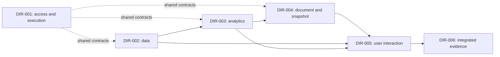

---
{
  "schema_version": "custometry-planning/v1",
  "framework_ref": {
    "path": "docs/architecture/planning/framework-v1/README.md",
    "version": "1.0.0"
  },
  "artifact_kind": "project_map",
  "doc_id": "MAP-001",
  "title": "Custometry development direction map",
  "version": "2.0.2",
  "planning_status": "in_review",
  "language": "en",
  "parent_ref": null,
  "direction_ref": null,
  "baseline_ref": {
    "commit": "2f04dacc2184ec0ad30636526855309262b6bf5e",
    "evidence_refs": [
      "docs/architecture/planning/project-map.md#sources-and-proof-boundary"
    ]
  },
  "requirement_refs": [
    {
      "source": "custometry-technical-blueprint-ru.md",
      "revision": "sha256:183d9d2f2070cb8e651eca46fa44244b0d0af2a914830bcee6e5716ae15fd163",
      "ids": [
        "A11Y-001",
        "ANALYTICAL-DOC-001",
        "ANALYTICAL-DOC-014",
        "API-001",
        "ARCH-PRINCIPLE-001",
        "ARTIFACT-COMMIT-001",
        "ARTIFACT-COMMIT-003",
        "ATTRIBUTION-001",
        "AUTH-001",
        "BLOCK-BUILDER-001",
        "BRAND-001",
        "CHART-001",
        "COLLAB-001",
        "COMPARE-011",
        "COMPUTE-001",
        "CONNECTOR-002",
        "DATA-MAP-001",
        "DATA-MAP-007",
        "DIGITAL-001",
        "DQ-INPUT-001",
        "DQ-REMEDIATE-001",
        "EXEC-CANCEL-001",
        "EXEC-DISPATCH-001",
        "EXEC-STATE-001",
        "FILTER-013",
        "FOCUS-001",
        "GOAL-001",
        "GOAL-002",
        "GOAL-003",
        "GOAL-006",
        "GOAL-007",
        "GOAL-009",
        "GOAL-010",
        "GOAL-011",
        "GOAL-012",
        "GOAL-013",
        "GOAL-014",
        "GOAL-015",
        "GOAL-016",
        "GOAL-017",
        "GOAL-018",
        "HELP-001",
        "I18N-001",
        "INGEST-008",
        "INGEST-020",
        "MART-GRAIN-001",
        "MATERIALIZE-001",
        "METHOD-001",
        "METRIC-001",
        "MOTION-001",
        "NOTIFY-001",
        "OPS-001",
        "OPS-009",
        "OPS-010",
        "OUTLIER-001",
        "PARAM-001",
        "PIVOT-001",
        "PRODUCT-ANALYTICS-001",
        "PVM-001",
        "RBAC-019",
        "REPORT-015",
        "REPORT-016",
        "REPORT-MAIL-001",
        "REPORT-PERF-001",
        "REPORT-PERF-002",
        "REPORT-REFRESH-001",
        "REPORT-REFRESH-005",
        "REPORT-REFRESH-006",
        "REPORT-REFRESH-007",
        "RESEARCH-001",
        "ROUTE-001",
        "SCALE-001",
        "SCHEDULE-001",
        "SEC-001",
        "SEGMENT-029",
        "SEGMENT-034",
        "SYS-UI-001",
        "TEST-INV-123",
        "TEST-INV-126",
        "THEME-001",
        "UI-DENSITY-001",
        "UI-SHELL-001",
        "UNIT-ECON-001",
        "V1-AC-063",
        "V1-AC-067",
        "V1-AC-068",
        "V1-AC-069",
        "V1-AC-070",
        "WATCH-001",
        "WEB-ARCH-001",
        "WEB-PERF-001",
        "XLSX-001"
      ]
    }
  ],
  "decision_refs": [
    "FRAME/DEC-01",
    "FRAME/DEC-03",
    "FRAME/DEC-06",
    "MAP-001/DEC-01",
    "MAP-001/DEC-02",
    "MAP-001/DEC-05",
    "MAP-001/DEC-06",
    "MAP-001/DEC-07",
    "MAP-001/DEC-08",
    "MAP-001/DEC-09",
    "MAP-001/DEC-10",
    "MAP-001/DEC-11"
  ],
  "supersedes_ref": null,
  "proof_boundary": {
    "label": "accepted-project-map-level-1-and-sequential-priorities",
    "exclusions": [
      "unwritten-workstream-acceptance",
      "exhaustive-code-audit",
      "runtime-readiness",
      "implementation-authority"
    ]
  }
}
---

# Custometry development direction map

> **Product-first sequence draft, version `2.0.2`, 2026-09-12.**
> The owner selected usable analyst functionality before administrative workflows.
> The six direction scopes, product requirements, development cadence and completed
> MS-001/MS-002 remain. The checkpoint order below is proposed for owner review;
> it does not accept an unwritten L2/L3 or start implementation.

## Accepted structure

Custometry has **six development directions at L1**. The first four group its
server and domain capabilities; the fifth owns Web interaction; the sixth owns
runtime, operations and combined-system evidence. This makes the large backend
scope visible without changing software context boundaries.

The directions are organizational scopes, not six services, teams or mandatory
parallel execution streams. Existing bounded contexts and modular-monolith
architecture remain authoritative. Direction numbers express identity, not order.

## Planning levels

| Level | Contents | Owner discussion outcome |
|---|---|---|
| Project map, above the levels | Directions, boundaries, common constraints and relationships | Understand the whole scope and choose the next branch |
| L1 — direction | Purpose, known existing base, scope, candidate large tasks and interfaces | Agreed development area |
| L2 — workstream | Specific capability, current state and milestone sequence | A clear path through a large task |
| L3 — milestone | Bounded result, contracts, changes and acceptance criteria | Accepted input for prompt-pack preparation |
| L4 — execution stage | One prompt's concrete actions, checks and handoff | A verified stage recorded in the milestone journal |

The default is **four levels below the project map**. The accepted framework
allows repeated workstream depth where an actual decomposition need is explained.
The iteration journal accompanies a milestone; it is not a fifth planning level.
The L1 candidate tables describe composition. The selected first block now has one
accepted L2, WS-001 scope 1.0.0, under DIR-006. Its existing MS-001 and MS-002
plans, packs and journals retain their exact accepted bindings. The new selected
product branch is [WS-002](directions/DIR-004/workstreams/WS-002.md) `0.2.0`, with
[MS-003](milestones/MS-003/plan.md) `0.2.0` and its draft pack/journal. Their concrete content was accepted by the owner on 2026-09-13; the journal
records initial S01 entry allowance without claiming implementation.

## Direction registry

The six direction documents have synchronized `2.0.2` sequence drafts and point
back to MAP-001 `2.0.2`. Their capability boundaries remain accepted at `1.0.0`;
the broader sequence remains a review draft. WS-002/MS-003 0.2.0 was explicitly
accepted on 2026-09-13; this does not widen L1 scope.

| Direction | Purpose | Contents | Main boundary |
|---|---|---|---|
| [DIR-001. Shared platform and execution control](directions/DIR-001/direction.md) | Common access and reliable work execution | Identity/workspace/org, execution/pipelines, schedules/reuse, collaboration, watches, notifications and audit/API | Does not own analytical formulas or document composition |
| [DIR-002. Data and semantic model](directions/DIR-002/direction.md) | Usable, explainable, versioned analytical inputs | Sources, ingestion/refresh, mappings, identity/grain, metrics/filters, DQ, Data Guide, marts/artifacts | Does not determine the analytical conclusion |
| [DIR-003. Analytics, segments and research](directions/DIR-003/direction.md) | Reproducible results and findings | Sales/customer/product/digital, segments, matrices/parameters, methods/research, promotion history; Forecasting held | Produces results rather than independent incompatible report composers |
| [DIR-004. Analytical documents and result delivery](directions/DIR-004/direction.md) | Compose, publish, refresh and deliver one document | Document/block/snapshot model, refresh/current, prepared serving, ChartSpec/rendering, branding, email/exports/XLSX | Renderers do not recompute business values |
| [DIR-005. Web interface and user journeys](directions/DIR-005/direction.md) | Make capabilities usable by every supported role | Shell/components, feature screens, composer/reader/Focus, states, RU/EN/accessibility/responsive and API integration | Preserve demonstrated pilot decisions; providers enforce policy and calculations |
| [DIR-006. Operations, integration and system acceptance](directions/DIR-006/direction.md) | Install, observe, recover and verify the whole product | Environments/CI, migrations/install/update, security/observability, backup/restore, mixed-load, end-to-end qualification and docs | Feature owners retain local proof; system acceptance connects their results |

The existing [WS-001](directions/DIR-006/workstreams/WS-001.md), accepted scope
`1.0.0` / navigation `1.0.10`, retains its DIR-006 ownership and completed supply
and installation contributions. The [MS-001 journal](../../../.codex/delivery/ledgers/MS-001.md)
and [MS-002 journal](../../../.codex/delivery/ledgers/MS-002.md) record completion;
they alone own execution state. This is a dated planning baseline, read 2026-09-12.

**Selected next L2: [WS-002 — First working analyst report](directions/DIR-004/workstreams/WS-002.md) `0.2.0`**, under
[DIR-004](directions/DIR-004/direction.md), with one bounded
[MS-003 milestone](milestones/MS-003/plan.md) `0.2.0`. The owner requested its
plan, prompts and journal together. The concrete recommendation uses the existing
Northwind Retail PostgreSQL demo, three receipt metrics, period/store/comparison,
a pilot-derived chart/table and backend save/reopen. WS-002/MS-003 0.2.0 was
accepted on 2026-09-13; initial S01 entry is allowed in the journal. The
[canonical journal](../../../.codex/delivery/ledgers/MS-003.md) links all six prompts.

WS-001/C04–C06 remain required work but cease to be the next universal prerequisite.
Full first-administrator onboarding, workspace/member administration and their
combined installation acceptance follow the selected analyst workflow. Necessary
Identity/storage support is a bounded contribution inside the first product unit,
not a reason to complete all administrative screens first.

The [MS-002 final owner decision](../../../.codex/delivery/evidence/MS-002/MS-002-S05/owner-acceptance-02.json)
accepts the delivered behavior and appearance with partial Linux proof, unverified
trusted second-MacBook Safari and exhausted Docker address pools affecting a
loopback restart. Preserve those limits and the [C04 handoff](../../../.codex/delivery/evidence/MS-002/MS-002-S05/report.md#exact-c04-prerequisites).
They do not reopen MS-002 or block unrelated local implementation. A later claim
covering an unverified target needs direct proof; a fresh installation requiring
new networks needs scoped resolution of the recorded engine resource issue.

## Accepted delivery sequence

The owner changed the development priority on 2026-09-12: build the product an
analyst can operate before the full administrative workflows. The earlier
installation-to-reader order remains a description of the eventual installed
journey, not the order in which all features must be implemented. Closed MS-001
and MS-002 remain the reusable base. Local development and packaged proof follow
the cadence below.

### Proposed product checkpoints

These rows are the proposed development order, not new planning levels, stage
IDs or mutable status records. Each checkpoint selects a bounded usable outcome;
it does not require completing an entire direction or every analytical feature.
Detailed limits are agreed at L2/L3. UI, actual APIs and necessary data/persistence
are developed together within the selected checkpoint.

| Order | What the user can do | Necessary supporting work | Full outcome references |
|---|---|---|---|
| 1 | Open the pilot-derived workspace, create a report with a useful table/chart, change period/filter, save it and reopen it with the same definition and reproducible values | One prepared real source/dataset path, versioned inputs, bounded calculations, document persistence and a prepared test identity/workspace; no preceding admin-screen programme | Bounded contributions from SEQ-05..09; [WS-002](directions/DIR-004/workstreams/WS-002.md) / [MS-003](milestones/MS-003/plan.md) accepted 0.2.0 plans |
| 2 | Connect or import data through the UI, inspect meaning/quality and refresh the report from a new admitted input version | Source configuration, typed mapping, DQ and the real ingestion/execution path; extend the path used by checkpoint 1 | SEQ-05..07 and relevant refresh contribution of SEQ-12 |
| 3 | Create and save segment definitions, calculate membership, inspect results, recalculate manually or on schedule, compare history and use exact results in reports | DIR-003/C02 owns the full definition/run/immutable-snapshot lifecycle, Used by and consumer bindings; DIR-001 supplies only the required scheduling/execution contribution | SEQ-08 with report integration; this is product functionality |
| 4 | Compose the selected report pages/blocks, configure presentation and reopen a readable preview of the stored result | Common document/snapshot path, pilot-derived editor/reader, actual state/error handling; no fabricated analytical values | SEQ-09 and reader presentation from SEQ-11; separate-user access is checkpoint 5 |
| 5 | Set up an installation/workspace independently, manage users and access, publish a report and let another authorized account read it | Remaining WS-001/C04–C06, full selected auth/admin UI and recovery, roles/invitations/revocation, distinct content publication and object grants | SEQ-03..04 and full SEQ-10..11 |
| 6 | Operate and update the selected product scope with verified backup, recovery and supported-target behavior | Integrate prior scoped proofs, remaining installation/update/restore, observability and load qualification; reuse the existing producer/installer | Full SEQ-12 and remaining SEQ-01..02 delivery obligations |

Checkpoint 1 uses a real backend and actual versioned inputs. A prepared source
may contain deterministic test data, but it must traverse the selected real
intake/calculation path; inline UI numbers or a fixture response do not prove it.
Engineers prepare the initial development input so the first analyst does not
wait for the complete connector catalogue, mapping editor or administrator centre.
The exact source and supported report controls are next-L2 decisions, using the
accepted sources and existing implementation rather than a new data engine.

### Minimum support for the first product outcome

- Prepare one isolated test user/workspace through the existing Identity boundary;
  inspect bootstrap/login/workspace seams before selecting the bounded mechanism.
  Missing required glue belongs to the first product unit. This document does not
  claim that a ready preparation command already exists.
- Keep server-owned identity, ownership and access checks. Reuse authentication
  and session contracts, including applicable cookie/CSRF/Origin protection;
  never substitute a browser flag, universal admin identity or auth bypass.
  Full user-management screens and self-service installation onboarding can follow.
- Persist actual report definitions and their input/version identity through the
  existing backend/storage boundaries. Save/reopen and required migration safety
  are part of the first outcome, not late operational polish.
- Keep the internal development setup separate from accepted installations. The
  MS-002 installed ingress permits only installation routes; opening product routes
  requires the bounded protected-ingress contract and packaged proof. It cannot be
  claimed merely because host Vite works.
- Multi-account or external use needs its actual authorization and transport proof.
  An isolated internal analyst workflow does not establish shared-user readiness.

### Retained outcome coverage

The stable SEQ IDs below keep their original product meaning and traceability.
Their numbers no longer determine development priority; the checkpoints above do.
Full requirements stay allocated even when a bounded contribution is implemented
earlier. Publication never widens access, and separate-reader acceptance still
uses a separate account. This table is coverage, not a second execution journal.

| Outcome reference | Participant and outcome | Required completed capability / proof | Primary responsibility and contributors | Planning allocation |
|---|---|---|---|---|
| MAP-001/SEQ-01 | Engineering supplies an installable delivery | Versioned launcher/configuration, compatible prebuilt images, required assets/dependencies, provenance and instructions; reuse the supply mechanism for each new candidate, keeping candidate and accepted delivery identities distinct | DIR-006; each feature owner supplies its required runtime assets | [WS-001](directions/DIR-006/workstreams/WS-001.md) `1.0.10`; reuse completed MS-001/MS-002 within their recorded proof limits |
| MAP-001/SEQ-02 | Installation administrator installs and starts it | Supported-target preflight, explicit ingress/origin/transport, protected secrets, persistent stores, migrations, actual readiness/URL and actionable failure | DIR-006; DIR-001/005 security and initial Web integration | Same WS-001; reuse the MS-002 installer and qualify changed contents at the selected delivery boundary |
| MAP-001/SEQ-03 | Installation administrator completes bootstrap | One-time bootstrap creates first administrator/workspace; locale/timezone, protected sign-in/logout and restart persistence; initial UI explains next setup action | DIR-001 and DIR-005 contribute; DIR-006 owns installed integration | Retained WS-001/C04–C06; full onboarding/admin checkpoint after the initial analyst workflow |
| MAP-001/SEQ-04 | Workspace administrator prepares staff and authority | Invitations and their states, member roles, access/session revocation and required local-auth recovery; separate users and workspaces prove permission boundaries | DIR-001 + DIR-005, integrated proof in DIR-006 | Later L2 is not instantiated |
| MAP-001/SEQ-05 | Workspace administrator connects the agreed source | Real connection/import setup UI, protected secrets, catalog/preflight, error correction and persistent configuration; source choice remains explicit | DIR-002 + DIR-005, DIR-001 authorization/execution prerequisites | Later L2 is not instantiated |
| MAP-001/SEQ-06 | Data Steward defines meaning and quality | Typed mappings, entities/keys/relationships/time/units, validation rules and capability criteria; understandable previews and limits | DIR-002 + DIR-005 | Later L2 is not instantiated; usable input publication is proven with SEQ-07 |
| MAP-001/SEQ-07 | Authorized users load and publish usable inputs | Common durable execution, progress/cancel/retry, DQ admission, immutable versions, lineage and failure-safe publication; no partial load is declared ready | DIR-001 + DIR-002 + DIR-005, DIR-006 integration | Later L2 is not instantiated |
| MAP-001/SEQ-08 | Analyst calculates and saves a reusable segment | Agreed analysis/segment scope, reproducible results, exact population/time identity and understandable quality/limitations | DIR-003 + DIR-005 using DIR-001/002 contracts | Later L2 is not instantiated |
| MAP-001/SEQ-09 | Analyst authors and reopens a report | Agreed pages/blocks/tables/charts, period/comparison/filter/segment bindings, persistence, safe draft changes and result trust through the accepted Web concept | DIR-004 + DIR-005 using DIR-003 results | Bounded draft-authoring subset: [WS-002](directions/DIR-004/workstreams/WS-002.md) / [MS-003](milestones/MS-003/plan.md); richer authoring remains later |
| MAP-001/SEQ-10 | Analyst publishes; administrator grants access | Immutable published content/snapshot, distinct object-access administration and audit; publication does not widen grants | DIR-004 + DIR-001 + DIR-005 | Later L2 is not instantiated |
| MAP-001/SEQ-11 | Separate reader opens the authorized result | Discovery/deep links, permitted interactions, freshness and safe unavailable states; no unauthorized data and no access after revocation | DIR-004 + DIR-005 + DIR-001, DIR-006 real multi-account proof | Later L2 is not instantiated |
| MAP-001/SEQ-12 | The installation repeats the business cycle and recovers | New inputs and refresh, safe last-good/current behavior, explicit viewer update, operational diagnosis, coherent backup/restore and compatible update/recovery; verify exact reports and access | All directions; DIR-006 owns combined acceptance | Later L2 is not instantiated |

Within each selected checkpoint, actual provider dependencies determine the code
order. Required security, execution or storage support exists before its consumer
is accepted. For example, a source preview requiring a job receives that bounded
Execution contribution first. A usable dataset requires both semantic admission
and successful ingestion/publication. L2/L3 records actual contracts and an acyclic
dependency chain; no whole-direction or full-admin completion gate is implied.

### Sequential development and control of rework

1. Select one next block, inspect its current code/contracts/evidence, and agree
   its L2 structure with the owner before selecting detailed L3 implementation.
2. Identify downstream constraints that affect this block's persistent identity,
   interfaces, configuration, security, migration or recovery before implementing
   the affected boundary. Resolve prerequisites rather than knowingly building a
   consumer on an unchosen contract.
3. Execute accepted milestones and their stages sequentially under their declared
   authority. Parallel dispatch and agent organization are not selected here.
4. Every milestone closes a bounded observable outcome with relevant UI, real
   integration, failure evidence and documentation. Dependency readiness is not
   inferred from finishing an entire direction or from a green static check.
5. Keep the installation/bundle contract reusable as delivered features grow.
   Later milestones publish compatible new contents and verify their new runtime
   dependencies. Assemble candidates at the boundaries below, reuse unchanged
   layers and retain the installer contract. No unsupported component may be
   represented as operational.
6. Capture new evidence that changes an accepted assumption as a scoped amendment:
   affected consumers, compatibility, migration/recovery, version and owner decision
   where material. Planning reduces avoidable rework; it cannot guarantee that no
   earlier decision will ever need revision. Do not freeze the entire product's
   detailed design before beginning the first bounded block.

Storage ownership/versioning, Identity grants/session boundaries, configuration
separation and deployment compatibility are considered for the first real
product consumers, without requiring a complete administrative workflow.
Detailed analytical and document schemas are resolved before their dependent
blocks. Forecast-specific contracts and implementation remain held.

### Development and delivery cadence

Apply the existing [development runtime contract](../development-runtime-contract.md)
`doc_version 3` and [operating model](../development-operating-model.md) `doc_version 15`.
There is one application, one set of domain rules, locked dependencies and
versioned migrations. Host development and packaged execution use those same
sources; development convenience is not a second implementation or auth policy.

| Work boundary | Normal work and evidence | When to build or install |
|---|---|---|
| Ordinary source edit | `fast-loop`: focused policy/component/type/contract checks | No application image rebuild solely because a file was saved |
| Real feature integration | `hybrid`: host API/Web with reload and only required containerized stateful adapters; real DB/API/browser checks | Reuse the owned running development environment; isolate test data and avoid repeated clean-stack startup |
| Changed runtime boundary | `full-stack`: actual images, Edge, networking, mounts, schema or image-dependent behavior | Build affected images and test the changed boundary immediately; dependency/base-image/OS/architecture changes require applicable target proof |
| Product milestone acceptance | Demonstrate the selected working journey and applicable failure cases in its packaged form; reuse matching earlier-stage or CI evidence | Build the changed candidate before acceptance; identify source, images and config. Documentation-only changes need their own source checks, not a new manual installation campaign |
| Internal delivery / install or update claim | Versioned bundle/toolkit through the existing producer; actual declared consumer and supported target checks | Run clean installation or upgrade/recovery only for the selected delivery claim, changed installation behavior or an unresolved relevant failure; preserve accepted exceptions |

The ordinary feature sequence is **inspect/reuse -> settle the bounded contracts
and checks -> implement and exercise locally -> verify the packaged candidate ->
accept the outcome**. It repeats within the selected workstream. Dependency
order stays sequential; this does not choose agents or parallel dispatch.

Rebuild affected application images when their packaged contents change; retain
valid cached layers and unchanged images. Changing toolkit/configuration only
still creates a new delivery identity when shipped bytes change. Never modify
an accepted bundle under its old version. Running old images is not proof of new
source. The exact build mechanism remains the existing producer and lockfiles.

Reusing infrastructure does not mean sharing uncontrolled test state. Keep
development ownership separate from accepted installations; apply migrations to
the selected test database and use bounded fixtures/transactions/databases as
appropriate. Never reset accepted or foreign data to make a check pass. Start
additional workers/queues only when the selected real feature requires them.

CI already builds a disposable Linux stack and runs browser checks on pull
requests and main pushes. Preserve required checks and reuse their actual results
for matching claims; do not repeat the same local campaign without changed inputs,
a failure or a specific coverage gap. CI does not automatically prove native ARM64,
an untested Linux guest, second-computer trust or an installer. Existing Mac/VM/LAN
proof is reused only within its candidate/configuration/target scope. No hosted CI
filter or gate bypass is implemented by this planning amendment.

Internal candidate delivery keeps the accepted internal-development profile and
ordinary upstream dependencies. Runtime-mode names do not automatically select
`tools.check --scope release` or official-release assurance for internal work.
The current [tooling contract](../tooling-gates.md) selects commands and gates;
licensing/scanner findings retain their existing internal report-only disposition.

Building a new image, restarting a container and upgrading persistent user state
are distinct operations. MS-002 proves bounded install/stop/resume, not a general
cross-version updater. Until a compatible upgrade path is implemented and tested,
qualify a new candidate in a separate owned test installation. Any persisted-state
change needs explicit reader/writer and migration/recovery decisions before the
affected implementation; prove the supported transition before offering an update.
SEQ-12 integrates the full backup/update/recovery cycle and does not defer safety
needed by an earlier shipped migration.

### Next L2 and L3 planning boundary

The owner selected preparation of [WS-002 0.2.0](directions/DIR-004/workstreams/WS-002.md)
and [MS-003 0.2.0](milestones/MS-003/plan.md), including their six prompts and
single journal. Static current-state inspection and fixed implementation choices
are recorded there. The owner accepted the complete L2/L3/pack on 2026-09-13; MS-003/DEC-01 and
its journal record the decision. Stage execution follows the existing runner.

Keep WS-001/C04–C06 for the later full onboarding/admin checkpoint. Extract only
the minimum prerequisite contracts needed by the early product unit, without
silently claiming that the whole C04 result is complete. Reuse MS-001/MS-002 and
the existing development environment and package producer.

Use existing template sections at the next decomposition; do not add a new
checklist, ledger or planning level. For each selected result, record:

- existing code/evidence to reuse and the actual gap to implement;
- prerequisite provider contracts and the UI/API/data flow, including failures;
- local proof mode, changed-runtime triggers, packaged acceptance and any target
  installation/upgrade claim, with clear limits for reused evidence;
- fixed material decisions before execution and ordinary delegated implementation
  choices, preserving the selected libraries and architecture.

Overall requirements and policy stay accepted. Before the first product L3,
resolve the concrete prepared-user/workspace path, real input, document/result
contracts and affected migration/ingress checks within existing decisions.
Routine engineering choices remain delegated; a new material policy or dependency
choice returns to the owner. Full C04 role/admin/onboarding detail is deferred to
its selected checkpoint. This draft changes priority, not product policy.

### Remaining product horizon

After the initial working analyst cycle, detail the remaining source/history
coverage, richer analytics/segments, authoring and collaboration, then the remaining
product/research/digital capabilities by their actual dependencies. Qualify complete
requirements, installation/update, security, mixed workload and coherent recovery.
Universal XLSX remains the last new functional v1 increment, followed by final
acceptance. Baseline safety and integration are proved throughout, not postponed
to qualification. Forecasting stays held; no external release scenario or reduced
final product scope is selected by this ordering. Later feature inventories and
milestone boundaries still require owner-led decomposition.

## Selection rationale

| Considered structure | Consequence | Disposition |
|---|---|---|
| Backend / UI / operations | Compact top map; data, analytics and documents need another large backend decomposition | Considered; not selected for L1 |
| The six directions above | Main domain outcomes and their interfaces are visible; more explicit document links | Accepted by the owner |
| One direction per bounded context | Precise technical boundaries but a large top-level catalog | Keep this detail in architecture and L2 |

The document direction is separate from Web because stored versions/snapshots serve
Web, email and XLSX. Data is separate from analytics because identity, grain, mapping
and refresh correctness affect many calculations. These are the accepted planning
tradeoffs, not a measured claim that six directions are universally optimal.

## How the directions form a working product

This is the main user flow, not a direction-completion dependency graph. Runtime
and local verification from DIR-006 are needed from the beginning. Actual hard
dependencies connect future workstreams/milestones after their contracts are agreed;
a whole direction need not wait for all adjacent directions to finish.

### Shared boundary: refreshing a prepared report

| Result part | Primary owner | Output to adjacent directions |
|---|---|---|
| New input generation, DQ and immutable inputs | DIR-002 | Coherent versions, readiness and provenance |
| Durable demand, waiting for inputs, queue, single-flight and fencing | DIR-001 | Repeatable execution and state events |
| Normalized analytical recomputation | DIR-003 | Verified values and result identity |
| Refresh policy, required blocks, monotonic atomic current and last-good | DIR-004 | New exact snapshot and safe prepared reads |
| Update notification and explicit application in an open viewer | DIR-005 | Clear interaction preserving compatible context |
| Readers plus background refresh, crash and restore | DIR-006 | Combined-system evidence using domain-owner expectations |

Physical artifact integrity belongs to Artifact Lifecycle in DIR-002; atomic report
current switching belongs to DIR-004. Their shared protocol is tested together.
Temporary unavailability or failed refresh does not make a valid last-good snapshot
corrupted.

## Requirement coverage and shared outcomes

This table allocates broad source areas. It is not exhaustive requirement-to-stage
traceability or evidence that corresponding code is complete. Normative
MUST/SHOULD/MAY meaning and acceptance criteria remain in the machine blueprint.

| Requirement area | Primary direction | Contributors / integration boundary | Sources |
|---|---|---|---|
| Identity, tenancy, organization, role/data/object scope and audit | DIR-001 | All protected providers/consumers; DIR-005 UI; DIR-006 system security | AUTH, RBAC, SEC; section 20 |
| Execution, schedules, cancel/retry, reuse and trusted extensions | DIR-001 | DIR-002/003/004 jobs; DIR-006 budgets/runtime; DIR-005 UI | EXEC-STATE/DISPATCH/CANCEL, SCHEDULE, MATERIALIZE; section 9 |
| Collaboration, adoption, watches and operational notifications | DIR-001 | DIR-003 metrics, DIR-004 anchors, DIR-005 UI | COLLAB, WATCH, NOTIFY; sections 14.2 and 15.7 |
| Sources, canonical identity/grain, mappings, readiness, DQ, marts and artifacts | DIR-002 | DIR-001 execution, DIR-003 analysis, DIR-004 refresh | DATA-RULE, IDENTITY, DATA-MAP, CONNECTOR, INGEST, METRIC, FILTER, CAPABILITY, DQ, MART, ARTIFACT; sections 4–11 |
| Sales/customer/product, populations/segments, comparison, discounts/PVM | DIR-003 | DIR-002 semantic providers; DIR-004/005 consumers | OUTLIER, SEGMENT, COMPARE, DISCOUNT/PVM, PRODUCT-ANALYTICS; section 12 |
| Analytical builder, pivot and parameters | DIR-003 | DIR-002 metrics/relationships; DIR-004 bindings/layout; DIR-005 controls | BLOCK-BUILDER, PIVOT, PARAM; section 12.15 |
| Methods, Research, findings, Digital/attribution/economics and Promotion Journal | DIR-003 | DIR-002 admission; DIR-004 composition; DIR-001 discussions; DIR-005 UI | METHOD, RESEARCH, DIGITAL, ATTRIBUTION, UNIT-ECON, ASSUMPTION, PROMO |
| Forecasting and temporal validation | DIR-003, held | After resumption: DIR-002 inputs, DIR-001 execution, DIR-004/005 consumers | GOAL-006; section 13 and relevant sections 26/28 criteria |
| AnalyticalDocument, refresh, snapshots, channels and branding | DIR-004 | DIR-001/002/003 providers; DIR-005 interaction; DIR-006 load/recovery | ANALYTICAL-DOC, REPORT, REPORT-REFRESH, CHART, DASHBOARD, REPORT-MAIL, XLSX, BRAND |
| Complete Web, roles/routes, Focus, help, themes/RU/EN/accessibility | DIR-005 | All domain providers; DIR-006 combined build | UI blueprint; UI-SHELL/DENSITY, FOCUS, ROUTE, PROGRESS, THEME, I18N, A11Y, MOTION, SYS-UI, HELP, WEB-ARCH/PERF |
| Runtime, install/update, observability, backup and mixed load | DIR-006 | Domain correctness, manifests, resource semantics and recovery ports | OPS, COMPUTE, SCALE, REPORT-PERF; sections 18 and 20–25 |
| Product scenarios, AC/V1-AC and TEST-INV | DIR-006 coordinates system acceptance | Actual owners prove each requirement; select one integration milestone owner during decomposition | Sections 22, 26–28 and 31–32 |
| Goals, architecture, documentation rules and open decisions | MAP-001 and all directions | Planning constraints, not a separate feature team | DOC-RULE, GOAL/NON-GOAL, ARCH-PRINCIPLE, RISK/RESOLVED/OPEN; sections 0–3, 17, 19, 25 and 29–30 |

Cross-cutting families are allocated by exact clause at L2/L3. This table does not
transfer all DISCOUNT or PRODUCT-ANALYTICS ownership from Semantic Model to Analytics.
For example, discount policy and product hierarchy remain DIR-002 semantic inputs;
PVM and product analytical results belong to DIR-003. The 18 accepted domain context
owners remain intact under their L1 grouping.

## Preserved priorities and constraints

- Current product focus is report authoring and reusable segments with necessary
  data, policy and execution. Rich segmentation is not reduced to three predicates
  on a flat customer row.
- Forecasting stays **on hold**. Its inclusion preserves requirements; no forecast
  research, models, backtests or UI work is activated by L1 adoption.
- Dashboard, Workbook/Report and Research use one document/snapshot path. Discussion,
  analyst note, data annotation and reviewed finding remain distinct objects.
- The final target pilot remains authoritative for demonstrated composition and
  interaction. Missing states and runtime integration still require implementation.
- REPORT-REFRESH-001..007, ARTIFACT-COMMIT-001..003, OPS-009/010,
  REPORT-PERF-001/002 and V1-AC-068..070 are included. Fifty analysts plus one hundred
  readers is a required workload envelope, not proven performance.
- Through v1, preserve self-hosted single-server modular-monolith delivery:
  PostgreSQL control truth, Valkey delivery/cache and immutable bulk artifacts.
  Off-primary backup does not authorize remote primary storage or multi-host runtime.
- Universal XLSX remains the final new functional v1 increment after hardening;
  its shared ReportSnapshot contract can be agreed earlier.
- No first external release scenario has been selected. Internal preview is not
  automatically complete vertical alpha/public MVP/v1, particularly during forecast hold.
- B2B, activation/reverse ETL, marketing campaigns, SaaS/Kubernetes, arbitrary
  untrusted Python and other NON-GOAL scope do not return through direction names.
  Post-v1 extensions stay documented without new active plans.

## Sources and proof boundary

For the original 1.0.0 adoption, the Russian draft was inspected at local commit
`2e8582aa132369ee24f21bb4b0121a517a24e764`. Its publication was based on remote main
`5a963ab0166bfa44d508679dcafa29723bbeb68b`. Relevant product/code sources were
compared for equality; the accepted planning-framework dependency was included
from local adoption commit `2d370f6ef1cd5cf9ddb09afa7987004b9412042c`.
Unrelated local governance cleanup was excluded from that publication. The 1.2.0
amendment baseline and its narrower current-state inspection are recorded below.

The 1.3.0 planning amendment and 2.0.0 sequence draft use local commit
`2f04dacc2184ec0ad30636526855309262b6bf5e` as the repository baseline. The 1.3.0 edit started clean; 2.0.0 revises those
uncommitted planning documents after the owner changed priority. They read the
completed journals and final MS-002 acceptance, the existing Hybrid configuration
and CI workflow. Earlier W-ticket observations remain historical. No runtime,
container, VM or browser was started to update these plans.

| Source | Version / role |
|---|---|
| [Planning framework](framework-v1/README.md) | 1.0.0, doc_version 2; shape and owner checkpoints, published as prerequisite |
| [Machine blueprint](../../../custometry-technical-blueprint-ru.md) | 0.11.0-draft, 2026-09-06; normative product requirements |
| [Human mirror](../../../custometry-technical-blueprint-human-ru.md) | 0.11.0-draft; explanations of selected areas |
| [UI blueprint](../../../custometry-ui-blueprint-ru.md) | 0.9.0-draft; all-family scope and inventory |
| [System design](../system-design.md) | doc_version 17; target architecture |
| [Context map](../bounded-context-map.md) | doc_version 13; domain ownership and integration |
| [Frontend ADR](../../adr/0007-responsive-web-frontend-platform.md) | doc_version 2; accepted frontend platform |
| [Target pilot](../ui/target-pilot/README.md) and [manifest](../ui/target-pilot/manifest.json) | Accepted UI; HTML SHA-256 `b54b8b77d677d57869b0065dbe3aa005f13070297dface19ba98938f50d83700` |
| [Broad roadmap](development-roadmap-v1.md) | Supporting sequence proposal; its status is not copied into the hierarchy |
| [Source-data contract](../../contracts/source-data-adaptation-contract.md), [authoring contract](../../contracts/analytical-authoring-contract.md) | Accepted source and analytical semantics |

The base commit identifies the product/code source bytes even where a document
has no semver. Framework/process documents carried in this publication retain
their own version and acceptance provenance. Architecture status is not code readiness.

| Claim ID | Established fact | Evidence | Remaining uncertainty |
|---|---|---|---|
| MAP-001/EV-01 | `documented_only`: broad requirement and context coverage | Sources above and references in all six directions | Exhaustive clause-to-workstream-to-proof mapping is not yet created |
| MAP-001/EV-02 | `code_observed`: API composition imports identity, organization, data, analytics, people, runs and notifications | [API entrypoint](../../../apps/api/src/custometry_api/main.py) | This is static inspection, not a full wired-runtime observation |
| MAP-001/EV-03 | `documented_only`: W11–W17 and W31–W38 record accepted bounded outcomes | Exact evidence links in each DIR | Historical proof does not automatically cover newer requirements |
| MAP-001/EV-04 | `unknown`: full product/direction readiness | No exhaustive current runtime/browser/load/restore assessment | Inspect the selected L2 task before planning its implementation |
| MAP-001/EV-05 | `boundary_verified`: completed C02/C03 at their recorded scope | [MS-001 journal](../../../.codex/delivery/ledgers/MS-001.md), [MS-002 journal](../../../.codex/delivery/ledgers/MS-002.md), [final C03 owner decision](../../../.codex/delivery/evidence/MS-002/MS-002-S05/owner-acceptance-02.json); read 2026-09-11 | Preserve accepted target limits; bootstrap, upgrade and whole-workstream completion are not established |
| MAP-001/EV-06 | `code_observed`: Hybrid runs host API with reload, host Web and owned containerized databases | [Development policy](../../../deploy/compose/development-runtime-policy.json), [launcher](../../../scripts/dev), runtime contract 3 at the 1.3.0 baseline | Not a fresh lifecycle observation; add infrastructure only as actual consumers need it |
| MAP-001/EV-07 | `code_observed`: current PR/main CI builds and checks disposable Linux runtime and browser | [Foundation CI](../../../.github/workflows/ci.yml) at the 1.3.0 baseline | Not a new CI run or proof of every accepted consumer target |
| MAP-001/EV-08 | `code_observed`: existing Identity API has bootstrap, login and workspace-creation seams | [Identity router](../../../apps/api/src/custometry_api/identity/router.py), baseline read 2026-09-12 | This is not an observed prepared-user command or first-product readiness; the bounded L2 must choose and verify actual preparation/session/ingress behavior |

## Owner decisions and adoption

| Decision ID | Decision | Basis / status | Effect |
|---|---|---|---|
| MAP-001/DEC-01 | Adopt the six directions and their L1 boundaries | Owner accepted the six-direction format on 2026-09-06; version 1.0.0 | Settles MAP/L1 structure |
| MAP-001/DEC-02 | Apply four levels below the map, with justified repeated workstream depth | Accepted framework and owner acceptance of its L1 application | Preserves the existing planning form |
| MAP-001/DEC-03 | Which area should be detailed next? | Resolved by MAP-001/DEC-07. The earlier DIR-004-first recommendation is superseded by the owner-accepted installation-first correction | WS-001 1.0.0 is accepted; C02 was selected first. Current child selection follows the WS-001 registry |
| MAP-001/DEC-04 | First external release scenario | Deferred; not needed to adopt L1 | Must be resolved before relevant release promises |
| MAP-001/DEC-05 | Adopt MAP-001 and DIR-001..006 in English and publish to main; remove Russian drafts | Explicit owner instruction in this task on 2026-09-06; version 1.0.0 | Authorizes this adoption/publication and required framework dependencies, not implementation |
| MAP-001/DEC-06 | Adopt the complete installation-to-reader sequence and sequential development with prerequisite decisions | Owner accepted the expanded proposal and requested English documentation on 2026-09-06; version 1.1.0 | Sets priority/order across directions; does not promise zero rework or select parallel dispatch |
| MAP-001/DEC-07 | Select delivery, installation and first administrator bootstrap for deep planning | Same owner decision, 2026-09-06; version 1.1.0 | DIR-006 owns WS-001; DIR-001/005 contribute; authoring the L2 draft is authorized, its unwritten children are not accepted |
| MAP-001/DEC-08 | Finalize WS-001 and synchronize accepted installation/HTTPS/bootstrap choices | Owner accepted six proposals, corrected target to M5 Max/36 GB, allowed local Linux VM, excluded experimental-data migration and authorized direct main publication on 2026-09-06 | WS-001 1.0.0 owns five sequential outcomes; C02 was the first separate L3. No general publication-policy or product-execution authority is inferred. |
| MAP-001/DEC-09 | Preserve completed MS-002 and use focused local development, packaged milestone proof and explicit delivery qualification across all directions | Owner accepted the explained approach on 2026-09-11 and requested the general plan/sequence amendment before later L2/L3 work; compatible detail in 1.3.0 | Reuse delivery machinery, retain requirements and SEQ IDs, the then-selected C04 frontier is superseded by DEC-10; development cadence remains accepted |
| MAP-001/DEC-10 | Build usable analyst functionality before full administration/access-management workflows; retain necessary technical safeguards | Owner correction, 2026-09-12; priority accepted, detailed checkpoint order in 2.0.0 is proposed | First report L2 under DIR-004 is proposed; defer full WS-001/C04–C06; preserve MS-001/MS-002 and all product requirements |
| MAP-001/DEC-11 | Prepare the first-report L2/L3, prompts and journal together; retain full segment lifecycle in product sequencing | Owner request on 2026-09-12; WS-002/MS-003 content `0.2.0` accepted by the owner on 2026-09-13, including Customer/Product source inclusion | Plan acceptance recorded; initial S01 entry allowed in the journal; execution and publication remain separate |

The owner first reviewed the Russian `0.1.0` drafts, then explicitly accepted L1
and requested the English records. Their Russian bodies are replaced in the same
canonical paths; IDs remain stable. No duplicate draft copies remain in the source
tree. The acceptance recorded here does not imply that candidate L2 plans or future
milestones have been accepted.

## History and synchronization

| Version | Date | Change | Authority |
|---|---|---|---|
| 0.1.0 | 2026-09-06 | Russian review map and six direction drafts | Owner draft request |
| 1.0.0 | 2026-09-06 | Accepted English map/L1, reciprocal version links and navigation | MAP-001/DEC-05 |
| 1.1.0 | 2026-09-06 | Full sequential priorities adopted; first-block WS-001 draft selected and registered; L1 links synchronized | MAP-001/DEC-06/07 |
| 1.2.0 | 2026-09-06 | Register accepted WS-001 1.0.0, source amendments and exact-version revalidation across unchanged directions | MAP-001/DEC-08 |
| 1.2.1 | 2026-09-09 | Refresh next-planning navigation to C03/MS-002; six directions and all sequence rows unchanged | Owner requested next iteration; delegated editorial link maintenance |
| 1.3.0 | 2026-09-11 | Apply accepted development/build/delivery cadence across six directions; preserve closed MS-002 and point to C04; retain SEQ-01..12 outcomes and remaining horizon | MAP-001/DEC-09; owner-authorized general planning amendment |
| 2.0.0 | 2026-09-12 | Draft product-first checkpoint order and proposed analyst-report L2; defer full admin/onboarding; retain outcome IDs and development cadence | MAP-001/DEC-10; owner selected priority, detailed sequence awaits review |
| 2.0.1 | 2026-09-12 | Register WS-002/MS-003 and six-prompt review package, disclose first-source proposal, expand segment lifecycle allocation | MAP-001/DEC-11; no product execution or publication |
| 2.0.2 | 2026-09-12 | Refresh WS-002/MS-003 0.2.0 and reciprocal navigation; checkpoint order and L1 scopes unchanged | Owner source-scope correction; editorial reference maintenance |

The 2.0.0 draft synchronizes the map and six L1 sequence documents at 2.0.0
with reciprocal draft references. Their accepted capability boundaries remain
unchanged. WS-001 navigation 1.0.10 retains its accepted scope and historical
DIR-006 1.2.0 parent basis; only next-selection wording is updated. No C04–C06
outcome or criterion is removed. Completed MS-001/MS-002 retain their exact
plan/pack/journal/evidence bytes and WS bindings (1.0.6 and 1.0.7).

The previous local 1.3.0 edits were not published; their development cadence
remains selected, while their administration-first frontier is superseded. This
revision changes planning priority and proposes a new first product outcome.
API/persistence/runtime impact is `none` for this documentation-only edit. Product
requirements, code, dependencies, CI and installed environments are unchanged.
The preceding 2.0.0 authoring unit created no L2/L3, pack, journal or implementation.
The 2.0.1 unit adds the selected WS-002/MS-003 review package; its preparation
checks are recorded in the MS-003 journal/evidence, without product execution.

### Product-first draft validation — 2026-09-12

The local source profile passed after the 2.0.0 edits:
`uv run --locked python -m tools.check --scope local`. Bounded metadata/scope
assertions verified seven synchronized sequence drafts and their reciprocal
MAP/L1 links, six proposed checkpoints and all twelve retained outcome IDs.
WS-001 intentionally retains its historical accepted parent and all five outcomes
and six criteria. Requirement hashes, six L1 capability/candidate tables,
Forecasting hold and late XLSX allocation are unchanged.

Protected-path comparison confirms unchanged MS-001/MS-002 execution artifacts
and product/runtime/tool/CI sources. Documentation indexes were regenerated and
checked. These checks establish local document consistency only, not acceptance
of the proposed checkpoint order or readiness to execute its unwritten children.
No container, VM, browser campaign, product implementation or publication ran.

### Development cadence amendment validation — 2026-09-11

Historical authoring checks for the previous local 1.3.0 revision only; they do
not validate the changed 2.0.0 sequence:

| Check | Result and boundary |
|---|---|
| `uv run --locked python -m tools.check --scope local` after toolchain activation | Passed: repository source/static contracts, links, indexes and both completed prompt-pack bindings; no runtime campaign |
| Bounded Python assertions over planning metadata and baseline diff | Passed: eight planning records, seven acyclic reciprocal parent edges, current L1 provider versions and unchanged pinned requirement hashes |
| Scope and sequence comparison against baseline | Passed: twelve ordered SEQ IDs; SEQ-04..12 text, six L1 scope/candidate tables, five WS outcomes and six WS criteria preserved |
| Protected-path comparison against baseline | Passed: both completed milestone plans/packs/journals/evidence and product/tool/test/CI/runtime sources unchanged; no new execution artifact |

Regenerating the contributor index produced no byte changes. This is local planning
evidence only; no commit, push, stage execution or target setup is part of this
amendment. Later publication and L2/L3 work follow their own selected authority.

### Earlier amendments

The earlier 1.2.1 navigation patch retained 1.2.0 scope and recorded the then-draft
MS-002 journal. That preparation observation is historical; closure is now sourced
from the canonical journals above.

The original 1.0.0 adoption changed this map, six direction documents, architecture/contributor
navigation and the roadmap's next-planning-step reference. The previously adopted
framework and its required instruction/architecture dependencies are included because
remote main did not contain them. Product requirements, application behavior and
existing ticket states are unchanged. Process impact is accepted organizational
decomposition; API/persistence/runtime impact is `none`.

The 1.1.0 amendment adds WS-001 `0.1.0` under DIR-006 and the accepted sequence in
this map, with reciprocal versions and relevant navigation/roadmap updates. It
changes no product requirement or existing execution state. Its implementation
impact is `none`; the compatible planning amendment is owner accepted. Each DIR
registers MAP-001 `1.1.0`; interface links use DIR versions `1.1.0`. WS-001 alone
owns its draft child proposals; actual L3 dependencies remain to be agreed.
No milestone, prompt pack or execution journal is created.

### Validation and publication evidence

Historical evidence for adoption 1.0.0, 2026-09-06. This review and publication
evidence does not claim review or publication of the later 1.1.0 amendment:

Pre-publication evidence:

| Check | Observed result | Boundary |
|---|---|---|
| Product/code/evidence comparison against the original inspection checkout | 33 directly used source files are byte-identical; target-pilot manifest hashes match | Preserves the basis of the accepted Russian proposal |
| Python semantic assertions against the framework metadata | Seven English accepted documents; stable IDs, exact parent/framework versions, owner-decision references and 187 requirement anchors pass | Bounded MAP/L1 structural check, not a new general planning validator |
| `uv run --locked --offline python -m tools.custometry_quality.generate_docs_index` | Pass; 62 contributor documents | Normal English-language validation and index generation |
| `uv run --locked --offline python -m tools.check --scope local` | Pass | Grouped local source/static checks; no product-runtime claim |
| `git diff --check` | Pass | Patch whitespace |

Cold-head review: completed. Mode: independent subagent, read-only review of the
English MAP/L1 records against the Russian proposal, framework/routing prerequisites
and directly linked authoritative sources. Verdict: Release after fixes. One Medium
finding corrected metric-definition ownership in DIR-001 and DIR-004 summaries:
DIR-002 owns registered meaning; DIR-003 owns analytical calculations/results.
No Blocker/High remains. Local follow-up checks cover the saved corrections.

The publication follows the protected-main PR route, including the repository's
commit/push profiles and required Foundation gate. The containing Git commit and
its hosted PR/check records identify the final published bytes and later CI results;
the table above records only observed local evidence before that publication.
English adoption removes the temporary language exception without changing the
contributor-language validator. No deployment or product-completion claim follows.

### Sequence amendment validation

The 1.1.0 planning amendment and WS-001 draft were prepared against local commit
`7111057a94fdbdceb7287c66297913182a12d5f3`. The three product blueprints are
byte-identical to the original L1 requirement revision. Existing 1.0.0 planning
bytes remain in Git; the original broad current-state observations retain their
source date and proof limits. New bounded installer/Identity observations belong
to WS-001, not a full product-readiness audit.

| Check | Observed result | Boundary |
|---|---|---|
| Source comparison | Three product blueprints are unchanged from the L1 source revision | No requirement rewrite or product-scope change |
| Python semantic assertions against the framework | Eight English planning documents, seven reciprocal parent edges, 217 requirement references and 12 sequence rows pass; the candidate child dependency chain is acyclic | Bounded author check; not a new general planning validator |
| Acceptance/version inspection | MAP and six DIR documents are accepted at 1.1.0; WS-001 is a draft at 0.1.0; historical 1.0.0 decisions are retained | Selection is distinct from acceptance of detailed child plans |
| `uv run --locked --offline python -m tools.custometry_quality.generate_docs_index` | Pass; 64 contributor documents | Generated navigation and contributor-language checks |
| `uv run --locked --offline python -m tools.check --scope local` | Pass | Grouped local source/static profile |
| `git diff --check` | Pass | Patch whitespace |

The author checked provider-versus-consumer order, single-parent ownership, explicit
deferrals, preserved roles/holds, actual source paths and the next owner checkpoint.
This is a deterministic author check, not a new independent review. The amendment
creates no runtime evidence or accepted L3 implementation plan. No publication or
deployment is recorded for this documentation unit.

### WS-001 finalization validation

The 1.2.0 map/direction amendment registers accepted WS-001 1.0.0. Original 1.1.0
planning bytes are preserved in local commit `8a67a678`; prior 1.0.0 publication
evidence above remains historical. Current product sources are machine/human
`0.11.0-draft` and UI `0.9.0-draft`. Their exact content digests are pinned by the
current planning metadata; code baseline and historical proof remain separately
identified. WS-001 decides the changed installation, TLS and bootstrap contracts.
Other direction boundaries, full downstream order, Forecasting hold and final
functional XLSX increment are unchanged. L1 source bindings are revalidated for
these bounded changes; no existing ticket or claimed ledger is mutated.

Publication scope includes the preceding installation-first planning amendment
and this finalization plus required source/index synchronization. Previously
unpublished local governance/tooling commits are not part of this publication.
The owner explicitly authorized direct main publication without a new branch;
repository protections are not changed.

| Check | Result / scope |
|---|---|
| Source/version/requirement and link synchronization | Passed the grouped source checks after regenerating the requirement/contributor indexes; initial consumer-version drift was corrected |
| Local grouped profile and publication profile | `uv run --locked --offline python -m tools.check --scope local` and `--scope pre-push` passed; no runtime profile run |
| Scoped Git diff and reciprocal planning bindings | `git diff --check` and semantic inspection passed: eight accepted plans, seven reciprocal parent edges, exact source hashes/IDs, five ordered outcomes and twelve MAP sequence rows |
| Runtime, browser, Linux VM, TLS, recovery, performance and external release | Not executed or claimed by this documentation task |

The shipped documentation build also passed: `uv run --locked --offline mkdocs build --strict --config-file mkdocs.yml`. Route/surface contracts and three authoring templates change only their product/UI version references; no prompt behavior, route behavior or persisted schema changes. Publication-copy verification and remote identity are reported at handoff; no commit identifier is invented inside its own content.

Publication-copy checks also passed using that checkout's own tools with the existing locked Python interpreter: the pre-push profile and semantic/scope audit. Eight accepted plans retain exact source hashes and reciprocal parents; five outcome rows and twelve sequence rows are present. The publication contributor index contains 63 documents; the local index contains 64 because an unrelated local synchronization report is intentionally not published. Local and publication WS-001/source documents match. Foreign governance, role profiles and validator/test changes remain outside the scoped patch.

#### Direct-main publication outcome

On 2026-09-06, the scoped publication commit `2af36e964740d2034137096103a9f522f9039ae6` was prepared on main in the publication checkout. GitHub rejected `git push origin main` with GH006: changes require a pull request and the required `Foundation gate` status is expected. Remote main remains `d9e1fddd2fd12ac51c88275544833d8b20b93728`. No new remote branch or PR was created, protections were not changed, and no CI run for this unpublished commit is claimed. Documentation preparation and local/publication-copy static verification are complete; remote publication remains blocked until the owner permits the required PR route. The local main history retains the accepted document and prior unrelated work.

#### Authorized PR publication route

After the protected-main rejection, the owner explicitly authorized a temporary technical branch and pull request, merge into main after the required checks, and deletion of that branch. This supersedes only the original direct-push constraint; the accepted WS-001 scope, engineering decisions and proof limits are unchanged. The GitHub rejection above is historical evidence, not an outstanding owner-decision blocker. Publication uses the scoped documentation checkout, preserves unrelated local commits and leaves branch protection intact. The PR and its checks provide the merge receipt; publication is not product runtime or release acceptance.
