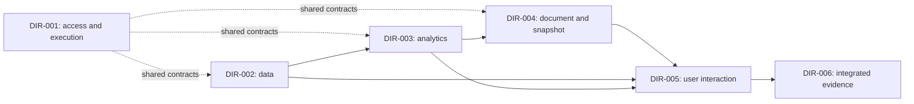

---
{
  "schema_version": "custometry-planning/v1",
  "framework_ref": {
    "path": "docs/architecture/planning/framework-v1/README.md",
    "version": "1.0.0"
  },
  "artifact_kind": "project_map",
  "doc_id": "MAP-001",
  "title": "Custometry development direction map",
  "version": "1.1.0",
  "planning_status": "accepted",
  "language": "en",
  "parent_ref": null,
  "direction_ref": null,
  "baseline_ref": {
    "commit": "5a963ab0166bfa44d508679dcafa29723bbeb68b",
    "evidence_refs": [
      "docs/architecture/planning/project-map.md#sources-and-proof-boundary"
    ]
  },
  "requirement_refs": [
    {
      "source": "custometry-technical-blueprint-ru.md",
      "revision": "5a963ab0166bfa44d508679dcafa29723bbeb68b",
      "ids": [
        "A11Y-001",
        "ANALYTICAL-DOC-001",
        "ANALYTICAL-DOC-014",
        "API-001",
        "ARCH-PRINCIPLE-001",
        "ARTIFACT-COMMIT-001",
        "ARTIFACT-COMMIT-003",
        "ATTRIBUTION-001",
        "AUTH-001",
        "BLOCK-BUILDER-001",
        "BRAND-001",
        "CHART-001",
        "COLLAB-001",
        "COMPARE-011",
        "COMPUTE-001",
        "CONNECTOR-002",
        "DATA-MAP-001",
        "DATA-MAP-007",
        "DIGITAL-001",
        "DQ-INPUT-001",
        "DQ-REMEDIATE-001",
        "EXEC-CANCEL-001",
        "EXEC-DISPATCH-001",
        "EXEC-STATE-001",
        "FILTER-013",
        "FOCUS-001",
        "GOAL-001",
        "GOAL-002",
        "GOAL-003",
        "GOAL-006",
        "GOAL-007",
        "GOAL-009",
        "GOAL-010",
        "GOAL-011",
        "GOAL-012",
        "GOAL-013",
        "GOAL-014",
        "GOAL-015",
        "GOAL-016",
        "GOAL-017",
        "GOAL-018",
        "HELP-001",
        "I18N-001",
        "INGEST-008",
        "INGEST-020",
        "MART-GRAIN-001",
        "MATERIALIZE-001",
        "METHOD-001",
        "METRIC-001",
        "MOTION-001",
        "NOTIFY-001",
        "OPS-001",
        "OPS-009",
        "OPS-010",
        "OUTLIER-001",
        "PARAM-001",
        "PIVOT-001",
        "PRODUCT-ANALYTICS-001",
        "PVM-001",
        "RBAC-019",
        "REPORT-015",
        "REPORT-016",
        "REPORT-MAIL-001",
        "REPORT-PERF-001",
        "REPORT-PERF-002",
        "REPORT-REFRESH-001",
        "REPORT-REFRESH-005",
        "REPORT-REFRESH-006",
        "REPORT-REFRESH-007",
        "RESEARCH-001",
        "ROUTE-001",
        "SCALE-001",
        "SCHEDULE-001",
        "SEC-001",
        "SEGMENT-029",
        "SEGMENT-034",
        "SYS-UI-001",
        "TEST-INV-123",
        "TEST-INV-126",
        "THEME-001",
        "UI-DENSITY-001",
        "UI-SHELL-001",
        "UNIT-ECON-001",
        "V1-AC-063",
        "V1-AC-067",
        "V1-AC-068",
        "V1-AC-069",
        "V1-AC-070",
        "WATCH-001",
        "WEB-ARCH-001",
        "WEB-PERF-001",
        "XLSX-001"
      ]
    }
  ],
  "decision_refs": [
    "FRAME/DEC-01",
    "FRAME/DEC-03",
    "FRAME/DEC-06",
    "MAP-001/DEC-01",
    "MAP-001/DEC-02",
    "MAP-001/DEC-05",
    "MAP-001/DEC-06",
    "MAP-001/DEC-07"
  ],
  "supersedes_ref": null,
  "proof_boundary": {
    "label": "accepted-project-map-level-1-and-sequential-priorities",
    "exclusions": [
      "unwritten-workstream-acceptance",
      "exhaustive-code-audit",
      "runtime-readiness",
      "implementation-authority"
    ]
  }
}
---

# Custometry development direction map

> **Accepted map, L1 boundaries and sequential priorities, version `1.1.0`, 2026-09-06.**
> The owner accepted the full installation-to-reader sequence and selected delivery,
> installation and bootstrap as the first block to develop. WS-001 is the new L2
> draft for that discussion; its detailed structure and implementation remain separate decisions.

## Accepted structure

Custometry has **six development directions at L1**. The first four group its
server and domain capabilities; the fifth owns Web interaction; the sixth owns
runtime, operations and combined-system evidence. This makes the large backend
scope visible without changing software context boundaries.

The directions are organizational scopes, not six services, teams or mandatory
parallel execution streams. Existing bounded contexts and modular-monolith
architecture remain authoritative. Direction numbers express identity, not order.

## Planning levels

| Level | Contents | Owner discussion outcome |
|---|---|---|
| Project map, above the levels | Directions, boundaries, common constraints and relationships | Understand the whole scope and choose the next branch |
| L1 — direction | Purpose, known existing base, scope, candidate large tasks and interfaces | Agreed development area |
| L2 — workstream | Specific capability, current state and milestone sequence | A clear path through a large task |
| L3 — milestone | Bounded result, contracts, changes and acceptance criteria | Accepted input for prompt-pack preparation |
| L4 — execution stage | One prompt's concrete actions, checks and handoff | A verified stage recorded in the milestone journal |

The default is **four levels below the project map**. The accepted framework
allows repeated workstream depth where an actual decomposition need is explained.
The iteration journal accompanies a milestone; it is not a fifth planning level.
The L1 candidate tables describe composition. The selected first block now has one
L2 draft, WS-001, under DIR-006. No milestone, pack or execution ledger is initialized.

## Direction registry

All six documents below are accepted at `1.1.0` and point back to MAP-001 `1.1.0`.
The amendment adds the owner-selected sequence and synchronizes relationships;
their six capability boundaries remain those accepted at `1.0.0`.

| Direction | Purpose | Contents | Main boundary |
|---|---|---|---|
| [DIR-001. Shared platform and execution control](directions/DIR-001/direction.md) | Common access and reliable work execution | Identity/workspace/org, execution/pipelines, schedules/reuse, collaboration, watches, notifications and audit/API | Does not own analytical formulas or document composition |
| [DIR-002. Data and semantic model](directions/DIR-002/direction.md) | Usable, explainable, versioned analytical inputs | Sources, ingestion/refresh, mappings, identity/grain, metrics/filters, DQ, Data Guide, marts/artifacts | Does not determine the analytical conclusion |
| [DIR-003. Analytics, segments and research](directions/DIR-003/direction.md) | Reproducible results and findings | Sales/customer/product/digital, segments, matrices/parameters, methods/research, promotion history; Forecasting held | Produces results rather than independent incompatible report composers |
| [DIR-004. Analytical documents and result delivery](directions/DIR-004/direction.md) | Compose, publish, refresh and deliver one document | Document/block/snapshot model, refresh/current, prepared serving, ChartSpec/rendering, branding, email/exports/XLSX | Renderers do not recompute business values |
| [DIR-005. Web interface and user journeys](directions/DIR-005/direction.md) | Make capabilities usable by every supported role | Shell/components, feature screens, composer/reader/Focus, states, RU/EN/accessibility/responsive and API integration | Preserve demonstrated pilot decisions; providers enforce policy and calculations |
| [DIR-006. Operations, integration and system acceptance](directions/DIR-006/direction.md) | Install, observe, recover and verify the whole product | Environments/CI, migrations/install/update, security/observability, backup/restore, mixed-load, end-to-end qualification and docs | Feature owners retain local proof; system acceptance connects their results |

The selected entry is **[WS-001. Installable platform and first administrator bootstrap](directions/DIR-006/workstreams/WS-001.md)** `0.1.0`, with DIR-006 as its single parent
and DIR-001/005 contributing their existing ownership. Selection is accepted;
the newly authored L2 structure is a draft for the next owner discussion.

## Accepted delivery sequence

The owner accepted the complete installation-to-reader journey and requested
sequential development on 2026-09-06. This section is the canonical priority and
dependency summary. Sequence rows are outcome references inside MAP-001, not a new
planning level, milestones or an execution-status register.

The first overall outcome is: an administrator installs a versioned delivery,
initializes the platform and prepares staff/data access; a Data Steward publishes
usable inputs; an analyst computes, authors and publishes; an authorized reader
opens the result under a separate account; refresh, restart and recovery preserve
the agreed state. One person may hold several roles, but role boundaries must be
proven with separate accounts. Administrator object grants remain separate from
analyst content publication.

| Sequence ID | Participant and outcome | Required completed capability / proof | Primary responsibility and contributors | Selected planning document |
|---|---|---|---|---|
| MAP-001/SEQ-01 | Engineering supplies an installable delivery | Versioned launcher/configuration, compatible prebuilt images, required assets/dependencies, provenance and instructions; distinguish candidate images from an accepted installable bundle | DIR-006; each feature owner supplies its required runtime assets | [WS-001](directions/DIR-006/workstreams/WS-001.md) `0.1.0`, first-block draft |
| MAP-001/SEQ-02 | Installation administrator installs and starts it | Supported-target preflight, explicit ingress/origin/transport, protected secrets, persistent stores, migrations, actual readiness/URL and actionable failure | DIR-006; DIR-001/005 security and initial Web integration | Same WS-001 |
| MAP-001/SEQ-03 | Installation administrator completes bootstrap | One-time bootstrap creates first administrator/workspace; locale/timezone, protected sign-in/logout and restart persistence; initial UI explains next setup action | DIR-001 and DIR-005 contribute; DIR-006 owns installed integration | Same WS-001; this closes only the first block |
| MAP-001/SEQ-04 | Workspace administrator prepares staff and authority | Invitations and their states, member roles, access/session revocation and required local-auth recovery; separate users and workspaces prove permission boundaries | DIR-001 + DIR-005, integrated proof in DIR-006 | Later L2 is not instantiated |
| MAP-001/SEQ-05 | Workspace administrator connects the agreed source | Real connection/import setup UI, protected secrets, catalog/preflight, error correction and persistent configuration; source choice remains explicit | DIR-002 + DIR-005, DIR-001 authorization/execution prerequisites | Later L2 is not instantiated |
| MAP-001/SEQ-06 | Data Steward defines meaning and quality | Typed mappings, entities/keys/relationships/time/units, validation rules and capability criteria; understandable previews and limits | DIR-002 + DIR-005 | Later L2 is not instantiated; usable input publication is proven with SEQ-07 |
| MAP-001/SEQ-07 | Authorized users load and publish usable inputs | Common durable execution, progress/cancel/retry, DQ admission, immutable versions, lineage and failure-safe publication; no partial load is declared ready | DIR-001 + DIR-002 + DIR-005, DIR-006 integration | Later L2 is not instantiated |
| MAP-001/SEQ-08 | Analyst calculates and saves a reusable segment | Agreed analysis/segment scope, reproducible results, exact population/time identity and understandable quality/limitations | DIR-003 + DIR-005 using DIR-001/002 contracts | Later L2 is not instantiated |
| MAP-001/SEQ-09 | Analyst authors and reopens a report | Agreed pages/blocks/tables/charts, period/comparison/filter/segment bindings, persistence, safe draft changes and result trust through the accepted Web concept | DIR-004 + DIR-005 using DIR-003 results | Later L2 is not instantiated |
| MAP-001/SEQ-10 | Analyst publishes; administrator grants access | Immutable published content/snapshot, distinct object-access administration and audit; publication does not widen grants | DIR-004 + DIR-001 + DIR-005 | Later L2 is not instantiated |
| MAP-001/SEQ-11 | Separate reader opens the authorized result | Discovery/deep links, permitted interactions, freshness and safe unavailable states; no unauthorized data and no access after revocation | DIR-004 + DIR-005 + DIR-001, DIR-006 real multi-account proof | Later L2 is not instantiated |
| MAP-001/SEQ-12 | The installation repeats the business cycle and recovers | New inputs and refresh, safe last-good/current behavior, explicit viewer update, operational diagnosis, coherent backup/restore and compatible update/recovery; verify exact reports and access | All directions; DIR-006 owns combined acceptance | Later L2 is not instantiated |

These rows order completed outcomes. Within each selected block, real provider
dependencies determine the implementation order: required execution, security or
storage support must exist before its consumer is accepted. For example, source
previews requiring a job receive that bounded Execution contribution before the
preview; SEQ-07 is the complete ingestion/publication outcome, not permission to
postpone a prerequisite engine until after its consumers. Semantic definitions can
be prepared before loading; a usable published dataset requires both SEQ-06 and
SEQ-07. L2/L3 records the exact provider versions and acyclic dependencies.

### Sequential development and control of rework

1. Select one next block, inspect its current code/contracts/evidence, and agree
   its L2 structure with the owner before selecting detailed L3 implementation.
2. Identify downstream constraints that affect this block's persistent identity,
   interfaces, configuration, security, migration or recovery before implementing
   the affected boundary. Resolve prerequisites rather than knowingly building a
   consumer on an unchosen contract.
3. Execute accepted milestones and their stages sequentially under their declared
   authority. Parallel dispatch and agent organization are not selected here.
4. Every milestone closes a bounded observable outcome with relevant UI, real
   integration, failure evidence and documentation. Dependency readiness is not
   inferred from finishing an entire direction or from a green static check.
5. Keep the installation/bundle contract reusable as delivered features grow.
   Later milestones publish compatible new contents and verify their new runtime
   dependencies; repeated assembly is normal delivery work, not a redesign of the
   installer. No unsupported component may be represented as operational.
6. Capture new evidence that changes an accepted assumption as a scoped amendment:
   affected consumers, compatibility, migration/recovery, version and owner decision
   where material. Planning reduces avoidable rework; it cannot guarantee that no
   earlier decision will ever need revision. Do not freeze the entire product's
   detailed design before beginning the first bounded block.

Storage ownership/versioning, Identity grants/session boundaries, configuration
separation and deployment compatibility are considered in the first block.
Detailed analytical and document schemas are resolved before their dependent
blocks. Forecast-specific contracts and implementation remain held.

### Remaining product horizon

After the first complete operational chain, detail the remaining source/history
coverage, richer analytics/segments, authoring and collaboration, then the remaining
product/research/digital capabilities by their actual dependencies. Qualify complete
requirements, installation/update, security, mixed workload and coherent recovery.
Universal XLSX remains the last new functional v1 increment, followed by final
acceptance. Baseline safety and integration are proved throughout, not postponed
to qualification. Forecasting stays held; no external release scenario or reduced
final product scope is selected by this ordering. Later feature inventories and
milestone boundaries still require owner-led decomposition.

## Selection rationale

| Considered structure | Consequence | Disposition |
|---|---|---|
| Backend / UI / operations | Compact top map; data, analytics and documents need another large backend decomposition | Considered; not selected for L1 |
| The six directions above | Main domain outcomes and their interfaces are visible; more explicit document links | Accepted by the owner |
| One direction per bounded context | Precise technical boundaries but a large top-level catalog | Keep this detail in architecture and L2 |

The document direction is separate from Web because stored versions/snapshots serve
Web, email and XLSX. Data is separate from analytics because identity, grain, mapping
and refresh correctness affect many calculations. These are the accepted planning
tradeoffs, not a measured claim that six directions are universally optimal.

## How the directions form a working product

This is the main user flow, not a direction-completion dependency graph. Runtime
and local verification from DIR-006 are needed from the beginning. Actual hard
dependencies connect future workstreams/milestones after their contracts are agreed;
a whole direction need not wait for all adjacent directions to finish.

### Shared boundary: refreshing a prepared report

| Result part | Primary owner | Output to adjacent directions |
|---|---|---|
| New input generation, DQ and immutable inputs | DIR-002 | Coherent versions, readiness and provenance |
| Durable demand, waiting for inputs, queue, single-flight and fencing | DIR-001 | Repeatable execution and state events |
| Normalized analytical recomputation | DIR-003 | Verified values and result identity |
| Refresh policy, required blocks, monotonic atomic current and last-good | DIR-004 | New exact snapshot and safe prepared reads |
| Update notification and explicit application in an open viewer | DIR-005 | Clear interaction preserving compatible context |
| Readers plus background refresh, crash and restore | DIR-006 | Combined-system evidence using domain-owner expectations |

Physical artifact integrity belongs to Artifact Lifecycle in DIR-002; atomic report
current switching belongs to DIR-004. Their shared protocol is tested together.
Temporary unavailability or failed refresh does not make a valid last-good snapshot
corrupted.

## Requirement coverage and shared outcomes

This table allocates broad source areas. It is not exhaustive requirement-to-stage
traceability or evidence that corresponding code is complete. Normative
MUST/SHOULD/MAY meaning and acceptance criteria remain in the machine blueprint.

| Requirement area | Primary direction | Contributors / integration boundary | Sources |
|---|---|---|---|
| Identity, tenancy, organization, role/data/object scope and audit | DIR-001 | All protected providers/consumers; DIR-005 UI; DIR-006 system security | AUTH, RBAC, SEC; section 20 |
| Execution, schedules, cancel/retry, reuse and trusted extensions | DIR-001 | DIR-002/003/004 jobs; DIR-006 budgets/runtime; DIR-005 UI | EXEC-STATE/DISPATCH/CANCEL, SCHEDULE, MATERIALIZE; section 9 |
| Collaboration, adoption, watches and operational notifications | DIR-001 | DIR-003 metrics, DIR-004 anchors, DIR-005 UI | COLLAB, WATCH, NOTIFY; sections 14.2 and 15.7 |
| Sources, canonical identity/grain, mappings, readiness, DQ, marts and artifacts | DIR-002 | DIR-001 execution, DIR-003 analysis, DIR-004 refresh | DATA-RULE, IDENTITY, DATA-MAP, CONNECTOR, INGEST, METRIC, FILTER, CAPABILITY, DQ, MART, ARTIFACT; sections 4–11 |
| Sales/customer/product, populations/segments, comparison, discounts/PVM | DIR-003 | DIR-002 semantic providers; DIR-004/005 consumers | OUTLIER, SEGMENT, COMPARE, DISCOUNT/PVM, PRODUCT-ANALYTICS; section 12 |
| Analytical builder, pivot and parameters | DIR-003 | DIR-002 metrics/relationships; DIR-004 bindings/layout; DIR-005 controls | BLOCK-BUILDER, PIVOT, PARAM; section 12.15 |
| Methods, Research, findings, Digital/attribution/economics and Promotion Journal | DIR-003 | DIR-002 admission; DIR-004 composition; DIR-001 discussions; DIR-005 UI | METHOD, RESEARCH, DIGITAL, ATTRIBUTION, UNIT-ECON, ASSUMPTION, PROMO |
| Forecasting and temporal validation | DIR-003, held | After resumption: DIR-002 inputs, DIR-001 execution, DIR-004/005 consumers | GOAL-006; section 13 and relevant sections 26/28 criteria |
| AnalyticalDocument, refresh, snapshots, channels and branding | DIR-004 | DIR-001/002/003 providers; DIR-005 interaction; DIR-006 load/recovery | ANALYTICAL-DOC, REPORT, REPORT-REFRESH, CHART, DASHBOARD, REPORT-MAIL, XLSX, BRAND |
| Complete Web, roles/routes, Focus, help, themes/RU/EN/accessibility | DIR-005 | All domain providers; DIR-006 combined build | UI blueprint; UI-SHELL/DENSITY, FOCUS, ROUTE, PROGRESS, THEME, I18N, A11Y, MOTION, SYS-UI, HELP, WEB-ARCH/PERF |
| Runtime, install/update, observability, backup and mixed load | DIR-006 | Domain correctness, manifests, resource semantics and recovery ports | OPS, COMPUTE, SCALE, REPORT-PERF; sections 18 and 20–25 |
| Product scenarios, AC/V1-AC and TEST-INV | DIR-006 coordinates system acceptance | Actual owners prove each requirement; select one integration milestone owner during decomposition | Sections 22, 26–28 and 31–32 |
| Goals, architecture, documentation rules and open decisions | MAP-001 and all directions | Planning constraints, not a separate feature team | DOC-RULE, GOAL/NON-GOAL, ARCH-PRINCIPLE, RISK/RESOLVED/OPEN; sections 0–3, 17, 19, 25 and 29–30 |

Cross-cutting families are allocated by exact clause at L2/L3. This table does not
transfer all DISCOUNT or PRODUCT-ANALYTICS ownership from Semantic Model to Analytics.
For example, discount policy and product hierarchy remain DIR-002 semantic inputs;
PVM and product analytical results belong to DIR-003. The 18 accepted domain context
owners remain intact under their L1 grouping.

## Preserved priorities and constraints

- Current product focus is report authoring and reusable segments with necessary
  data, policy and execution. Rich segmentation is not reduced to three predicates
  on a flat customer row.
- Forecasting stays **on hold**. Its inclusion preserves requirements; no forecast
  research, models, backtests or UI work is activated by L1 adoption.
- Dashboard, Workbook/Report and Research use one document/snapshot path. Discussion,
  analyst note, data annotation and reviewed finding remain distinct objects.
- The final target pilot remains authoritative for demonstrated composition and
  interaction. Missing states and runtime integration still require implementation.
- REPORT-REFRESH-001..007, ARTIFACT-COMMIT-001..003, OPS-009/010,
  REPORT-PERF-001/002 and V1-AC-068..070 are included. Fifty analysts plus one hundred
  readers is a required workload envelope, not proven performance.
- Through v1, preserve self-hosted single-server modular-monolith delivery:
  PostgreSQL control truth, Valkey delivery/cache and immutable bulk artifacts.
  Off-primary backup does not authorize remote primary storage or multi-host runtime.
- Universal XLSX remains the final new functional v1 increment after hardening;
  its shared ReportSnapshot contract can be agreed earlier.
- No first external release scenario has been selected. Internal preview is not
  automatically complete vertical alpha/public MVP/v1, particularly during forecast hold.
- B2B, activation/reverse ETL, marketing campaigns, SaaS/Kubernetes, arbitrary
  untrusted Python and other NON-GOAL scope do not return through direction names.
  Post-v1 extensions stay documented without new active plans.

## Sources and proof boundary

For the original 1.0.0 adoption, the Russian draft was inspected at local commit
`2e8582aa132369ee24f21bb4b0121a517a24e764`. Its publication was based on remote main
`5a963ab0166bfa44d508679dcafa29723bbeb68b`. Relevant product/code sources were
compared for equality; the accepted planning-framework dependency was included
from local adoption commit `2d370f6ef1cd5cf9ddb09afa7987004b9412042c`.
Unrelated local governance cleanup was excluded from that publication. The 1.1.0
amendment baseline and its narrower current-state inspection are recorded below.

| Source | Version / role |
|---|---|
| [Planning framework](framework-v1/README.md) | 1.0.0, doc_version 2; shape and owner checkpoints, published as prerequisite |
| [Machine blueprint](../../../custometry-technical-blueprint-ru.md) | 0.10.0-draft, 2026-09-06; normative product requirements |
| [Human mirror](../../../custometry-technical-blueprint-human-ru.md) | 0.10.0-draft; explanations of selected areas |
| [UI blueprint](../../../custometry-ui-blueprint-ru.md) | 0.8.0-draft; all-family scope and inventory |
| [System design](../system-design.md) | doc_version 17; target architecture |
| [Context map](../bounded-context-map.md) | doc_version 13; domain ownership and integration |
| [Frontend ADR](../../adr/0007-responsive-web-frontend-platform.md) | doc_version 2; accepted frontend platform |
| [Target pilot](../ui/target-pilot/README.md) and [manifest](../ui/target-pilot/manifest.json) | Accepted UI; HTML SHA-256 `b54b8b77d677d57869b0065dbe3aa005f13070297dface19ba98938f50d83700` |
| [Broad roadmap](development-roadmap-v1.md) | Supporting sequence proposal; its status is not copied into the hierarchy |
| [Source-data contract](../../contracts/source-data-adaptation-contract.md), [authoring contract](../../contracts/analytical-authoring-contract.md) | Accepted source and analytical semantics |

The base commit identifies the product/code source bytes even where a document
has no semver. Framework/process documents carried in this publication retain
their own version and acceptance provenance. Architecture status is not code readiness.

| Claim ID | Established fact | Evidence | Remaining uncertainty |
|---|---|---|---|
| MAP-001/EV-01 | `documented_only`: broad requirement and context coverage | Sources above and references in all six directions | Exhaustive clause-to-workstream-to-proof mapping is not yet created |
| MAP-001/EV-02 | `code_observed`: API composition imports identity, organization, data, analytics, people, runs and notifications | [API entrypoint](../../../apps/api/src/custometry_api/main.py) | This is static inspection, not a full wired-runtime observation |
| MAP-001/EV-03 | `documented_only`: W11–W17 and W31–W38 record accepted bounded outcomes | Exact evidence links in each DIR | Historical proof does not automatically cover newer requirements |
| MAP-001/EV-04 | `unknown`: full product/direction readiness | No exhaustive current runtime/browser/load/restore assessment | Inspect the selected L2 task before planning its implementation |

## Owner decisions and adoption

| Decision ID | Decision | Basis / status | Effect |
|---|---|---|---|
| MAP-001/DEC-01 | Adopt the six directions and their L1 boundaries | Owner accepted the six-direction format on 2026-09-06; version 1.0.0 | Settles MAP/L1 structure |
| MAP-001/DEC-02 | Apply four levels below the map, with justified repeated workstream depth | Accepted framework and owner acceptance of its L1 application | Preserves the existing planning form |
| MAP-001/DEC-03 | Which area should be detailed next? | Resolved by MAP-001/DEC-07. The earlier DIR-004-first recommendation is superseded by the owner-accepted installation-first correction | WS-001 is selected for L2 development |
| MAP-001/DEC-04 | First external release scenario | Deferred; not needed to adopt L1 | Must be resolved before relevant release promises |
| MAP-001/DEC-05 | Adopt MAP-001 and DIR-001..006 in English and publish to main; remove Russian drafts | Explicit owner instruction in this task on 2026-09-06; version 1.0.0 | Authorizes this adoption/publication and required framework dependencies, not implementation |
| MAP-001/DEC-06 | Adopt the complete installation-to-reader sequence and sequential development with prerequisite decisions | Owner accepted the expanded proposal and requested English documentation on 2026-09-06; version 1.1.0 | Sets priority/order across directions; does not promise zero rework or select parallel dispatch |
| MAP-001/DEC-07 | Select delivery, installation and first administrator bootstrap for deep planning | Same owner decision, 2026-09-06; version 1.1.0 | DIR-006 owns WS-001; DIR-001/005 contribute; authoring the L2 draft is authorized, its unwritten children are not accepted |

The owner first reviewed the Russian `0.1.0` drafts, then explicitly accepted L1
and requested the English records. Their Russian bodies are replaced in the same
canonical paths; IDs remain stable. No duplicate draft copies remain in the source
tree. The acceptance recorded here does not imply that candidate L2 plans or future
milestones have been accepted.

## History and synchronization

| Version | Date | Change | Authority |
|---|---|---|---|
| 0.1.0 | 2026-09-06 | Russian review map and six direction drafts | Owner draft request |
| 1.0.0 | 2026-09-06 | Accepted English map/L1, reciprocal version links and navigation | MAP-001/DEC-05 |
| 1.1.0 | 2026-09-06 | Full sequential priorities adopted; first-block WS-001 draft selected and registered; L1 links synchronized | MAP-001/DEC-06/07 |

The original 1.0.0 adoption changed this map, six direction documents, architecture/contributor
navigation and the roadmap's next-planning-step reference. The previously adopted
framework and its required instruction/architecture dependencies are included because
remote main did not contain them. Product requirements, application behavior and
existing ticket states are unchanged. Process impact is accepted organizational
decomposition; API/persistence/runtime impact is `none`.

The 1.1.0 amendment adds WS-001 `0.1.0` under DIR-006 and the accepted sequence in
this map, with reciprocal versions and relevant navigation/roadmap updates. It
changes no product requirement or existing execution state. Its implementation
impact is `none`; the compatible planning amendment is owner accepted. Each DIR
registers MAP-001 `1.1.0`; interface links use DIR versions `1.1.0`. WS-001 alone
owns its draft child proposals; actual L3 dependencies remain to be agreed.
No milestone, prompt pack or execution journal is created.

### Validation and publication evidence

Historical evidence for adoption 1.0.0, 2026-09-06. This review and publication
evidence does not claim review or publication of the later 1.1.0 amendment:

Pre-publication evidence:

| Check | Observed result | Boundary |
|---|---|---|
| Product/code/evidence comparison against the original inspection checkout | 33 directly used source files are byte-identical; target-pilot manifest hashes match | Preserves the basis of the accepted Russian proposal |
| Python semantic assertions against the framework metadata | Seven English accepted documents; stable IDs, exact parent/framework versions, owner-decision references and 187 requirement anchors pass | Bounded MAP/L1 structural check, not a new general planning validator |
| `uv run --locked --offline python -m tools.custometry_quality.generate_docs_index` | Pass; 62 contributor documents | Normal English-language validation and index generation |
| `uv run --locked --offline python -m tools.check --scope local` | Pass | Grouped local source/static checks; no product-runtime claim |
| `git diff --check` | Pass | Patch whitespace |

Cold-head review: completed. Mode: independent subagent, read-only review of the
English MAP/L1 records against the Russian proposal, framework/routing prerequisites
and directly linked authoritative sources. Verdict: Release after fixes. One Medium
finding corrected metric-definition ownership in DIR-001 and DIR-004 summaries:
DIR-002 owns registered meaning; DIR-003 owns analytical calculations/results.
No Blocker/High remains. Local follow-up checks cover the saved corrections.

The publication follows the protected-main PR route, including the repository's
commit/push profiles and required Foundation gate. The containing Git commit and
its hosted PR/check records identify the final published bytes and later CI results;
the table above records only observed local evidence before that publication.
English adoption removes the temporary language exception without changing the
contributor-language validator. No deployment or product-completion claim follows.

### Sequence amendment validation

The 1.1.0 planning amendment and WS-001 draft were prepared against local commit
`7111057a94fdbdceb7287c66297913182a12d5f3`. The three product blueprints are
byte-identical to the original L1 requirement revision. Existing 1.0.0 planning
bytes remain in Git; the original broad current-state observations retain their
source date and proof limits. New bounded installer/Identity observations belong
to WS-001, not a full product-readiness audit.

| Check | Observed result | Boundary |
|---|---|---|
| Source comparison | Three product blueprints are unchanged from the L1 source revision | No requirement rewrite or product-scope change |
| Python semantic assertions against the framework | Eight English planning documents, seven reciprocal parent edges, 217 requirement references and 12 sequence rows pass; the candidate child dependency chain is acyclic | Bounded author check; not a new general planning validator |
| Acceptance/version inspection | MAP and six DIR documents are accepted at 1.1.0; WS-001 is a draft at 0.1.0; historical 1.0.0 decisions are retained | Selection is distinct from acceptance of detailed child plans |
| `uv run --locked --offline python -m tools.custometry_quality.generate_docs_index` | Pass; 64 contributor documents | Generated navigation and contributor-language checks |
| `uv run --locked --offline python -m tools.check --scope local` | Pass | Grouped local source/static profile |
| `git diff --check` | Pass | Patch whitespace |

The author checked provider-versus-consumer order, single-parent ownership, explicit
deferrals, preserved roles/holds, actual source paths and the next owner checkpoint.
This is a deterministic author check, not a new independent review. The amendment
creates no runtime evidence or accepted L3 implementation plan. No publication or
deployment is recorded for this documentation unit.
