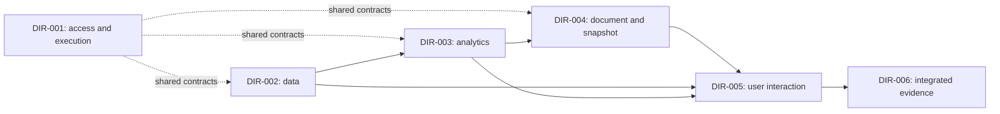

---
{
  "schema_version": "custometry-planning/v1",
  "framework_ref": {
    "path": "docs/architecture/planning/framework-v1/README.md",
    "version": "1.0.0"
  },
  "artifact_kind": "project_map",
  "doc_id": "MAP-001",
  "title": "Custometry development direction map",
  "version": "1.0.0",
  "planning_status": "accepted",
  "language": "en",
  "parent_ref": null,
  "direction_ref": null,
  "baseline_ref": {
    "commit": "5a963ab0166bfa44d508679dcafa29723bbeb68b",
    "evidence_refs": [
      "docs/architecture/planning/project-map.md#sources-and-proof-boundary"
    ]
  },
  "requirement_refs": [
    {
      "source": "custometry-technical-blueprint-ru.md",
      "revision": "5a963ab0166bfa44d508679dcafa29723bbeb68b",
      "ids": [
        "A11Y-001",
        "ANALYTICAL-DOC-001",
        "ANALYTICAL-DOC-014",
        "API-001",
        "ARCH-PRINCIPLE-001",
        "ARTIFACT-COMMIT-001",
        "ARTIFACT-COMMIT-003",
        "ATTRIBUTION-001",
        "AUTH-001",
        "BLOCK-BUILDER-001",
        "BRAND-001",
        "CHART-001",
        "COLLAB-001",
        "COMPARE-011",
        "COMPUTE-001",
        "CONNECTOR-002",
        "DATA-MAP-001",
        "DATA-MAP-007",
        "DIGITAL-001",
        "DQ-INPUT-001",
        "DQ-REMEDIATE-001",
        "EXEC-CANCEL-001",
        "EXEC-DISPATCH-001",
        "EXEC-STATE-001",
        "FILTER-013",
        "FOCUS-001",
        "GOAL-001",
        "GOAL-002",
        "GOAL-003",
        "GOAL-006",
        "GOAL-007",
        "GOAL-009",
        "GOAL-010",
        "GOAL-011",
        "GOAL-012",
        "GOAL-013",
        "GOAL-014",
        "GOAL-015",
        "GOAL-016",
        "GOAL-017",
        "GOAL-018",
        "HELP-001",
        "I18N-001",
        "INGEST-008",
        "INGEST-020",
        "MART-GRAIN-001",
        "MATERIALIZE-001",
        "METHOD-001",
        "METRIC-001",
        "MOTION-001",
        "NOTIFY-001",
        "OPS-001",
        "OPS-009",
        "OPS-010",
        "OUTLIER-001",
        "PARAM-001",
        "PIVOT-001",
        "PRODUCT-ANALYTICS-001",
        "PVM-001",
        "RBAC-019",
        "REPORT-015",
        "REPORT-016",
        "REPORT-MAIL-001",
        "REPORT-PERF-001",
        "REPORT-PERF-002",
        "REPORT-REFRESH-001",
        "REPORT-REFRESH-005",
        "REPORT-REFRESH-006",
        "REPORT-REFRESH-007",
        "RESEARCH-001",
        "ROUTE-001",
        "SCALE-001",
        "SCHEDULE-001",
        "SEC-001",
        "SEGMENT-029",
        "SEGMENT-034",
        "SYS-UI-001",
        "TEST-INV-123",
        "TEST-INV-126",
        "THEME-001",
        "UI-DENSITY-001",
        "UI-SHELL-001",
        "UNIT-ECON-001",
        "V1-AC-063",
        "V1-AC-067",
        "V1-AC-068",
        "V1-AC-069",
        "V1-AC-070",
        "WATCH-001",
        "WEB-ARCH-001",
        "WEB-PERF-001",
        "XLSX-001"
      ]
    }
  ],
  "decision_refs": [
    "FRAME/DEC-01",
    "FRAME/DEC-03",
    "FRAME/DEC-06",
    "MAP-001/DEC-01",
    "MAP-001/DEC-02",
    "MAP-001/DEC-05"
  ],
  "supersedes_ref": null,
  "proof_boundary": {
    "label": "accepted-project-map-and-level-1-scope",
    "exclusions": [
      "workstream-selection",
      "exhaustive-code-audit",
      "runtime-readiness",
      "implementation-authority"
    ]
  }
}
---

# Custometry development direction map

> **Accepted project map and L1 scope, version `1.0.0`, 2026-09-06.**
> The owner accepted the six-direction structure, requested English adoption and
> publication to main, and permitted removal of the Russian drafts. This adopts
> planning boundaries; it does not select an L2 task or authorize implementation.

## Accepted structure

Custometry has **six development directions at L1**. The first four group its
server and domain capabilities; the fifth owns Web interaction; the sixth owns
runtime, operations and combined-system evidence. This makes the large backend
scope visible without changing software context boundaries.

The directions are organizational scopes, not six services, teams or mandatory
parallel execution streams. Existing bounded contexts and modular-monolith
architecture remain authoritative. Direction numbers express identity, not order.

## Planning levels

| Level | Contents | Owner discussion outcome |
|---|---|---|
| Project map, above the levels | Directions, boundaries, common constraints and relationships | Understand the whole scope and choose the next branch |
| L1 — direction | Purpose, known existing base, scope, candidate large tasks and interfaces | Agreed development area |
| L2 — workstream | Specific capability, current state and milestone sequence | A clear path through a large task |
| L3 — milestone | Bounded result, contracts, changes and acceptance criteria | Accepted input for prompt-pack preparation |
| L4 — execution stage | One prompt's concrete actions, checks and handoff | A verified stage recorded in the milestone journal |

The default is **four levels below the project map**. The accepted framework
allows repeated workstream depth where an actual decomposition need is explained.
The iteration journal accompanies a milestone; it is not a fifth planning level.
The L1 candidate tables describe composition, not accepted L2 plans. No workstream,
milestone, pack or execution ledger is initialized by this map.

## Direction registry

All six documents below are accepted at `1.0.0` and point back to MAP-001 `1.0.0`.

| Direction | Purpose | Contents | Main boundary |
|---|---|---|---|
| [DIR-001. Shared platform and execution control](directions/DIR-001/direction.md) | Common access and reliable work execution | Identity/workspace/org, execution/pipelines, schedules/reuse, collaboration, watches, notifications and audit/API | Does not own analytical formulas or document composition |
| [DIR-002. Data and semantic model](directions/DIR-002/direction.md) | Usable, explainable, versioned analytical inputs | Sources, ingestion/refresh, mappings, identity/grain, metrics/filters, DQ, Data Guide, marts/artifacts | Does not determine the analytical conclusion |
| [DIR-003. Analytics, segments and research](directions/DIR-003/direction.md) | Reproducible results and findings | Sales/customer/product/digital, segments, matrices/parameters, methods/research, promotion history; Forecasting held | Produces results rather than independent incompatible report composers |
| [DIR-004. Analytical documents and result delivery](directions/DIR-004/direction.md) | Compose, publish, refresh and deliver one document | Document/block/snapshot model, refresh/current, prepared serving, ChartSpec/rendering, branding, email/exports/XLSX | Renderers do not recompute business values |
| [DIR-005. Web interface and user journeys](directions/DIR-005/direction.md) | Make capabilities usable by every supported role | Shell/components, feature screens, composer/reader/Focus, states, RU/EN/accessibility/responsive and API integration | Preserve demonstrated pilot decisions; providers enforce policy and calculations |
| [DIR-006. Operations, integration and system acceptance](directions/DIR-006/direction.md) | Install, observe, recover and verify the whole product | Environments/CI, migrations/install/update, security/observability, backup/restore, mixed-load, end-to-end qualification and docs | Feature owners retain local proof; system acceptance connects their results |

The owner has **not selected the next direction or workstream for detailed planning**.

## Selection rationale

| Considered structure | Consequence | Disposition |
|---|---|---|
| Backend / UI / operations | Compact top map; data, analytics and documents need another large backend decomposition | Considered; not selected for L1 |
| The six directions above | Main domain outcomes and their interfaces are visible; more explicit document links | Accepted by the owner |
| One direction per bounded context | Precise technical boundaries but a large top-level catalog | Keep this detail in architecture and L2 |

The document direction is separate from Web because stored versions/snapshots serve
Web, email and XLSX. Data is separate from analytics because identity, grain, mapping
and refresh correctness affect many calculations. These are the accepted planning
tradeoffs, not a measured claim that six directions are universally optimal.

## How the directions form a working product

This is the main user flow, not a direction-completion dependency graph. Runtime
and local verification from DIR-006 are needed from the beginning. Actual hard
dependencies connect future workstreams/milestones after their contracts are agreed;
a whole direction need not wait for all adjacent directions to finish.

### Shared boundary: refreshing a prepared report

| Result part | Primary owner | Output to adjacent directions |
|---|---|---|
| New input generation, DQ and immutable inputs | DIR-002 | Coherent versions, readiness and provenance |
| Durable demand, waiting for inputs, queue, single-flight and fencing | DIR-001 | Repeatable execution and state events |
| Normalized analytical recomputation | DIR-003 | Verified values and result identity |
| Refresh policy, required blocks, monotonic atomic current and last-good | DIR-004 | New exact snapshot and safe prepared reads |
| Update notification and explicit application in an open viewer | DIR-005 | Clear interaction preserving compatible context |
| Readers plus background refresh, crash and restore | DIR-006 | Combined-system evidence using domain-owner expectations |

Physical artifact integrity belongs to Artifact Lifecycle in DIR-002; atomic report
current switching belongs to DIR-004. Their shared protocol is tested together.
Temporary unavailability or failed refresh does not make a valid last-good snapshot
corrupted.

## Requirement coverage and shared outcomes

This table allocates broad source areas. It is not exhaustive requirement-to-stage
traceability or evidence that corresponding code is complete. Normative
MUST/SHOULD/MAY meaning and acceptance criteria remain in the machine blueprint.

| Requirement area | Primary direction | Contributors / integration boundary | Sources |
|---|---|---|---|
| Identity, tenancy, organization, role/data/object scope and audit | DIR-001 | All protected providers/consumers; DIR-005 UI; DIR-006 system security | AUTH, RBAC, SEC; section 20 |
| Execution, schedules, cancel/retry, reuse and trusted extensions | DIR-001 | DIR-002/003/004 jobs; DIR-006 budgets/runtime; DIR-005 UI | EXEC-STATE/DISPATCH/CANCEL, SCHEDULE, MATERIALIZE; section 9 |
| Collaboration, adoption, watches and operational notifications | DIR-001 | DIR-003 metrics, DIR-004 anchors, DIR-005 UI | COLLAB, WATCH, NOTIFY; sections 14.2 and 15.7 |
| Sources, canonical identity/grain, mappings, readiness, DQ, marts and artifacts | DIR-002 | DIR-001 execution, DIR-003 analysis, DIR-004 refresh | DATA-RULE, IDENTITY, DATA-MAP, CONNECTOR, INGEST, METRIC, FILTER, CAPABILITY, DQ, MART, ARTIFACT; sections 4–11 |
| Sales/customer/product, populations/segments, comparison, discounts/PVM | DIR-003 | DIR-002 semantic providers; DIR-004/005 consumers | OUTLIER, SEGMENT, COMPARE, DISCOUNT/PVM, PRODUCT-ANALYTICS; section 12 |
| Analytical builder, pivot and parameters | DIR-003 | DIR-002 metrics/relationships; DIR-004 bindings/layout; DIR-005 controls | BLOCK-BUILDER, PIVOT, PARAM; section 12.15 |
| Methods, Research, findings, Digital/attribution/economics and Promotion Journal | DIR-003 | DIR-002 admission; DIR-004 composition; DIR-001 discussions; DIR-005 UI | METHOD, RESEARCH, DIGITAL, ATTRIBUTION, UNIT-ECON, ASSUMPTION, PROMO |
| Forecasting and temporal validation | DIR-003, held | After resumption: DIR-002 inputs, DIR-001 execution, DIR-004/005 consumers | GOAL-006; section 13 and relevant sections 26/28 criteria |
| AnalyticalDocument, refresh, snapshots, channels and branding | DIR-004 | DIR-001/002/003 providers; DIR-005 interaction; DIR-006 load/recovery | ANALYTICAL-DOC, REPORT, REPORT-REFRESH, CHART, DASHBOARD, REPORT-MAIL, XLSX, BRAND |
| Complete Web, roles/routes, Focus, help, themes/RU/EN/accessibility | DIR-005 | All domain providers; DIR-006 combined build | UI blueprint; UI-SHELL/DENSITY, FOCUS, ROUTE, PROGRESS, THEME, I18N, A11Y, MOTION, SYS-UI, HELP, WEB-ARCH/PERF |
| Runtime, install/update, observability, backup and mixed load | DIR-006 | Domain correctness, manifests, resource semantics and recovery ports | OPS, COMPUTE, SCALE, REPORT-PERF; sections 18 and 20–25 |
| Product scenarios, AC/V1-AC and TEST-INV | DIR-006 coordinates system acceptance | Actual owners prove each requirement; select one integration milestone owner during decomposition | Sections 22, 26–28 and 31–32 |
| Goals, architecture, documentation rules and open decisions | MAP-001 and all directions | Planning constraints, not a separate feature team | DOC-RULE, GOAL/NON-GOAL, ARCH-PRINCIPLE, RISK/RESOLVED/OPEN; sections 0–3, 17, 19, 25 and 29–30 |

Cross-cutting families are allocated by exact clause at L2/L3. This table does not
transfer all DISCOUNT or PRODUCT-ANALYTICS ownership from Semantic Model to Analytics.
For example, discount policy and product hierarchy remain DIR-002 semantic inputs;
PVM and product analytical results belong to DIR-003. The 18 accepted domain context
owners remain intact under their L1 grouping.

## Preserved priorities and constraints

- Current product focus is report authoring and reusable segments with necessary
  data, policy and execution. Rich segmentation is not reduced to three predicates
  on a flat customer row.
- Forecasting stays **on hold**. Its inclusion preserves requirements; no forecast
  research, models, backtests or UI work is activated by L1 adoption.
- Dashboard, Workbook/Report and Research use one document/snapshot path. Discussion,
  analyst note, data annotation and reviewed finding remain distinct objects.
- The final target pilot remains authoritative for demonstrated composition and
  interaction. Missing states and runtime integration still require implementation.
- REPORT-REFRESH-001..007, ARTIFACT-COMMIT-001..003, OPS-009/010,
  REPORT-PERF-001/002 and V1-AC-068..070 are included. Fifty analysts plus one hundred
  readers is a required workload envelope, not proven performance.
- Through v1, preserve self-hosted single-server modular-monolith delivery:
  PostgreSQL control truth, Valkey delivery/cache and immutable bulk artifacts.
  Off-primary backup does not authorize remote primary storage or multi-host runtime.
- Universal XLSX remains the final new functional v1 increment after hardening;
  its shared ReportSnapshot contract can be agreed earlier.
- No first external release scenario has been selected. Internal preview is not
  automatically complete vertical alpha/public MVP/v1, particularly during forecast hold.
- B2B, activation/reverse ETL, marketing campaigns, SaaS/Kubernetes, arbitrary
  untrusted Python and other NON-GOAL scope do not return through direction names.
  Post-v1 extensions stay documented without new active plans.

## Sources and proof boundary

The Russian draft was inspected at local commit
`2e8582aa132369ee24f21bb4b0121a517a24e764`. Publication is based on remote main
`5a963ab0166bfa44d508679dcafa29723bbeb68b`. Relevant product/code sources were
compared for equality; the accepted planning-framework dependency is included in
this publication from local adoption commit `2d370f6ef1cd5cf9ddb09afa7987004b9412042c`.
Unrelated local governance cleanup is not part of this change.

| Source | Version / role |
|---|---|
| [Planning framework](framework-v1/README.md) | 1.0.0, doc_version 2; shape and owner checkpoints, published as prerequisite |
| [Machine blueprint](../../../custometry-technical-blueprint-ru.md) | 0.10.0-draft, 2026-09-06; normative product requirements |
| [Human mirror](../../../custometry-technical-blueprint-human-ru.md) | 0.10.0-draft; explanations of selected areas |
| [UI blueprint](../../../custometry-ui-blueprint-ru.md) | 0.8.0-draft; all-family scope and inventory |
| [System design](../system-design.md) | doc_version 17; target architecture |
| [Context map](../bounded-context-map.md) | doc_version 13; domain ownership and integration |
| [Frontend ADR](../../adr/0007-responsive-web-frontend-platform.md) | doc_version 2; accepted frontend platform |
| [Target pilot](../ui/target-pilot/README.md) and [manifest](../ui/target-pilot/manifest.json) | Accepted UI; HTML SHA-256 `b54b8b77d677d57869b0065dbe3aa005f13070297dface19ba98938f50d83700` |
| [Broad roadmap](development-roadmap-v1.md) | Supporting sequence proposal; its status is not copied into the hierarchy |
| [Source-data contract](../../contracts/source-data-adaptation-contract.md), [authoring contract](../../contracts/analytical-authoring-contract.md) | Accepted source and analytical semantics |

The base commit identifies the product/code source bytes even where a document
has no semver. Framework/process documents carried in this publication retain
their own version and acceptance provenance. Architecture status is not code readiness.

| Claim ID | Established fact | Evidence | Remaining uncertainty |
|---|---|---|---|
| MAP-001/EV-01 | `documented_only`: broad requirement and context coverage | Sources above and references in all six directions | Exhaustive clause-to-workstream-to-proof mapping is not yet created |
| MAP-001/EV-02 | `code_observed`: API composition imports identity, organization, data, analytics, people, runs and notifications | [API entrypoint](../../../apps/api/src/custometry_api/main.py) | This is static inspection, not a full wired-runtime observation |
| MAP-001/EV-03 | `documented_only`: W11–W17 and W31–W38 record accepted bounded outcomes | Exact evidence links in each DIR | Historical proof does not automatically cover newer requirements |
| MAP-001/EV-04 | `unknown`: full product/direction readiness | No exhaustive current runtime/browser/load/restore assessment | Inspect the selected L2 task before planning its implementation |

## Owner decisions and adoption

| Decision ID | Decision | Basis / status | Effect |
|---|---|---|---|
| MAP-001/DEC-01 | Adopt the six directions and their L1 boundaries | Owner accepted the six-direction format on 2026-09-06; version 1.0.0 | Settles MAP/L1 structure |
| MAP-001/DEC-02 | Apply four levels below the map, with justified repeated workstream depth | Accepted framework and owner acceptance of its L1 application | Preserves the existing planning form |
| MAP-001/DEC-03 | Which area should be detailed next? | Not selected. Previous recommendation: DIR-004 with required DIR-001/002/003 inputs; remains a proposal | Owner selects the next L2 planning unit; agent order remains unassigned |
| MAP-001/DEC-04 | First external release scenario | Deferred; not needed to adopt L1 | Must be resolved before relevant release promises |
| MAP-001/DEC-05 | Adopt MAP-001 and DIR-001..006 in English and publish to main; remove Russian drafts | Explicit owner instruction in this task on 2026-09-06; version 1.0.0 | Authorizes this adoption/publication and required framework dependencies, not implementation |

The owner first reviewed the Russian `0.1.0` drafts, then explicitly accepted L1
and requested the English records. Their Russian bodies are replaced in the same
canonical paths; IDs remain stable. No duplicate draft copies remain in the source
tree. The acceptance recorded here does not imply that candidate L2 plans or future
milestones have been accepted.

## History and synchronization

| Version | Date | Change | Authority |
|---|---|---|---|
| 0.1.0 | 2026-09-06 | Russian review map and six direction drafts | Owner draft request |
| 1.0.0 | 2026-09-06 | Accepted English map/L1, reciprocal version links and navigation | MAP-001/DEC-05 |

Owned L1 changes are this map, six direction documents, architecture/contributor
navigation and the roadmap's next-planning-step reference. The previously adopted
framework and its required instruction/architecture dependencies are included because
remote main did not contain them. Product requirements, application behavior and
existing ticket states are unchanged. Process impact is accepted organizational
decomposition; API/persistence/runtime impact is `none`.

No L2 file, milestone or execution ledger is created. Each direction registers the
exact MAP parent version; MAP links every immediate child. Candidate IDs are local
row identifiers, not fabricated WS paths. Interface links use accepted `1.0.0`
versions; actual acyclic milestone dependencies are deferred to owner-led detail.

### Validation and publication evidence

Pre-publication evidence, 2026-09-06:

| Check | Observed result | Boundary |
|---|---|---|
| Product/code/evidence comparison against the original inspection checkout | 33 directly used source files are byte-identical; target-pilot manifest hashes match | Preserves the basis of the accepted Russian proposal |
| Python semantic assertions against the framework metadata | Seven English accepted documents; stable IDs, exact parent/framework versions, owner-decision references and 187 requirement anchors pass | Bounded MAP/L1 structural check, not a new general planning validator |
| `uv run --locked --offline python -m tools.custometry_quality.generate_docs_index` | Pass; 62 contributor documents | Normal English-language validation and index generation |
| `uv run --locked --offline python -m tools.check --scope local` | Pass | Grouped local source/static checks; no product-runtime claim |
| `git diff --check` | Pass | Patch whitespace |

Cold-head review: completed. Mode: independent subagent, read-only review of the
English MAP/L1 records against the Russian proposal, framework/routing prerequisites
and directly linked authoritative sources. Verdict: Release after fixes. One Medium
finding corrected metric-definition ownership in DIR-001 and DIR-004 summaries:
DIR-002 owns registered meaning; DIR-003 owns analytical calculations/results.
No Blocker/High remains. Local follow-up checks cover the saved corrections.

The publication follows the protected-main PR route, including the repository's
commit/push profiles and required Foundation gate. The containing Git commit and
its hosted PR/check records identify the final published bytes and later CI results;
the table above records only observed local evidence before that publication.
English adoption removes the temporary language exception without changing the
contributor-language validator. No deployment or product-completion claim follows.
