# Custometry Program Plan

## 1. Purpose and authority

This document defines the canonical program structure from repository preparation through final acceptance. It allocates product requirements to one primary workstream, records dependency and release sequencing, and defines when detailed staged execution may begin.

It does not authorize implementation by itself. Current execution state comes only from the applicable `stage_ledger`; `.codex/PLANS.md` is a compact program pointer, not a substitute for the ledger.

The authority order remains:

1. `custometry-technical-blueprint-ru.md`, the normative product specification;
2. `custometry-technical-blueprint-human-ru.md`, its required explanatory mirror;
3. accepted architecture and contract documents;
4. this program plan and its generated requirement matrix;
5. an approved workstream `plan_doc`;
6. the active workstream `stage_ledger`.

## 2. Program topology

The program consists of one repository gate, thirteen product workstreams, and one final acceptance gate:

- `W00` — repository preparation and proof;
- `B01`–`B13` — long-lived product capability workstreams;
- `W14` — release acceptance without new feature scope.

A product workstream is not a one-pass module that becomes permanently complete after one S00–S06 cycle. It can participate in several release milestones. Each participation uses a release-scoped checkpoint:

- `A` — allocation and architecture readiness: scope, dependencies, decisions, contracts, and evidence obligations are accepted;
- `P` — implementation proof: the milestone slice is implemented at its nearest real boundary;
- `V` — milestone verification: the slice is reconciled with the requirement matrix and accepted as input to the terminal milestone gate.

The common S00–S06 framework governs each approved implementation iteration. `A/P/V` governs how multiple iterations contribute to a release milestone.

## 3. Canonical workstreams

| ID | Canonical name | Outcome | Hard dependencies | Soft dependencies | Release milestones |
|---|---|---|---|---|---|
| `W00` | Repository Foundation | Reproducible repository, toolchain, governance, CI contracts, validators, and M3 Pro Foundation proof | — | — | `repository_foundation` |
| `B01` | Experience Platform | Frost foundations, Web shell, route-backed UI, design system, docs/help surfaces, i18n, accessibility, and generated mocks | `W00` | — | `product_foundation`, `vertical_alpha`, `public_mvp`, `v1_target` |
| `B02` | Local Data Lab | Deterministic control/source PostgreSQL environments, migrations, and generated retail fixtures | `W00` | `B01` | `product_foundation`, `vertical_alpha`, `public_mvp`, `v1_target` |
| `B03` | Identity and Control Plane | Workspaces, sessions, RBAC, actor context, object lifecycle, API policy, and audit boundaries | `B01`, `B02` | — | `product_foundation`, `vertical_alpha`, `public_mvp`, `v1_target` |
| `B04` | Execution, Compute and Artifact Spine | Runs, leases, fencing, cancellation, CPU execution, progress/ETA, outbox, reconciler, and immutable artifact commit | `B02`, `B03` | `B01` | `product_foundation`, `vertical_alpha`, `public_mvp`, `v1_target` |
| `B05` | Data Foundation | Connections, catalog, ingestion, semantic model, metrics, filters, marts, identity rules, and data quality | `B02`, `B03`, `B04` | `B01` | `vertical_alpha`, `public_mvp`, `v1_target` |
| `B06` | Analytics and Forecasting Vertical Alpha | First real reportable slice with typed filters, vs LY, ChartSpec/ECharts, Trust, Focus, baseline forecasting, and rolling backtest | `B01`, `B02`, `B03`, `B04`, `B05` | — | `vertical_alpha`, `public_mvp`, `v1_target` |
| `B07` | Operations | Runs, schedules, Operator Center, and the public-MVP in-app notification subset | `B01`, `B03`, `B04`, `B06` | `B05` | `public_mvp`, `v1_target` |
| `B08` | Customer Intelligence and Promotion Journal | Customers, cohorts, lifecycle, segments, and immutable channel/client-scoped promotion timelines | `B01`, `B03`, `B04`, `B05`, `B06` | `B07` | `public_mvp`, `v1_target` |
| `B09` | Forecasting Expansion | Forecast specification expansion, model registry, prediction products, monitoring, and advanced model comparison | `B04`, `B05`, `B06`, `B08` | `B07` | `public_mvp`, `v1_target` |
| `B10` | Reporting and Knowledge | Dashboards, ReportSnapshot composition, Data Guides, user-sent email, and cross-render reporting | `B01`, `B03`, `B04`, `B05`, `B06`, `B07`, `B08`, `B09` | — | `public_mvp`, `v1_target` |
| `B11` | Pipelines, Extensibility and Operational Channels | Common-engine canvas, plugin contracts, administrator lifecycle, and operational email/webhook channels | `B04`, `B07`, `B10` | `B05`, `B08`, `B09` | `v1_target` |
| `B12` | Production Hardening | Security consolidation, upgrade/recovery, supply-chain proof, performance, and target-specific firewall/CNI enforcement | `B01`–`B10` | `B11` | `public_mvp`, `v1_feature_freeze`, `v1_target` |
| `B13` | Universal XLSX | Universal entity-aware workbook assembly from stable ReportSnapshot contracts | `B10`, `B11`, `B12` | `B06`, `B08`, `B09` | `v1_feature_freeze`, `v1_target` |
| `W14` | Final Acceptance | Reconcile and verify release evidence without adding feature scope | `B01`–`B13` | — | `v1_target` |

The machine-readable source for this table is [requirement-routing.json](./requirement-routing.json). Its generator validates the complete workstream catalog, release participation, terminal milestones, and dependency references.

## 4. Dependency graph

Hard dependencies gate activation of the dependent capability slice. Soft dependencies may proceed through an explicit versioned contract or generated mock, but must be reconciled before the relevant milestone verification.

```mermaid
flowchart LR
    W00["W00 Repository Foundation"]
    B01["B01 Experience Platform"]
    B02["B02 Local Data Lab"]
    B03["B03 Identity and Control Plane"]
    B04["B04 Execution, Compute and Artifact Spine"]
    B05["B05 Data Foundation"]
    B06["B06 Analytics and Forecasting Vertical Alpha"]
    B07["B07 Operations"]
    B08["B08 Customer Intelligence and Promotion Journal"]
    B09["B09 Forecasting Expansion"]
    B10["B10 Reporting and Knowledge"]
    B11["B11 Pipelines, Extensibility and Operational Channels"]
    B12["B12 Production Hardening"]
    B13["B13 Universal XLSX"]
    W14["W14 Final Acceptance"]

    W00 --> B01
    W00 --> B02
    B01 --> B03
    B02 --> B03
    B02 --> B04
    B03 --> B04
    B04 --> B05
    B05 --> B06
    B06 --> B07
    B06 --> B08
    B08 --> B09
    B07 --> B10
    B08 --> B10
    B09 --> B10
    B04 --> B11
    B07 --> B11
    B10 --> B11
    B11 -. "B12 S06 gate" .-> B12
    B10 --> B13
    B12 --> B13
    B11 --> B13
    B13 --> W14
```

This diagram intentionally compresses transitive edges. The complete hard/soft edge list is authoritative in `requirement-routing.json`.

## 5. Release milestones

| Milestone | Terminal gate | Required program result |
|---|---|---|
| `repository_foundation` | `W00 / foundation_proof` | Repository governance, deterministic validation, reproducible tool activation, CI contracts, and local M3 Pro Foundation proof are observed |
| `product_foundation` | `B04 / S06` | Web shell, local data lab, identity/control plane, and execution/artifact spine form a usable product foundation |
| `vertical_alpha` | `B06 / S06` | One complete analytics and baseline-forecasting journey reaches real data, execution, artifact, API, and browser boundaries |
| `public_mvp` | `B12 / S05` | Public-MVP product slices and their minimum production hardening are accepted; security baseline is not deferred to a later milestone |
| `v1_feature_freeze` | `B13 / S06` | Universal XLSX completes the planned v1 feature surface, while B12 rechecks hardening impacts |
| `v1_target` | `W14 / S06` | All v1 requirements and evidence are reconciled; no feature implementation occurs in W14 |

The terminal workstream coordinates verification; it does not become the primary owner of requirements allocated to another workstream.

## 6. Requirement allocation and evidence matrix

The canonical inputs and output are:

- [requirement-routing.json](./requirement-routing.json) — reviewed routing rules, workstreams, dependencies, milestone catalog, and evidence profiles;
- [requirement-matrix.json](./requirement-matrix.json) — generated exact allocation of every current requirement;
- `docs/generated/requirement-index.json` — generated source inventory from the normative blueprint;
- `tools.custometry_quality.generate_program_requirement_matrix` — fail-closed generator and checker.

For every indexed requirement, the matrix records:

- exactly one primary workstream;
- zero or more contributing workstreams;
- first required milestone and release scope;
- implementation and acceptance evidence classes;
- decision gate and allocation status when applicable;
- source document and source line.

Current invariant: all 649 indexed requirement IDs are allocated exactly once. A selector that matches nothing, an unknown dependency/evidence type, an unallocated ID, or a duplicate allocation fails generation.

The primary owner of every allocation must belong to the hard-dependency
closure of its `first_required_milestone`. A later workstream may contribute
expansion or hardening evidence, but it cannot be the primary implementer of a
requirement needed before that workstream can participate.

The primary workstream implements and maintains the requirement contract. A contributor supplies a dependency or acceptance observation but does not silently assume ownership. `W14` verifies release evidence and is therefore normally a contributor rather than a primary feature owner.

## 7. Resolved ownership boundaries

### 7.1 Vertical Alpha and Forecasting

`B06` owns the smallest complete forecast slice required to make Vertical Alpha real:

- the canonical `monthly_net_revenue` series;
- Seasonal Naive and CatBoost baseline candidates;
- rolling backtest and comparable forecast evidence;
- future-leakage, incomplete-period, immutable-spec, and baseline-quality
  invariants;
- the baseline model-comparison and forecast-publication use case;
- reportable forecast result contracts.

`B09` does not rebuild or postpone that slice. Its first required scope is
`public_mvp`: full lifecycle, monitoring, hierarchy warnings, richer
specifications, registry lifecycle, prediction products, and advanced model
comparison. Any B09 change to a B06 contract is compatibility-classified and
migrated explicitly.

### 7.2 Notifications and operational delivery

`B07` owns the in-app/public-MVP notification subset (`NOTIFY-001`–`NOTIFY-005`, `NOTIFY-007`) needed for operational visibility.

`B11` owns operational email/webhook channels and their administrator lifecycle (`NOTIFY-006`, `NOTIFY-008`–`NOTIFY-015`). User-initiated report email remains in `B10` and is not an anonymous alert channel.

### 7.3 Repository Foundation and product foundation

`W00 Repository Foundation` proves that the repository and its delivery rules are reproducible. It does not claim that product runtime foundations exist.

`product_foundation` is a product milestone terminated by `B04`; it requires the accepted B01–B04 product slices at their real boundaries.

### 7.4 Hardening timing

`B12` consolidates production hardening and terminates `public_mvp` at
`B12-S05`, but security ownership follows the protected capability and its
first milestone. W00 owns the Foundation Edge/network topology baseline; B03
owns identity, secret, audit, and redaction controls; B04 owns artifact-path
safety; B05 owns upload/CSV safety; B06 owns ChartSpec validation; B09 owns
model-format safety; B10 owns sensitive exports and isolated static rendering;
B11 owns outbound HTTP policy. B12 owns target hardening, official
supply-chain evidence, TLS/security-header and firewall/CNI acceptance, and
cross-cutting re-proof. It is not permission to defer baseline security.

`B11` is a soft dependency for the B12 public-MVP path because its operational channels are post-public-MVP scope. `B12-S06` is nevertheless gated by accepted B11 evidence for the final v1 hardening pass. `B13` therefore has B11 as a hard dependency, preventing `v1_feature_freeze` and `v1_target` from closing without it.

## 8. Decision gates

Two blueprint decisions remain intentionally open and block only the affected path:

| Requirement | Gate | Owner | Blocking rule |
|---|---|---|---|
| `OPEN-007` | `B05-S01` | `B05` | The affected data-contract path cannot pass S01 until the decision is recorded and its compatibility impact is classified |
| `OPEN-008` | `B06-S01` | `B06` | The affected analytics/forecasting contract cannot pass S01 until the decision is recorded and its compatibility impact is classified |

No implementation prompt may convert an open decision into an implicit default.

## 9. Staged-work artifact contract

For each product workstream `B01`–`B13`, the canonical artifacts are:

- definition: `docs/architecture/workstreams/<slug>-module.md`;
- plan: `docs/architecture/workstreams/<slug>-plan.md`;
- ledger: `docs/architecture/workstreams/<slug>-stage-reports/<slug>-stage-ledger.md`;
- prompt pack: `.codex/agents/generated/<slug>/`.

`W14` uses the plan, ledger, and prompt-pack forms but has no module definition because it owns no new product capability. `W00` is governed by this program plan and repository-foundation evidence; it is a prerequisite gate rather than a product module.

The artifact set is exactly `plan_doc + prompt_pack_dir + stage_ledger`. Do not
create `GOAL.md`. Initial B01–B13 ledgers remain `dormant` and locked until
their declared hard dependencies and activation conditions are observed.
`blocked` is reserved for an active current stage with an explicit blocker.
B03–B13 prompt packs remain dormant scaffolds until detailed immediately before
activation against the implemented repository state.

Every B01–B13 and W14 activation uses Codex Goal mode with
`execution_mode: goal_driven`. One Goal owns one workstream's currently
authorized S00–S06 iteration, not an individual stage and not several
workstreams. After every accepted stage, the Goal must re-read the ledger and
may continue only when the ledger makes the successor current and sets
`next_allowed: true`. It stops on a blocked, completed, dormant, or superseded
ledger; missing or stale evidence; failed validation; required approval; or no
explicitly unlocked successor. Goal runtime state is ephemeral and never
replaces or overrides the staged trio.

## 10. Activation sequence

1. Freeze the canonical W00/B01–B13/W14 catalog.
2. Prove W00, including reproducible Node/pnpm/uv activation and the M3 Pro Foundation boundary.
3. Generate and validate exact requirement allocation.
4. Create and validate all initial workstream definitions, plans, ledgers, and prompt-pack scaffolds.
5. Complete an independent cold review, fix blockers, and repeat applicable checks.
6. Activate only B01 in `.codex/PLANS.md`.
7. Start one Codex Goal for the active B01 iteration and execute from its
   ledger; detail each later prompt pack immediately before that workstream
   starts in its own Goal.

Penpot access and the canonical Penpot file are a separate decision. B01 may perform repository-local product mapping and contract work, but any Penpot mutation must stop until live write authority and the canonical file are explicitly confirmed.

## 11. W00 proof boundary

W00 is accepted only with observed evidence for:

- locked Python and JavaScript dependency activation from documented repository commands;
- a clean `uv`, Node, and pnpm activation path in a fresh shell;
- static and local quality profiles;
- CI workflow syntax and contract checks;
- canonical OCI/Compose configuration validation;
- local M3 Pro Foundation lifecycle evidence at the boundary named by the repository runbook.

A version file, successful package-manager invocation, `docker compose config`, or generated document alone is not M3 Pro Foundation proof. Missing Docker, browser, image, PostgreSQL, or host observations remain explicit gaps.

## 12. Change control and acceptance

Any change to workstream ownership, a hard dependency, a terminal milestone, or evidence semantics must update:

1. `requirement-routing.json`;
2. the generated `requirement-matrix.json`;
3. this program plan;
4. affected module definitions/plans/ledgers;
5. the architecture index when navigation changes.

Program-preparation acceptance requires:

- exact requirement allocation;
- valid dependency and milestone catalogs;
- synchronized staged-work artifacts;
- focused generator/lint/link checks;
- one independent cold review, followed by a repeat check after blocker fixes;
- no activation of B01 before the full preparation set passes.

Green preparation gates establish planning readiness only. They do not establish product runtime, browser, recovery, performance, supply-chain, deployment, or release readiness.
