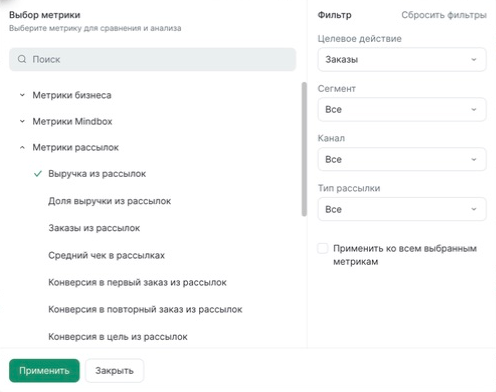
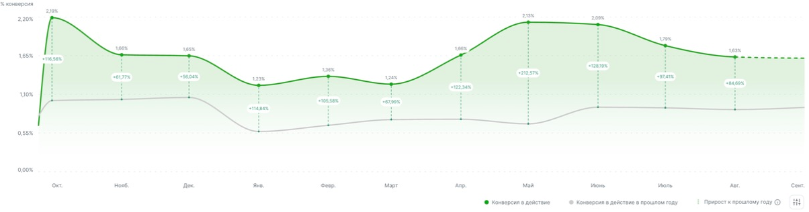
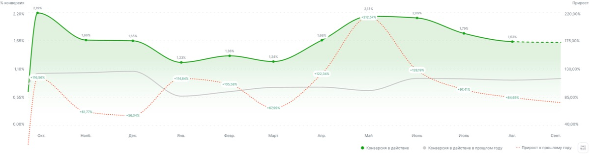
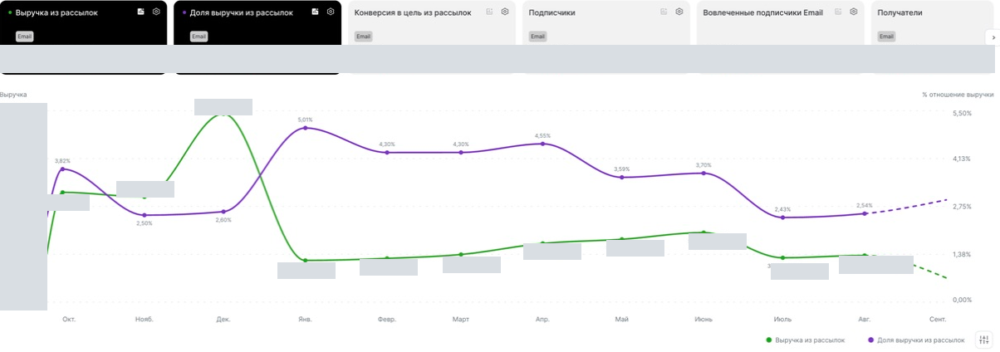
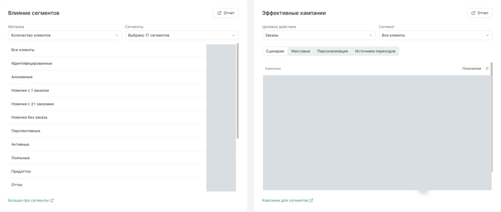

# Metric worksets and comparison interactions

## Authority and reading guide

On 2026-09-17 the owner requested screenshots from their already authenticated
Mindbox page and incorporation of the selected new capabilities into requirements.
This atlas is the resulting **target addition**, version 1. It records selected
interaction patterns, not a replacement visual design or an implementation plan.

Normative requirements are in the [machine blueprint](../../../../../custometry-technical-blueprint-ru.md)
(METRIC-025…029 and CHART-021), mirrored in the [human blueprint](../../../../../custometry-technical-blueprint-human-ru.md).
[UI requirements §8.5.2a](../../../../../custometry-ui-blueprint-ru.md)
and the [analytical authoring contract](../../../../contracts/analytical-authoring-contract.md)
explain their integration. [Architecture index](../../../README.md) provides navigation.

The [preserved Custometry pilot](../../target-pilot/README.md) remains the source for
its demonstrated shell, rail, document tabs, density, typography, inspector and
Focus interactions. Mindbox supplies the additional behavior below. Its white
surfaces, exact card dimensions, brand navigation, terminology and business data
are not a command to rebuild the pilot. New controls must be composed from the
pilot's established elements; source changes or a new layout need an explicit
implementation decision. This atlas does not expand accepted MS-003 stages.

The owner accepted the [initial Custometry composition](../../drafts/metric-workspace-v1/README.md)
on 2026-09-17 as the visual baseline for fitting these interactions into the
preserved pilot; its current document version is 3. This changes neither the captured reference images nor the
production implementation claims. Backend decisions remain in the subsequent
bounded planning work.

## Capture boundary and provenance

- Source: owner-opened `https://simplewine.mindbox.ru/home?brandId=1`, including
  its visible system-set tabs, on 2026-09-17.
- Mechanic: native Brave UI through Computer Use, existing authenticated session.
- Window: 1312 × 768 logical pixels; observed browser zoom 90%. Images preserve
  source pixel density and are deliberately cropped to one relevant surface.
- Ten screenshots, once per selected state. [Capture manifest](capture-manifest.json)
  records pixel sizes, crop coordinates, redaction rectangles and SHA-256 hashes.
- Browser chrome, unrelated tabs and account/chat content are excluded. Grey
  rectangles mask financial amounts and campaign records. Percentage chart
  geometry/labels are retained only to explain comparison placement; none are
  fixtures, acceptance thresholds or claims about the business.
- No source HTML was copied, no vendor API/session extraction was performed,
  and no metric set or monitoring goal was created. Form inspection was cancelled.
  Presentation switches were returned to the original difference view; the
  original personal set and selected mailing-revenue card were restored.
- These are actual captures, with lossless cropping and opaque redaction only.
  They are not generated mockups. Keep internal; no public help or publication
  is authorized by this task. Console/network and backend persistence were not
  inspected and are not proven by these references.

## 01 — Task-oriented worksets and a metric rail

**Observed:** a personal set and ten thematic sets coexist: business, audience,
CRM, mailings, Email, website personalization, In-App, loyalty, points movement,
and website. The selected metric is visually prominent. The same chart area is
reused instead of navigating to a separate page for every metric.

**Target:** a named ordered workset groups configured cards by a business task or
team. A department does not automatically become a domain entity or a permission
group. Personal and shared scope are explicit (METRIC-025). Carry selection and
keyboard navigation into the existing compact pilot metric rail; tall Mindbox
cards are not a new universal Custometry layout.

**Acceptance:** selecting a workset resolves its permitted cards in saved order;
selecting a card visibly changes the primary metric. An inaccessible card cannot
leak a value, filter facet or cached result. Overflow remains keyboard accessible.

## 02 — Metric definition plus a typed filter configuration

**Observed:** a searchable metric catalogue is paired with applicable filters.
For mailing revenue, the form exposes target action, segment, channel and mailing
type. It offers reset, Apply, Close and “apply to all selected metrics”. A revenue
card has fewer filters; website conversion adds a website selector.

**Target:** distinguish the registered metric definition from a configured card
(METRIC-026/027). The card references a MetricVersion and its allowed typed
parameters. One formula can appear as several cards with different filters.
Filter schema follows capabilities, not a universal set of arbitrary fields.
Target action means the event population to count; it is not a monitoring goal.

**Acceptance:** two instances of revenue with different stores/populations remain
independent. Cancel retains the applied result. Apply calculates the effective
context on the server; Save persists separately. Bulk apply previews affected
cards and reports incompatibilities instead of silently dropping a filter.

## 03 — Catalogue, selection, order and card editing

**Observed:** the drawer combines search, select/clear, selected metrics, per-card
editing, ordering handles and an available-metrics section. It is a bounded
assembly interface, not an observed arbitrary expression editor.

**Target:** make set composition available without requiring the analyst to edit
metric formulas (METRIC-027). Preserve MetricGroupVersion semantics, published
metric compatibility and personal Saved View reset. Formula/lineage governance
continues in the existing metric registry.

**Acceptance:** selecting, deselecting and reordering can be completed with a
keyboard. Order survives authorized save/reopen. New data projections pass
backend preflight and change request identity (METRIC-024); selection does not
invent values in the browser.

## 04 — Copy a set and disclose who will see it

**Observed:** the form says that it copies metrics from the selected set and makes
the new set available to users of the brand. Inspection stopped before creation.

**Target:** copy-as-new with an explicit destination scope and name (METRIC-025).
Custometry uses workspace/access policy; it does not introduce a Mindbox brand
object or automatically expose a copy to everyone. Personal changes remain
private, and a shared write is explicit and authorized.

**Acceptance:** copying leaves the original unchanged; reopening preserves card
bindings/order. A conflicting shared save preserves unsaved inputs. Unauthorized
users cannot save to shared scope. Mindbox's personal autosave behavior is not
an override of Custometry's Apply/Save contract.

## 05 — A delta at each aligned period

**Observed:** current and prior-year values share month positions; dashed vertical
connectors carry relative-change labels. This screenshot demonstrates year-over-
year comparison, not the immediately preceding month. The incomplete tail uses
a different line style; its precise vendor policy was not established.

**Target:** CHART-021 adds a presentation of per-bucket deltas from the existing
ComparisonArtifact. Comparison mode, baseline period, unit and coverage remain
visible. Support the modes defined by the comparison contract; do not silently
interpret “previous period” as “previous year”. A line style is not proof that an
unfinished value is a forecast or an estimate.

**Acceptance:** for a synthetic rate from 1% to 2%, the table shows +1 percentage
point and +100% relative change as distinct values. A zero baseline makes the
relative delta unavailable; a missing bucket does not become zero. The chart,
tooltip and accessible table use the same server-provided values. Dense labels
may be suppressed without losing the table alternative.

## 06 — Presentation controls are separate from calculation

**Observed:** current series, baseline series and growth can be shown separately;
value labels have separate switches. The growth type offers difference or trend.

**Target:** preserve these independent presentation choices (CHART-021). They do
not change the saved metric definition, business values or result identity.
Only the presentation/render identity changes when relevant. Use the existing
pilot view/inspector conventions rather than a second competing settings system.

**Acceptance:** hiding a line never recalculates the metric or changes saved
result data. All controls have localized accessible names and keyboard operation.
The full applied comparison mode remains discoverable even if its line is hidden.

## 07 — Growth as its own time series

**Observed:** the second growth mode draws a separate dotted series against a
right-hand growth axis, while the metric keeps its original scale.

**Target:** an alternative to the connectors, using exactly the same comparison
artifact (CHART-021). It is a descriptive delta series; no new metric computation
is delegated to ECharts or the browser. A typed ChartSpec controls a trusted
renderer; user callbacks, raw options and arbitrary renderItem code stay forbidden.

**Acceptance:** switching modes preserves every comparable bucket's delta, baseline
and unavailable reason. Axes and legend identify their units. Negative values and
crossing lines remain legible. Static/export support must be declared by the
future implementing unit, not inferred from this Web screenshot.

## 08 — Monitoring goal as a separate object

**Observed:** the form combines a metric, target action and segment with a target
period, target numeric value and a hypothesis text. It was cancelled, so this
capture proves the input surface only, not saved-goal progress behavior.

**Target:** a bounded monitoring goal is distinct from a target-action definition,
a forecast and a metric formula (METRIC-029). Bind it to the configured metric,
period, target unit, owner/scope and hypothesis. Actual/progress comes from the
same server-resolved analytical method and retains Result Trust.

**Acceptance:** invalid units/periods are rejected; missing actual is visibly
unavailable, not zero or achieved. Before implementation, specify progress direction
(higher/lower/range), period aggregation for sums/rates/stocks, permitted edits to
an active target, and historical version behavior. This document does not silently
choose those unresolved policies or add a general planning/budgeting engine.

## 09 — Two different metrics, one shared time context

**Observed:** selecting the chart icon on a second card displays two measures.
Here revenue and its share use different axes. Financial amounts are redacted;
selection, units, series geometry and legend remain visible.

**Target:** metric-to-metric mode is distinct from temporal comparison (METRIC-028).
Each card keeps its own filters and metric/version identity; their effective time
buckets must be compatible. Both units and series-to-axis assignments are explicit.
This surface does not establish correlation significance or causal impact.

**Acceptance:** two different-unit metrics have labelled axes; same-unit series
may share a compatible scale. Incompatible grain/calendar/coverage is explained.
Removing the second selection restores an unambiguous single-metric mode.

## 10 — Continue from a metric into its analytical context

**Observed:** the segment block selects one metric and a set of populations. The
campaign block selects an action and segment, then switches among scenarios,
mass campaigns, personalization and traffic sources. Both link to detailed reports.
Campaign names/values and population counts are masked in this reference.

**Target:** carry this investigation continuity into existing population, segment
and activity/attribution capabilities. Preserve visible context and permissions
on drill-through; do not add vendor campaign management or declare causal effect.
A capability without the required sources shows its reason and does not render
a falsely functional control. This screenshot adds no new activation scope.

**Acceptance:** drill-through retains the selected time/population/metric context;
unauthorized populations remain hidden. Results declare membership-time and
attribution policy where relevant. A detailed linked report is proven separately;
this capture demonstrates only the parent controls.

## Conceptual separation, not a database design

| Concept | Owns | Does not own |
|---|---|---|
| Metric definition / MetricVersion | Formula, grain, unit, allowed dimensions, lineage | Personal card order |
| Configured card | Metric reference, filters, population and inherited/local context | A copy of the formula |
| Workset | Named ordered cards and personal/shared visibility | A department permission model |
| View/comparison presentation | Selected one/two cards, line/label visibility, delta display | Business delta calculation |
| Monitoring goal | Configured metric binding, target period/value, hypothesis, scope | Forecast or event definition |

Existing MetricGroupVersion and Saved View are the integration anchors. Whether
configured cards/worksets need new persistence objects or a versioned extension
of those contracts is an architecture decision for the selected implementation
unit. No new service, database table, migration or endpoint is established here.

## Handoff and verification

Scope: target documentation and these ten references only. Completed milestone
plans, stage prompts, receipts and ledger bytes remain outside this change.
New requirements use the next explicit draft requirements revision
`2026-09-17.1`; the base `0.11.0-draft` product specification and `0.9.0-draft` UI
specification identifiers remain, with the revision pinned in both mirrors and
this atlas. It is not a release-version update or a runtime compatibility claim.

Before implementation, select the owning workstream/milestone under the existing
planning framework and resolve the policy questions noted above. Browser proof
must cover RU/EN, 768/1920 widths, keyboard/Focus, dense labels, mixed units,
zero/missing baselines, denied access, shared-save conflicts and exact save/reopen
with real server data. Matching these references alone cannot certify backend
semantics or every capability in the third-party product.

Validation results and the changed-document hashes are recorded in
[verification](verification.json). Capture hashes are recorded separately so
later text maintenance need not rewrite the screenshots.
