# Workset and catalogue follow-up

## Scope and authority

Parent: [reference atlas, version 6](../README.md).
Consumer: [UI blueprint §8.5.2a](../../../../../../custometry-ui-blueprint-ru.md).
The owner requested live inspection in their open Brave Mindbox session, durable
capture, and then a separate implementation step. They selected analogous
creation and switching/management behavior instead of the present Custometry
interaction. During inspection they explicitly authorized creating a test set
and added the top-level **Metrics** catalogue to scope.

Classification: bounded interaction research and reference update. Execution
unit: this capture/report, not a milestone stage. Primary skill:
`product-design:audit`. Allowed repository writes: reference evidence and its
navigation/consumer links. Product code, plans and ledgers are outside this unit.
Contract impact: none at runtime; this document records the selected next UI
direction without changing persistence, permissions or calculation contracts.

## Capture boundary

- Date: 2026-09-24. Source: the existing authenticated
  `https://simplewine.mindbox.ru/home?brandId=1` page in Brave.
- Mechanic: native Brave UI through `cua_repl`; screenshots and accessibility
  observations only, without vendor API, browser storage or session extraction.
- Source screenshots: 3600 × 2110 pixels. Zoom was not independently measured.
- Nineteen lossless crops exclude browser chrome, business results, account and
  chat content. [Capture manifest](capture-manifest.json) records coordinates and
  SHA-256 hashes. Crops were visually inspected before acceptance.
- Initial selection: **My metrics**, 14 cards; ten thematic tabs visible.
- One test set was created: **TEST Custometry — worksets 24.09 (translated name)**, ID
  `66943b8e-0a4e-40fd-b88f-9b8d860219fc`, copied from **CRM** with six cards.
  A seventh card, **Orders**, was added and explicitly saved to this test set.
  Switching to CRM showed six cards; switching back showed seven.
- The test set remains in the vendor account. Brave is left on its metric
  catalogue. No set was deleted or renamed; the rename form was cancelled.
  CRM visibility was toggled off/on, which also changed its position/selection.
  Existing set definitions were not deliberately edited. Original browser
  presentation was not restored because the test catalogue is the handoff.

UI labels below are translated into English; the screenshots retain the exact
Russian source labels and test-set name.

## Observed flow and evidence

### 1. Workset tabs — observed

**My metrics** is separate at the left. Thematic sets are compact tabs with icons;
the selected tab is dark. A **+** follows the visible tabs, while **All 10** is
aligned at the right. This keeps selection, creation and managing visible tabs
on the same row.

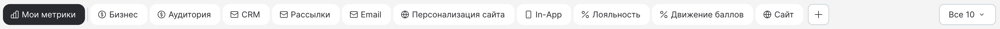

### 2. Create from the selected set — observed and completed

The **+** opens an anchored popover, not a full-screen wizard. It explains that
the current set is a template and the copy is available to all users in the
brand. One name input and **Apply / Cancel** are present. Apply is disabled
for an empty name and enabled after entering text. The first inspection draft
was cancelled; later the explicitly authorized test copy was created from CRM.

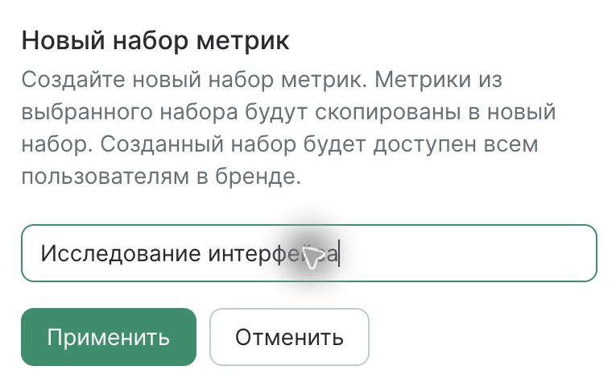

### 3. Manage visible tabs — observed and exercised

**All 10** opens a scrollable popover with search and grouped checkbox rows:
**Business**, **Marketing**, **Loyalty**, **Website**. Search filters the menu without
changing the active set; a miss displays **Nothing found**. The search query
survived closing/reopening the menu within this page session.

Unchecking CRM removed its tab immediately. **All 10** still displayed 10, so this
counter describes available sets, not the checked count. Checking CRM again
made it visible, moved it directly after **My metrics**, selected it and loaded
its six cards. A checkbox therefore has a selection side effect when enabled.
Cross-session persistence and exact overflow/pinning policy were not established.

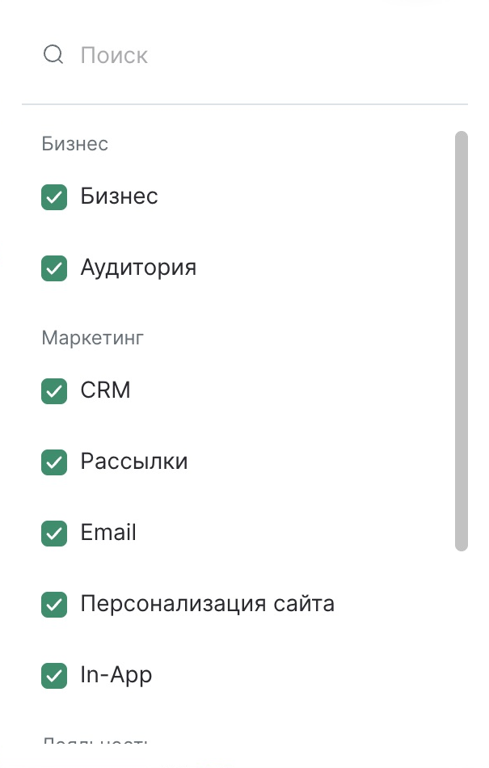

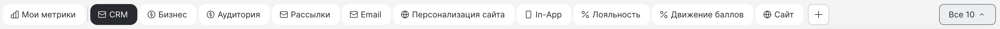

### 4. Creation result and saved-set actions — observed

Creating the copy closes the form, selects the new tab, inserts it immediately
after **My metrics**, gives it a lightning icon, updates the URL `set` identifier
and changes **All 10** to **All 11**. Its six cards and the two selected chart
metrics initially match CRM. The displayed date range remains unchanged.

The menu gains **Saved sets** above the built-in groups. The test row has
a visibility checkbox plus pencil and trash icons. Built-in rows did not expose
those actions in the inspected menu. The pencil opens a name form with
**Save / Cancel** and a warning that the name changes for all users in the
brand. It was cancelled. Deletion and its recovery/confirmation are unverified.

After creation, the two tail tabs were no longer visible and their menu boxes
were unchecked; the precise capacity rule was not tested. Do not infer a fixed
maximum number of tabs from this one viewport.

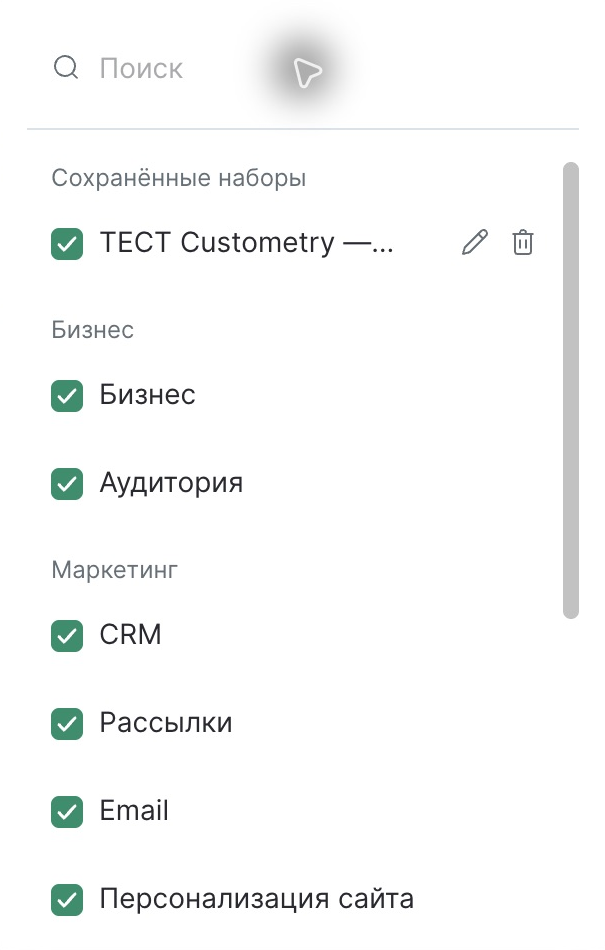
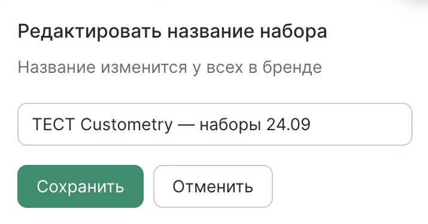

### 5. Top-level metric catalogue — observed

The **Metrics 6** button beside the date range opens a right-hand drawer titled
**Metric settings**. The report remains visible behind it. At the top are close,
search, **Select all** and **Deselect all**. The body scrolls independently.

**Selected metrics** is an ordered group: checkbox, label, edit pencil where
applicable, drag handle; its heading has a **+**. **Available metrics** follows,
grouped into business, Mindbox, mailings, personalization, In-App, audience and
website metrics. Available entries have unchecked boxes and applicable edit
actions. Search filters both selected and available sections, retains grouping
and highlights matching substrings. Selected-only sorting handles were not
visible in the filtered result. Drag/drop and bulk select were not executed.

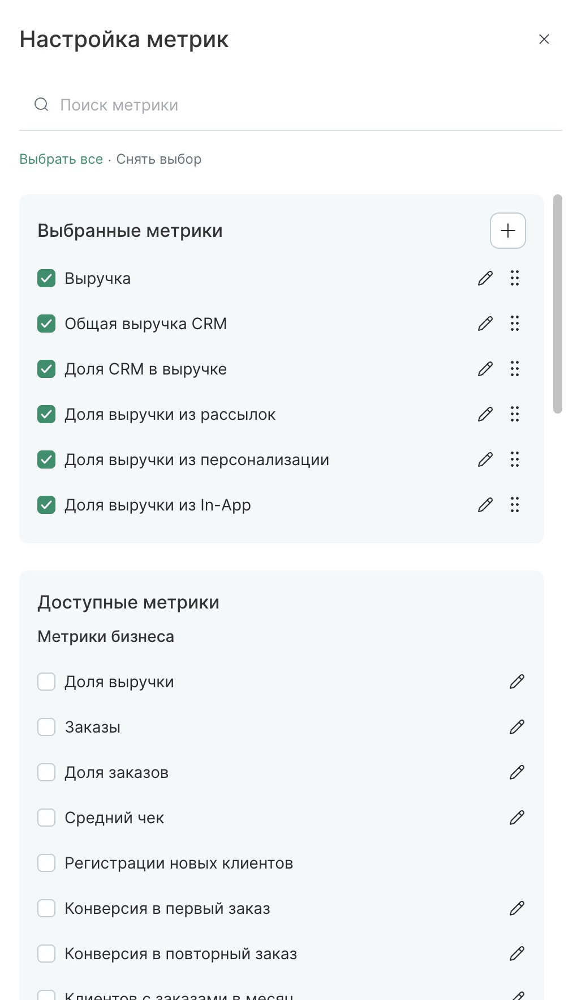
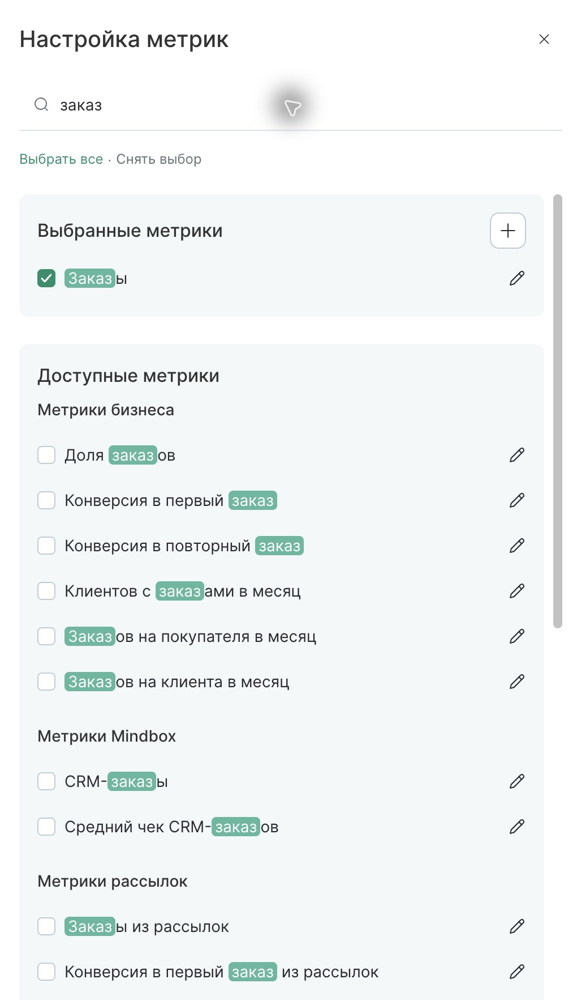

### 6. Add a configured card — observed and exercised

The selected-group **+** opens a two-column picker over the drawer. The left
column has a search and metric groups; the right is the filter pane. Before a
metric is selected, it explains that filters will appear after selection and
Apply is disabled. Choosing revenue exposes **Target action**, **Segment**,
**Reset filters** and **Apply to all selected metrics**. This is card
configuration, not formula authoring.

Revenue with the already-present default configuration left Apply disabled in
this observation; the exact duplicate policy was not independently tested.
Choosing **Orders** enabled Apply. Applying added it to the selected list and
changed the header badge from 6 to 7. No extra set was created by this action.

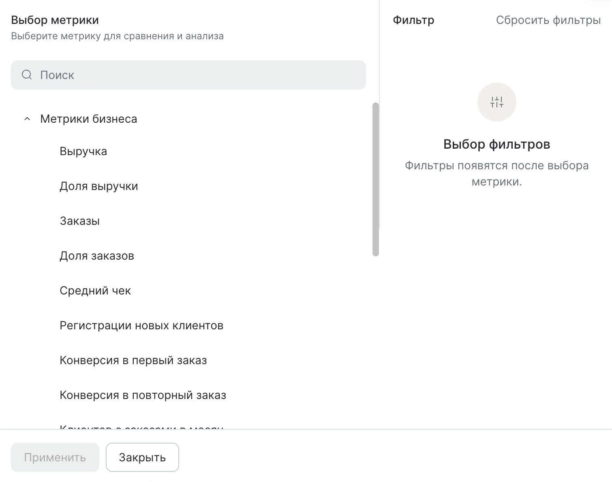
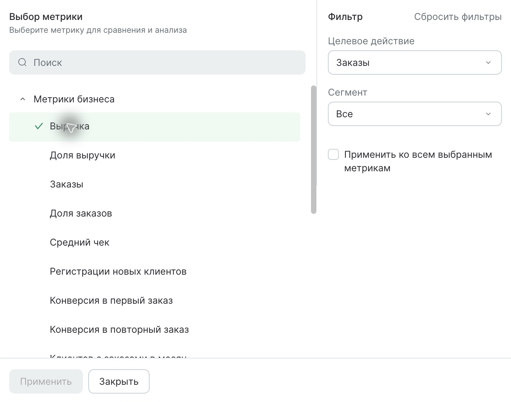
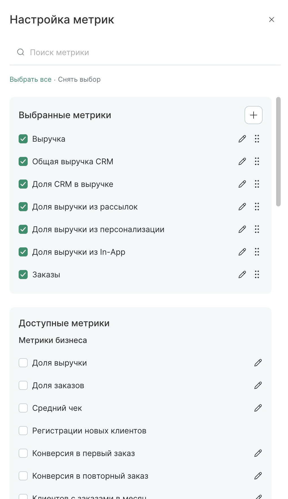

### 7. Save changed set separately — observed and completed

After the card change, the active tab gained a small cloud-style marker and the
tab row exposed save and cancel icons in place of the normal create affordance.
Opening save shows **Save changes**, explains shared impact, and offers
**Save to current** (default) or **Save as new**. The latter reveals
a name field and disables Apply until it is filled; that branch was inspected
without creating another set.

Applying **Save to current** removed the changed-state controls and restored
the creation affordance. Switching to CRM returned six metrics; reopening the
test tab returned seven. This proves same-session save/reopen and source-copy
independence at the visible UI boundary, not cross-user persistence or backend
atomicity. Reload and reconnect behavior were not tested.

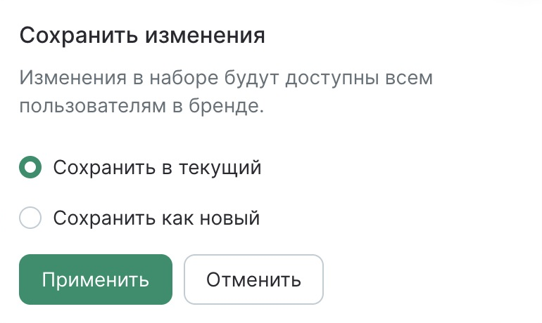
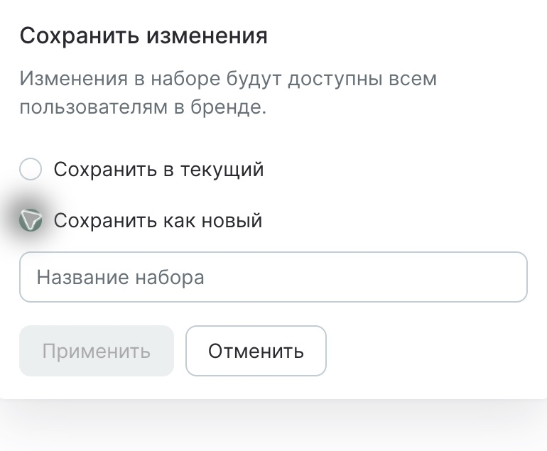

## Implementation handoff

Owner-selected interaction direction for the next Custometry unit:

1. Create a named copy from the active workset using an anchored **+** form.
2. Keep workset switching and an **All sets** searchable visibility menu on the
   workset row; distinguish saved sets and applicable management actions.
3. Open the metric catalogue from a count-bearing **Metrics** button. Preserve
   selected/available sections, grouped search, card editing and ordering.
4. Keep applying card changes separate from saving the common set. Offer save
   to current and save as new with visible unsaved state and cancellation.

Map to METRIC-025/026/027. Preserve Custometry's creator-only edit rule and
report/data access in REPORT-018/019; vendor brand-wide wording does not replace
those rules. Preserve existing shell and visual language. The referenced vendor
layout is interaction evidence, not authority to copy business data or formulas.
Current Custometry implementation differences have not been audited in this
unit; scope and direct browser/API tests belong to the next selected execution.

The evidence separates three operations that the implementation must make
understandable: selecting a set, choosing which tabs are shown, and saving its
configured metric composition. The menu checkbox's auto-selection and observed
tab movement need an explicit mapping when implementing, not an assumed general
pinning or ordering algorithm.

## UX and accessibility notes

- Strengths: short copy flow, explicit shared-impact copy, selected/available
  separation, and distinct apply/save surfaces keep each action understandable.
- Risks observed: checkbox visibility also switches selection; long saved names
  are truncated in the menu; several icon-only actions and checkbox rows have
  no useful name in the native accessibility snapshot. Provide explicit labels,
  focus behavior and a keyboard ordering alternative in Custometry.
- Not checked: keyboard-only completion, screen-reader announcements, contrast
  compliance, responsive layouts, deletion, saved rename, permissions across
  users, bulk-operation compatibility, duplicate/whitespace/length validation,
  save conflicts, cancellation of dirty composition and reload persistence.

## Validation

All 19 saved crops were visually inspected; business results and browser chrome
are outside the crop bounds. Manifest hashes and repository validation results
are recorded in [verification](verification.json). No Custometry product build,
runtime acceptance, publication or milestone completion is claimed.
